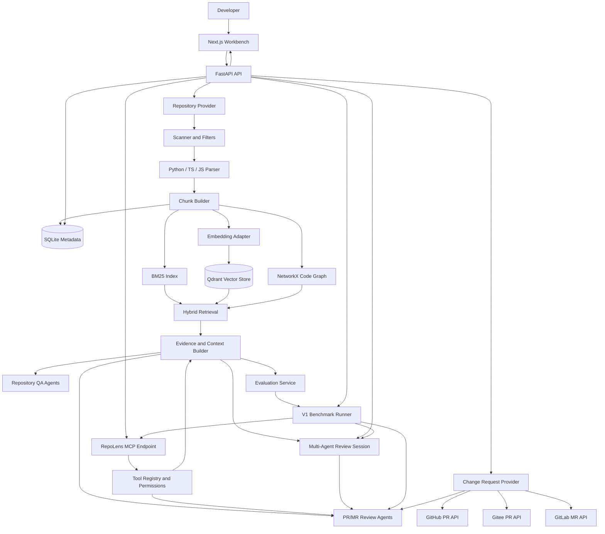

# RepoLens

RepoLens is a repository-level Code Agent workbench for codebase understanding, evidence-grounded question answering, PR/MR review, and retrieval evaluation.

Current scope: **P0+ complete path plus V1 complete path, Phase 1 to Phase 10**.

## Positioning

RepoLens turns a local repository or Git URL into structured code knowledge. It imports and scans source files, parses Python/TypeScript/JavaScript symbols, builds retrievable chunks, combines BM25, vector search, and code graph context, then exposes the result through a Next.js workbench and FastAPI APIs.

The project is intentionally scoped as an interview-ready P0+/V1 system rather than a production SaaS. It demonstrates the core architecture of a code intelligence agent: repository ingestion, hybrid retrieval, evidence citation, role-based agent orchestration, PR/MR review tooling, multi-platform Change Request Provider design, a real read-only MCP endpoint, controlled multi-agent collaboration, evaluation metrics, and reproducible local deployment.

## Resume Highlights

- Repository ingestion pipeline with local path and Git URL providers, safe filtering, language detection, AST-based parsing, chunk building, SQLite persistence, and index status tracking.
- Hybrid retrieval stack combining BM25, embedding search, Qdrant, NetworkX graph expansion, candidate merging, lightweight reranking, Evidence output, and context building.
- Evidence-grounded repository QA with a single-main LangGraph orchestrator and role agents for planning, retrieval, answer review, verification, and report writing.
- PR/MR review workflow with MCP-style read-only tools for diff analysis, file slice reading, code search, symbol context, static-check placeholder, tool call traces, risk review, verification, test suggestions, and review report generation.
- Multi-platform Change Request Provider layer for PR/MR URLs: GitHub Pull Request, Gitee Pull Request, GitLab.com Merge Request, and self-hosted GitLab Merge Request have read-only fetch clients for metadata, changed files, commits, and diff reconstruction.
- Real RepoLens MCP endpoint over FastAPI HTTP JSON-RPC with `initialize`, `tools/list`, `tools/call`, a Tool Registry, read-only permission policy, disabled safe-check policy, client/session audit, and input/output hashes.
- True multi-agent review flow with persisted `agent_sessions`, `agent_assignments`, and `agent_messages`, independent Risk/Security/Test reviewers, Arbiter dissent handling, round/token guards, comparison payloads, and a Workbench Multi-Agent Trace Panel.
- Evaluation and benchmark layer with 50 P0+ retrieval samples, 22 V1 PR/MR benchmark samples, strategy runners, V1 Review/Multi-Agent/MCP metrics, Evaluation Panel, and Docker Compose deployment.

## Architecture



## Tech Stack

| Layer | Technology |
| --- | --- |
| Frontend | Next.js 14, React 18, TypeScript, Tailwind CSS |
| Backend | Python 3.11, FastAPI, SQLAlchemy |
| Agent orchestration | LangGraph-style single-main orchestrator plus controlled multi-agent sessions with assignments, messages, and Arbiter |
| Metadata store | SQLite |
| Vector store | Qdrant |
| Graph | NetworkX |
| Retrieval | BM25, embedding search, graph expansion, lightweight rerank |
| Evaluation | JSONL dataset, Hit@5, MRR, citation coverage, latency, token metrics |
| MCP | FastAPI HTTP JSON-RPC endpoint, Tool Registry, read-only permission policy, tool-call audit |
| Deployment | Docker Compose with backend, frontend, qdrant, named volumes |

## Feature Map

| Phase | Status | Scope |
| --- | --- | --- |
| Phase 1 | Done | Repository Provider, local/Git URL import, scanner, filters, language detection, Python/TS/JS parsing, chunk builder, SQLite models, index status, repository status UI |
| Phase 2 | Done | BM25 index, embedding adapter, Qdrant write/search, NetworkX graph loading, graph neighborhood query, candidate merge/dedup, rerank, Evidence output, Context Builder, Evidence Panel |
| Phase 3 | Done | QA tasks, agent traces, QA API, single-main orchestrator, Planner, Retrieval Agent, Answer Reviewer, Verifier, second retrieval, Report Writer, Ask Panel, Trace Panel |
| Phase 4 | Done | Tool calls table, analyze_diff, read_file_slice, code_search, get_symbol_context, run_safe_static_check placeholder, diff-symbol mapping, Review API, Review agents, Review Panel, tool call display |
| Phase 5 | Done | Evaluation dataset, strategy runners, metrics, Evaluation Panel, Docker Compose, README, demo repos, demo questions, screenshots |
| Phase 6 | Done | Platform-neutral Change Request Provider, GitHub PR read-only client, Gitee/GitLab/self-hosted GitLab parser contracts, PR/MR Review API, PR/MR URL UI flow, synthetic PR/MR smoke fixture |
| Phase 6.5 / P6-EXT | Done | Gitee PR, GitLab.com MR, and self-hosted GitLab MR read-only fetch clients, diff reconstruction, provider tests, and API smoke closure |
| Phase 7 | Done | FastAPI HTTP JSON-RPC MCP endpoint, Tool Registry, permission policy, MCP audit fields, Tool Permissions Panel, MCP client smoke and security tests |
| Phase 8 | Done | Agent sessions, assignments, messages, independent risk/security/test review agents, Arbiter dissent handling, round/token guards, Multi-Agent Trace Panel, single-main comparison smoke |
| Phase 9 | Done | V1 PR/MR benchmark schema, 22-sample benchmark dataset, Review quality metrics, Multi-Agent metrics, MCP reliability metrics, V1 Benchmark API, Workbench panel, benchmark report |
| Phase 10 | Done | V1 README, architecture narrative, demo runbook, release package, V1 screenshots, resume bullets, interview talk track, final release checks |

## Quick Start

### Backend

```powershell
cd backend
python -m venv .venv
.\.venv\Scripts\Activate.ps1
pip install -e ".[dev]"
uvicorn app.main:app --reload
```

### Frontend

```powershell
cd frontend
npm install
npm run dev
```

### Docker Compose

```powershell
Copy-Item .env.example .env
docker compose up --build
```

Default URLs:

| Service | URL |
| --- | --- |
| Frontend | http://localhost:3000 |
| Backend health | http://localhost:8000/health |
| Backend status | http://localhost:8000/api/status |
| Qdrant | http://localhost:6333 |

## Environment Variables

The local defaults are documented in `.env.example`.

| Variable | Purpose | Default |
| --- | --- | --- |
| `REPOLENS_ENV` | Runtime environment label | `development` |
| `REPOLENS_DATABASE_URL` | SQLite database URL | `sqlite:///./.repolens/repolens.sqlite` |
| `REPOLENS_WORKSPACE_ROOT` | Imported repository workspace | `.repolens/repos` |
| `REPOLENS_QDRANT_URL` | Qdrant HTTP endpoint | `http://localhost:6333` |
| `REPOLENS_CORS_ORIGINS` | Frontend origins allowed by backend | `http://localhost:3000,http://127.0.0.1:3000` |
| `REPOLENS_EMBEDDING_BASE_URL` | Embedding provider endpoint | empty disables vector embedding calls |
| `REPOLENS_EMBEDDING_API_KEY` | Embedding provider key | empty |
| `REPOLENS_EMBEDDING_MODEL` | Embedding model name | empty |
| `REPOLENS_EMBEDDING_DIMENSION` | Embedding vector dimension | empty |
| `REPOLENS_CHAT_BASE_URL` | Chat provider endpoint | empty disables LLM calls |
| `REPOLENS_CHAT_API_KEY` | Chat provider key | empty |
| `REPOLENS_CHAT_MODEL` | Chat model name | empty |
| `REPOLENS_CHAT_TEMPERATURE` | Chat sampling temperature | `0.2` |
| `REPOLENS_CHAT_TIMEOUT_SECONDS` | Chat request timeout | `60` |
| `REPOLENS_SAFE_STATIC_CHECK_ENABLED` | Static check placeholder gate | `false` |
| `REPOLENS_SAFE_STATIC_CHECK_ALLOWED_CHECKERS` | Allowed placeholder checker names | `python_ast_parse` |
| `REPOLENS_CHANGE_REQUEST_TIMEOUT_SECONDS` | PR/MR provider request timeout | `30` |
| `REPOLENS_CHANGE_REQUEST_MAX_DIFF_CHARS` | Maximum accepted PR/MR diff size | `200000` |
| `REPOLENS_GITHUB_TOKEN` | Optional GitHub API token for PR fetches | empty |
| `REPOLENS_GITHUB_BASE_URL` | GitHub API base URL | `https://api.github.com` |
| `REPOLENS_GITEE_TOKEN` | Optional Gitee API token for PR fetches | empty |
| `REPOLENS_GITEE_BASE_URL` | Gitee API base URL | `https://gitee.com/api/v5` |
| `REPOLENS_GITLAB_TOKEN` | Optional GitLab API token for MR fetches | empty |
| `REPOLENS_GITLAB_BASE_URL` | GitLab API base URL, including self-hosted GitLab support | `https://gitlab.com/api/v4` |
| `NEXT_PUBLIC_API_BASE_URL` | Frontend API base URL | `http://localhost:8000` |

Docker Compose overrides container-only paths and service URLs for the backend:

- `REPOLENS_DATABASE_URL=sqlite:////app/.repolens/repolens.sqlite`
- `REPOLENS_WORKSPACE_ROOT=/app/.repolens/repos`
- `REPOLENS_QDRANT_URL=http://qdrant:6333`

## Core APIs

| Method | Path | Purpose |
| --- | --- | --- |
| `GET` | `/health` | Backend health check |
| `GET` | `/api/status` | API and storage status |
| `GET` | `/api/repositories` | List repositories |
| `POST` | `/api/repositories` | Import local path or Git URL |
| `GET` | `/api/repositories/{repository_id}` | Repository detail |
| `GET` | `/api/repositories/{repository_id}/status` | Index status and counts |
| `POST` | `/api/repositories/{repository_id}/retrieve` | Hybrid retrieval with Evidence |
| `POST` | `/api/repositories/{repository_id}/questions` | Evidence-grounded repository QA |
| `POST` | `/api/repositories/{repository_id}/reviews` | PR review workflow |
| `GET` | `/api/reviews/{task_id}` | Review task result |
| `POST` | `/api/repositories/{repository_id}/change-requests/reviews` | Create a PR/MR URL review from a supported Change Request Provider |
| `GET` | `/api/change-requests/{change_request_id}` | Change request metadata by id |
| `GET` | `/api/change-requests/tasks/{task_id}` | Change request metadata linked to a review task |
| `POST` | `/api/mcp` | MCP JSON-RPC endpoint for `initialize`, `tools/list`, and `tools/call` |
| `GET` | `/api/mcp/tools` | Tool registry and permission metadata for the Workbench |
| `GET` | `/api/mcp/tool-calls` | Recent MCP tool call audit records |
| `POST` | `/api/repositories/{repository_id}/multi-agent-reviews` | Run a controlled multi-agent review session for pasted diff text |
| `GET` | `/api/multi-agent-reviews/{task_id}` | Multi-agent review result by task id |
| `GET` | `/api/agent-sessions/{session_id}` | Multi-agent session, assignments, messages, Arbiter decision, and final report |
| `POST` | `/api/evaluations` | Run evaluation strategies |
| `GET` | `/api/evaluations` | List evaluation runs |
| `GET` | `/api/evaluations/{run_id}` | Evaluation detail |
| `POST` | `/api/v1-benchmarks` | Run V1 PR/MR Review, Multi-Agent, and MCP benchmark metrics |

## PR/MR Review Flow

Phase 6 adds a platform-neutral Change Request flow on top of the existing pasted-diff Review workflow.

1. Import and index the repository that corresponds to the PR/MR target code.
2. Open the Workbench Review panel.
3. Switch from `Diff` to `PR/MR URL`.
4. Enter a supported PR/MR URL.
5. Run review and inspect metadata, risks, suggested tests, citations, tool calls, and agent traces.

Supported behavior after Phase 6.5 / P6-EXT:

| Platform | URL support | Fetch support |
| --- | --- | --- |
| GitHub Pull Request | Yes | Yes, read-only metadata/files/commits/diff |
| Gitee Pull Request | Yes | Yes, read-only metadata/files/commits and reconstructed diff |
| GitLab.com Merge Request | Yes | Yes, read-only metadata/diffs/commits and reconstructed diff |
| Self-hosted GitLab Merge Request | Yes | Yes, uses configured API base URL or derives `{host}/api/v4` from the MR URL |

The provider layer is read-only. RepoLens does not comment on PR/MR threads, approve, request changes, merge, close, push code, or auto-modify external repositories.

For deterministic offline validation, use the Phase 6 synthetic fixture:

```text
evals/change_requests/phase6_demo_prs.json
```

The fixture models a small GitHub-style PR for `evals/demo_repos/ts_webapp` and is exercised by `backend/app/tests/test_phase6_demo_change_requests.py`. P6-EXT adds offline provider/API smoke coverage for Gitee, GitLab.com, and self-hosted GitLab through fake transports and fake providers. A live UI demo can use a reachable public PR/MR URL for any configured supported platform, with the corresponding token set when the API requires authentication or higher rate limits.

Phase 10 release demo path: follow `docs/phase10-demo-runbook.md` Demo Path A and use `docs/assets/screenshots/change-request-review-panel.png` as the PR/MR Review proof image.

## MCP Server Flow

Phase 7 exposes the existing RepoLens read-only capabilities through a FastAPI HTTP JSON-RPC endpoint at `/api/mcp`.

Supported MCP methods:

| Method | Purpose |
| --- | --- |
| `initialize` | Return protocol version, server info, and tool capability metadata |
| `tools/list` | List registry tools with JSON schema and permission annotations |
| `tools/call` | Execute an allowed read-only RepoLens tool and write audit records when a repository is involved |

Initial tools:

| Tool | Permission | Status |
| --- | --- | --- |
| `repository.list` | `read_only` | enabled |
| `repository.status` | `read_only` | enabled |
| `code.search` | `read_only` | enabled |
| `file.read_slice` | `read_only` | enabled |
| `symbol.context` | `read_only` | enabled |
| `diff.analyze` | `read_only` | enabled |
| `repository.ask` | `read_only` | enabled |
| `review.diff` | `read_only` | enabled |
| `run_safe_static_check` | `safe_check` | disabled by default |

Minimal JSON-RPC smoke:

```json
{
  "jsonrpc": "2.0",
  "id": "tools",
  "method": "tools/list",
  "params": {}
}
```

```json
{
  "jsonrpc": "2.0",
  "id": "search",
  "method": "tools/call",
  "params": {
    "name": "code.search",
    "arguments": {
      "repository_id": "<ready-repository-id>",
      "query": "repository import flow",
      "top_k": 5,
      "use_vector": false
    },
    "client": {"name": "local-smoke"},
    "session_id": "demo-session"
  }
}
```

The Workbench includes an MCP Tool Permissions panel that shows registry status, enabled/disabled tools, recent calls, permission decisions, client/session metadata, input/output hashes, and failure reasons.

Phase 10 release demo path: follow `docs/phase10-demo-runbook.md` Demo Path B and use `docs/assets/screenshots/mcp-tool-permissions-panel.png` as the MCP permission/audit proof image.

## Multi-Agent Review Flow

Phase 8 adds a controlled multi-agent review mode next to pasted-diff Review and PR/MR URL Review.

1. Import and index a repository.
2. Open the Workbench Review panel.
3. Switch to `Multi-Agent`.
4. Paste a diff and run `Run Multi-Agent Review`.
5. Inspect the session summary, assignments, messages, dissent, Arbiter decision, comparison metrics, risks, suggested tests, citations, and final markdown report.

The workflow is a bounded state machine:

```text
Coordinator -> Risk Reviewer + Security Reviewer + Test Strategist -> Arbiter -> Report Writer
```

Each run persists:

| Record | Purpose |
| --- | --- |
| `agent_sessions` | Session status, mode, round limit, assignment limit, token budget, final report |
| `agent_assignments` | Role task, status, input/output payload, evidence ids, dissent, confidence, latency, token estimate |
| `agent_messages` | Sender/recipient, message type, round, content, evidence ids, claims, arbitration flag |

The Arbiter keeps accepted, rejected, downgraded, and dissent outcomes in the final report. Unsupported high-risk or security-sensitive claims are not silently promoted; evidence gaps are recorded as dissent and shown in the Workbench.

Phase 10 release demo path: follow `docs/phase10-demo-runbook.md` Demo Path C and use `docs/assets/screenshots/multi-agent-trace-panel.png` as the Multi-Agent trace proof image.

## Evaluation

The fixed P0+ evaluation dataset is stored at:

```text
evals/datasets/p0_plus_eval.jsonl
```

Dataset distribution:

| Type | Count | Goal |
| --- | ---: | --- |
| `location` | 20 | Locate files and symbols |
| `explanation` | 10 | Explain implementation behavior |
| `architecture` | 10 | Identify cross-file architecture and dependencies |
| `review` | 10 | Evaluate PR review retrieval and citations |
| Total | 50 | P0+ evaluation baseline |

Strategies:

| Strategy | Retrieval path |
| --- | --- |
| `vector_only` | Embedding search only |
| `bm25_vector` | BM25 + embedding search |
| `bm25_vector_graph` | BM25 + embedding search + code graph expansion |

Metrics:

| Metric | Meaning |
| --- | --- |
| Hit@5 | Whether at least one expected file appears in the top 5 evidence items |
| MRR | Reciprocal rank of the first expected file hit |
| Citation coverage | Share of expected files/symbols covered by citations |
| Latency | Per-sample and aggregate retrieval latency |
| Token count | Real token count when available, otherwise estimated token count |
| Error count | Failed samples per strategy |

Current score table:

| Strategy | Samples | Hit@5 | MRR | Citation coverage | Latency | Token | Status |
| --- | ---: | ---: | ---: | ---: | --- | --- | --- |
| `vector_only` | 50 | 0% | 0.000 | 0% | avg 0.2 ms / p95 1 ms | 14.9 est | Completed without embedding configuration, expected zero vector hits |
| `bm25_vector` | 50 | 92% | 0.787 | 85.2% | avg 4.6 ms / p95 7 ms | 66.4 est | Completed |
| `bm25_vector_graph` | 50 | 90% | 0.892 | 84.5% | avg 9.6 ms / p95 20 ms | 64.8 est | Completed |

Scores are from the P5-012 local demo run against the imported `python_demo` and `ts_demo` repositories. Vector-only is intentionally 0% in the default local setup because embedding configuration is empty.

## V1 Benchmark

Phase 9 adds a V1 benchmark dataset and runner for PR/MR Review, Multi-Agent Review, and MCP tool reliability.

Dataset:

```text
evals/datasets/v1_pr_mr_benchmark.jsonl
```

Coverage:

| Dimension | Value |
| --- | --- |
| Samples | 22 |
| Platforms | GitHub, Gitee, GitLab.com, self-hosted GitLab, synthetic |
| Repository keys | `python_demo`, `ts_demo` |
| Runner API | `POST /api/v1-benchmarks` |
| Report | `docs/phase9-v1-benchmark-report.md` |

Metrics:

| Area | Metrics |
| --- | --- |
| Review | risk hit rate, citation coverage, unsupported claim rate, latency, token estimate |
| Multi-Agent | risk hit rate, citation coverage, dissent usefulness, arbiter resolution rate, token overhead, latency |
| MCP | tool success rate, permission denial correctness, latency, error count |

The V1 benchmark runner is offline and read-only. It uses local synthetic diff text and does not fetch live PR/MR data, comment on platforms, approve/request changes, merge, close, push, or modify code.

Phase 10 release demo path: follow `docs/phase10-demo-runbook.md` Demo Path D and use `docs/assets/screenshots/v1-benchmark-panel.png` as the V1 benchmark proof image.

## V1 Demo Runbook

The complete Phase 10 walkthrough is in:

```text
docs/phase10-demo-runbook.md
```

It covers four repeatable, read-only paths:

| Path | Shows | Default asset |
| --- | --- | --- |
| PR/MR Review | Change Request Provider metadata, diff review, risks, tests, citations, trace | `evals/change_requests/phase6_demo_prs.json` |
| MCP Client | `/api/mcp`, tool registry, permissions, audit hashes | `POST /api/mcp` |
| Multi-Agent Trace | session, assignments, messages, dissent, Arbiter, comparison | Workbench `Multi-Agent` mode |
| V1 Benchmark | Review, Multi-Agent, MCP metrics | `evals/datasets/v1_pr_mr_benchmark.jsonl` |

## V1 Release Package

The packaged release notes are in:

```text
docs/phase10-v1-release-package.md
```

## Workbench Screenshots

Screenshots are stored under `docs/assets/screenshots/`:

| Target | Purpose | File |
| --- | --- | --- |
| Repository import/status | Show local/Git import and indexing state | `docs/assets/screenshots/repository-status.png` |
| Evidence Panel | Show cited hybrid retrieval output | `docs/assets/screenshots/evidence-panel.png` |
| Ask + Trace Panel | Show QA answer, citations, and agent trace | `docs/assets/screenshots/ask-trace-panel.png` |
| Review Panel | Show PR risks, test suggestions, and citations | `docs/assets/screenshots/review-panel.png` |
| Tool Calls Panel | Show MCP-style tool calls and trace details | `docs/assets/screenshots/tool-calls-panel.png` |
| Evaluation Panel | Show strategy comparison table and sample results | `docs/assets/screenshots/evaluation-panel.png` |
| PR/MR URL Flow | Show Change Request metadata, fetched diff review, risks, tests, citations, tool calls, trace | `docs/assets/screenshots/change-request-review-panel.png` |
| MCP Tool Permissions | Show MCP Tool Registry, permission decisions, disabled safe-check, audit hashes | `docs/assets/screenshots/mcp-tool-permissions-panel.png` |
| Multi-Agent Trace Panel | Show session, assignments, messages, dissent, Arbiter, comparison, final report | `docs/assets/screenshots/multi-agent-trace-panel.png` |
| V1 Benchmark Panel | Show Review, Multi-Agent, and MCP metrics plus sample rows | `docs/assets/screenshots/v1-benchmark-panel.png` |

## Safety Boundaries

- Repository import is scoped to explicit local paths or Git URLs provided by the user.
- Scanning filters skip dependency, cache, build, VCS, binary, oversized, and sensitive-looking files.
- Stored evidence keeps file paths, symbols, line ranges, snippets, metrics, and trace metadata; it does not require storing secrets.
- MCP tools are read-only in Phase 7. `run_safe_static_check` remains disabled by default and does not execute shell commands.
- MCP audit records include client name, session id, permission policy, input hash, output hash, status, latency, and error details for repository-scoped calls.
- Change Request providers in Phase 6 are read-only. They fetch metadata, changed files, commits, and diff only.
- Phase 8 multi-agent collaboration is bounded by round limits, assignment limits, token budgets, and a fixed Coordinator/Reviewer/Arbiter/Report Writer state machine.
- Multi-agent final reports preserve dissent and Arbiter decisions; they do not write code, comment on PR/MR threads, or trigger external write actions.
- Platform tokens are read from environment variables and are not stored in `change_requests.metadata`, task payloads, API responses, tool call summaries, traces, or screenshots.
- Docker Compose mounts named project volumes only. It does not mount the user's whole disk.
- Chat and embedding calls are disabled unless the corresponding base URL, API key, and model settings are explicitly configured.
- PR review output is evidence-grounded and conservative; unsupported risks are filtered or downgraded by the verifier.

## P0+ Non-Goals

- No production authentication, billing, tenancy, or organization management.
- No arbitrary command execution inside repositories.
- No public remote MCP service or stdio MCP process in Phase 7; the current transport is local FastAPI HTTP JSON-RPC.
- No autonomous code modification, patch application, or push-to-repository workflow.
- No cross-process autonomous agent network, unbounded long-running agent conversation, or long-term personal memory.
- No fine-tuning, training pipeline, or provider-specific model optimization.
- No cloud deployment automation beyond local Docker Compose.

## Demo Plan

| Phase 5 task | Artifact | Status |
| --- | --- | --- |
| P5-010 | `evals/demo_repos/python_service` and `evals/demo_repos/ts_webapp` | ready |
| P5-011 | `evals/demo_questions.md` and `evals/datasets/demo_questions.json` | ready |
| P5-012 | `docs/assets/screenshots/*.png` | ready |
| P6-010 | `evals/change_requests/phase6_demo_prs.json` | ready |
| P6-011 | `docs/phase6-smoke-evaluation.md` | ready |
| P6-012 | README, closed-loop log, final closure review | ready |
| P6-EXT | `docs/phase6-ext-detailed-design.md` and `docs/phase6-ext-closed-loop-log.md` | ready |
| P7-011 | `docs/phase7-detailed-design.md`, `docs/phase7-closed-loop-log.md`, and `docs/phase7-final-closure-review.md` | ready |
| P8-012 | `docs/phase8-detailed-design.md`, `docs/phase8-closed-loop-log.md`, `docs/phase8-smoke-evaluation.md`, and `docs/phase8-final-closure-review.md` | ready |
| P9-009 | `docs/phase9-detailed-design.md`, `docs/phase9-closed-loop-log.md`, `docs/phase9-v1-benchmark-report.md`, and `docs/phase9-final-closure-review.md` | ready |
| P10-008 | `docs/phase10-demo-runbook.md`, `docs/phase10-v1-release-package.md`, `docs/phase10-closed-loop-log.md`, and `docs/phase10-final-closure-review.md` | ready |

## Resume Bullets

- Built RepoLens, a repository-level Code Agent workbench that imports local/Git repositories, parses Python/TypeScript/JavaScript code, builds SQLite metadata, BM25/vector indexes, and a NetworkX code graph for evidence-grounded code understanding.
- Designed a hybrid retrieval pipeline combining BM25, Qdrant vector search, graph neighborhood expansion, candidate deduplication, reranking, Evidence output, and Context Builder, enabling cited repository QA and PR review.
- Implemented a role-based agent workflow for code Q&A and PR/MR review with planner, retrieval, reviewer, verifier, report writer, MCP-style read-only tools, tool-call traces, and an Evaluation Panel comparing vector-only, BM25+vector, and BM25+vector+graph strategies.
- Added V1 Phase 6/6.5 PR/MR URL review with a platform-neutral Change Request Provider contract, read-only GitHub/Gitee/GitLab/self-hosted GitLab adapters, API/UI integration, deterministic smoke evaluation, and multi-platform API closure tests.
- Upgraded the MCP-style tool layer into a real read-only MCP HTTP JSON-RPC endpoint with Tool Registry, permission decisions, client/session audit, input/output hashes, disabled safe-check policy, and a Workbench Tool Permissions panel.
- Implemented V1 Phase 8 true multi-agent review with persisted sessions, role assignments, agent messages, independent reviewer outputs, Arbiter dissent handling, bounded round/token controls, comparison smoke tests, and a Workbench Multi-Agent Trace Panel.
- Built V1 Phase 9 benchmark coverage with a 22-sample PR/MR dataset, Review quality metrics, Multi-Agent dissent/arbiter/token metrics, MCP success/permission metrics, `/api/v1-benchmarks`, and a Workbench V1 Benchmark panel.
- Packaged RepoLens V1 with a reproducible demo runbook, V1 screenshots, release checklist, resume bullets, interview talk track, Docker Compose validation, and sensitive-info release scanning.

## Interview Talk Track

1. Problem: developers need reliable repository-level answers and PR/MR review comments that cite code, not generic summaries.
2. Architecture: RepoLens separates ingestion, storage, retrieval, agent orchestration, review tools, evaluation, and UI so each layer can be tested independently.
3. Retrieval decision: BM25 gives lexical precision, vectors help semantic matching, and graph expansion recovers nearby callers, callees, imports, and same-file context.
4. Agent decision: the main orchestrator stays single-entry and predictable, while role agents handle planning, retrieval, answer review, verification, and report writing.
5. Safety decision: tools are read-only, static checks are placeholders by default, and unsupported review risks are filtered instead of presented as facts.
6. V1 decision: PR/MR URL support is platform-neutral. GitHub landed first, then Phase 6.5 closed Gitee, GitLab.com, and self-hosted GitLab read-only fetch support without changing the API/UI contract.
7. MCP decision: Phase 7 uses a local FastAPI HTTP JSON-RPC endpoint first, keeps tools repository-scoped and read-only, and records permission/audit metadata for every repository tool call.
8. Multi-agent decision: Phase 8 is a bounded collaboration protocol, not free-form autonomous chatter; it persists assignments/messages, keeps dissent, and makes the Arbiter explain how conflicts were handled.
9. Evaluation decision: the system compares three retrieval strategies with the same 50 JSONL samples using Hit@5, MRR, citation coverage, latency, token, and error metrics, while Phase 9 adds V1 PR/MR, Multi-Agent, and MCP benchmark metrics without turning into Phase 10 packaging.
10. Release decision: Phase 10 turns the finished V1 system into a reproducible demo package with runbook, screenshots, resume bullets, interview talk track, final gates, and secret scanning instead of adding new product scope.

## Documentation

- Requirements: `docs/requirements-analysis.md`
- Outline design: `docs/outline-design.md`
- P0+ development plan: `docs/p0-plus-development-plan.md`
- V1 development plan: `docs/v1-development-plan.md`
- Phase 5 detailed design: `docs/phase5-detailed-design.md`
- Phase 5 closed-loop log: `docs/phase5-closed-loop-log.md`
- Phase 6 detailed design: `docs/phase6-detailed-design.md`
- Phase 6 closed-loop log: `docs/phase6-closed-loop-log.md`
- Phase 6 smoke evaluation: `docs/phase6-smoke-evaluation.md`
- Phase 6 final closure review: `docs/phase6-final-closure-review.md`
- Phase 6.5 detailed design: `docs/phase6-ext-detailed-design.md`
- Phase 6.5 closed-loop log: `docs/phase6-ext-closed-loop-log.md`
- Phase 7 detailed design: `docs/phase7-detailed-design.md`
- Phase 7 closed-loop log: `docs/phase7-closed-loop-log.md`
- Phase 7 final closure review: `docs/phase7-final-closure-review.md`
- Phase 8 detailed design: `docs/phase8-detailed-design.md`
- Phase 8 closed-loop log: `docs/phase8-closed-loop-log.md`
- Phase 8 smoke evaluation: `docs/phase8-smoke-evaluation.md`
- Phase 8 final closure review: `docs/phase8-final-closure-review.md`
- Phase 9 detailed design: `docs/phase9-detailed-design.md`
- Phase 9 closed-loop log: `docs/phase9-closed-loop-log.md`
- Phase 9 V1 benchmark report: `docs/phase9-v1-benchmark-report.md`
- Phase 9 final closure review: `docs/phase9-final-closure-review.md`
- Phase 10 detailed design: `docs/phase10-detailed-design.md`
- Phase 10 demo runbook: `docs/phase10-demo-runbook.md`
- Phase 10 V1 release package: `docs/phase10-v1-release-package.md`
- Phase 10 closed-loop log: `docs/phase10-closed-loop-log.md`
- Phase 10 final closure review: `docs/phase10-final-closure-review.md`
- Development process log: `docs/development-worklog.md`
