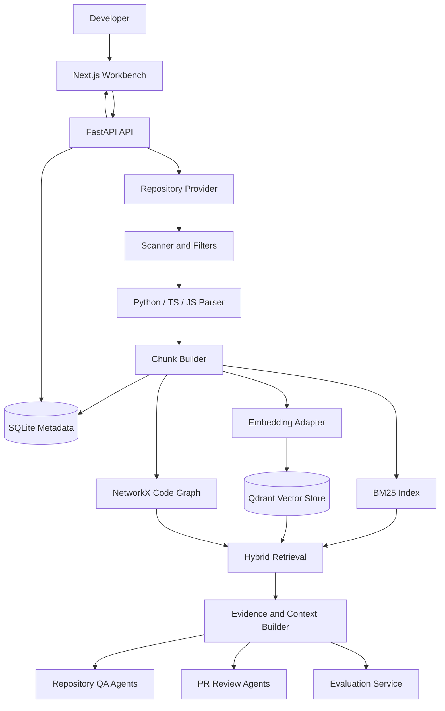

# RepoLens

RepoLens is a repository-level Code Agent workbench for codebase understanding, evidence-grounded question answering, PR review, and retrieval evaluation.

Current scope: **P0+ complete path, Phase 1 to Phase 5**.

## Positioning

RepoLens turns a local repository or Git URL into structured code knowledge. It imports and scans source files, parses Python/TypeScript/JavaScript symbols, builds retrievable chunks, combines BM25, vector search, and code graph context, then exposes the result through a Next.js workbench and FastAPI APIs.

The project is intentionally scoped as an interview-ready P0+ system rather than a production SaaS. It demonstrates the core architecture of a code intelligence agent: repository ingestion, hybrid retrieval, evidence citation, role-based agent orchestration, PR review tooling, evaluation metrics, and reproducible local deployment.

## Resume Highlights

- Repository ingestion pipeline with local path and Git URL providers, safe filtering, language detection, AST-based parsing, chunk building, SQLite persistence, and index status tracking.
- Hybrid retrieval stack combining BM25, embedding search, Qdrant, NetworkX graph expansion, candidate merging, lightweight reranking, Evidence output, and context building.
- Evidence-grounded repository QA with a single-main LangGraph orchestrator and role agents for planning, retrieval, answer review, verification, and report writing.
- PR review workflow with MCP-style read-only tools for diff analysis, file slice reading, code search, symbol context, static-check placeholder, tool call traces, risk review, verification, test suggestions, and review report generation.
- Evaluation and packaging layer with 50 JSONL samples, vector-only/BM25+vector/BM25+vector+graph strategy runners, Hit@5, MRR, citation coverage, latency, token metrics, Evaluation Panel, and Docker Compose deployment.

## Architecture



## Tech Stack

| Layer | Technology |
| --- | --- |
| Frontend | Next.js 14, React 18, TypeScript, Tailwind CSS |
| Backend | Python 3.11, FastAPI, SQLAlchemy |
| Agent orchestration | LangGraph-style single-main orchestrator with role agents |
| Metadata store | SQLite |
| Vector store | Qdrant |
| Graph | NetworkX |
| Retrieval | BM25, embedding search, graph expansion, lightweight rerank |
| Evaluation | JSONL dataset, Hit@5, MRR, citation coverage, latency, token metrics |
| Deployment | Docker Compose with backend, frontend, qdrant, named volumes |

## Feature Map

| Phase | Status | Scope |
| --- | --- | --- |
| Phase 1 | Done | Repository Provider, local/Git URL import, scanner, filters, language detection, Python/TS/JS parsing, chunk builder, SQLite models, index status, repository status UI |
| Phase 2 | Done | BM25 index, embedding adapter, Qdrant write/search, NetworkX graph loading, graph neighborhood query, candidate merge/dedup, rerank, Evidence output, Context Builder, Evidence Panel |
| Phase 3 | Done | QA tasks, agent traces, QA API, single-main orchestrator, Planner, Retrieval Agent, Answer Reviewer, Verifier, second retrieval, Report Writer, Ask Panel, Trace Panel |
| Phase 4 | Done | Tool calls table, analyze_diff, read_file_slice, code_search, get_symbol_context, run_safe_static_check placeholder, diff-symbol mapping, Review API, Review agents, Review Panel, tool call display |
| Phase 5 | Done | Evaluation dataset, strategy runners, metrics, Evaluation Panel, Docker Compose, README, demo repos, demo questions, screenshots |

## Quick Start

### Backend

```powershell
cd backend
python -m venv .venv
.\.venv\Scripts\Activate.ps1
pip install -e ".[dev]"
uvicorn app.main:app --reload
```

### Frontend

```powershell
cd frontend
npm install
npm run dev
```

### Docker Compose

```powershell
Copy-Item .env.example .env
docker compose up --build
```

Default URLs:

| Service | URL |
| --- | --- |
| Frontend | http://localhost:3000 |
| Backend health | http://localhost:8000/health |
| Backend status | http://localhost:8000/api/status |
| Qdrant | http://localhost:6333 |

## Environment Variables

The local defaults are documented in `.env.example`.

| Variable | Purpose | Default |
| --- | --- | --- |
| `REPOLENS_ENV` | Runtime environment label | `development` |
| `REPOLENS_DATABASE_URL` | SQLite database URL | `sqlite:///./.repolens/repolens.sqlite` |
| `REPOLENS_WORKSPACE_ROOT` | Imported repository workspace | `.repolens/repos` |
| `REPOLENS_QDRANT_URL` | Qdrant HTTP endpoint | `http://localhost:6333` |
| `REPOLENS_CORS_ORIGINS` | Frontend origins allowed by backend | `http://localhost:3000,http://127.0.0.1:3000` |
| `REPOLENS_EMBEDDING_BASE_URL` | Embedding provider endpoint | empty disables vector embedding calls |
| `REPOLENS_EMBEDDING_API_KEY` | Embedding provider key | empty |
| `REPOLENS_EMBEDDING_MODEL` | Embedding model name | empty |
| `REPOLENS_EMBEDDING_DIMENSION` | Embedding vector dimension | empty |
| `REPOLENS_CHAT_BASE_URL` | Chat provider endpoint | empty disables LLM calls |
| `REPOLENS_CHAT_API_KEY` | Chat provider key | empty |
| `REPOLENS_CHAT_MODEL` | Chat model name | empty |
| `REPOLENS_CHAT_TEMPERATURE` | Chat sampling temperature | `0.2` |
| `REPOLENS_CHAT_TIMEOUT_SECONDS` | Chat request timeout | `60` |
| `REPOLENS_SAFE_STATIC_CHECK_ENABLED` | Static check placeholder gate | `false` |
| `REPOLENS_SAFE_STATIC_CHECK_ALLOWED_CHECKERS` | Allowed placeholder checker names | `python_ast_parse` |
| `NEXT_PUBLIC_API_BASE_URL` | Frontend API base URL | `http://localhost:8000` |

Docker Compose overrides container-only paths and service URLs for the backend:

- `REPOLENS_DATABASE_URL=sqlite:////app/.repolens/repolens.sqlite`
- `REPOLENS_WORKSPACE_ROOT=/app/.repolens/repos`
- `REPOLENS_QDRANT_URL=http://qdrant:6333`

## Core APIs

| Method | Path | Purpose |
| --- | --- | --- |
| `GET` | `/health` | Backend health check |
| `GET` | `/api/status` | API and storage status |
| `GET` | `/api/repositories` | List repositories |
| `POST` | `/api/repositories` | Import local path or Git URL |
| `GET` | `/api/repositories/{repository_id}` | Repository detail |
| `GET` | `/api/repositories/{repository_id}/status` | Index status and counts |
| `POST` | `/api/repositories/{repository_id}/retrieve` | Hybrid retrieval with Evidence |
| `POST` | `/api/repositories/{repository_id}/questions` | Evidence-grounded repository QA |
| `POST` | `/api/repositories/{repository_id}/reviews` | PR review workflow |
| `GET` | `/api/reviews/{task_id}` | Review task result |
| `POST` | `/api/evaluations` | Run evaluation strategies |
| `GET` | `/api/evaluations` | List evaluation runs |
| `GET` | `/api/evaluations/{run_id}` | Evaluation detail |

## Evaluation

The fixed P0+ evaluation dataset is stored at:

```text
evals/datasets/p0_plus_eval.jsonl
```

Dataset distribution:

| Type | Count | Goal |
| --- | ---: | --- |
| `location` | 20 | Locate files and symbols |
| `explanation` | 10 | Explain implementation behavior |
| `architecture` | 10 | Identify cross-file architecture and dependencies |
| `review` | 10 | Evaluate PR review retrieval and citations |
| Total | 50 | P0+ evaluation baseline |

Strategies:

| Strategy | Retrieval path |
| --- | --- |
| `vector_only` | Embedding search only |
| `bm25_vector` | BM25 + embedding search |
| `bm25_vector_graph` | BM25 + embedding search + code graph expansion |

Metrics:

| Metric | Meaning |
| --- | --- |
| Hit@5 | Whether at least one expected file appears in the top 5 evidence items |
| MRR | Reciprocal rank of the first expected file hit |
| Citation coverage | Share of expected files/symbols covered by citations |
| Latency | Per-sample and aggregate retrieval latency |
| Token count | Real token count when available, otherwise estimated token count |
| Error count | Failed samples per strategy |

Current score table:

| Strategy | Samples | Hit@5 | MRR | Citation coverage | Latency | Token | Status |
| --- | ---: | ---: | ---: | ---: | --- | --- | --- |
| `vector_only` | 50 | 0% | 0.000 | 0% | avg 0.2 ms / p95 1 ms | 14.9 est | Completed without embedding configuration, expected zero vector hits |
| `bm25_vector` | 50 | 92% | 0.787 | 85.2% | avg 4.6 ms / p95 7 ms | 66.4 est | Completed |
| `bm25_vector_graph` | 50 | 90% | 0.892 | 84.5% | avg 9.6 ms / p95 20 ms | 64.8 est | Completed |

Scores are from the P5-012 local demo run against the imported `python_demo` and `ts_demo` repositories. Vector-only is intentionally 0% in the default local setup because embedding configuration is empty.

## Workbench Screenshots

Screenshots are stored under `docs/assets/screenshots/`:

| Target | Purpose | File |
| --- | --- | --- |
| Repository import/status | Show local/Git import and indexing state | `docs/assets/screenshots/repository-status.png` |
| Evidence Panel | Show cited hybrid retrieval output | `docs/assets/screenshots/evidence-panel.png` |
| Ask + Trace Panel | Show QA answer, citations, and agent trace | `docs/assets/screenshots/ask-trace-panel.png` |
| Review Panel | Show PR risks, test suggestions, and citations | `docs/assets/screenshots/review-panel.png` |
| Tool Calls Panel | Show MCP-style tool calls and trace details | `docs/assets/screenshots/tool-calls-panel.png` |
| Evaluation Panel | Show strategy comparison table and sample results | `docs/assets/screenshots/evaluation-panel.png` |

## Safety Boundaries

- Repository import is scoped to explicit local paths or Git URLs provided by the user.
- Scanning filters skip dependency, cache, build, VCS, binary, oversized, and sensitive-looking files.
- Stored evidence keeps file paths, symbols, line ranges, snippets, metrics, and trace metadata; it does not require storing secrets.
- MCP-style tools in Phase 4 are read-only or placeholder tools. `run_safe_static_check` is disabled by default and does not execute shell commands.
- Docker Compose mounts named project volumes only. It does not mount the user's whole disk.
- Chat and embedding calls are disabled unless the corresponding base URL, API key, and model settings are explicitly configured.
- PR review output is evidence-grounded and conservative; unsupported risks are filtered or downgraded by the verifier.

## P0+ Non-Goals

- No production authentication, billing, tenancy, or organization management.
- No arbitrary command execution inside repositories.
- No full MCP server implementation beyond the P0+ MCP-style tool layer.
- No autonomous code modification, patch application, or push-to-repository workflow.
- No large-scale benchmark suite beyond the fixed 50-sample P0+ dataset.
- No fine-tuning, training pipeline, or provider-specific model optimization.
- No cloud deployment automation beyond local Docker Compose.

## Demo Plan

| Phase 5 task | Artifact | Status |
| --- | --- | --- |
| P5-010 | `evals/demo_repos/python_service` and `evals/demo_repos/ts_webapp` | ready |
| P5-011 | `evals/demo_questions.md` and `evals/datasets/demo_questions.json` | ready |
| P5-012 | `docs/assets/screenshots/*.png` | ready |

## Resume Bullets

- Built RepoLens, a repository-level Code Agent workbench that imports local/Git repositories, parses Python/TypeScript/JavaScript code, builds SQLite metadata, BM25/vector indexes, and a NetworkX code graph for evidence-grounded code understanding.
- Designed a hybrid retrieval pipeline combining BM25, Qdrant vector search, graph neighborhood expansion, candidate deduplication, reranking, Evidence output, and Context Builder, enabling cited repository QA and PR review.
- Implemented a role-based agent workflow for code Q&A and PR review with planner, retrieval, reviewer, verifier, report writer, MCP-style read-only tools, tool-call traces, and an Evaluation Panel comparing vector-only, BM25+vector, and BM25+vector+graph strategies.

## Interview Talk Track

1. Problem: developers need reliable repository-level answers and PR review comments that cite code, not generic summaries.
2. Architecture: RepoLens separates ingestion, storage, retrieval, agent orchestration, review tools, evaluation, and UI so each layer can be tested independently.
3. Retrieval decision: BM25 gives lexical precision, vectors help semantic matching, and graph expansion recovers nearby callers, callees, imports, and same-file context.
4. Agent decision: the main orchestrator stays single-entry and predictable, while role agents handle planning, retrieval, answer review, verification, and report writing.
5. Safety decision: tools are read-only, static checks are placeholders by default, and unsupported review risks are filtered instead of presented as facts.
6. Evaluation decision: the system compares three retrieval strategies with the same 50 JSONL samples using Hit@5, MRR, citation coverage, latency, token, and error metrics.

## Documentation

- Requirements: `docs/requirements-analysis.md`
- Outline design: `docs/outline-design.md`
- P0+ development plan: `docs/p0-plus-development-plan.md`
- Phase 5 detailed design: `docs/phase5-detailed-design.md`
- Phase 5 closed-loop log: `docs/phase5-closed-loop-log.md`
- Development process log: `docs/development-worklog.md`
