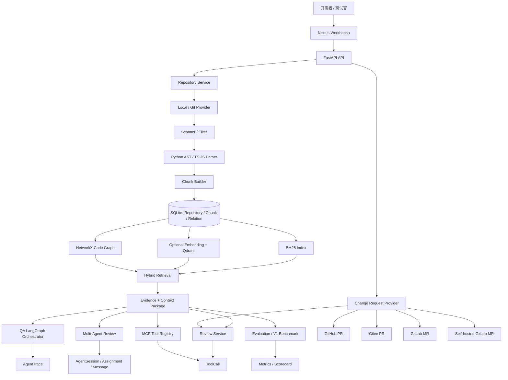
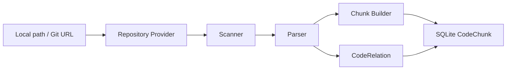
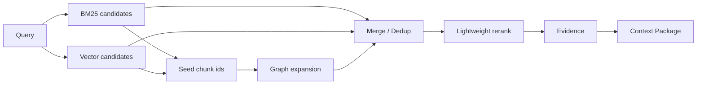
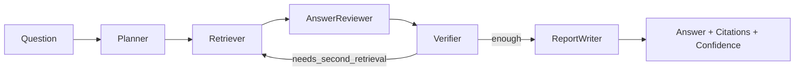
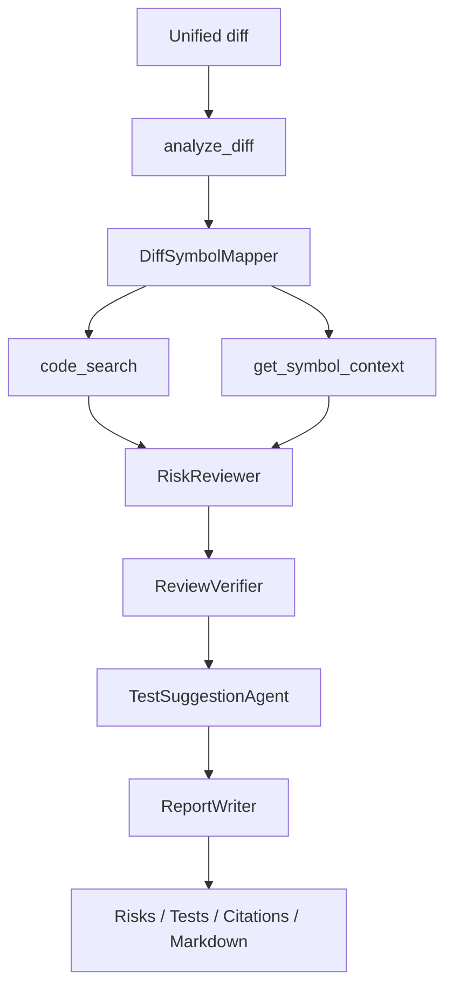

# RepoLens V1 面试深度讲解手册

这份文档的目标不是再写一份功能清单，而是帮你真正吃透 RepoLens V1 的产品逻辑、系统架构、关键技术点、取舍理由、可展示深度和面试表达方式。

阅读方式：

- `【给你理解】`：面向你自己，解释这一段到底在解决什么问题、为什么这样设计、背后的原理是什么。
- `【面试可说】`：面向面试官，可以直接口头表达，尽量保持自然、准确、不过度夸大。
- `【追问展开】`：面试官继续追问时可以展开的技术细节。
- `【代码锚点】`：对应本仓库的实现位置，方便你打开代码讲。
- `【边界说明】`：这个功能没有做什么，为什么没有做，避免面试里被问到时被动。

## 1. 项目一句话定位

【给你理解】

RepoLens V1 是一个“仓库级 Code Agent 工作台”。它不是简单把代码塞给大模型总结，也不是复刻 GitHub Copilot，而是从工程角度实现一条完整的代码智能链路：

1. 把本地仓库或 Git URL 导入系统。
2. 扫描和过滤源码，跳过依赖、缓存、二进制、密钥类文件。
3. 解析 Python、TypeScript、JavaScript 代码结构。
4. 构建代码 chunk、symbol、relation 和代码图。
5. 用 BM25、可选向量检索、代码图扩展做混合检索。
6. 把检索结果包装成带文件路径、行号、symbol、snippet、score、source 的 Evidence。
7. 基于 Evidence 做仓库问答和 PR/MR 审查。
8. 用 Agent trace、ToolCall、Verifier、Benchmark 让结果可追踪、可解释、可评测。
9. 通过 Change Request Provider 支持 GitHub、Gitee、GitLab.com、自托管 GitLab 的 PR/MR 只读接入。
10. 通过 MCP HTTP JSON-RPC endpoint 暴露只读工具。
11. 通过受控 Multi-Agent Review 展示多角色协作、分歧保留和 Arbiter 仲裁。
12. 最后用本地 Demo、截图、评测、真实 PR/MR 案例做 V1 闭环包装。

这个项目的价值重点不是“我做了一个聊天框”，而是“我把一个代码智能体背后的基础设施拆出来并落地了”：代码结构化、GraphRAG、证据链、工具权限、Agent 编排、多平台适配、评测闭环和可观测性。

【面试可说】

> RepoLens 是我做的一个仓库级 Code Agent 工作台。它的重点不是替代 Copilot 写代码，而是实现一个可解释、可追踪、可评测的代码理解和 PR/MR 审查底座。系统会先把仓库扫描、解析成 chunk、symbol 和代码关系图，然后用 BM25、可选向量检索和图邻域扩展做 GraphRAG，最后让 QA、Review、MCP 工具和 Multi-Agent 都复用同一套 Evidence 层。每个回答和审查结论都尽量绑定文件、行号、symbol 和证据来源。

【追问展开】

- 如果面试官问“为什么不是 Copilot 竞品”：回答它不是通用 IDE 编程助手，而是展示代码智能应用的底层工程能力。
- 如果问“核心创新是什么”：回答不是某一个算法，而是把结构化代码理解、混合检索、证据链、工具调用、Agent 编排和评测连接成闭环。
- 如果问“有没有生产化”：回答 V1 是面试级原型，不包含租户、权限、计费、云部署和写回 PR，但核心链路可演示、可测试、可扩展。

【代码锚点】

- `README.md`
- `docs/phase10-v1-release-package.md`
- `docs/interview/competitive-positioning.md`
- `docs/interview/v1-evaluation-scorecard.md`

## 2. 总体架构图和讲解顺序

【给你理解】

你可以按“从用户请求到系统输出”的顺序讲，而不是按代码目录讲。推荐讲解路径：

1. 用户在 Next.js Workbench 里导入仓库、提问、提交 diff 或 PR/MR URL。
2. FastAPI 接收请求，把功能分发给 Repository、Retrieval、QA、Review、Change Request、MCP、Multi-Agent、Benchmark 等服务。
3. Repository Service 负责把源码变成结构化知识。
4. Retrieval Service 把结构化知识变成 Evidence。
5. 上层 QA、Review、MCP、Multi-Agent 都围绕 Evidence 工作。
6. 评测系统复用同一套服务链路，输出指标。
7. 前端不是装饰，而是展示证据、trace、tool calls、权限、benchmark 的可观测窗口。

【面试可说】

> 我讲这个项目时会按一条主链路讲：先导入仓库，把源码结构化成 chunk、symbol 和 relation；再通过 BM25、向量和代码图做混合检索，产出 Evidence；然后 QA、PR Review、MCP 工具、多 Agent 和 Benchmark 都复用这个 Evidence 层。这样的好处是上层能力很多，但底层证据口径是一致的，便于做 trace、评测和安全边界控制。

【追问展开】

- “为什么分层”：每层有清晰输入输出，便于单元测试和替换。例如 Change Request Provider 可以扩平台，不影响 Review Agent；MCP 可以复用工具，不影响 QA。
- “为什么 Evidence 是中心”：Evidence 是让大模型输出可追踪的关键。没有 Evidence，上层 Agent 只是自由生成；有 Evidence，结果才能引用文件、行号和 symbol。
- “为什么 UI 要展示 trace”：面试展示时不仅看最后答案，还要让面试官看到系统如何检索、调用工具、验证和评测。

## 3. 面试开场白：30 秒、2 分钟、5 分钟版本

【给你理解】

面试中不要一上来讲所有技术。先用一句话建立定位，再根据面试官兴趣展开。你可以准备三个长度：

- 30 秒：用于简历项目快速介绍。
- 2 分钟：用于“讲讲你这个项目”。
- 5 分钟：用于技术面正式展开。

【面试可说：30 秒版】

> RepoLens 是一个仓库级 Code Agent 工作台。我把代码仓库导入后，会解析成 chunk、symbol 和代码关系图，然后用 BM25、可选向量和图扩展做 GraphRAG，给 QA 和 PR/MR Review 提供带文件、行号、symbol 的证据。V1 还做了多代码平台 PR/MR 只读接入、MCP 工具端点、受控 Multi-Agent Review 和评测闭环。

【面试可说：2 分钟版】

> 这个项目的出发点是：代码智能体不能只靠大模型直接读一堆文件，因为容易丢上下文、幻觉，也难以评测。所以我先实现了仓库导入和结构化解析，把 Python、TypeScript、JavaScript 代码扫描过滤后解析成 chunk、symbol 和 relation，存到 SQLite。检索层用 BM25 做稳定词法召回，向量检索作为可选语义召回，代码图扩展补充 caller、callee、import、same-file 等上下文，然后统一生成 Evidence。上层 QA、Review、MCP 和 Multi-Agent 都基于 Evidence 输出，配合 AgentTrace、ToolCall、Verifier 和 Benchmark 做可观测和可评测。V1 重点加强了 PR/MR 场景，支持 GitHub、Gitee、GitLab.com 和 self-hosted GitLab 的只读 PR/MR 获取，同时明确不写回、不 approve、不 push。

【面试可说：5 分钟版】

> RepoLens 的架构我按“代码知识底座 + 证据检索 + Agent 工作流 + 评测包装”来设计。第一层是 Repository Service，它支持本地路径和 Git URL，把仓库经过安全扫描、语言识别、解析和 chunk building，形成 CodeChunk 和 CodeRelation。第二层是 Retrieval Service，它把 BM25、可选的 Qdrant 向量检索和 NetworkX 代码图扩展合并、去重、重排，输出 Evidence 和 Context Package。第三层是 Agent 能力，包括仓库 QA、diff Review、PR/MR URL Review、MCP 工具调用和 Multi-Agent Review。QA 使用 LangGraph 风格的 Planner、Retriever、AnswerReviewer、Verifier、ReportWriter；Review 会分析 diff、映射 changed symbols、调用 code_search 和 symbol_context，再做风险生成、验证和测试建议。第四层是 V1 扩展：Change Request Provider 把 GitHub PR、Gitee PR、GitLab MR、自托管 GitLab MR 统一成平台无关模型；MCP 通过本地 FastAPI HTTP JSON-RPC 暴露只读工具；Multi-Agent 通过固定角色、assignment、message、Arbiter 和 token/round guard 控制复杂度。最后我做了 50 条检索评测、22 条 V1 PR/MR benchmark、scorecard、真实 PR/MR case study 和 seed demo，让项目不只是功能完成，也能解释质量和边界。

## 4. 模块一：Repository Ingestion，把仓库变成结构化知识

【给你理解】

Repository Ingestion 是整个系统的地基。大模型不能直接可靠地“理解仓库”，因为仓库里有依赖目录、构建产物、缓存、图片、二进制、大文件、环境变量、密钥文件，也有跨文件调用、导入、类和函数结构。如果直接把文件全文塞给模型，会遇到几个问题：

1. 上下文太大，放不进 prompt。
2. 文件粒度太粗，检索不到具体函数或方法。
3. 缺少行号和 symbol，回答无法引用。
4. 依赖和缓存会污染检索。
5. 敏感文件可能被误读。
6. 无法构建代码图，后续 GraphRAG 没有基础。

所以 RepoLens 先做一套结构化管线：

这条链路可以拆成五步：

1. `Repository Provider`
   - 本地路径：确认路径存在、是目录、解析 Git branch 和 commit。
   - Git URL：识别 HTTPS/SSH Git URL，使用 shallow clone 导入到工作目录。
   - 平台识别：GitHub、Gitee、GitLab、generic Git 只是 source_type，不与 PR/MR Provider 绑定。

2. `Scanner`
   - 遍历仓库。
   - 跳过 `.git`、`node_modules`、`dist`、`build`、虚拟环境、缓存目录。
   - 跳过 `.env`、证书、key、日志、压缩包、图片、PDF、SQLite 等文件。
   - 过滤符号链接、二进制和超大文件。
   - 识别 `.py`、`.ts`、`.tsx`、`.js`、`.jsx`。

3. `Parser`
   - Python 使用标准库 AST，提取 class、function、method、import、calls 等。
   - TypeScript/JavaScript 当前使用轻量解析策略，提取 import、class、function、method、块范围等。
   - V1 不追求完整编译器级类型分析，而是优先服务检索、定位和演示。

4. `Chunk Builder`
   - 把 parser 输出的 symbol 转成 `CodeChunk`。
   - chunk 粒度优先是 function/method/class/file。
   - 每个 chunk 带 file_path、language、symbol_name、symbol_type、start_line、end_line、content_hash、content、metadata。
   - 如果解析失败或没有可用 symbol，会 fallback 成 file chunk，保证系统仍能检索。

5. `Persistence`
   - `Repository` 记录导入状态和统计。
   - `CodeChunk` 保存可检索代码单元。
   - `CodeRelation` 保存 contains、defined_in、calls、imports、changed_by 等关系。
   - 导入完成后 repository status 从 `PENDING/RUNNING` 转为 `READY`，失败则 `FAILED` 并记录 error message。

【面试可说】

> 我没有直接把仓库文件扔给大模型，而是先做 Repository Ingestion。它会从本地路径或 Git URL 导入仓库，扫描时过滤依赖、缓存、二进制、大文件和敏感文件，再解析 Python/TypeScript/JavaScript 的 symbol，最后构建 CodeChunk 和 CodeRelation。这样后续检索拿到的不是一整份文件，而是带路径、行号、symbol 和内容 hash 的结构化代码单元。

【追问展开】

- “为什么 chunk 粒度选函数/方法/类”：因为代码问答和 review 通常关注行为单元，函数方法比整文件更精确，比单行又保留足够上下文。
- “解析失败怎么办”：不会让整个仓库导入失败，chunk builder 会 fallback 为 file-level chunk，并把错误写入 metadata。
- “为什么不一开始就用 tree-sitter 支持所有语言”：V1 目标是闭环和可解释，Python AST 加 TS/JS 轻量解析已经覆盖演示主路径；后续加 Java/Go/Rust 可以在 Parser 层替换或扩展，不影响 Retrieval 和 Agent。
- “如何避免扫描到危险文件”：Scanner 有默认 ignored dirs、ignored file patterns、max file size、binary check、symlink check 和 path escape check。

【代码锚点】

- `backend/app/services/repository/service.py`
- `backend/app/services/repository/providers.py`
- `backend/app/services/scanner/scanner.py`
- `backend/app/services/parser/parser.py`
- `backend/app/services/chunking/chunk_builder.py`
- `backend/app/models/repository.py`
- `backend/app/models/code_chunk.py`
- `backend/app/models/code_relation.py`

【边界说明】

- V1 不是完整 IDE 级语言服务器，不做跨项目类型推导和完整语义分析。
- TS/JS 解析是面向结构提取和检索的轻量实现，不等价于 TypeScript compiler API。
- Git clone 是导入读取，不做 push、checkout 用户分支修改或远程写入。

## 5. 模块二：代码知识存储，为什么用 SQLite、CodeChunk、CodeRelation

【给你理解】

RepoLens 的存储不是为了做复杂业务系统，而是为了让“代码知识”和“Agent 过程”可追踪。核心数据可以分成三类：

1. 代码知识数据
   - `Repository`：仓库元信息、状态、路径、语言统计、chunk_count、relation_count。
   - `CodeChunk`：可检索的代码单元。
   - `CodeRelation`：代码图边，比如调用、导入、包含、定义于、被某次变更影响。

2. 任务过程数据
   - `Task`：QA、Review、MCP Tool、Multi-Agent、Benchmark 等任务。
   - `AgentTrace`：单主 Agent 每个步骤的输入摘要、输出摘要、证据、工具调用、token、latency。
   - `ToolCall`：工具调用的输入输出、权限决策、hash、latency、错误。

3. V1 扩展数据
   - `ChangeRequest`：PR/MR 平台、URL、title、author、branch、files、commits、safe metadata。
   - `AgentSession`：Multi-Agent 会话。
   - `AgentAssignment`：每个角色的一次任务。
   - `AgentMessage`：角色之间的消息、claim、evidence、dissent、confidence。
   - `Evaluation` / Benchmark payload：评测输入输出和指标。

为什么 V1 使用 SQLite：

- 面试 Demo 可以本地一键跑，不依赖外部数据库。
- 结构简单，适合保存 metadata、trace 和评测结果。
- SQLAlchemy 层让未来迁移 PostgreSQL 的成本较低。
- SQLite 文件便于清理和复现实验。

但是 SQLite 不负责向量检索。向量部分由 Qdrant 承担，SQLite 保存 chunk metadata 和原始 content，Qdrant 保存向量点位和向量搜索能力。这是一个常见的“metadata store + vector store”分工。

【面试可说】

> 存储层我刻意分成代码知识和运行过程两部分。CodeChunk/CodeRelation 支撑检索和图扩展，Task/AgentTrace/ToolCall 支撑可观测性，ChangeRequest 和 AgentSession 支撑 V1 的 PR/MR 与 Multi-Agent 能力。V1 选择 SQLite 是为了本地可复现和面试演示简单，向量检索单独交给 Qdrant，后续如果产品化可以把 SQLAlchemy 后端迁移到 PostgreSQL。

【追问展开】

- “为什么不全放向量库”：向量库不适合作为完整业务状态库；任务状态、trace、权限、relation、benchmark 更适合关系型存储。
- “为什么要存 ToolCall hash”：既能展示审计能力，又避免面试时把敏感输入输出全部暴露为唯一可信记录。
- “为什么需要 Relation”：GraphRAG 和 symbol context 需要关系边，review 的 changed_by 也可以把 diff 与 symbol 连接起来。

【代码锚点】

- `backend/app/models/repository.py`
- `backend/app/models/code_chunk.py`
- `backend/app/models/code_relation.py`
- `backend/app/models/task.py`
- `backend/app/models/agent_trace.py`
- `backend/app/models/tool_call.py`
- `backend/app/models/change_request.py`
- `backend/app/models/agent_session.py`

【边界说明】

- V1 没有做多租户、权限隔离、审计后台和数据保留策略。
- SQLite 适合本地 Demo，不是高并发生产数据库方案。

## 6. 模块三：Hybrid Retrieval 和 GraphRAG

【给你理解】

Retrieval 是 RepoLens 的核心技术点。它回答一个问题：当用户问一个仓库问题，或者系统要审查 diff 时，应该把哪些代码片段交给 Agent？

RepoLens 没有只做向量检索，而是组合三类信号：

1. BM25
   - 词法检索。
   - 对函数名、变量名、路径、错误关键字很有效。
   - 不需要外部 embedding 服务，离线可运行。

2. Vector Search
   - 语义检索。
   - 适合用户自然语言和代码表达不完全一致的情况。
   - 通过 OpenAI-compatible embedding adapter 和 Qdrant 实现。
   - 如果 embedding 配置为空，会显式返回 disabled reason，而不是静默伪装成功。

3. Graph Expansion
   - 根据 BM25/Vector 命中的 seed chunk，在 NetworkX 代码图中扩展邻居。
   - 补 caller、callee、import、same-file、defined_in 等上下文。
   - 解决“单个函数命中了，但真正需要理解它的调用方或依赖”的问题。

完整流程：

候选合并时，系统按 chunk_id 去重，保留来源信息。一个 chunk 可能同时来自 BM25、vector 和 graph_expand，这时 Evidence 的 `sources` 会体现多来源。然后轻量 rerank 会综合 score、匹配项和查询相关性排序，最后 Evidence Builder 从数据库取回 chunk 内容，生成带行号和 snippet 的证据。

Evidence 的意义非常关键：

- `evidence_id`：可追踪 ID。
- `chunk_id`：回到代码块。
- `file_path`：面试展示时可以定位文件。
- `start_line/end_line`：可引用行号。
- `symbol_name/symbol_type`：说明命中的是哪个函数/类/文件。
- `sources`：说明来自 BM25、vector 还是 graph。
- `score`：说明排序信号。
- `snippet`：提供给 Agent 的原始代码片段。

Context Package 再把 Evidence 压缩到上下文预算内，控制最大 evidence 数量和最大字符数，避免把过多代码塞进 prompt。

【面试可说】

> 检索层我做的是 hybrid retrieval。BM25 负责稳定的词法召回，向量检索负责语义召回，代码图扩展负责补充调用、导入和同文件上下文。三路候选会按 chunk_id 合并去重并重排，最后统一转成 Evidence。Evidence 里有文件路径、行号、symbol、snippet、score 和来源，所以后面的 QA、Review、MCP、多 Agent 都不是凭空生成，而是围绕同一套证据工作。

【追问展开】

- “为什么不只用向量”：代码里大量关键字是精确符号，比如函数名、路径、配置项，BM25 在这类问题上非常稳定；而且本地 Demo 不能强依赖 embedding key。
- “GraphRAG 有什么实际意义”：代码理解不是孤立片段，函数的风险可能在调用方、被调用函数、import 或同文件上下文里。图扩展能把这些结构关系纳入候选。
- “图扩展会不会引入噪声”：会，所以 V1 只做浅层邻居和 top_k 控制，并且保留 source 和 score，后续由 rerank 和 verifier 控制。
- “评测结果怎么解释”：本地 scorecard 记录中，`bm25_vector` 的 Hit@5 是 92%，`bm25_vector_graph` 的 MRR 从 0.787 提升到 0.892，但 Hit@5 略低到 90%、延迟升高。这说明图扩展不是永远更好，而是在排序质量和上下文丰富度上有收益，同时有延迟成本。

【代码锚点】

- `backend/app/services/retrieval/hybrid.py`
- `backend/app/services/indexing/bm25.py`
- `backend/app/services/indexing/embeddings.py`
- `backend/app/services/indexing/qdrant_store.py`
- `backend/app/services/graph/code_graph.py`
- `backend/app/services/retrieval/candidates.py`
- `backend/app/services/retrieval/rerank.py`
- `backend/app/services/retrieval/evidence.py`
- `backend/app/services/retrieval/context.py`
- `docs/interview/v1-evaluation-scorecard.md`

【边界说明】

- V1 的向量检索是可选能力，不配置 embedding provider 时会降级。
- 图扩展是 lightweight GraphRAG，不是完整程序依赖分析或类型系统。
- 当前 rerank 是轻量规则重排，不是 cross-encoder reranker。

## 7. 模块四：Evidence-grounded QA，带验证的仓库问答

【给你理解】

QA 模块解决的是“用户问仓库问题，系统如何回答，并证明自己不是幻觉”。RepoLens 的 QA 不是一个单函数调用，而是一个 LangGraph 风格的单主流程：

1. `Planner`
   - 判断问题类型。
   - 生成检索 query。
   - 决定是否需要图扩展。

2. `Retriever`
   - 调用 hybrid retrieval。
   - 取回 Evidence。
   - 构建 Context Package。
   - 记录工具调用摘要。

3. `AnswerReviewer`
   - 基于 question、Evidence、context 生成草稿。
   - 如果 chat provider 未配置，可以走规则 fallback，保证 Demo 可运行。

4. `Verifier`
   - 检查 draft claim 是否有证据支撑。
   - 如果证据不足，可以触发 second retrieval。
   - 不足的 claim 会记录为 warning 或降低 confidence。

5. `ReportWriter`
   - 输出最终 answer、citations、confidence、warnings、verification。

流程图：

每一步都会写 `AgentTrace`：

- step name
- step order
- input summary
- output summary
- evidence ids
- tool calls
- token usage
- latency
- error

这就是“可观测 Agent”的面试亮点。很多项目只展示最后答案，RepoLens 能展示 Agent 每一步怎么计划、检索、验证和输出。

【面试可说】

> QA 流程我用 LangGraph 风格的单主 orchestrator 来控制。它不是让 Agent 自由聊天，而是固定经过 Planner、Retriever、AnswerReviewer、Verifier、ReportWriter。Verifier 如果发现证据不足，会触发二次检索或者降低结论可信度。每一步都会写 AgentTrace，所以我可以在 Workbench 里展示这个回答到底用了哪些 Evidence、有没有二次检索、token 和 latency 是多少。

【追问展开】

- “为什么单主而不是全多 Agent”：QA 场景更需要稳定、低成本、可预测；多 Agent 留给复杂 review，QA 用单主更容易评测和 debug。
- “Verifier 怎么防幻觉”：V1 的 verifier 主要检查 claim 与 evidence/citation 的绑定，不是形式化证明，但能过滤无证据结论和触发补检索。
- “LLM 不可用怎么办”：OpenAI-compatible chat adapter 可以禁用，系统会走 fallback，让本地 Demo 不依赖 API key。

【代码锚点】

- `backend/app/services/qa/service.py`
- `backend/app/services/agent/orchestrator.py`
- `backend/app/services/agent/qa_agents.py`
- `backend/app/services/agent/state.py`
- `backend/app/models/agent_trace.py`
- `backend/app/tests/test_phase3_qa_api.py`
- `backend/app/tests/test_phase3_verifier_agent.py`

【边界说明】

- V1 QA 不修改代码。
- Verifier 是证据一致性检查，不是完整数学证明。
- Chat 和 embedding 都默认可禁用，以保证本地可复现。

## 8. 模块五：PR/MR Review，围绕 diff、symbol 和 evidence 做审查

【给你理解】

Review 是 RepoLens 很适合面试展示的功能，因为它同时体现代码理解、工具调用、证据链和安全边界。Review 有两种入口：

- 粘贴 diff 文本。
- 输入 PR/MR URL，由 Change Request Provider 拉取 diff。

无论哪种入口，最终都会进入同一条 Review pipeline：

关键步骤：

1. `analyze_diff`
   - 解析 unified diff。
   - 统计 changed files、新增/删除行。
   - 形成结构化 diff analysis。

2. `DiffSymbolMapper`
   - 把 diff 中变更的文件和行映射到已索引的 CodeChunk。
   - 生成 changed_by relation。
   - 让 review 不只知道“哪一行变了”，还知道“哪个函数或类受到影响”。

3. `code_search`
   - 根据 diff 文件、symbol、关键词构造 review query。
   - 通过 hybrid retrieval 找相关上下文。

4. `get_symbol_context`
   - 对命中的 symbol 拉取图邻域。
   - 展示 caller/callee/import/same-file 等相关关系。

5. `run_safe_static_check`
   - V1 是 placeholder，默认 disabled。
   - 这不是缺陷，而是安全边界：系统不会默认执行仓库命令。

6. `RiskReviewer`
   - 根据 diff、symbol mapping、Evidence 生成风险草稿。
   - 风险包含 title、severity、location、reason、evidence_ids、impacted_symbols、suggestion。

7. `ReviewVerifier`
   - 检查风险是否有 Evidence 或 diff support。
   - 无证据风险会进入 missing。
   - 只有 diff support 的 high risk 会降级到 medium。

8. `TestSuggestionAgent`
   - 根据 verified risks 生成建议测试。

9. `ReportWriter`
   - 汇总 summary、risk_level、risks、suggested_tests、citations、markdown、warnings。

这条链路的重要点是：Review 不是让模型“自由评价代码风格”，而是把 diff、symbol、Evidence、Verifier 串起来，尽量让每个风险都有来源。

【面试可说】

> Review 流程从 diff 开始，先用 analyze_diff 结构化变更，再用 DiffSymbolMapper 把变更行映射到已索引的函数或类，然后通过 code_search 和 symbol_context 找上下文。RiskReviewer 只负责生成候选风险，ReviewVerifier 会再检查这些风险有没有 Evidence 或 diff 支撑；如果没有支撑就过滤，如果只有 diff 支撑且标成 high，会降级。最后再生成测试建议和 markdown 报告。

【追问展开】

- “为什么要 diff-symbol mapping”：面试官看重这一点，因为它说明你不是只看文本 diff，而是把变更绑定到了代码结构。
- “为什么 high risk 要降级”：避免在没有证据的情况下给出过度严重结论，体现保守审查策略。
- “测试建议怎么来”：不是通用模板，而是由 verified risks、impacted symbols 和 changed files 推导。
- “Review 和 QA 是否复用”：复用 Retrieval 和 Evidence，但 Review 有额外 diff analyzer、symbol mapper、risk verifier 和 test suggestion。

【代码锚点】

- `backend/app/services/review/service.py`
- `backend/app/services/review/agents.py`
- `backend/app/services/review/diff_mapper.py`
- `backend/app/services/tools/diff_analyzer.py`
- `backend/app/services/tools/code_search.py`
- `backend/app/services/tools/symbol_context.py`
- `backend/app/services/tools/static_check.py`
- `backend/app/models/tool_call.py`
- `backend/app/tests/test_phase4_review_api.py`

【边界说明】

- V1 Review 不写回 PR 评论。
- 不 approve、不 request changes、不 merge、不 push。
- 静态检查默认 disabled，不执行任意 shell 命令。

## 9. 模块六：Change Request Provider，多代码平台 PR/MR 接入

【给你理解】

Phase 6 的关键不是“支持 GitHub PR”，而是“抽象出平台无关 Change Request Provider”。GitHub 只是第一个落地适配器，V1 已预留并闭环 Gitee、GitLab.com、自托管 GitLab。

为什么需要 Provider 抽象：

- GitHub 叫 Pull Request，GitLab 叫 Merge Request。
- URL 结构不同。
- API 路径不同。
- diff 获取方式不同。
- 文件列表字段不同。
- token header 不同。
- self-hosted GitLab 的 host 和 API base URL 不固定。
- 但 Review pipeline 需要的是统一模型：title、author、source branch、target branch、files、commits、diff_text、metadata。

Provider 层做三件事：

1. `detect(url)`
   - 判断 URL 属于哪个平台。

2. `parse_url(url)`
   - 解析 owner/repo/number/base_url/change_type/platform。
   - 转成 `ChangeRequestRef`。

3. `fetch(ref, settings)`
   - 只读请求平台 API。
   - 拉 metadata、files、commits、diff。
   - 控制 diff size。
   - 返回统一 `ChangeRequest`。

支持的 URL 形态：

| 平台 | 类型 | URL |
| --- | --- | --- |
| GitHub | Pull Request | `https://github.com/{owner}/{repo}/pull/{number}` |
| Gitee | Pull Request | `https://gitee.com/{owner}/{repo}/pulls/{number}` |
| GitLab.com | Merge Request | `https://gitlab.com/{namespace}/{repo}/-/merge_requests/{number}` |
| self-hosted GitLab | Merge Request | `https://host/{namespace}/{repo}/-/merge_requests/{number}` |

GitHub 可以通过 API 的 diff accept header 获取 diff；Gitee/GitLab 的 diff 字段可能来自文件 patch，需要重建 unified diff。V1 中 `_build_diff_text` 就负责把 per-file patch 组装成 review pipeline 可以消费的 diff_text。

安全边界：

- Provider 只读。
- token 从环境变量读取。
- 不把 token 存到 ChangeRequest metadata、task payload、trace 或截图。
- 有 `REPOLENS_CHANGE_REQUEST_MAX_DIFF_CHARS` 限制，防止巨大 diff 压垮上下文和延迟。
- 平台错误、鉴权错误、限流、not found 都映射成明确错误类型。

【面试可说】

> Phase 6 我没有把 PR Review 写死在 GitHub 上，而是做了 Change Request Provider 抽象。Provider 负责 detect、parse_url 和 fetch，把 GitHub PR、Gitee PR、GitLab MR、自托管 GitLab MR 都规范成同一个 ChangeRequest 模型。Review pipeline 不关心平台差异，只消费统一的 diff、files、commits 和 metadata。这样新增平台时只要加 provider，不需要改 Review Agent 和 UI 主流程。

【追问展开】

- “GitHub 和 GitLab 最大差异”：命名不同、URL 不同、API 不同，GitLab 还有 namespace 和 self-hosted base URL 问题。
- “Gitee/GitLab 没有直接 diff 怎么办”：从 changed files 的 patch 字段重建 diff_text。
- “为什么不写回评论”：V1 明确是只读审查工具，避免权限、安全和误操作风险。
- “真实 PR/MR 怎么证明”：有 `docs/interview/v1-real-pr-mr-case-studies.md`，包含 GitHub、Gitee、GitLab.com、自托管 GitLab 的 public case candidates；默认 Demo 仍然使用本地 fixture 保证稳定。

【代码锚点】

- `backend/app/services/change_request/providers.py`
- `backend/app/services/change_request/models.py`
- `backend/app/services/change_request/service.py`
- `backend/app/api/change_requests.py`
- `backend/app/models/change_request.py`
- `backend/app/tests/test_phase6_github_provider.py`
- `backend/app/tests/test_phase6_ext_providers.py`
- `docs/phase6-detailed-design.md`
- `docs/phase6-ext-detailed-design.md`
- `docs/interview/v1-real-pr-mr-case-studies.md`

【边界说明】

- V1 不做 PR/MR 写回评论。
- live cases 只作为 smoke candidates，不作为 CI gate，因为平台 API、限流、仓库大小会带来不稳定。
- 目标仓库仍需要先导入 RepoLens，Review 才能把 diff 绑定到本地 Evidence。

## 10. 模块七：MCP endpoint，把 RepoLens 能力变成可复用工具

【给你理解】

MCP 的面试价值在于：RepoLens 不只是一个自用 Web App，它把能力抽成工具注册表，让外部 Agent 理论上可以通过标准化协议调用。

V1 当前实现的是 FastAPI HTTP JSON-RPC endpoint，路径是 `/api/mcp`，支持：

1. `initialize`
   - 返回协议版本、server info、capabilities。

2. `tools/list`
   - 返回工具列表、JSON schema、权限 annotation、enabled 状态。

3. `tools/call`
   - 执行一个工具。
   - 做参数校验。
   - 做权限决策。
   - 记录审计。

工具注册表包含：

| 工具 | 作用 | 权限 |
| --- | --- | --- |
| `repository.list` | 列出仓库 | read_only |
| `repository.status` | 查看仓库索引状态 | read_only |
| `code.search` | 混合检索代码 | read_only |
| `file.read_slice` | 读取受限文件片段 | read_only |
| `symbol.context` | 查询 symbol 图邻域 | read_only |
| `diff.analyze` | 分析 diff | read_only |
| `repository.ask` | 仓库问答 | read_only |
| `review.diff` | 运行 Review pipeline | read_only |
| `run_safe_static_check` | 保留的安全检查占位 | safe_check，默认 disabled |

权限模型很重要。V1 中 read_only 工具允许执行，safe_check 默认 disabled，未知或不支持策略会 deny。每个 repository-scoped 工具调用会写 ToolCall：

- tool_name
- status
- permission_decision
- permission_policy
- client_name
- client_session_id
- input_hash
- output_hash
- input_summary
- output_summary
- latency_ms
- error_message

这说明系统不是随便开 API 给 Agent，而是有 registry、schema、permission 和 audit。

【面试可说】

> Phase 7 我把内部工具升级成一个真实的 MCP-style HTTP JSON-RPC endpoint。它支持 initialize、tools/list 和 tools/call。所有工具都先注册在 Tool Registry 里，每个工具有 JSON schema、权限策略和 handler。当前工具都是 repository-scoped read-only，`run_safe_static_check` 这种执行类能力默认 disabled。每次工具调用都会记录 permission decision、client/session、input/output hash、latency 和错误，方便审计和 UI 展示。

【追问展开】

- “为什么是 HTTP JSON-RPC，不是 stdio MCP server”：V1 先做本地 Workbench 和 API 复用，HTTP 更容易和 FastAPI、前端、测试集成；后续可以在同一 Tool Registry 外面再包 stdio transport。
- “MCP 的核心价值”：把 code.search、file.read_slice、review.diff 变成外部 Agent 可发现、可调用、可审计的工具。
- “安全怎么控制”：只读、schema 校验、权限决策、disabled safe check、审计 hash、repository scope。
- “和 Phase 4 工具有何关系”：Phase 4 是内部工具，Phase 7 是把这些工具通过 MCP endpoint 正式暴露出来。

【代码锚点】

- `backend/app/services/mcp/registry.py`
- `backend/app/services/mcp/service.py`
- `backend/app/api/mcp.py`
- `backend/app/models/tool_call.py`
- `backend/app/tests/test_phase7_mcp_registry.py`
- `backend/app/tests/test_phase7_mcp_api.py`
- `docs/phase7-detailed-design.md`

【边界说明】

- V1 不是公网 MCP 服务。
- V1 没有开放任意命令执行。
- 当前是 HTTP JSON-RPC transport，后续可扩 stdio 或 remote MCP 部署形态。

## 11. 模块八：Multi-Agent Review，受控协作而不是自由聊天

【给你理解】

Multi-Agent 很容易被面试官质疑：“是不是只是多叫几次模型，套个概念？”RepoLens 的回答是：V1 的 Multi-Agent 不是自由聊天，而是受控工作流。

它有固定角色：

1. `Coordinator`
   - 拆分任务。
   - 指定第一轮由 Risk Reviewer、Security Reviewer、Test Strategist 工作。
   - 第二轮由 Arbiter 和 Report Writer 汇总。

2. `Risk Reviewer`
   - 关注功能和行为风险。

3. `Security Reviewer`
   - 关注 secret、auth、path traversal、unsafe execution 等安全信号。
   - 如果只有 diff 信号、没有 evidence，会生成 dissent 或需要仲裁。

4. `Test Strategist`
   - 根据风险生成测试建议。

5. `Arbiter`
   - 合并或拒绝角色结论。
   - 处理 dissent。
   - 记录 accepted/rejected/downgraded 等决策。

6. `Report Writer`
   - 生成最终报告。

持久化对象：

- `AgentSession`：一次多 Agent 会话，含 round_limit、assignment_limit、token_budget。
- `AgentAssignment`：某个角色执行的一次任务，含 input/output/evidence/confidence/dissent。
- `AgentMessage`：角色之间的消息，含 sender、recipient、message_type、claims、evidence_ids、requires_arbitration。

关键控制：

- round limit：防止无限对话。
- assignment limit：防止无限派发。
- token budget：控制成本。
- fixed state machine：避免不可预测自组织。
- Arbiter：避免多个 agent 结论直接堆到最终报告。
- comparison payload：和单主 review 比较 token、风险、引用等。

【面试可说】

> Multi-Agent 我没有做自由聊天，而是做成一个受控 review protocol。它会持久化 AgentSession、AgentAssignment 和 AgentMessage，固定角色包括 Coordinator、Risk Reviewer、Security Reviewer、Test Strategist、Arbiter 和 Report Writer。各角色可以产生分歧，Arbiter 会解释哪些风险接受、拒绝或降级。系统还有 round、assignment 和 token guard，所以它更像可审计的协作流程，而不是无限 agent 对话。

【追问展开】

- “Multi-Agent 有什么用”：复杂 review 里功能风险、安全风险、测试风险关注点不同，拆角色可以暴露不同视角；dissent 和 Arbiter 让冲突显性化。
- “成本会不会更高”：会，所以 V1 benchmark 记录 token_overhead_ratio 和 latency，不把 Multi-Agent 当免费能力。
- “什么时候不用 Multi-Agent”：普通 QA 或小 diff 用单主更合适，Multi-Agent 更适合高风险 diff 或需要多视角审查的场景。
- “如何避免多 Agent 胡说”：Evidence、Verifier、Arbiter、bounded workflow 和最终 citations 共同控制。

【代码锚点】

- `backend/app/services/multi_agent/service.py`
- `backend/app/models/agent_session.py`
- `backend/app/api/multi_agent.py`
- `backend/app/schemas/multi_agent.py`
- `backend/app/tests/test_phase8_multi_agent_models.py`
- `backend/app/tests/test_phase8_multi_agent_api.py`
- `docs/phase8-detailed-design.md`
- `docs/phase8-smoke-evaluation.md`

【边界说明】

- V1 Multi-Agent 不自动改代码。
- 不做跨进程长期自治 agent。
- 不做无限轮辩论，重点是可控协作和可观测分歧。

## 12. 模块九：Evaluation 和 Benchmark，证明系统不是只会演示

【给你理解】

面试项目最容易被质疑的是“看起来能跑，但质量怎么证明？”RepoLens 的回答是：有两层评测。

第一层是 P0+ retrieval evaluation：

- 50 条 retrieval samples。
- 对比 `vector_only`、`bm25_vector`、`bm25_vector_graph`。
- 指标：
  - Hit@5
  - MRR
  - Citation Coverage
  - Avg Latency
  - P95 Latency
  - Avg Tokens
  - Error Count

当前 scorecard 里的结果要诚实解释：

| Strategy | Hit@5 | MRR | 解释 |
| --- | ---: | ---: | --- |
| `vector_only` | 0% | 0.000 | 本地未配置 embedding provider，说明系统会显式降级 |
| `bm25_vector` | 92% | 0.787 | 词法召回强，离线稳定 |
| `bm25_vector_graph` | 90% | 0.892 | 图扩展略降 Hit@5，但提升 MRR，说明相关上下文更靠前 |

第二层是 V1 PR/MR benchmark：

- 22 条 V1 PR/MR benchmark samples。
- 复用 ReviewService、MultiAgentReviewService、MCPService。
- 指标分三组：

Review metrics：

- `risk_hit_rate`
- `citation_coverage`
- `unsupported_claim_rate`
- latency
- token estimate

Multi-Agent metrics：

- risk hit
- citation coverage
- `dissent_usefulness`
- `arbiter_resolution_rate`
- `token_overhead_ratio`
- latency

MCP metrics：

- `tool_success_rate`
- `permission_denial_correctness`
- latency
- error count

为什么这很重要：

- 不是只展示 UI 截图。
- 能解释哪种检索策略有用。
- 能解释 Multi-Agent 的收益和成本。
- 能解释 MCP 权限是否按预期拒绝。
- 能承认当前数据集是合成/离线，不夸大成生产质量。

【面试可说】

> 我做了两层评测。第一层是 50 条检索样本，对比 vector_only、bm25_vector 和 bm25_vector_graph，用 Hit@5、MRR、引用覆盖、延迟和 token 估算来衡量。第二层是 V1 PR/MR benchmark，跑 Review、Multi-Agent 和 MCP 三类指标，比如 risk_hit_rate、unsupported_claim_rate、dissent_usefulness、arbiter_resolution_rate、tool_success_rate 和 permission_denial_correctness。我会明确说明这些是本地离线 benchmark，不等同于生产人评，但能证明系统不是只做 UI 演示。

【追问展开】

- “为什么 vector_only 是 0”：因为本地 release 配置没有 embedding provider，这是透明降级结果，不代表向量检索本身没用。
- “图扩展为什么 Hit@5 低一点但 MRR 高”：图扩展可能引入额外上下文，top5 命中略波动，但相关项排序更靠前。
- “unsupported_claim_rate 有什么意义”：衡量 review 输出中无证据支撑的 claim 比例，是控制幻觉的重要指标。
- “真实 PR/MR 有没有评测”：有 public case studies 用于 live smoke，但默认 release gate 用离线 fixture 和 benchmark，避免外部 API flakiness。

【代码锚点】

- `backend/app/services/evaluation/runner.py`
- `backend/app/services/evaluation/metrics.py`
- `backend/app/services/v1_benchmark/service.py`
- `backend/app/services/v1_benchmark/metrics.py`
- `backend/app/services/v1_benchmark/dataset.py`
- `evals/datasets/v1_pr_mr_benchmark.jsonl`
- `docs/phase9-v1-benchmark-report.md`
- `docs/interview/v1-evaluation-scorecard.md`
- `backend/app/tests/test_phase9_v1_benchmark_metrics.py`

【边界说明】

- V1 benchmark 是本地、离线、可复现，不是生产线上人类标注大规模评测。
- 下一步最有价值的深化是做 5 到 10 个 human-reviewed public PR/MR pack。

## 13. 模块十：Workbench 前端，不只是界面，而是可观测性窗口

【给你理解】

RepoLens 的前端不是营销页，而是工程工作台。它的价值是把后端每个关键能力可视化：

- Repository status：展示导入、索引、文件数、chunk 数、relation 数。
- Evidence Panel：展示检索证据、来源、score、snippet。
- Ask + Trace Panel：展示 QA answer、citations、AgentTrace。
- Review Panel：展示风险、测试建议、引用、工具调用。
- Change Request Review Panel：展示 PR/MR metadata、平台信息、diff review。
- MCP Tool Permissions Panel：展示工具列表、permission policy、disabled safe-check、audit。
- Multi-Agent Trace Panel：展示 session、assignments、messages、dissent、Arbiter。
- V1 Benchmark Panel：展示 Review/Multi-Agent/MCP metrics 和 sample rows。

这套 UI 的面试价值是：你可以边讲边点开证据链，不需要让面试官相信你口头描述。

【面试可说】

> 前端我做成 Workbench，而不是普通聊天页面。因为这个项目最重要的是可解释性，所以 UI 会把 Repository status、Evidence、Agent trace、ToolCall、MCP permission、Multi-Agent assignment/message 和 Benchmark metrics 展示出来。这样面试演示时不只看到最终答案，还能看到系统中间过程。

【追问展开】

- “为什么不用简单 Swagger 演示”：Swagger 能证明 API，但不能展示 Agent trace 和证据链的产品体验。
- “UI 重点是什么”：信息密度和可观测性，不是花哨 landing page。
- “截图有什么用”：Phase 10 截图是 release proof，保证每个关键能力有可展示资产。

【代码锚点】

- `frontend/`
- `docs/assets/screenshots/repository-status.png`
- `docs/assets/screenshots/evidence-panel.png`
- `docs/assets/screenshots/ask-trace-panel.png`
- `docs/assets/screenshots/change-request-review-panel.png`
- `docs/assets/screenshots/mcp-tool-permissions-panel.png`
- `docs/assets/screenshots/multi-agent-trace-panel.png`
- `docs/assets/screenshots/v1-benchmark-panel.png`
- `docs/phase10-demo-runbook.md`

【边界说明】

- V1 前端是本地工作台，不是多租户 SaaS 控制台。
- 当前重点是 demo 和可观测，不包含登录、组织、权限、计费等产品化模块。

## 14. 安全边界和非目标，面试中要主动讲

【给你理解】

主动讲边界会让项目显得更成熟。RepoLens 的安全策略很明确：

1. 仓库导入只读取用户指定路径或 Git URL。
2. Scanner 跳过依赖、缓存、构建产物、二进制、大文件、敏感文件模式。
3. Chat 和 embedding 默认可禁用，不强制把代码发给外部模型。
4. PR/MR Provider 只读，不写回平台。
5. MCP 工具只读，执行类 safe check 默认 disabled。
6. Review 不 approve、不 request changes、不 merge、不 push。
7. Multi-Agent 不修改代码，不触发外部写操作。
8. token 从环境变量读取，不进 metadata、trace、task payload、截图。
9. diff size 有上限。
10. Docker Compose 不挂载用户整个磁盘，只使用项目命名 volume。

面试里这部分尤其能体现你不是“堆功能”，而是知道 Code Agent 的风险。

【面试可说】

> 我在 V1 里刻意把所有外部集成都限定为只读。Change Request Provider 只拉 metadata、files、commits 和 diff，不评论、不 approve、不 merge；MCP 工具默认都是 read-only，执行类 safe check 是 disabled；Multi-Agent 只产出报告，不改代码。因为代码 Agent 最大的风险不是不能生成，而是权限和误操作不可控，所以我先把证据、审计和边界做好。

【追问展开】

- “为什么不自动修复代码”：自动修复会引入 patch 安全、测试执行、分支管理和 push 权限，不属于 V1 面试闭环。
- “为什么静态检查 disabled”：执行类能力容易变成任意命令执行，V1 先保留策略和 UI，不默认启用。
- “如果生产化怎么做”：需要身份认证、仓库授权、租户隔离、token vault、审批流、sandbox、审计后台和写回权限分级。

【代码锚点】

- `backend/app/services/scanner/scanner.py`
- `backend/app/services/change_request/providers.py`
- `backend/app/services/mcp/registry.py`
- `backend/app/services/mcp/service.py`
- `backend/app/services/tools/static_check.py`
- `README.md` 的 `Safety Boundaries`

## 15. 技术选型总表：怎么解释每个选择

【给你理解】

面试官经常会问“为什么选这个技术”。你可以按层回答：

| 层 | 选择 | 原因 |
| --- | --- | --- |
| Backend API | FastAPI | Python 生态适合 LLM、检索、NLP、图；FastAPI schema 清晰，测试方便 |
| ORM | SQLAlchemy | 让 SQLite 本地 Demo 和未来 PostgreSQL 迁移之间有抽象层 |
| Metadata Store | SQLite | 本地可复现、部署简单、适合面试 demo 和 trace 保存 |
| Vector Store | Qdrant | 专门做向量检索，和 metadata store 分工清晰 |
| Graph | NetworkX | 轻量、本地、适合构建代码关系图和邻域扩展 |
| Retrieval | BM25 + Vector + Graph | 词法、语义、结构三类信号互补 |
| Agent Orchestration | LangGraph-style | 固定节点、可控制流、可 trace，比自由 agent 更稳定 |
| Frontend | Next.js + React + TypeScript | 快速构建本地工作台，类型化 API 消费，适合展示可观测面板 |
| Styling | Tailwind CSS | 快速实现信息密集型 UI |
| Deployment | Docker Compose | 本地一键拉起 backend/frontend/qdrant，适合面试复现 |
| Evaluation | JSONL dataset + custom metrics | 简单、可版本化、可复现，便于 ablation |
| MCP | FastAPI HTTP JSON-RPC | 复用现有 API 和 registry，便于前端与测试展示 |

【面试可说】

> 技术选型上我优先考虑本地可复现和清晰边界。后端用 FastAPI 和 SQLAlchemy，metadata 用 SQLite，向量检索交给 Qdrant，代码图用 NetworkX。检索层不用单一方案，而是 BM25、向量和图扩展组合。Agent 编排用 LangGraph 风格的固定节点流程，前端用 Next.js 做 Workbench，最后通过 Docker Compose 和 seed script 保证面试时能复现。

【追问展开】

- “为什么 Python”：LLM、检索、图、API、测试生态成熟。
- “为什么不是 LangChain 全家桶”：项目只在需要状态图时使用 LangGraph 风格，业务逻辑保持在自有 service 层，避免框架过度侵入。
- “为什么不用 PostgreSQL”：V1 本地 demo 优先；生产化会考虑 PostgreSQL。
- “为什么不用 Elasticsearch”：BM25 当前内存构建即可满足 demo；大规模仓库可替换为 ES/OpenSearch。

## 16. 核心亮点如何对应面试能力点

【给你理解】

这个项目可以展示的能力点非常多，但你不要平均用力。建议突出下面这些：

1. LLM 应用架构能力
   - 不是 prompt demo，而是 retrieval、evidence、tool、agent、eval 的完整系统。

2. RAG / GraphRAG 能力
   - BM25、向量、图扩展、rerank、context budget、ablation。

3. 代码理解能力
   - scanner、parser、chunk、relation、symbol mapping。

4. Agent 工程能力
   - LangGraph-style single-main、Verifier、Trace、Multi-Agent bounded workflow。

5. 平台抽象能力
   - Change Request Provider 支持 GitHub/Gitee/GitLab/self-hosted GitLab。

6. 工具协议能力
   - MCP registry、schema、permission、audit。

7. 安全意识
   - read-only、disabled execution、secret handling、diff limit。

8. 评测意识
   - retrieval ablation、V1 benchmark、scorecard、real case study。

9. 产品包装能力
   - runbook、screenshots、seed demo、release package。

【面试可说】

> 我希望这个项目展示的不只是会调模型，而是完整 LLM 应用工程能力。它包含代码解析、GraphRAG、证据链、Agent trace、PR/MR 多平台抽象、MCP 工具权限、多 Agent 协作和评测闭环。每个模块都有边界和测试，不是堆在一个脚本里。

## 17. 高频追问与推荐回答

### 17.1 GitHub Copilot 已经有 Code Review，你这个项目有什么意义？

【面试可说】

> Copilot 是成熟的生产力产品，我的项目不是替代它。RepoLens 更像是把代码智能体背后的工程链路拆出来：代码如何结构化、如何做 BM25/向量/图混合检索、如何让回答带证据、如何记录 Agent trace 和 tool audit、如何评测检索和 review 质量。面试价值在于展示我能构建这类系统，而不只是使用现成工具。

### 17.2 为什么不直接把整个仓库交给大模型？

【面试可说】

> 整个仓库直接进模型会遇到上下文窗口、噪声、成本、隐私和不可评测问题。RepoLens 先把仓库解析成 chunk 和 relation，再检索出相关 Evidence。这样 prompt 更小、引用更准确，也能评测 Hit@5、MRR、citation coverage 和 unsupported claim rate。

### 17.3 GraphRAG 在这个项目里到底是什么？

【面试可说】

> 这里的 GraphRAG 不是泛泛的知识图谱概念，而是代码 chunk 之间的关系图。节点是 CodeChunk，边包括 contains、defined_in、calls、imports、changed_by 等。检索时先用 BM25/向量找到 seed chunk，再沿代码图扩展 caller、callee、import 和 same-file 邻居，把结构相关的代码补进 Evidence。

### 17.4 BM25、向量、图三者怎么取舍？

【面试可说】

> BM25 对代码符号、路径、关键字最稳定；向量对语义相似问题有帮助，但需要 embedding provider；图扩展补充结构上下文。V1 的 scorecard 显示 BM25+vector 的 Hit@5 更高，BM25+vector+graph 的 MRR 更高但延迟增加，所以我不会说图永远更好，而是说它带来了排序和上下文 tradeoff。

### 17.5 怎么防止大模型幻觉？

【面试可说】

> 我从四层控制：第一，检索输出结构化 Evidence；第二，Prompt 和 Agent 输入围绕 Evidence；第三，Verifier 检查 claim 是否有证据或 diff support；第四，最终 UI 展示 citations、warnings、trace 和 unsupported_claim_rate。V1 不能保证完全没有幻觉，但能把无证据结论暴露和压低。

### 17.6 Multi-Agent 是不是噱头？

【面试可说】

> 我没有把 Multi-Agent 做成自由聊天，而是固定角色和状态机。Risk、Security、Test 三类角色独立产出，Arbiter 处理分歧，Report Writer 汇总。系统记录 assignment、message、dissent、confidence、token overhead 和 latency。所以它不是为了多叫几个模型，而是为了让复杂 review 的不同视角和冲突可见。

### 17.7 MCP 为什么有价值？

【面试可说】

> MCP 让 RepoLens 的能力不只停留在自己的 UI 里，而是可以作为工具被外部 Agent 发现和调用。比如 code.search、file.read_slice、symbol.context、review.diff 都有 schema 和权限策略。更重要的是我做了 permission decision 和 audit hash，说明工具开放不是裸奔 API。

### 17.8 为什么不写回 PR 评论？

【面试可说】

> V1 的目标是代码理解和审查建议，不是自动化平台操作。写回评论、approve、request changes、merge 都涉及权限、误操作和组织流程风险。面试版我选择只读集成，把 provider、evidence、review 和评测做好。如果后续产品化，可以在权限审批和审计完善后增加写回。

### 17.9 如何支持一个新代码平台？

【面试可说】

> 新增平台主要实现 ChangeRequestProvider 的 detect、parse_url、fetch，把平台数据转成统一 ChangeRequest 模型。只要输出 diff_text、files、commits 和 metadata，后面的 Review pipeline、UI 和 Benchmark 不需要大改。这就是 Phase 6 做平台无关抽象的原因。

### 17.10 如何支持 Java 或 Go？

【面试可说】

> 主要扩 Parser 和 language detection。Scanner 先识别后缀，Parser 输出统一 ParsedFile、ParsedSymbol、relation，ChunkBuilder 和 Retrieval 不关心语言细节。更生产化的方案会引入 tree-sitter 或语言服务器，提取更准确的 symbol、call 和 import relation。

### 17.11 大仓库如何扩展？

【面试可说】

> V1 是本地面试原型，大仓库需要几类优化：增量索引、持久化 BM25 或迁移到 OpenSearch、向量批量写入、代码图分区、文件级 cache、异步任务队列、chunk versioning 和按路径/语言过滤。当前架构已经把 ingestion、retrieval 和 storage 分层，方便替换这些组件。

### 17.12 如果 embedding provider 不可用怎么办？

【面试可说】

> 系统会显式记录 vector_disabled_reason，并继续用 BM25 和图扩展工作。scorecard 里的 vector_only 0% 就是因为本地没有配置 embedding provider，这反而证明系统没有假装向量检索成功。

### 17.13 这个项目最难的地方是什么？

【面试可说】

> 最难的不是某一个 API，而是把能力串成可闭环的系统。比如 PR/MR Review 需要 provider 抽象、diff 获取、diff-symbol mapping、检索证据、风险生成、验证、测试建议、trace、UI 和 benchmark 同时对齐。每一层都要有边界，否则很容易变成一个不可解释的大 prompt。

### 17.14 你会如何继续深化？

【面试可说】

> 如果继续深化，我会优先做两个方向：第一，做 5 到 10 个 human-reviewed public PR/MR pack，让评测从合成数据扩展到人工标注真实案例；第二，增强 parser 和增量索引，比如引入 tree-sitter 或 LSP，支持更多语言和更准确的 call graph。相比继续堆 UI，这两点更能提升技术深度。

## 18. 推荐现场演示路线

【给你理解】

面试演示不要从零乱点。推荐顺序：

1. 先打开 README 架构图，讲 30 秒定位。
2. 运行或展示 `scripts/seed_demo.ps1` 的结果，证明本地 demo 可复现。
3. 打开 Repository status，展示 chunk/relation。
4. 打开 Evidence Panel，问一个代码问题，看 BM25/vector/graph sources。
5. 打开 Ask + Trace，展示 Planner/Retriever/Verifier/ReportWriter。
6. 打开 Review Panel，用离线 diff 展示 risks/tests/citations。
7. 打开 Change Request Review Panel，说明 GitHub/Gitee/GitLab/self-hosted GitLab provider。
8. 打开 MCP Tool Permissions，展示 tools/list、read_only、disabled safe-check、audit hash。
9. 打开 Multi-Agent Trace，展示 assignments/messages/dissent/Arbiter。
10. 打开 V1 Benchmark，展示 metrics。
11. 最后用 scorecard 解释质量和边界。

【面试可说】

> 我建议演示时先看仓库导入和 Evidence，因为这是底座；然后看 QA trace 和 Review，因为这是核心应用；再看 PR/MR Provider、MCP 和 Multi-Agent，因为这是 V1 扩展；最后看 Benchmark 和 scorecard，说明我不是只做了一个能跑的 UI，而是有评测和边界。

【代码锚点】

- `scripts/seed_demo.ps1`
- `docs/phase10-demo-runbook.md`
- `docs/phase10-v1-release-package.md`
- `docs/interview/v1-evaluation-scorecard.md`
- `docs/interview/v1-real-pr-mr-case-studies.md`

## 19. 最终 3 分钟整合讲稿

【面试可说】

> RepoLens 是我做的一个仓库级 Code Agent 工作台，目标是实现一个可解释、可追踪、可评测的代码理解和 PR/MR 审查系统。它不是为了替代 Copilot，而是为了展示这类代码智能体背后的工程链路。
>
> 底层首先是 Repository Ingestion。系统支持本地路径和 Git URL，会扫描过滤依赖、缓存、二进制、大文件和敏感文件，然后解析 Python、TypeScript、JavaScript 的函数、类、导入和调用关系，构建 CodeChunk 和 CodeRelation，存到 SQLite。
>
> 检索层是 hybrid retrieval。我组合了 BM25、可选向量检索和 NetworkX 代码图扩展。BM25 解决代码符号和路径的精确召回，向量解决语义召回，图扩展补充 caller、callee、import 和 same-file 上下文。三路候选会合并去重、重排，并统一转成 Evidence，里面包含文件、行号、symbol、snippet、score 和来源。
>
> 上层 QA 用 LangGraph 风格的 Planner、Retriever、AnswerReviewer、Verifier、ReportWriter。Review 流程会先分析 diff，再把变更行映射到 symbol，调用 code_search 和 symbol_context 找上下文，之后生成风险、验证证据、建议测试并输出报告。所有过程都有 AgentTrace 和 ToolCall。
>
> V1 我又做了三个扩展：第一是平台无关 Change Request Provider，支持 GitHub PR、Gitee PR、GitLab.com MR 和 self-hosted GitLab MR 的只读拉取；第二是 MCP HTTP JSON-RPC endpoint，把 code.search、file.read_slice、review.diff 等工具通过 schema、权限和审计暴露出去；第三是受控 Multi-Agent Review，持久化 session、assignment、message、dissent 和 Arbiter 决策。
>
> 最后我做了评测和包装。检索侧有 50 条样本对比 vector_only、bm25_vector、bm25_vector_graph，用 Hit@5、MRR、引用覆盖和延迟评估；V1 还有 22 条 PR/MR benchmark，评估 Review、Multi-Agent 和 MCP 指标。整个系统默认只读，不写回 PR，不 approve，不 push，执行类工具默认 disabled。这个项目最想展示的是我能把 LLM、RAG、代码结构化、工具协议、Agent 编排和评测闭环做成一个完整工程系统。

## 20. 你复习时最该记住的 8 个关键词

【给你理解】

1. `结构化代码知识`：scanner、parser、chunk、relation。
2. `Evidence`：文件、行号、symbol、snippet、source。
3. `Hybrid Retrieval`：BM25 + optional vector + graph expansion。
4. `Verifier`：过滤或降级无证据结论。
5. `Change Request Provider`：多平台 PR/MR 只读抽象。
6. `MCP Registry`：schema、permission、audit。
7. `Bounded Multi-Agent`：assignment、message、dissent、Arbiter、guards。
8. `Evaluation Closure`：retrieval ablation、V1 benchmark、scorecard、real cases。

【面试可说】

> 如果用八个词总结 RepoLens，我会说：结构化代码知识、Evidence、Hybrid Retrieval、Verifier、Change Request Provider、MCP Registry、Bounded Multi-Agent 和 Evaluation Closure。这八个词基本覆盖了项目从底层代码理解到上层 Agent 产品化的完整链路。
