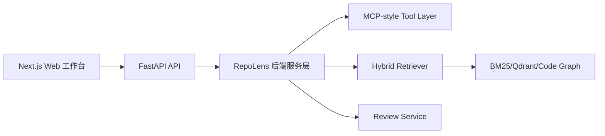
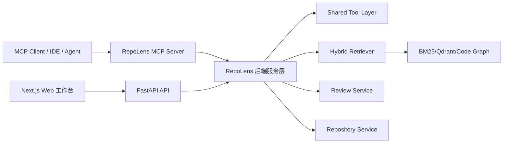

# RepoLens MCP Server 与多 Git 平台扩展设计

## 1. 文档信息

- 项目名称：RepoLens
- 文档类型：扩展设计文档
- 当前版本：v0.1
- 创建日期：2026-06-05
- 相关文档：
  - `docs/requirements-analysis.md`
  - `docs/outline-design.md`
  - `docs/p0-plus-development-plan.md`

## 2. 设计结论

RepoLens 可以封装为 MCP Server，供支持 MCP 的客户端调用，例如 Claude Desktop、Cursor、IDE Agent、Copilot Agent Mode 或其他本地 Agent 客户端。

但 MCP Server 不应在 P0+ 阶段强行实现。推荐路径是：

- P0+：实现 MCP-style Tool Layer，作为内部工具抽象。
- P1：扩展多 Git 平台仓库导入抽象，支持 GitHub、Gitee、GitLab、本地 Git。
- P2：在现有后端能力之上封装真正的 RepoLens MCP Server。

这样既保留当前 P0+ 的可控范围，又为后续扩展成通用本地代码分析服务留下清晰路径。

## 3. 为什么 MCP 封装有价值

### 3.1 从 Web Demo 升级为本地能力服务

如果只提供 Web 工作台，RepoLens 是一个独立应用。封装为 MCP Server 后，RepoLens 可以成为本地代码分析能力服务，被外部 Agent 调用。

典型使用方式：

- 用户在 Cursor 中提问：“分析这个仓库的鉴权逻辑。”
- MCP Client 调用 RepoLens 的 `code_search` 或 `explain_symbol`。
- RepoLens 在本地仓库索引中检索证据，返回文件路径、行号和片段。
- 外部 Agent 基于 RepoLens 返回的证据继续完成代码修改、解释或审查。

### 3.2 扩展应用范围

MCP Server 能让 RepoLens 变成一个通用工具，而不是只能在自己的网页里使用。

扩展方向：

- 本地 IDE 调用。
- 桌面 Agent 调用。
- 企业内部 Agent 调用。
- 与其他代码生成 Agent 组合。
- 支持 GitHub、Gitee、GitLab、自建 Git 服务、本地仓库。

### 3.3 简历价值更强

MCP 封装后，项目可以表达为：

不仅实现了一个 Web 端 Code Agent 平台，还将代码理解、GraphRAG 检索、PR Review 等能力封装为 MCP Server，供外部 Agent 在本地环境中调用。

这会比单纯 Web Demo 更有基础设施味道。

## 4. 架构设计

### 4.1 当前 P0+ 架构



### 4.2 P2 MCP 扩展架构



MCP Server 是薄适配层，只负责协议适配和权限边界，不重新实现代码解析、检索或 Review 逻辑。

## 5. MCP Server 能力范围

### 5.1 推荐暴露 Tools

| MCP Tool | 作用 | 复用内部能力 |
| --- | --- | --- |
| `import_repository` | 导入本地或远程 Git 仓库 | Repository Service |
| `get_repository_status` | 查询仓库索引状态 | Repository Service |
| `code_search` | 混合检索代码证据 | Hybrid Retriever |
| `read_file_slice` | 读取文件指定行范围 | Tool Layer |
| `get_symbol_context` | 获取函数/类上下文和邻接节点 | Code Graph Service |
| `explain_codebase` | 回答仓库架构或模块问题 | QA Service |
| `review_diff` | 审查 PR Diff | Review Service |
| `list_repositories` | 列出已导入仓库 | Repository Service |

### 5.2 推荐暴露 Resources

| MCP Resource | 作用 |
| --- | --- |
| `repolens://repositories` | 已导入仓库列表 |
| `repolens://repositories/{id}/overview` | 仓库概览、语言统计、chunk 数、关系边数 |
| `repolens://repositories/{id}/files` | 文件树 |
| `repolens://tasks/{id}/trace` | Agent trace |
| `repolens://evaluations/{id}` | 评测结果 |

### 5.3 推荐暴露 Prompts

| MCP Prompt | 作用 |
| --- | --- |
| `explain_architecture` | 引导外部 Agent 分析仓库架构 |
| `review_diff_with_evidence` | 引导外部 Agent 基于证据审查 diff |
| `find_feature_implementation` | 引导外部 Agent 定位功能实现 |

## 6. 多 Git 平台扩展设计

### 6.1 问题

当前 P0+ 设计主要写的是 GitHub URL 和本地路径。实际上，仓库来源可以扩展到：

- GitHub
- Gitee
- GitLab
- 自建 GitLab
- Bitbucket
- 本地 Git 仓库
- 普通 Git URL

多数场景并不需要一开始深度接入各平台 API，只要支持标准 Git clone URL，即可完成代码导入与分析。

### 6.2 抽象方式

新增 Repository Provider 抽象：

```text
RepositoryProvider:
  detect(source)
  validate(source)
  clone(source, target_dir, branch)
  get_metadata(source)
```

P1 优先实现：

- LocalRepositoryProvider
- GenericGitProvider
- GitHubProvider
- GiteeProvider

其中 GitHubProvider 和 GiteeProvider 在 P1 可以先复用 GenericGitProvider，只做 URL 识别和展示 metadata，不急于调用平台 API。

### 6.3 source_type 设计

推荐支持：

- local
- github
- gitee
- gitlab
- generic_git

### 6.4 source_url 示例

GitHub：

```text
https://github.com/langchain-ai/langgraph.git
git@github.com:langchain-ai/langgraph.git
```

Gitee：

```text
https://gitee.com/{owner}/{repo}.git
git@gitee.com:{owner}/{repo}.git
```

GitLab：

```text
https://gitlab.com/{owner}/{repo}.git
```

本地：

```text
F:\Desktop\some-project
/home/user/some-project
```

## 7. 阶段规划调整

### 7.1 P0+

保持不变：

- 内部 MCP-style Tool Layer。
- 本地路径导入。
- GitHub URL 导入。
- 不实现真正 MCP Server。

### 7.2 P1

新增：

- Repository Provider 抽象。
- 支持 Gitee URL 和 generic Git URL。
- 仓库来源类型识别。
- 可选支持 GitHub/Gitee token 环境变量，但不强依赖。

### 7.3 P2

新增：

- RepoLens MCP Server。
- 暴露 code_search、read_file_slice、get_symbol_context、review_diff 等 tools。
- 暴露 repositories、overview、trace 等 resources。
- 提供 MCP Client 配置示例。

## 8. 与当前开发计划的关系

当前已经完成 Phase 0。接下来 Phase 1 做仓库导入与代码结构化时，可以提前在代码结构上预留 provider 抽象，但不要在 Phase 1 中深度实现所有平台。

推荐 Phase 1 实现策略：

- 必须完成 LocalRepositoryProvider。
- 必须完成 GenericGitProvider。
- GitHub URL 通过 GenericGitProvider 支持。
- Gitee URL 可以通过 GenericGitProvider 支持，作为轻量增强。
- 平台 API、Issues、PR、commit history 留给 P1/P2 后续增强。

## 9. 简历表达建议

P0+ 完成后可以写：

- 设计 MCP-style Tool Layer，将 code_search、read_file_slice、get_symbol_context、analyze_diff 等能力封装为结构化工具，并记录权限决策和调用日志。

P2 完成后可以升级为：

- 将 RepoLens 封装为 MCP Server，向外部 Agent 暴露代码检索、符号上下文、仓库问答和 PR Diff Review 工具，支持本地仓库、GitHub、Gitee、GitLab 等多来源代码分析。

## 10. 结论

封装为 MCP Server 是一个正确的增强方向，但不应打乱当前 P0+ 主线。

推荐路线：

1. Phase 1 开始引入 Repository Provider 抽象，为 GitHub、Gitee、GitLab 和 generic Git URL 做铺垫。
2. Phase 4 保持 MCP-style Tool Layer，保证工具 schema、权限和日志落地。
3. P2 将现有工具层封装为真正 MCP Server，让 RepoLens 能被外部 Agent 调用。

这样 RepoLens 的定位会从“Web 代码分析应用”升级为“本地代码理解能力服务”，应用范围和简历深度都会更强。

