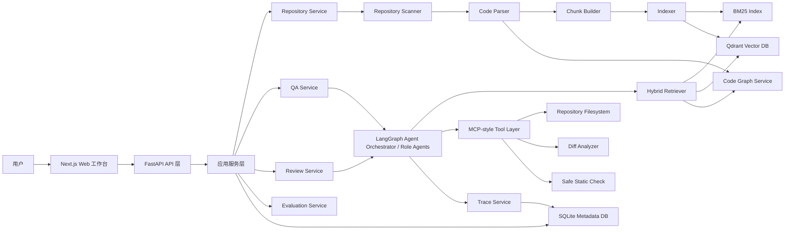
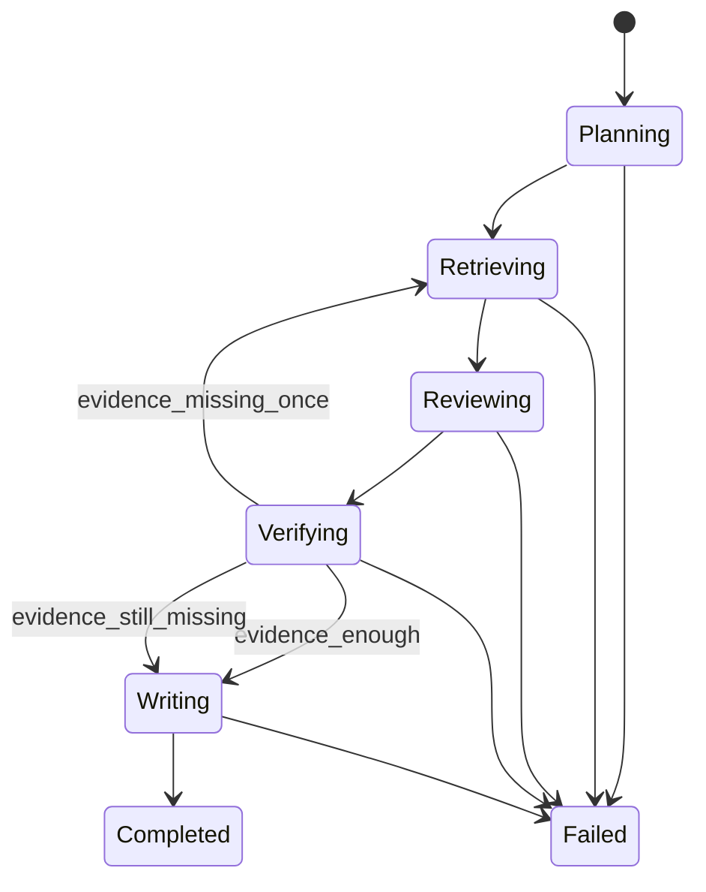
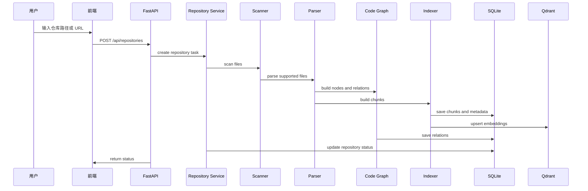
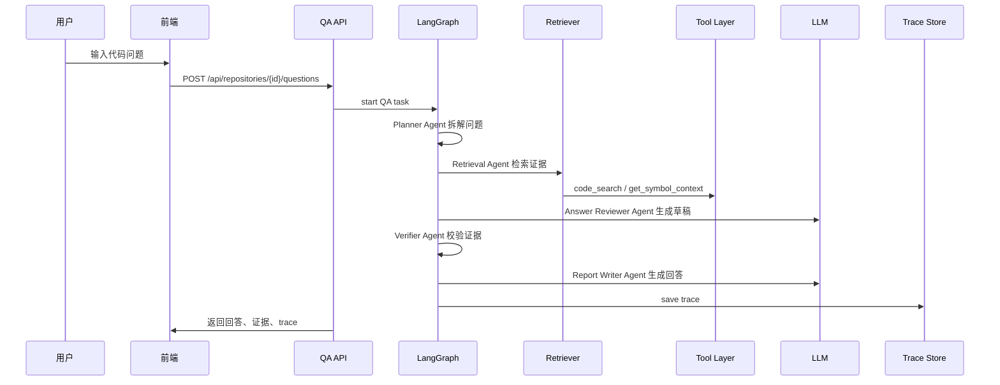
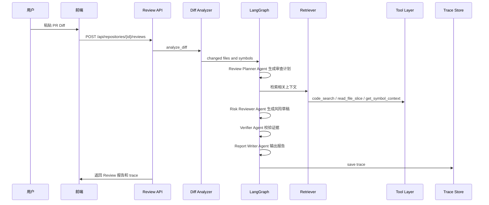
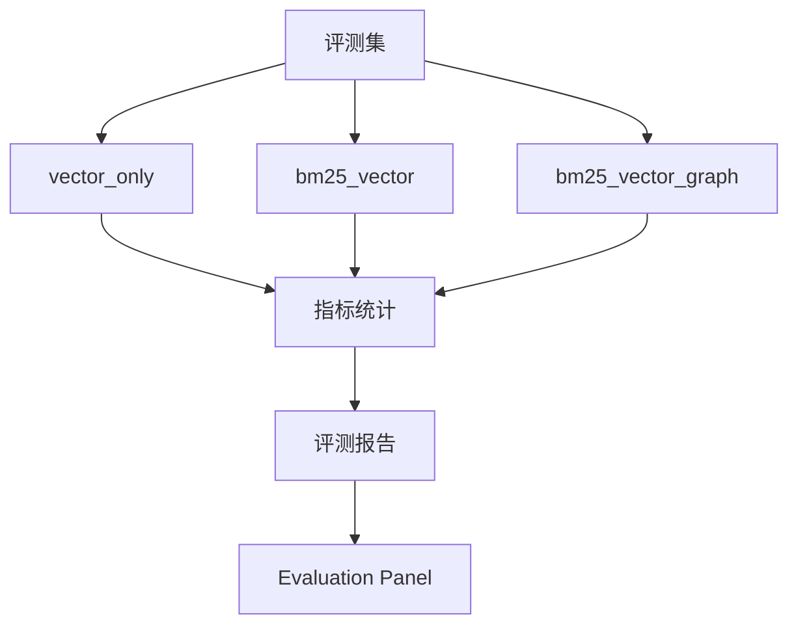
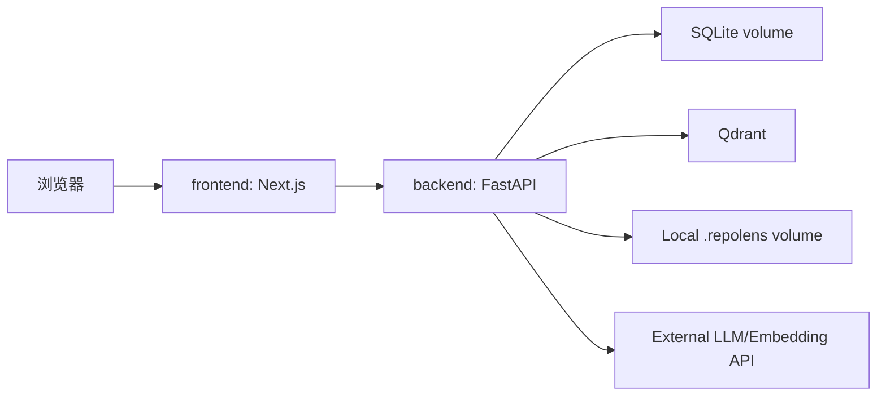

# RepoLens 概要设计文档

## 1. 文档信息

- 项目名称：RepoLens
- 推荐简历名称：RepoLens：基于代码图谱 GraphRAG 的仓库级代码智能体平台
- 文档类型：概要设计文档
- 当前版本：v0.4
- 创建日期：2026-06-05
- 最近更新：2026-06-13
- 依据文档：`docs/requirements-analysis.md`
- 目标读者：项目实现者、面试官、代码评审者

## 2. 设计目标

本概要设计用于把需求分析中的 P0+ 范围落成明确的软件架构、模块边界、数据流、接口边界和验收标准。当前阶段只做设计固化，不进入开发。

RepoLens 的 P0+ 目标是实现一个可面向大厂简历展示的仓库级 Code Agent 系统，而不是普通代码问答 Demo。设计上强调：

- 代码仓库结构化，而不是只做文本切块。
- 混合检索和代码图谱，而不是只做向量搜索。
- 证据引用和 Verifier 校验，而不是只输出模型回答。
- Agent trace 和工具日志，而不是黑盒生成。
- 单主 LangGraph 编排起步，后续演进为角色型 Multi-Agent 协作，而不是一开始堆复杂自治 Agent。
- 评测闭环和指标对比，而不是只靠演示效果。
- 本地可复现部署，而不是只在开发机上能跑。

## 3. 架构总览

### 3.1 架构风格

P0+ 采用前后端分离的单体架构。后端内部按模块分层，不拆微服务。这样可以在控制复杂度的同时，展示完整工程能力。



### 3.2 核心设计分层

| 层级 | 模块 | 职责 |
| --- | --- | --- |
| 展示层 | Web 工作台 | 仓库导入、问答、Review、证据、trace、评测展示 |
| API 层 | FastAPI Routers | 参数校验、任务创建、状态查询、结果返回 |
| 应用服务层 | Repository/QA/Review/Evaluation Service | 编排业务流程，不直接处理底层细节 |
| Agent 层 | LangGraph Orchestrator + Role Agents | 统一状态机编排 Planner、Retriever、Reviewer、Verifier、Report Writer 等角色型 Agent |
| 检索层 | Hybrid Retriever | BM25、向量检索、图扩展、重排、上下文组装 |
| 代码理解层 | Parser/Graph/Chunker | 扫描、解析、chunk、关系图构建 |
| 工具层 | MCP-style Tool Layer | 结构化工具调用、权限控制、调用日志 |
| 数据层 | SQLite/Qdrant/BM25 文件 | 保存元数据、向量、关键词索引、trace |

### 3.3 P0+ 运行时组件

| 组件 | 技术 | 说明 |
| --- | --- | --- |
| frontend | Next.js + TypeScript + Tailwind CSS + shadcn/ui | Web 工作台 |
| backend | Python 3.11+ + FastAPI | API 服务和业务逻辑 |
| metadata db | SQLite + SQLAlchemy | 仓库、chunk、任务、trace、证据 |
| vector db | Qdrant | 代码 chunk 向量检索 |
| code graph | NetworkX + SQLite 持久化关系边 | 图邻域扩展和影响范围分析 |
| bm25 index | 本地索引文件 | 精确关键词和符号检索 |
| agent runtime | LangGraph | 单主状态机和角色型 Multi-Agent 工作流 |
| model adapter | OpenAI-compatible adapter | 兼容多种 Chat/Embedding 模型 |

## 4. P0+ 功能范围

### 4.1 必须实现

| 功能 | 范围 |
| --- | --- |
| 仓库导入 | 本地路径导入、Git URL 导入，识别 GitHub、Gitee、GitLab 和 generic Git URL |
| 仓库扫描 | 文件树、语言统计、过滤规则、敏感文件跳过 |
| 代码解析 | Python、TypeScript、JavaScript |
| 代码 chunk | 函数级、类级、文件级 chunk，带行号和 symbol |
| 代码图谱 | File/Class/Function/Method 节点，contains/imports/calls/defined_in/changed_by 边 |
| BM25 检索 | 支持关键词、文件名、函数名、符号检索 |
| 向量检索 | Qdrant 保存 chunk embedding |
| 图邻域扩展 | 调用方、被调用方、同文件上下文、导入依赖 |
| 轻量重排 | 按 BM25 分、向量分、图距离、文件相关性综合排序 |
| 仓库问答 | 架构理解、功能定位、函数解释、调用关系、影响范围 |
| PR Review | 粘贴 Diff，输出风险、影响范围、测试建议、修复建议 |
| Agent 工作流 | 单主 LangGraph Orchestrator + Planner、Retriever、Reviewer、Verifier、Report Writer 角色型 Agent 节点 |
| 工具层 | code_search、read_file_slice、get_symbol_context、analyze_diff、run_safe_static_check |
| Trace | Agent 节点、工具调用、证据、耗时、token |
| 评测 | 至少 50 条样例，输出 Hit@5、MRR、引用覆盖率、幻觉率、延迟、token 成本 |
| Web 工作台 | Repository、Ask、Review、Evidence、Trace、Evaluation、Settings 区域 |
| 部署 | Docker Compose 启动 frontend、backend、qdrant |

### 4.2 暂不实现

- 多用户登录。
- 代码平台 PR/MR 评论自动写回。
- Kubernetes。
- 分布式索引。
- Neo4j。
- PostgreSQL。
- Redis/Celery。
- 完整 MCP Server。
- 任意测试脚本自动执行。
- 支持几十种编程语言。
- 独立自治式多 Agent 协商框架。P0+ 只实现 LangGraph 统一编排下的角色型 Agent 节点。

### 4.3 后续增强

- GitHub/Gitee/GitLab 等代码平台的 Issue、PR/MR、commit history 纳入上下文。
- Repository Provider 与 Change Request Provider 抽象，支持 GitHub、Gitee、GitLab、self-hosted GitLab、generic Git URL 和本地 Git。
- RepoLens MCP Server，对外暴露代码检索、符号上下文、仓库问答和 PR Review 能力。
- 架构图可视化。
- 静态检查工具完整接入。
- 增量索引。
- PostgreSQL + Redis/RQ + Neo4j 生产化替换。

## 5. 后端模块设计

### 5.1 Repository Service

#### 职责

- 创建仓库导入任务。
- 管理仓库元数据。
- 通过 Repository Provider 适配本地仓库、GitHub、Gitee、GitLab 和 generic Git URL。
- V1 通过 Change Request Provider 适配 GitHub PR、Gitee Pull Request、GitLab Merge Request 和自建 GitLab Merge Request。
- 调用 Scanner、Parser、Indexer、Graph Service。
- 查询索引状态。
- 删除仓库记录和索引。

#### 输入

- repository_url，可选。
- local_path，可选。
- branch，可选。
- ignore_rules，可选。

#### 输出

- repository_id。
- repository status。
- language summary。
- file/chunk/relation 统计。

#### 不负责

- 不直接调用 LLM。
- 不生成问答结果。
- 不执行 PR Review。

### 5.2 Repository Scanner

#### 职责

- 遍历仓库目录。
- 应用过滤规则。
- 识别文件类型和语言。
- 输出可解析文件列表。

#### 过滤规则

- 过滤 `.git`、`node_modules`、`dist`、`build`、`.venv`、`.next`、`coverage`、`__pycache__`。
- 过滤二进制文件、图片、压缩包和日志。
- 过滤 `.env`、密钥、证书、token 配置。
- 单文件超过 1MB 时跳过并记录原因。

### 5.3 Code Parser

#### 职责

- 解析 Python、TypeScript、JavaScript。
- 提取文件、类、函数、方法、导入语句和基础调用关系。
- 输出结构化 symbol 和 relation。

#### 技术方案

- Python 优先使用 `ast`，必要时用 tree-sitter 补充。
- TypeScript/JavaScript 使用 tree-sitter。
- 无法解析时退化为文件级 chunk。

#### 输出

- ParsedFile。
- SymbolDefinition。
- ImportRelation。
- CallRelation。
- ParseError。

### 5.4 Chunk Builder

#### 职责

- 根据解析结果生成函数级、类级和文件级 chunk。
- 计算 content_hash。
- 绑定文件路径、起止行号、symbol_name、symbol_type、language。

#### chunk 优先级

1. 函数或方法级。
2. 类级。
3. 文件级。
4. 固定 token 窗口 fallback。

### 5.5 Code Graph Service

#### 职责

- 构建并维护代码关系图。
- 支持图邻域查询。
- 支持 diff 影响范围分析。

#### 节点类型

- Repository
- File
- Module
- Class
- Function
- Method

#### 边类型

- contains
- imports
- calls
- defined_in
- changed_by

#### 查询能力

- get_neighbors(symbol_id, depth)
- get_callers(symbol_id)
- get_callees(symbol_id)
- get_file_symbols(file_path)
- get_impacted_symbols(changed_symbol_ids)

### 5.6 Indexer

#### 职责

- 写入 code_chunks 表。
- 建立 BM25 索引。
- 调用 embedding adapter 生成向量。
- 写入 Qdrant。
- 维护索引版本和索引状态。

#### 索引状态

- pending
- scanning
- parsing
- indexing_bm25
- indexing_vector
- building_graph
- ready
- failed

### 5.7 Hybrid Retriever

#### 职责

- 执行多路召回。
- 合并候选。
- 图邻域扩展。
- 轻量重排。
- 组装证据包。

#### 输入

- repository_id。
- query。
- task_type：qa 或 review。
- changed_files，可选。
- symbol_hints，可选。
- token_budget。

#### 输出

- evidence list。
- retrieval trace。
- missing_context hints。

#### 重排公式

P0+ 使用轻量加权公式：

```text
final_score =
  0.35 * vector_score +
  0.30 * bm25_score +
  0.20 * graph_score +
  0.10 * file_relevance_score +
  0.05 * diff_relevance_score
```

P1 可替换为 cross-encoder 或 LLM reranker。

### 5.8 Context Builder

#### 职责

- 控制上下文 token 预算。
- 对证据去重。
- 合并相邻代码片段。
- 生成模型输入上下文。

#### 规则

- QA 默认最多 12 条证据。
- Review 默认最多 20 条证据。
- 同文件相邻 chunk 可以合并。
- 优先保留 diff 相关、图距离近、分数高的证据。

### 5.9 Agent Orchestrator 与 Multi-Agent 演进

#### 职责

- 使用 LangGraph 管理 Agent 状态机。
- 记录每个节点 trace。
- 管理失败重试和二次检索。
- 在统一 AgentState 下编排角色型 Agent 节点。

#### 设计定位

RepoLens 不在 P0+ 一开始实现复杂自治式 Multi-Agent 系统。当前采用单主 LangGraph Orchestrator，所有角色节点共享同一个 AgentState、证据包、工具调用日志和 trace。这样可以先保证 GraphRAG、证据引用和 Verifier 闭环稳定，再逐步拆分角色。

#### 角色型 Agent 节点

| 角色 Agent | 主要职责 | 首次落地阶段 |
| --- | --- | --- |
| Planner Agent | 判断任务类型，拆解检索计划 | Phase 3 |
| Retrieval Agent | 调用 Hybrid Retriever 和 code_search 工具 | Phase 3 |
| Answer Reviewer Agent | 基于证据生成 QA 草稿 | Phase 3 |
| Risk Reviewer Agent | 基于 Diff 和证据生成风险草稿 | Phase 4 |
| Test Suggestion Agent | 基于影响范围生成测试建议 | Phase 4 |
| Verifier Agent | 校验结论是否被证据支撑 | Phase 3 |
| Report Writer Agent | 输出问答结果或 Review 报告 | Phase 3/4 |

#### 不做内容

- 不做 Agent 之间自由长对话。
- 不做独立消息总线。
- 不做多个 Agent 竞争式投票。
- 不做脱离证据链的“专家团”式生成。

#### Agent 状态

```text
AgentState:
  task_id
  repository_id
  task_type
  user_input
  plan
  retrieval_queries
  evidences
  draft
  verification_result
  final_report
  trace
  errors
```

#### 节点设计

| 角色 Agent 节点 | 输入 | 输出 | 失败处理 |
| --- | --- | --- | --- |
| Planner | user_input | plan, retrieval_queries | 生成默认检索 query |
| Retriever | retrieval_queries | evidences | 降级为 BM25-only |
| Reviewer | evidences | draft | 标记 insufficient_context |
| Verifier | draft, evidences | verification_result | 触发一次补充检索 |
| Report Writer | verified draft | final_report | 输出结构化错误 |

#### 状态流转



### 5.10 QA Service

#### 职责

- 接收仓库问答请求。
- 创建 QA task。
- 调用 Agent Orchestrator。
- 返回答案、证据和 trace。

#### 支持问题类型

- architecture_overview
- feature_location
- symbol_explanation
- call_relation
- impact_analysis

### 5.11 PR Review Service

#### 职责

- 接收 Diff。
- 调用 Diff Analyzer。
- 将变更映射到代码 chunk 和 symbol。
- 调用 Agent Orchestrator。
- 输出结构化 Review 报告。

V1 中 PR Review Service 需要支持平台无关的 Change Request 输入。平台适配器负责把 GitHub PR、Gitee Pull Request、GitLab Merge Request 或 self-hosted GitLab Merge Request 转换为统一的 diff、metadata、changed files 和 commits，再复用同一条 Review pipeline。

#### Change Request Provider 职责

- 解析不同平台的 PR/MR URL。
- 读取平台 API token、base URL 和 timeout 配置。
- 拉取变更 metadata、diff、changed files 和 commits。
- 输出统一 ChangeRequest 对象。
- 标记 unsupported provider、权限不足、rate limit、diff 过大等错误。

#### 首批平台范围

| 平台 | 变更类型 | V1 策略 |
| --- | --- | --- |
| GitHub | Pull Request | Phase 6 首个落地适配器 |
| Gitee | Pull Request | Phase 6 预留 URL parser 和 provider 契约，可后续补 client |
| GitLab.com | Merge Request | Phase 6 预留 URL parser 和 provider 契约，可后续补 client |
| self-hosted GitLab | Merge Request | 通过 configurable base URL 预留 |
| generic Git URL | 无平台 API | 继续支持 clone/import；不承诺 PR/MR metadata |

#### Review 报告 schema

```text
ReviewReport:
  summary
  risk_level
  risks[]
  impacted_symbols[]
  suggested_tests[]
  patch_suggestions[]
  citations[]
  trace_id
```

### 5.12 MCP-style Tool Layer

#### 设计原则

P0+ 工具层要像 MCP 一样有明确的工具名、输入 schema、输出 schema、权限边界和调用日志。P0+ 不要求启动真正 MCP Server，但后续应能平滑迁移。

#### 工具清单

| 工具 | 输入 | 输出 | 权限 |
| --- | --- | --- | --- |
| code_search | repository_id, query, filters, top_k | evidence list | 仅当前仓库索引 |
| read_file_slice | repository_id, file_path, start_line, end_line | file snippet | 仅仓库目录，过滤敏感文件 |
| get_symbol_context | repository_id, symbol_name/id, depth | symbol + neighbors | 仅当前仓库代码图 |
| analyze_diff | repository_id, diff_text | changed files/symbols | 不执行代码 |
| run_safe_static_check | repository_id, tool_name, target_files | check result | 白名单工具，默认关闭 |

#### 工具调用日志

每次工具调用记录：

- tool_name
- input_summary
- output_summary
- permission_decision
- latency_ms
- success
- error

### 5.13 Evaluation Service

#### 职责

- 加载评测集。
- 执行不同检索策略。
- 统计检索、生成和工程指标。
- 生成评测报告。

#### 评测策略

- vector_only。
- bm25_vector。
- bm25_vector_graph。

#### 输出指标

- Hit@5。
- MRR。
- 引用覆盖率。
- 幻觉率。
- Review 有效率。
- 平均延迟。
- 平均 token 成本。

## 6. 前端模块设计

### 6.1 页面结构

前端首页就是工作台。推荐采用双栏或三栏布局，强调工程工具感。

| 区域 | 功能 |
| --- | --- |
| Repository Panel | 导入仓库、仓库列表、索引状态 |
| Overview Panel | 文件数、chunk 数、关系边数、语言分布 |
| Ask Panel | 问题输入、回答展示、引用展示 |
| Review Panel | Diff 输入、Review 报告展示 |
| Evidence Panel | 证据列表、文件路径、行号、snippet、score |
| Trace Panel | Agent 步骤、工具调用、耗时、token |
| Evaluation Panel | 评测指标和策略对比 |
| Settings Panel | 模型、embedding、过滤规则、token budget |

### 6.2 前端状态

- idle
- importing
- scanning
- indexing
- ready
- answering
- reviewing
- evaluating
- failed

### 6.3 展示要求

- 所有证据引用都能看到文件路径和行号。
- Agent trace 可以折叠展开。
- 工具调用结果可以查看摘要。
- Review 风险按 High、Medium、Low 分组。
- 支持导出 Markdown 报告。

## 7. 核心流程设计

### 7.1 仓库导入与索引流程



### 7.2 代码问答流程



### 7.3 PR Review 流程



### 7.4 评测流程



## 8. 数据架构

### 8.1 SQLite 表

#### repositories

| 字段 | 类型 | 说明 |
| --- | --- | --- |
| id | text | 仓库 ID |
| name | text | 仓库名称 |
| source_type | text | local、github、gitee、gitlab 或 generic_git |
| source_url | text | Git URL 或平台仓库 URL |
| local_path | text | 本地路径 |
| branch | text | 分支 |
| language_summary | text | JSON |
| file_count | integer | 文件数量 |
| chunk_count | integer | chunk 数量 |
| relation_count | integer | 关系边数量 |
| status | text | 索引状态 |
| created_at | datetime | 创建时间 |
| indexed_at | datetime | 索引完成时间 |

#### code_chunks

| 字段 | 类型 | 说明 |
| --- | --- | --- |
| id | text | chunk ID |
| repository_id | text | 仓库 ID |
| file_path | text | 文件路径 |
| language | text | 语言 |
| symbol_name | text | 符号名 |
| symbol_type | text | file、class、function、method |
| start_line | integer | 起始行 |
| end_line | integer | 结束行 |
| content_hash | text | 内容 hash |
| content | text | chunk 内容 |
| metadata | text | JSON |

#### code_relations

| 字段 | 类型 | 说明 |
| --- | --- | --- |
| id | text | 关系 ID |
| repository_id | text | 仓库 ID |
| source_id | text | 来源节点 |
| target_id | text | 目标节点 |
| source_symbol | text | 来源符号 |
| target_symbol | text | 目标符号 |
| relation_type | text | contains、imports、calls、defined_in、changed_by |
| source_file | text | 来源文件 |
| target_file | text | 目标文件 |
| metadata | text | JSON |

#### tasks

| 字段 | 类型 | 说明 |
| --- | --- | --- |
| id | text | 任务 ID |
| repository_id | text | 仓库 ID |
| task_type | text | qa、review、evaluation |
| status | text | running、completed、failed |
| input | text | 用户问题或 diff |
| output | text | 最终结果 JSON/Markdown |
| created_at | datetime | 创建时间 |
| completed_at | datetime | 完成时间 |

#### evidences

| 字段 | 类型 | 说明 |
| --- | --- | --- |
| id | text | 证据 ID |
| task_id | text | 任务 ID |
| chunk_id | text | chunk ID |
| file_path | text | 文件路径 |
| start_line | integer | 起始行 |
| end_line | integer | 结束行 |
| symbol_name | text | 符号名 |
| source | text | bm25、vector、graph_expand、diff_context |
| score | real | 综合分数 |
| snippet | text | 证据片段 |

#### agent_traces

| 字段 | 类型 | 说明 |
| --- | --- | --- |
| id | text | trace ID |
| task_id | text | 任务 ID |
| step_name | text | Planner、Retriever、Reviewer、Verifier、ReportWriter、TestSuggestion |
| input_summary | text | 输入摘要 |
| output_summary | text | 输出摘要 |
| evidence_ids | text | JSON |
| tool_calls | text | JSON |
| latency_ms | integer | 耗时 |
| token_usage | text | JSON |
| error | text | 错误信息 |

#### tool_calls

| 字段 | 类型 | 说明 |
| --- | --- | --- |
| id | text | 工具调用 ID |
| task_id | text | 任务 ID |
| trace_id | text | trace ID |
| tool_name | text | 工具名称 |
| input_summary | text | 输入摘要 |
| output_summary | text | 输出摘要 |
| permission_decision | text | allow、deny、requires_confirmation |
| latency_ms | integer | 耗时 |
| success | boolean | 是否成功 |
| error | text | 错误 |

#### change_requests

V1 新增，用于保存外部平台 PR/MR metadata 与 Review task 的关联。

| 字段 | 类型 | 说明 |
| --- | --- | --- |
| id | text | 外部变更记录 ID |
| repository_id | text | 关联 RepoLens repository，可为空或后续补全 |
| task_id | text | 关联 review task |
| platform | text | github、gitee、gitlab、self_hosted_gitlab |
| change_type | text | pull_request 或 merge_request |
| owner | text | 命名空间或组织 |
| repo | text | 仓库名 |
| number | text | PR/MR 编号 |
| url | text | 原始 PR/MR URL |
| title | text | 标题 |
| author | text | 作者 |
| source_branch | text | 源分支 |
| target_branch | text | 目标分支 |
| metadata | text | 脱敏后的 JSON metadata |
| created_at | datetime | 创建时间 |

### 8.2 Qdrant Collection

Collection 名称：

- `repolens_code_chunks`

Vector payload：

- chunk_id
- repository_id
- file_path
- symbol_name
- symbol_type
- language
- start_line
- end_line
- content_hash

### 8.3 本地缓存目录

```text
.repolens/
  repos/
    {repository_id}/
  indexes/
    bm25/
      {repository_id}.json
  traces/
    {task_id}.json
  eval/
    results/
```

## 9. API 设计概要

### 9.1 Repository API

| 方法 | 路径 | 说明 |
| --- | --- | --- |
| POST | `/api/repositories` | 创建仓库导入任务 |
| GET | `/api/repositories` | 查询仓库列表 |
| GET | `/api/repositories/{id}` | 查询仓库详情 |
| GET | `/api/repositories/{id}/status` | 查询索引状态 |
| GET | `/api/repositories/{id}/files` | 查询文件树 |
| GET | `/api/repositories/{id}/symbols` | 查询符号列表 |
| DELETE | `/api/repositories/{id}` | 删除仓库记录和索引 |

### 9.2 QA API

| 方法 | 路径 | 说明 |
| --- | --- | --- |
| POST | `/api/repositories/{id}/questions` | 创建问答任务 |
| GET | `/api/tasks/{task_id}` | 查询任务结果 |
| GET | `/api/tasks/{task_id}/evidences` | 查询证据 |
| GET | `/api/tasks/{task_id}/trace` | 查询 Agent trace |

### 9.3 Review API

| 方法 | 路径 | 说明 |
| --- | --- | --- |
| POST | `/api/repositories/{id}/reviews` | 创建 PR Review 任务 |
| GET | `/api/reviews/{review_id}` | 查询 Review 报告 |
| GET | `/api/reviews/{review_id}/markdown` | 导出 Markdown |

### 9.4 Evaluation API

| 方法 | 路径 | 说明 |
| --- | --- | --- |
| POST | `/api/repositories/{id}/evaluations` | 启动评测 |
| GET | `/api/evaluations/{id}` | 查询评测结果 |

### 9.5 Tool API

P0+ 工具主要由 Agent 内部调用。为了调试和展示，可提供只读调试接口：

| 方法 | 路径 | 说明 |
| --- | --- | --- |
| GET | `/api/tasks/{task_id}/tools` | 查询工具调用记录 |

## 10. 目录结构设计

```text
repolens/
  backend/
    app/
      api/
        repositories.py
        questions.py
        reviews.py
        evaluations.py
        tasks.py
      core/
        config.py
        security.py
        logging.py
      db/
        session.py
        migrations/
      models/
      schemas/
      services/
        repository/
        scanner/
        parser/
        chunking/
        indexing/
        retrieval/
        graph/
        agent/
        review/
        evaluation/
        tools/
      prompts/
        planner.md
        reviewer.md
        verifier.md
        report_writer.md
      tests/
    pyproject.toml
  frontend/
    app/
    components/
      repository/
      ask/
      review/
      evidence/
      trace/
      evaluation/
      settings/
    lib/
    types/
    package.json
  docs/
    requirements-analysis.md
    outline-design.md
    resume-project-audit.md
    conversation-worklog.md
  evals/
    datasets/
    reports/
  docker-compose.yml
  README.md
```

## 11. 安全与权限设计

### 11.1 文件访问

- 只能读取已导入仓库目录内文件。
- 禁止读取仓库外路径。
- 禁止读取 `.env`、密钥、证书、token 配置。
- 读取文件必须经过 read_file_slice 工具，记录日志。

### 11.2 命令执行

- P0+ 默认不执行仓库脚本。
- run_safe_static_check 默认关闭。
- 仅允许白名单静态检查工具。
- 执行前需要显式开关或用户确认。

### 11.3 模型密钥

- API key 只从环境变量读取。
- 不写入数据库。
- 不写入 Agent trace。
- 日志中需要脱敏。

## 12. 错误处理设计

| 场景 | 处理方式 |
| --- | --- |
| 仓库路径不存在 | 返回明确错误和修复建议 |
| Git clone 失败 | 返回网络、权限或仓库不存在原因 |
| PR/MR URL 平台不支持 | 返回 unsupported provider 和当前支持平台 |
| 平台 API 失败 | 返回认证、权限、rate limit 或资源不存在原因 |
| PR/MR diff 过大 | 拒绝或截断，并返回明确原因 |
| 文件解析失败 | 记录失败文件，继续处理其他文件 |
| embedding 失败 | 重试，失败后标记索引失败 |
| Qdrant 不可用 | 返回服务异常，提示检查 Docker |
| LLM 调用失败 | 重试，失败后返回 trace 和错误原因 |
| 证据不足 | Verifier 触发一次补充检索 |
| 二次检索仍不足 | 输出低置信度和 missing_context |
| 工具权限拒绝 | 记录 permission_decision，不执行工具 |

## 13. 可观测性设计

每次 QA、Review、Evaluation 任务都记录：

- task_id。
- repository_id。
- Agent 节点执行顺序。
- 每个节点输入和输出摘要。
- 检索 query。
- 检索到的 evidence 列表。
- 工具调用记录。
- 模型名称。
- token 使用量。
- 每个步骤耗时。
- 总耗时。
- 错误信息。

前端展示：

- 当前任务状态。
- Agent 执行轨迹。
- 检索证据和召回来源。
- 工具调用日志。
- 最终报告。
- 耗时和 token 成本。
- 评测指标。

## 14. 部署设计

P0+ 使用 Docker Compose 启动：



服务：

- frontend：Next.js Web 服务。
- backend：FastAPI API 服务。
- qdrant：向量数据库。

挂载：

- SQLite 数据文件。
- `.repolens` 仓库缓存和索引缓存。
- eval reports。

## 15. P0+ 验收标准

P0+ 完成后必须满足：

- 可以导入至少 1 个真实 Python 仓库和 1 个真实 TypeScript/JavaScript 仓库。
- 可以完成仓库扫描、代码解析、chunk 生成、BM25 索引、Qdrant 向量索引和代码图构建。
- 代码图至少包含 File、Class、Function/Method 节点，以及 contains、imports、calls、defined_in 边。
- 可以回答架构理解、功能定位、函数解释、调用关系、影响范围 5 类问题。
- QA 结果关键结论必须带文件路径、行号和代码证据片段。
- 可以对粘贴式 PR Diff 生成结构化 Review 报告。
- Review 报告必须包含风险等级、代码位置、原因、证据、影响范围和测试建议。
- Agent trace 必须展示 Planner、Retriever、Reviewer、Verifier、Report Writer 等角色型 Agent 节点。
- 工具调用必须记录 tool_name、permission_decision、latency_ms、success、error。
- 至少 50 条评测样例，至少对比 vector_only、bm25_vector、bm25_vector_graph 三种策略。
- 前端可以展示仓库状态、问答结果、Review 报告、证据列表、Agent trace 和评测结果。
- Docker Compose 可以启动主要服务。
- README 包含项目介绍、架构图、启动步骤、演示截图、评测结果和简历写法。

## 16. 当前已确定结论

- 项目定位确定为：基于代码图谱 GraphRAG 的仓库级代码智能体平台。
- P0+ 是大厂简历可展示版本。
- P0+ 必须包含代码结构图谱、混合检索、证据引用、Agent trace、MCP-style Tool Layer、评测闭环和 Web 工作台。
- P0+ 架构采用前后端分离单体架构，不拆微服务。
- 后端使用 Python + FastAPI + LangGraph。
- Agent 设计采用单主 LangGraph Orchestrator 起步，Phase 3/4 演进为 Planner、Retriever、Reviewer、Verifier、Report Writer 等角色型 Multi-Agent 工作流。
- 前端使用 Next.js + TypeScript + Tailwind CSS + shadcn/ui。
- 元数据使用 SQLite，向量库使用 Qdrant，代码图使用 NetworkX，关键词检索使用 BM25。
- P0+ 优先支持 Python、TypeScript 和 JavaScript。
- P0+ 不做多用户、代码平台 PR/MR 写回、Kubernetes、大规模分布式索引、Neo4j、PostgreSQL、Redis/Celery 和完整 MCP Server。
- 后续 V1/P1/P2 可以通过 Repository Provider、Change Request Provider 和 RepoLens MCP Server 扩展为本地代码分析能力服务，支持 GitHub、Gitee、GitLab、self-hosted GitLab、generic Git URL 和本地 Git。
