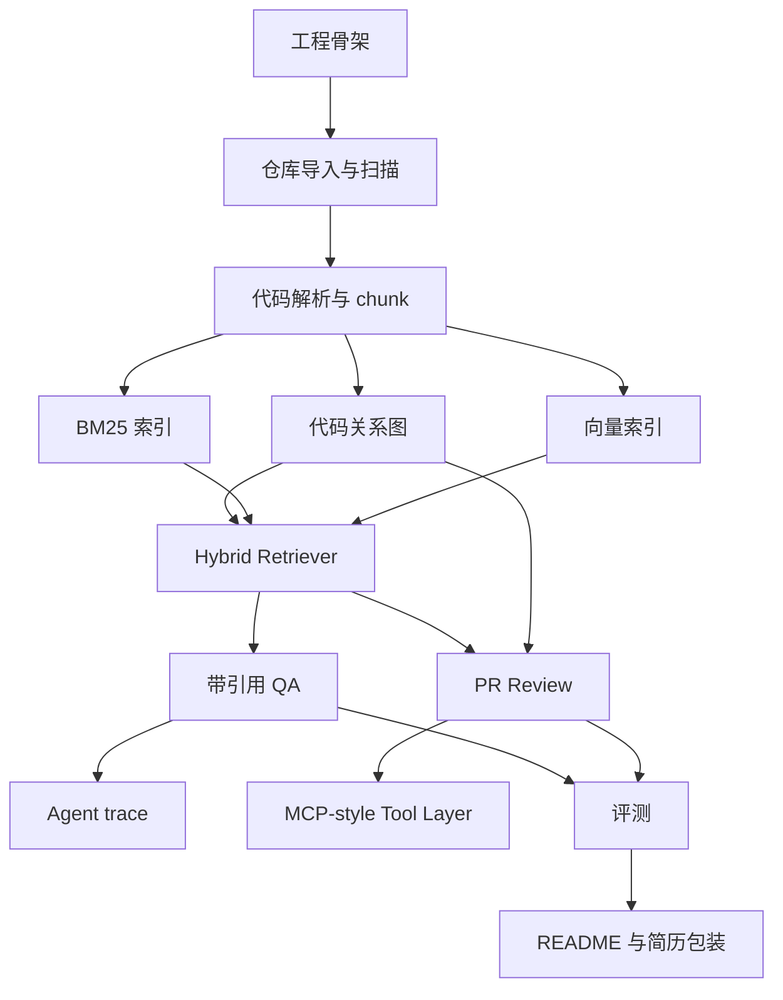

# RepoLens P0+ 开发任务清单与排期文档

## 1. 文档信息

- 项目名称：RepoLens
- 文档类型：P0+ 开发任务清单与排期文档
- 当前版本：v0.2
- 创建日期：2026-06-05
- 依据文档：
  - `docs/requirements-analysis.md`
  - `docs/outline-design.md`
  - `docs/resume-project-audit.md`
- 当前阶段：设计固化后，进入开发前计划制定

## 2. 开发策略结论

RepoLens 后续开发不建议按“一个模块彻底完成后再做下一个模块”的方式推进。更合理的方式是：

按概要设计的模块边界拆分任务，但按垂直闭环迭代交付。

原因：

- RepoLens 的亮点来自端到端链路：仓库导入、代码解析、混合检索、Agent、证据引用、PR Review、trace、评测。
- 如果先把某个模块做得很深，容易出现后续模块接不上、接口不匹配或展示效果不足。
- 垂直闭环可以尽早验证架构合理性，让每一阶段都有可运行、可演示、可验收的成果。
- 模块边界仍然严格遵循概要设计，避免为了赶进度写成混乱脚本。

最终开发方式：

- 以模块划分作为代码组织依据。
- 以端到端能力作为迭代顺序。
- 每个阶段都必须能产出可运行成果。
- 每个阶段结束时更新文档、测试和工作日志。

## 3. 总体排期

P0+ 推荐开发周期为 5 周。若每天投入时间较少，可放宽到 6-8 周。

| 阶段 | 周期 | 目标 | 核心交付 |
| --- | --- | --- | --- |
| Phase 0 | 0.5 周 | 工程初始化与基础骨架 | monorepo、后端/前端基础、配置、README 初版 |
| Phase 1 | 1 周 | 仓库导入与代码结构化 | 扫描、解析、chunk、SQLite 元数据 |
| Phase 2 | 1 周 | 代码图谱与混合检索 | BM25、Qdrant、NetworkX、证据包 |
| Phase 3 | 1 周 | 带引用仓库问答 | QA Service、单主 LangGraph 流程、QA 角色型 Agent、Evidence 展示 |
| Phase 4 | 1 周 | PR Review、Multi-Agent 与工具调用 | Diff 解析、Review 角色型 Agent、MCP-style tools、Review 报告、trace |
| Phase 5 | 0.5-1 周 | 评测、部署与简历包装 | 评测集、指标报告、Docker Compose、演示材料 |

## 4. 阶段开发计划

### 4.1 Phase 0：工程初始化与基础骨架

#### 目标

搭建可持续开发的工程骨架，为后续模块实现提供稳定目录、配置、接口和开发环境。

#### 涉及模块

- Backend 基础框架
- Frontend 基础框架
- 配置模块
- 文档与 README
- Docker Compose 初版

#### 任务清单

| 编号 | 任务 | 说明 |
| --- | --- | --- |
| P0-001 | 初始化 monorepo 目录 | 按概要设计创建 `backend`、`frontend`、`docs`、`evals` |
| P0-002 | 初始化 FastAPI 后端 | 创建 app、api、core、services、models、schemas 目录 |
| P0-003 | 初始化 Next.js 前端 | 创建工作台页面基础结构 |
| P0-004 | 建立配置管理 | 环境变量、模型配置、Qdrant 配置、路径配置 |
| P0-005 | 建立 SQLite 连接 | SQLAlchemy session 与基础迁移方式 |
| P0-006 | 建立健康检查接口 | `/health`、`/api/status` |
| P0-007 | 建立 Docker Compose 初版 | backend、frontend、qdrant |
| P0-008 | README 初版 | 项目定位、技术栈、当前状态、启动方式占位 |

#### 交付物

- 后端服务可启动。
- 前端页面可打开。
- Qdrant 容器可启动。
- README 初版。

#### 验收标准

- `backend` 健康检查返回正常。
- `frontend` 能访问基础工作台页面。
- Docker Compose 能启动 Qdrant。
- 项目目录符合概要设计。

### 4.2 Phase 1：仓库导入与代码结构化

#### 目标

完成从仓库导入到代码结构化存储的闭环，为后续检索和图谱构建提供数据基础。

#### 涉及模块

- Repository Service
- Repository Scanner
- Code Parser
- Chunk Builder
- SQLite 数据模型
- Repository Panel

#### 任务清单

| 编号 | 任务 | 说明 |
| --- | --- | --- |
| P1-001 | 实现 repositories 表 | 保存仓库元数据、状态、统计信息 |
| P1-002 | 实现 code_chunks 表 | 保存 chunk 元数据和内容 |
| P1-003 | 实现 code_relations 表 | 保存 contains、imports、calls、defined_in |
| P1-004 | 实现仓库本地路径导入 | P0+ 优先保证本地路径稳定 |
| P1-005 | 实现 Git URL 导入 | 通过 Repository Provider 支持 GitHub URL，预留 Gitee/GitLab/generic Git URL |
| P1-006 | 实现目录扫描和过滤 | 过滤依赖目录、二进制文件、敏感文件 |
| P1-007 | 实现语言识别 | Python、TypeScript、JavaScript |
| P1-008 | 实现 Python 解析 | 使用 `ast` 提取函数、类、导入、调用 |
| P1-009 | 实现 TS/JS 解析 | 使用 tree-sitter 提取函数、类、导入 |
| P1-010 | 实现 chunk builder | 函数级、类级、文件级 chunk |
| P1-011 | 实现索引状态流转 | pending、scanning、parsing、ready、failed |
| P1-012 | 前端展示仓库状态 | 文件数、chunk 数、语言分布 |

#### 交付物

- 能导入本地仓库。
- 能扫描并过滤文件。
- 能生成 code_chunks。
- 能生成基础 code_relations。
- 前端能看到仓库状态。

#### 验收标准

- 至少成功导入 1 个 Python 仓库。
- 至少成功导入 1 个 TypeScript/JavaScript 仓库。
- 每个 chunk 都包含文件路径、起止行号、symbol、language、hash。
- 解析失败文件被记录，但不阻断整个仓库索引。

### 4.3 Phase 2：代码图谱与混合检索

#### 目标

完成 RepoLens 的第一个核心亮点：代码 GraphRAG。实现 BM25、向量检索、代码图邻域扩展和证据包输出。

#### 涉及模块

- Indexer
- Code Graph Service
- Hybrid Retriever
- Context Builder
- Evidence 数据模型
- Evidence Panel

#### 任务清单

| 编号 | 任务 | 说明 |
| --- | --- | --- |
| P2-001 | 实现 BM25 索引 | 支持关键词、文件名、函数名检索 |
| P2-002 | 实现 embedding adapter | OpenAI-compatible embedding 接口 |
| P2-003 | 实现 Qdrant 写入 | 保存 chunk 向量和 payload |
| P2-004 | 实现 Qdrant 检索 | 根据 query 返回相似 chunk |
| P2-005 | 实现 NetworkX 代码图 | 从 code_relations 加载图 |
| P2-006 | 实现图邻域查询 | callers、callees、same file、imports |
| P2-007 | 实现候选合并去重 | 合并 BM25、vector、graph_expand 来源 |
| P2-008 | 实现轻量重排公式 | vector、BM25、graph、file、diff 加权 |
| P2-009 | 实现 Evidence 输出 | evidence_id、chunk_id、source、score、snippet |
| P2-010 | 实现 Context Builder | 控制证据数量和 token 预算 |
| P2-011 | 前端 Evidence Panel | 展示路径、行号、snippet、score、来源 |

#### 交付物

- 能对仓库代码执行 BM25 检索。
- 能执行向量检索。
- 能根据检索结果做图邻域扩展。
- 能输出结构化 evidence list。

#### 验收标准

- 对同一个 query 可以看到 BM25、vector、graph_expand 不同来源证据。
- 每条 evidence 有文件路径、起止行号、symbol、score、snippet。
- 能解释某条证据为什么被召回。

### 4.4 Phase 3：带引用仓库问答

#### 目标

完成第一个可面试演示闭环：导入仓库后，用户提问，系统通过 GraphRAG 和 Agent 输出带证据引用的回答。

#### 涉及模块

- QA Service
- Agent Orchestrator
- Planner Agent
- Retrieval Agent
- Answer Reviewer Agent
- Verifier Agent
- Report Writer Agent
- Trace Service
- Ask Panel
- Trace Panel

#### 任务清单

| 编号 | 任务 | 说明 |
| --- | --- | --- |
| P3-001 | 实现 tasks 表 | 保存 QA 任务状态和输入输出 |
| P3-002 | 实现 agent_traces 表 | 保存每个 Agent 节点执行过程 |
| P3-003 | 实现 QA API | 创建问题任务，查询结果 |
| P3-004 | 实现 Planner Agent | 判断问题类型，生成检索计划 |
| P3-005 | 实现 Retrieval Agent | 调用 Hybrid Retriever |
| P3-006 | 实现 Answer Reviewer Agent | 基于证据生成回答草稿 |
| P3-007 | 实现 Verifier Agent | 检查关键结论是否有证据 |
| P3-008 | 实现二次检索机制 | 证据不足时最多补充检索一次 |
| P3-009 | 实现 Report Writer Agent | 输出 answer、citations、confidence |
| P3-010 | 实现 Trace Panel | 展示 Agent 步骤、耗时、token、工具调用 |
| P3-011 | 实现 Ask Panel | 输入问题、展示回答和引用 |

#### Multi-Agent 边界

Phase 3 的多 Agent 采用“角色型节点”形式实现：所有 Agent 仍由单主 LangGraph Orchestrator 管理，共享 AgentState、evidence list、trace 和工具调用记录。当前不实现 Agent 间自由对话、消息总线或投票式协商。

#### 支持问题类型

- 架构理解。
- 功能定位。
- 函数解释。
- 调用关系。
- 影响范围。

#### 交付物

- 用户能在前端提问。
- 系统返回带引用的回答。
- 前端展示 evidence 和 trace。

#### 验收标准

- 至少能回答 5 类问题。
- 回答关键结论必须带文件路径和行号引用。
- Verifier 能拦截无证据结论或降低 confidence。
- Trace Panel 能看到 Planner、Retriever、Verifier、Report Writer。

### 4.5 Phase 4：PR Review、Multi-Agent 与 MCP-style 工具调用

#### 目标

完成第二个可面试演示闭环：用户粘贴 PR Diff，系统解析变更、检索上下文、分析风险、输出 Review 报告，并展示工具调用 trace。

#### 涉及模块

- PR Review Service
- Diff Analyzer
- MCP-style Tool Layer
- Risk Reviewer Agent
- Test Suggestion Agent
- Tool Call Store
- Review Panel

#### 任务清单

| 编号 | 任务 | 说明 |
| --- | --- | --- |
| P4-001 | 实现 tool_calls 表 | 保存工具名、权限决策、耗时、错误 |
| P4-002 | 实现 analyze_diff 工具 | 解析变更文件、行号、变更类型 |
| P4-003 | 实现 read_file_slice 工具 | 读取指定文件行范围，限制仓库目录 |
| P4-004 | 实现 code_search 工具 | Agent 内部调用混合检索 |
| P4-005 | 实现 get_symbol_context 工具 | 获取 symbol 邻域和上下文 |
| P4-006 | 实现 run_safe_static_check 占位 | 默认关闭，只支持白名单 |
| P4-007 | 实现 Diff 到 symbol 映射 | changed_by 关系 |
| P4-008 | 实现 Review API | 创建 Review 任务，查询报告 |
| P4-009 | 实现 Risk Reviewer Agent | 输出风险草稿和影响范围 |
| P4-010 | 实现 Review Verifier | 检查风险是否有证据支撑 |
| P4-011 | 实现 Test Suggestion Agent | 基于影响范围生成测试建议 |
| P4-012 | 实现 Review Report Writer | 输出 Markdown 和结构化 JSON |
| P4-013 | 实现 Review Panel | Diff 输入、风险报告、证据引用 |
| P4-014 | 实现工具调用展示 | Trace 中展示 tool_name、permission、latency |

#### Multi-Agent 边界

Phase 4 在 Review 场景中扩展角色型 Multi-Agent：Review Planner、Risk Reviewer、Test Suggestion、Verifier、Report Writer。所有角色必须基于 evidence 和 tool outputs 工作，关键结论必须经过 Verifier 校验。

#### 交付物

- 能粘贴 PR Diff。
- 能生成结构化 Review 报告。
- 能展示工具调用记录。

#### 验收标准

- Review 报告包含 summary、risk_level、risks、impacted_symbols、suggested_tests、citations。
- 单个风险包含 severity、location、reason、evidence_ids、suggestion、test_advice。
- 工具调用记录包含 permission_decision。
- 敏感文件不会被 read_file_slice 读取。

### 4.6 Phase 5：评测、部署与简历包装

#### 目标

完成项目从“能跑”到“能放简历”的最后打磨：评测指标、部署复现、README、演示材料。

#### 涉及模块

- Evaluation Service
- Evaluation Panel
- Docker Compose
- README
- Demo Materials

#### 任务清单

| 编号 | 任务 | 说明 |
| --- | --- | --- |
| P5-001 | 设计评测数据格式 | question、expected_files、expected_symbols、type |
| P5-002 | 准备 50 条评测样例 | 20 定位、10 解释、10 架构、10 Review |
| P5-003 | 实现 vector_only 评测 | 只用向量检索 |
| P5-004 | 实现 bm25_vector 评测 | BM25 + 向量 |
| P5-005 | 实现 bm25_vector_graph 评测 | BM25 + 向量 + 图扩展 |
| P5-006 | 实现指标计算 | Hit@5、MRR、引用覆盖率、延迟、token |
| P5-007 | 实现 Evaluation Panel | 展示策略对比表 |
| P5-008 | 完善 Docker Compose | frontend、backend、qdrant、volume |
| P5-009 | 完善 README | 项目定位、架构图、启动、截图、指标、简历写法 |
| P5-010 | 准备演示仓库 | 1 个 Python，1 个 TS/JS |
| P5-011 | 准备演示问题 | 架构、定位、解释、影响范围、Review |
| P5-012 | 录制或整理演示截图 | 用于简历和 GitHub |

#### 交付物

- 评测报告。
- Docker Compose 可复现部署。
- README 完整版。
- Demo 截图或视频素材。
- 简历 bullet 最终版。

#### 验收标准

- 至少 50 条评测样例。
- 至少 3 种检索策略对比。
- README 包含评测结果。
- 项目可以通过 Docker Compose 启动主要服务。
- 有真实仓库演示截图。

## 5. 模块与阶段映射

| 模块 | Phase 0 | Phase 1 | Phase 2 | Phase 3 | Phase 4 | Phase 5 |
| --- | --- | --- | --- | --- | --- | --- |
| Repository Service | 基础目录 | 核心实现 | 状态完善 | 使用 | 使用 | 使用 |
| Scanner | 目录 | 核心实现 | 使用 | 使用 | 使用 | 使用 |
| Parser | 目录 | 核心实现 | 使用 | 使用 | 使用 | 使用 |
| Chunk Builder | 目录 | 核心实现 | 使用 | 使用 | 使用 | 使用 |
| Code Graph | 目录 | 基础关系 | 核心实现 | 使用 | 影响分析 | 评测使用 |
| Indexer | 目录 | 元数据 | BM25/Qdrant | 使用 | 使用 | 评测使用 |
| Hybrid Retriever | 目录 | 无 | 核心实现 | QA 使用 | Review 使用 | 策略对比 |
| Agent Orchestrator | 目录 | 无 | 无 | QA 角色型 Agent 流程 | Review Multi-Agent 流程 | 优化 |
| Tool Layer | 目录 | 无 | 无 | 检索工具雏形 | 核心实现 | 日志完善 |
| QA Service | 目录 | 无 | 无 | 核心实现 | 使用 | 评测使用 |
| Review Service | 目录 | 无 | 无 | 无 | 核心实现 | 评测使用 |
| Evaluation Service | 目录 | 无 | 无 | 无 | 无 | 核心实现 |
| Web 工作台 | 基础页面 | 仓库状态 | 证据展示 | 问答/trace | Review/tools | 评测/包装 |

## 6. 关键依赖关系

## 7. 开发原则

### 7.1 先闭环，后增强

每个阶段都要产出可运行结果。不要在还没有问答闭环前过度优化 parser、reranker 或前端视觉。

### 7.2 先本地路径，后 GitHub URL

本地路径导入稳定性更高，应优先完成。远程 Git URL 导入可以在本地导入稳定后补充；实现时使用 Repository Provider 抽象，为 GitHub、Gitee、GitLab 和 generic Git URL 留扩展点。

### 7.3 先规则重排，后模型重排

P0+ 使用轻量加权重排即可。cross-encoder 或 LLM reranker 放到 P1，避免影响主线。

### 7.4 先 MCP-style Tool Layer，后完整 MCP Server

P0+ 先实现结构化工具 schema、权限边界和调用日志。完整 MCP Server 放到 P2。

### 7.5 先单主编排，后角色型 Multi-Agent

P0+ 的 Agent 系统先使用单主 LangGraph Orchestrator，保证 GraphRAG、证据引用、Verifier 和 trace 闭环稳定。Phase 3/4 再按任务角色拆分 Planner、Retrieval、Reviewer、Verifier、Report Writer、Test Suggestion 等 Agent 节点。不要在检索链路未稳定前引入复杂自治式多 Agent 协商。

### 7.6 先真实小中型仓库，后大型仓库

P0+ 面向简历展示，不追求企业级大仓库性能。优先保证 20k LOC 内仓库体验稳定。

## 8. 风险与控制

| 风险 | 表现 | 控制方式 |
| --- | --- | --- |
| 范围过大 | 每个模块都做一点但没有闭环 | 按 Phase 交付，Phase 3 必须形成 QA 演示闭环 |
| Parser 难度过高 | TS/JS 调用关系提取复杂 | P0+ 只做基础调用关系，失败则退化为 imports 和同文件上下文 |
| Review 准确性不足 | 输出风险不可信 | 强制 evidence 引用和 Verifier 校验 |
| LLM 成本过高 | 问答和评测 token 消耗大 | Context Builder 控制证据数量，记录 token 成本 |
| 前端拖慢进度 | 页面做得漂亮但后端没闭环 | 前端优先工程工作台，不做营销页 |
| MCP 概念空转 | 简历写 MCP 但项目没有落地 | P0+ 实现 MCP-style 工具 schema、权限和日志 |
| Multi-Agent 概念空转 | 为了多 Agent 而多 Agent，缺少收益解释 | 先实现单主 LangGraph 与证据链，Phase 3/4 只做角色型 Agent 节点，并用 trace/评测证明价值 |
| 评测缺失 | 项目难以证明效果 | Phase 5 必须输出指标对比表 |

## 9. P0+ 最终验收总清单

### 9.1 功能验收

- 支持本地仓库导入。
- 支持 GitHub URL 导入。
- 支持 Python、TypeScript、JavaScript 解析。
- 支持函数级、类级、文件级 chunk。
- 支持代码图构建。
- 支持 BM25 检索。
- 支持 Qdrant 向量检索。
- 支持图邻域扩展。
- 支持带引用仓库问答。
- 支持 PR Diff Review。
- 支持 Agent trace 展示。
- 支持 MCP-style 工具调用记录。
- 支持评测策略对比。

### 9.2 展示验收

- 前端可展示仓库状态。
- 前端可展示问答结果和证据。
- 前端可展示 Review 报告。
- 前端可展示 Agent trace。
- 前端可展示工具调用记录。
- 前端可展示评测指标。
- README 有架构图、截图、启动方式和简历写法。

### 9.3 指标验收

- 至少 50 条评测样例。
- 至少对比 3 种检索策略。
- 输出 Hit@5。
- 输出 MRR。
- 输出引用覆盖率。
- 输出幻觉率或无证据结论比例。
- 输出平均延迟。
- 输出平均 token 成本。

## 10. 推荐执行顺序

后续真正进入开发时，按以下顺序执行：

1. Phase 0：工程初始化与基础骨架。
2. Phase 1：仓库导入与代码结构化。
3. Phase 2：代码图谱与混合检索。
4. Phase 3：带引用仓库问答与 QA 角色型 Agent。
5. Phase 4：PR Review、Review Multi-Agent 与 MCP-style 工具调用。
6. Phase 5：评测、部署与简历包装。

这个顺序已经与概要设计中的模块划分对齐。开发过程中如果出现范围冲突，以 `docs/requirements-analysis.md` 的 P0+ 必须实现范围和 `docs/outline-design.md` 的模块边界为准。
