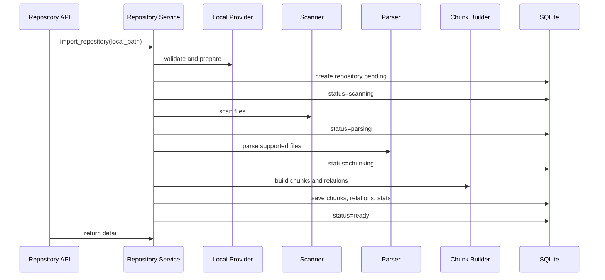
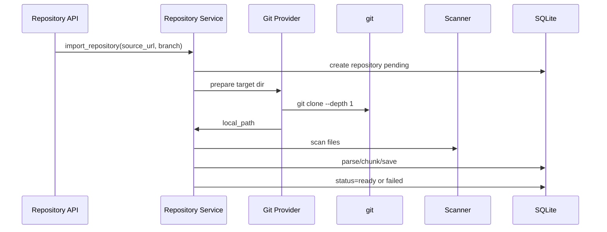
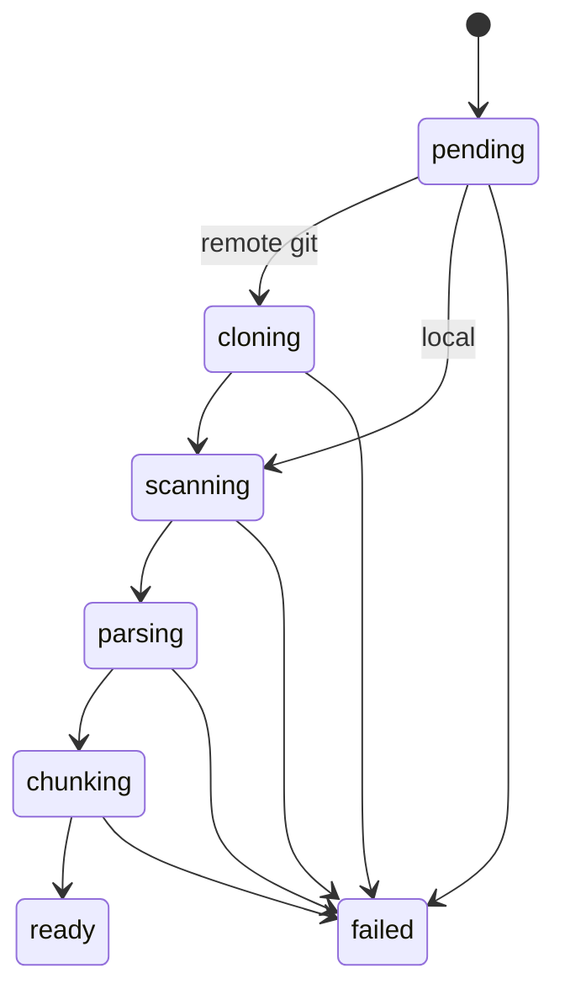

# RepoLens Phase 1 详细设计文档

## 1. 文档信息

- 项目名称：RepoLens
- 文档类型：Phase 1 详细设计文档
- 当前版本：v0.1
- 创建日期：2026-06-05
- 对应计划：`docs/p0-plus-development-plan.md` Phase 1
- 覆盖任务：P1-001 到 P1-012

## 2. Phase 1 目标

Phase 1 的目标是完成“仓库导入与代码结构化”的端到端闭环，为 Phase 2 的代码图谱与混合检索提供可靠数据基础。

Phase 1 完成后，系统应能够：

- 导入本地仓库。
- 通过 Git URL 导入远程仓库，并预留 GitHub、Gitee、GitLab、generic Git URL 扩展点。
- 扫描并过滤仓库文件。
- 识别 Python、TypeScript、JavaScript 文件。
- 解析 Python 代码结构。
- 解析 TypeScript/JavaScript 的基础结构。
- 生成函数级、类级、文件级 chunk。
- 保存 repositories、code_chunks、code_relations。
- 维护索引状态流转。
- 前端展示仓库状态、语言统计、文件数、chunk 数、关系数。

Phase 1 不做：

- BM25 索引。
- Qdrant 向量索引。
- 代码问答。
- PR Review。
- Agent 工作流。
- 完整 MCP Server。

## 3. 任务映射

| 计划编号 | 任务 | 本文档章节 |
| --- | --- | --- |
| P1-001 | 实现 repositories 表 | 5.1 |
| P1-002 | 实现 code_chunks 表 | 5.2 |
| P1-003 | 实现 code_relations 表 | 5.3 |
| P1-004 | 实现仓库本地路径导入 | 6.1、7.1 |
| P1-005 | 实现 Git URL 导入 | 6.2、7.2 |
| P1-006 | 实现目录扫描和过滤 | 8 |
| P1-007 | 实现语言识别 | 8.4 |
| P1-008 | 实现 Python 解析 | 9.2 |
| P1-009 | 实现 TS/JS 解析 | 9.3 |
| P1-010 | 实现 chunk builder | 10 |
| P1-011 | 实现索引状态流转 | 11 |
| P1-012 | 前端展示仓库状态 | 13 |

## 4. 后端模块设计

Phase 1 涉及以下后端模块：

```text
backend/app/
  api/repositories.py
  models/repository.py
  models/code_chunk.py
  models/code_relation.py
  schemas/repository.py
  schemas/code.py
  services/repository/
    service.py
    providers.py
    statuses.py
  services/scanner/
    scanner.py
    filters.py
    language.py
  services/parser/
    base.py
    python_parser.py
    ts_js_parser.py
  services/chunking/
    builder.py
  services/graph/
    relation_builder.py
```

### 4.1 Repository Service

职责：

- 接收导入请求。
- 选择 Repository Provider。
- 创建或更新 Repository 记录。
- 调用 Scanner、Parser、Chunk Builder、Relation Builder。
- 维护状态流转。
- 捕获错误并记录到 Repository。

核心接口：

```text
RepositoryService.import_repository(request) -> RepositoryDetail
RepositoryService.get_repository(repository_id) -> RepositoryDetail
RepositoryService.list_repositories() -> list[RepositorySummary]
RepositoryService.get_status(repository_id) -> RepositoryStatusResponse
RepositoryService.delete_repository(repository_id) -> None
```

### 4.2 Repository Provider

职责：

- 统一本地路径和远程 Git URL 的导入。
- 识别 source_type。
- 校验来源。
- 将仓库准备到本地可扫描路径。

抽象接口：

```text
RepositoryProvider:
  detect(source: str) -> bool
  validate(source: str) -> ProviderValidationResult
  prepare(source: str, target_dir: Path, branch: str | None) -> PreparedRepository
  get_metadata(source: str) -> RepositorySourceMetadata
```

Phase 1 实现：

- LocalRepositoryProvider
- GenericGitProvider

Phase 1 预留但不深度实现：

- GitHubProvider
- GiteeProvider
- GitLabProvider

这些平台 provider 在 Phase 1 可只做 URL 识别和 source_type 标注，实际 clone 复用 GenericGitProvider。

### 4.3 Repository Scanner

职责：

- 遍历仓库目录。
- 应用忽略规则。
- 识别语言。
- 返回可解析文件列表和过滤统计。

核心接口：

```text
scan_repository(root_path: Path, rules: ScanRules) -> ScanResult
```

### 4.4 Code Parser

职责：

- 将源码文件解析为 ParsedFile。
- 提取 symbol 和 relation。
- 捕获 parse error，不阻断整个仓库。

核心接口：

```text
parse_file(file: SourceFile) -> ParsedFile
```

### 4.5 Chunk Builder

职责：

- 将 ParsedFile 转换为 CodeChunk。
- 计算 content_hash。
- 补齐文件级 fallback chunk。

核心接口：

```text
build_chunks(parsed_file: ParsedFile) -> list[CodeChunkCreate]
```

## 5. 数据库设计

Phase 1 使用 SQLite + SQLAlchemy。

### 5.1 repositories 表

| 字段 | 类型 | 必填 | 说明 |
| --- | --- | --- | --- |
| id | string | 是 | UUID |
| name | string | 是 | 仓库名称 |
| source_type | string | 是 | local、github、gitee、gitlab、generic_git |
| source_url | string | 否 | 远程仓库 URL |
| local_path | string | 是 | 实际扫描路径 |
| branch | string | 否 | 分支 |
| commit_hash | string | 否 | 当前 commit |
| language_summary | json/text | 是 | 语言统计 |
| file_count | integer | 是 | 扫描文件总数 |
| parsed_file_count | integer | 是 | 成功解析文件数 |
| skipped_file_count | integer | 是 | 跳过文件数 |
| chunk_count | integer | 是 | chunk 数 |
| relation_count | integer | 是 | relation 数 |
| status | string | 是 | pending、scanning、parsing、chunking、ready、failed |
| error_message | text | 否 | 失败原因 |
| created_at | datetime | 是 | 创建时间 |
| updated_at | datetime | 是 | 更新时间 |
| indexed_at | datetime | 否 | Phase 1 结构化完成时间 |

索引：

- id primary key。
- source_type。
- status。
- created_at。

### 5.2 code_chunks 表

| 字段 | 类型 | 必填 | 说明 |
| --- | --- | --- | --- |
| id | string | 是 | UUID |
| repository_id | string | 是 | Repository FK |
| file_path | string | 是 | 仓库相对路径 |
| language | string | 是 | python、typescript、javascript、unknown |
| symbol_name | string | 是 | 符号名，文件级 chunk 使用文件名 |
| symbol_type | string | 是 | file、class、function、method |
| start_line | integer | 是 | 起始行，1-based |
| end_line | integer | 是 | 结束行，1-based |
| content_hash | string | 是 | SHA256 |
| content | text | 是 | chunk 内容 |
| metadata | json/text | 否 | 额外信息 |
| created_at | datetime | 是 | 创建时间 |

索引：

- repository_id。
- file_path。
- symbol_name。
- symbol_type。
- content_hash。

约束：

- repository_id + file_path + symbol_name + start_line + end_line 应尽量唯一。

### 5.3 code_relations 表

| 字段 | 类型 | 必填 | 说明 |
| --- | --- | --- | --- |
| id | string | 是 | UUID |
| repository_id | string | 是 | Repository FK |
| source_id | string | 否 | 来源 chunk 或 symbol id |
| target_id | string | 否 | 目标 chunk 或 symbol id |
| source_symbol | string | 否 | 来源 symbol |
| target_symbol | string | 否 | 目标 symbol |
| relation_type | string | 是 | contains、imports、calls、defined_in |
| source_file | string | 是 | 来源文件 |
| target_file | string | 否 | 目标文件，可能未知 |
| metadata | json/text | 否 | JSON |
| created_at | datetime | 是 | 创建时间 |

索引：

- repository_id。
- relation_type。
- source_file。
- source_symbol。
- target_symbol。

## 6. Repository Provider 详细设计

### 6.1 LocalRepositoryProvider

支持输入：

```text
F:\Desktop\project
/home/user/project
.
```

校验规则：

- 路径必须存在。
- 路径必须是目录。
- 目录不能是敏感系统目录。
- 目录可没有 `.git`，但 source_type 仍为 local。

prepare 逻辑：

- 不复制仓库，直接使用原路径。
- 保存 local_path 为绝对路径。
- 若存在 `.git`，尝试读取 branch 和 commit_hash；失败不阻断。

### 6.2 GenericGitProvider

支持输入：

```text
https://github.com/owner/repo.git
https://gitee.com/owner/repo.git
https://gitlab.com/owner/repo.git
git@github.com:owner/repo.git
git@gitee.com:owner/repo.git
```

校验规则：

- URL 必须匹配 http(s) Git URL 或 ssh Git URL。
- 不在 Phase 1 校验远程仓库是否真实存在，clone 时处理失败。

prepare 逻辑：

- target_dir 使用 `.repolens/repos/{repository_id}`。
- 调用 `git clone --depth 1`。
- 如果指定 branch，使用 `--branch {branch}`。
- clone 失败时记录 error_message。
- clone 后读取 commit_hash。

安全规则：

- 不执行仓库脚本。
- 不读取敏感文件内容。
- clone 目标目录必须位于 `.repolens/repos`。

### 6.3 source_type 识别

识别规则：

| source | source_type |
| --- | --- |
| 本地路径 | local |
| 包含 `github.com` | github |
| 包含 `gitee.com` | gitee |
| 包含 `gitlab.com` 或自建 gitlab URL | gitlab |
| 其他 Git URL | generic_git |

## 7. 导入流程

### 7.1 本地仓库导入流程



### 7.2 Git URL 导入流程



## 8. Scanner 详细设计

### 8.1 默认忽略目录

```text
.git
node_modules
dist
build
.venv
venv
__pycache__
.next
coverage
.pytest_cache
.mypy_cache
.ruff_cache
target
vendor
```

### 8.2 默认忽略文件

```text
.env
.env.*
*.pem
*.key
*.crt
*.p12
*.pfx
*.log
*.zip
*.tar
*.gz
*.png
*.jpg
*.jpeg
*.gif
*.pdf
*.sqlite
*.db
```

### 8.3 文件大小限制

- 默认单文件最大 1MB。
- 超过限制跳过，记录 skipped reason。

### 8.4 语言识别

| 扩展名 | language |
| --- | --- |
| `.py` | python |
| `.ts` | typescript |
| `.tsx` | typescript |
| `.js` | javascript |
| `.jsx` | javascript |

Phase 1 仅解析上述语言。其他文本文件可以统计，但不生成代码结构 chunk。

### 8.5 ScanResult

```text
ScanResult:
  root_path
  files[]
  skipped_files[]
  language_summary
  file_count
  supported_file_count
  skipped_file_count
```

## 9. Parser 详细设计

### 9.1 通用输出结构

```text
ParsedFile:
  file_path
  language
  content
  line_count
  symbols[]
  relations[]
  errors[]

ParsedSymbol:
  symbol_id
  name
  qualified_name
  symbol_type
  start_line
  end_line
  parent_symbol

ParsedRelation:
  relation_type
  source_symbol
  target_symbol
  source_file
  target_file
  metadata
```

### 9.2 Python Parser

技术：

- 使用 Python 标准库 `ast`。

提取：

- Module。
- ClassDef。
- FunctionDef。
- AsyncFunctionDef。
- Import。
- ImportFrom。
- Call。

规则：

- 顶层函数生成 function symbol。
- 类内函数生成 method symbol。
- 类生成 class symbol。
- 文件 contains 类、函数。
- 类 contains method。
- import/import_from 生成 imports relation。
- 函数体内 `ast.Call` 生成 calls relation，target_symbol 可以先保存为解析到的名称字符串。

限制：

- Phase 1 不要求精准跨文件调用解析。
- 动态调用、装饰器、复杂别名允许不精确。
- 解析失败时生成文件级 chunk。

### 9.3 TypeScript/JavaScript Parser

技术：

- 优先使用 tree-sitter。
- 如果环境暂时缺 tree-sitter，可先实现轻量 fallback parser，提取常见函数、类、import。

提取：

- import statement。
- function declaration。
- method definition。
- class declaration。
- arrow function assigned to const/let。

限制：

- Phase 1 只要求基础结构提取。
- 不要求完整 TypeScript 类型语义。
- 不要求精准跨文件调用解析。

## 10. Chunk Builder 详细设计

### 10.1 chunk 粒度

优先级：

1. method/function chunk。
2. class chunk。
3. file chunk。
4. fallback fixed window chunk。

### 10.2 生成规则

- 每个 function/method symbol 生成一个 chunk。
- 每个 class symbol 生成一个 chunk，可包含类定义及方法摘要范围。
- 每个文件至少生成一个 file chunk。
- 如果文件无法解析，则按文件级或固定窗口生成 fallback chunk。

### 10.3 content_hash

使用 SHA256：

```text
sha256(language + file_path + start_line + end_line + content)
```

### 10.4 行号规则

- 行号从 1 开始。
- start_line 和 end_line 必须闭区间。
- content 必须与行号对应。

## 11. 状态流转设计

### 11.1 RepositoryStatus

```text
pending
cloning
scanning
parsing
chunking
ready
failed
```

### 11.2 状态流转



### 11.3 失败策略

- Provider 失败：repository status = failed。
- Scanner 文件级失败：记录 skipped，不阻断。
- Parser 文件级失败：记录 parse error，生成 fallback chunk。
- Chunk Builder 文件级失败：跳过该文件并记录 error。
- DB 保存失败：repository status = failed。

## 12. API 详细设计

### 12.1 POST `/api/repositories`

请求：

```json
{
  "source": "F:\\Desktop\\project",
  "branch": null,
  "name": null
}
```

字段：

- source：本地路径或 Git URL。
- branch：可选。
- name：可选展示名。

响应：

```json
{
  "id": "uuid",
  "name": "project",
  "source_type": "local",
  "source_url": null,
  "local_path": "F:\\Desktop\\project",
  "branch": null,
  "status": "ready",
  "language_summary": {
    "python": 10
  },
  "file_count": 20,
  "parsed_file_count": 10,
  "skipped_file_count": 3,
  "chunk_count": 35,
  "relation_count": 80,
  "error_message": null
}
```

### 12.2 GET `/api/repositories`

返回：

```json
[
  {
    "id": "uuid",
    "name": "project",
    "source_type": "local",
    "status": "ready",
    "file_count": 20,
    "chunk_count": 35,
    "relation_count": 80,
    "updated_at": "2026-06-05T00:00:00"
  }
]
```

### 12.3 GET `/api/repositories/{id}`

返回 RepositoryDetail。

### 12.4 GET `/api/repositories/{id}/status`

返回：

```json
{
  "id": "uuid",
  "status": "ready",
  "progress": {
    "current_step": "ready",
    "file_count": 20,
    "parsed_file_count": 10,
    "chunk_count": 35,
    "relation_count": 80
  },
  "error_message": null
}
```

### 12.5 GET `/api/repositories/{id}/files`

返回文件树或文件列表。Phase 1 可先返回扁平列表。

### 12.6 GET `/api/repositories/{id}/symbols`

返回 chunk symbol 列表。Phase 1 可基于 code_chunks 返回。

## 13. 前端 Repository Panel 设计

### 13.1 页面区域

Phase 1 在首页工作台中补充 Repository Panel：

- source 输入框。
- branch 输入框，可选。
- Import 按钮。
- 仓库列表。
- 当前仓库状态。
- 语言统计。
- file_count、parsed_file_count、skipped_file_count、chunk_count、relation_count。

### 13.2 前端状态

```text
idle
submitting
importing
ready
failed
```

### 13.3 API 调用

- POST `/api/repositories`
- GET `/api/repositories`
- GET `/api/repositories/{id}/status`

### 13.4 展示规则

- ready：展示统计信息。
- failed：展示 error_message。
- importing/scanning/parsing/chunking：展示当前状态。

## 14. 安全设计

### 14.1 路径安全

- LocalRepositoryProvider 允许读取用户输入的本地路径。
- 远程 clone 目标必须在 `.repolens/repos/{repository_id}`。
- read/scan 逻辑不得越过仓库 root。

### 14.2 敏感文件过滤

Scanner 必须过滤：

- `.env`
- `.env.*`
- `*.pem`
- `*.key`
- `*.crt`
- `*.p12`
- `*.pfx`

### 14.3 命令安全

Phase 1 只允许执行：

- `git clone`
- `git rev-parse`
- `git branch --show-current`

不执行仓库中的任何脚本。

## 15. 测试设计

### 15.1 单元测试

必须覆盖：

- source_type 识别。
- LocalRepositoryProvider validate。
- GenericGitProvider URL detect。
- scanner 过滤规则。
- language detect。
- Python parser 提取 class/function/import/call。
- chunk builder 行号和 hash。
- repository status 流转。

### 15.2 集成测试

使用临时目录构造小型仓库：

- Python demo repo。
- TypeScript/JavaScript demo repo。

测试：

- POST `/api/repositories` 导入本地仓库。
- 生成 repositories 记录。
- 生成 code_chunks。
- 生成 code_relations。
- GET status 返回 ready。

### 15.3 前端测试

Phase 1 最低要求：

- `npm run build` 通过。
- Repository Panel 能编译。

## 16. 审核设计

每次 Phase 1 开发完成一个任务，应做轻量自查：

- 是否严格对应 P1 编号。
- 是否越界实现 Phase 2/3 功能。
- 是否更新 `docs/development-worklog.md`。
- 是否有测试或验证记录。
- 是否保留安全边界。

## 17. 评测设计

Phase 1 不做最终 RAG 评测，但需要记录结构化质量指标，为 Phase 2/5 做准备：

- 成功扫描文件数。
- 跳过文件数。
- 成功解析文件数。
- 解析失败文件数。
- 生成 chunk 数。
- 生成 relation 数。
- 每种语言文件数。

这些指标应在 RepositoryDetail 中返回，并在前端展示。

## 18. Phase 1 验收标准

Phase 1 完成时必须满足：

- P1-001 到 P1-012 均完成并记录。
- 至少成功导入 1 个 Python 本地仓库。
- 至少成功导入 1 个 TypeScript/JavaScript 本地仓库。
- Git URL 导入可通过 provider 识别并执行 clone，至少对 URL 识别有测试。
- 每个 chunk 包含 file_path、start_line、end_line、symbol_name、symbol_type、language、content_hash。
- code_relations 至少包含 contains、imports、defined_in，Python 尽量包含 calls。
- 解析失败文件不会阻断整个仓库导入。
- 前端能展示仓库状态和统计。
- 后端测试通过。
- 前端构建通过。
- 开发过程记录、审核记录、测试记录、评测指标记录完成。

