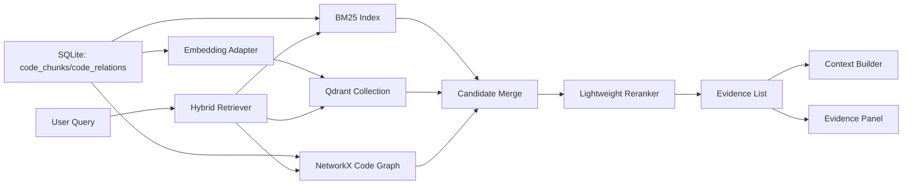

# RepoLens Phase 2 详细设计文档

## 1. 文档信息

- 文档名称：RepoLens Phase 2 详细设计文档
- 所属阶段：Phase 2 - 代码图谱与混合检索
- 当前版本：v0.1
- 创建日期：2026-06-06
- 依据文档：
  - `docs/p0-plus-development-plan.md`
  - `docs/requirements-analysis.md`
  - `docs/outline-design.md`
  - `docs/phase1-detailed-design.md`
- 前置阶段：Phase 1 已完成，`repositories`、`code_chunks`、`code_relations` 已落库

## 2. Phase 2 目标与边界

Phase 2 的目标是完成 RepoLens 的第一个核心亮点：代码 GraphRAG 数据检索层。它需要把 Phase 1 生成的代码 chunk 和代码关系边转化为可查询、可解释、可给后续 Agent 使用的 evidence list。

Phase 2 必须完成：

- BM25 关键词检索。
- OpenAI-compatible embedding adapter。
- Qdrant 写入与检索。
- NetworkX 代码图加载。
- 图邻域查询。
- BM25、vector、graph_expand 候选合并去重。
- 轻量重排。
- Evidence 输出结构。
- Context Builder。
- 前端 Evidence Panel。

Phase 2 不做：

- 仓库问答生成。
- PR Review 生成。
- LangGraph Agent 执行。
- 多 Agent 协作实现。
- LLM 回答生成。
- 评测集完整 50 条构建。
- 生产级异步索引队列。

## 3. Phase 2 任务映射

| 编号 | 任务 | 设计章节 |
| --- | --- | --- |
| P2-001 | 实现 BM25 索引 | 6 |
| P2-002 | 实现 embedding adapter | 7 |
| P2-003 | 实现 Qdrant 写入 | 8 |
| P2-004 | 实现 Qdrant 检索 | 9 |
| P2-005 | 实现 NetworkX 代码图 | 10 |
| P2-006 | 实现图邻域查询 | 11 |
| P2-007 | 实现候选合并去重 | 12 |
| P2-008 | 实现轻量重排公式 | 13 |
| P2-009 | 实现 Evidence 输出 | 14 |
| P2-010 | 实现 Context Builder | 15 |
| P2-011 | 前端 Evidence Panel | 18 |

## 4. 总体数据流



核心原则：

- Phase 2 的检索输入以 `repository_id + query` 为主。
- 检索输出必须是结构化 evidence，不返回裸字符串。
- 每条 evidence 必须能追溯到 `code_chunks.id`。
- graph_expand 只能从已保存的 `code_relations` 生成，不能臆造关系。

## 5. 后端模块划分

Phase 2 主要新增或完善以下模块：

```text
backend/app/services/indexing/
  bm25.py
  embeddings.py
  qdrant_store.py

backend/app/services/graph/
  code_graph.py

backend/app/services/retrieval/
  candidates.py
  hybrid.py
  rerank.py
  context.py

backend/app/schemas/
  evidence.py

backend/app/api/
  retrieval.py
```

模块职责：

| 模块 | 职责 |
| --- | --- |
| indexing.bm25 | 从 code_chunks 构建内存/本地 BM25 索引，执行关键词检索 |
| indexing.embeddings | OpenAI-compatible embedding adapter，支持配置缺失时显式降级 |
| indexing.qdrant_store | Qdrant collection 初始化、upsert、search |
| graph.code_graph | 从 code_chunks/code_relations 加载 NetworkX 图并查询邻域 |
| retrieval.candidates | 统一 BM25/vector/graph 候选结构 |
| retrieval.hybrid | 编排多路召回、图扩展、合并、重排、evidence 输出 |
| retrieval.rerank | 轻量加权排序 |
| retrieval.context | 控制 evidence 数量和 token 预算 |
| schemas.evidence | API 输出结构 |
| api.retrieval | 提供检索调试接口，供前端 Evidence Panel 使用 |

## 6. P2-001 BM25 索引设计

### 6.1 输入

从 SQLite 读取当前仓库的 `code_chunks`：

- id
- repository_id
- file_path
- language
- symbol_name
- symbol_type
- start_line
- end_line
- content
- content_hash

### 6.2 文档字段

每个 chunk 形成一条 BM25 文档：

```text
document_text =
  file_path +
  symbol_name +
  symbol_type +
  language +
  content
```

### 6.3 分词策略

P0+ 不引入复杂中文分词。BM25 使用轻量 tokenizer：

- 小写。
- 按非字母数字下划线切分。
- 对 `snake_case` 按 `_` 拆分。
- 对 `camelCase` 和 `PascalCase` 拆分。
- 保留文件路径片段，例如 `app`, `services`, `repository`。
- 过滤空 token。

示例：

```text
RepositoryService.import_repository
=> repository, service, import, repository
```

### 6.4 BM25 参数

默认参数：

- `k1 = 1.5`
- `b = 0.75`

### 6.5 索引形态

Phase 2 初版优先实现内存 BM25：

- 每次检索从 SQLite 加载当前仓库 chunks 并构建 BM25。
- 中小仓库足够可用，避免提前设计复杂缓存失效。

后续可扩展为本地索引文件：

```text
.repolens/indexes/bm25/{repository_id}.json
```

### 6.6 输出

输出 `RetrievalCandidate`：

```text
chunk_id
source = bm25
score
bm25_score
matched_terms
metadata
```

## 7. P2-002 Embedding Adapter 设计

### 7.1 目标

实现 OpenAI-compatible embedding adapter，供 Qdrant 写入和向量检索使用。

### 7.2 配置

环境变量：

- `REPOLENS_EMBEDDING_BASE_URL`
- `REPOLENS_EMBEDDING_API_KEY`
- `REPOLENS_EMBEDDING_MODEL`
- `REPOLENS_EMBEDDING_DIMENSION`

已在 `backend/app/core/config.py` 扩展 settings，四个环境变量均可读取；`REPOLENS_EMBEDDING_DIMENSION` 为空时表示不强制校验维度。

### 7.3 接口

```text
EmbeddingAdapter.embed_texts(texts: list[str]) -> list[list[float]]
EmbeddingAdapter.embed_query(query: str) -> list[float]
```

### 7.4 降级策略

如果 embedding 配置缺失：

- 不静默伪造真实向量。
- vector 检索返回明确的 disabled 状态。
- Hybrid Retriever 继续使用 BM25 + graph_expand。
- API response 中标记 `vector_disabled_reason`。

测试中允许使用 deterministic fake embedding adapter。

### 7.5 安全

- API key 只从环境变量读取。
- 不写入数据库。
- 不写入前端 response。
- 错误日志不输出完整 key。

### 7.6 实现校准

P2-002 已按本设计落地为 `OpenAICompatibleEmbeddingAdapter`：

- 请求路径兼容 `base_url` 和 `base_url/v1` 两种配置，最终访问 `/v1/embeddings`。
- 请求体为 `{ "model": model, "input": texts }`。
- 响应按 `data[].index` 排序后返回向量列表。
- 配置缺失抛出 `EmbeddingDisabledError`，请求、响应格式和维度错误抛出 `EmbeddingRequestError`。
- 单元测试使用 fake transport 覆盖配置读取、disabled、请求参数、响应排序和维度校验。

## 8. P2-003 Qdrant 写入设计

### 8.1 Collection

Collection 名称：

```text
repolens_code_chunks
```

向量维度：

- 从 `REPOLENS_EMBEDDING_DIMENSION` 读取。
- 若未配置，使用 adapter 返回向量长度初始化。

### 8.2 Point ID

先生成稳定 hash：

```text
sha256(repository_id + ":" + chunk_id)
```

Qdrant point id 使用该 hash 前 128 bit 的 UUID 表示，确保兼容 Qdrant REST point id 约束；完整 hash 写入 payload 的 `point_hash` 字段用于追踪。

### 8.3 Payload

```text
chunk_id
repository_id
file_path
symbol_name
symbol_type
language
start_line
end_line
content_hash
point_hash
```

### 8.4 Upsert 流程

```text
load chunks
build embedding input
embed batches
ensure collection
upsert points
return count
```

### 8.5 批大小

默认：

- embedding batch size：32
- qdrant upsert batch size：64

### 8.6 失败策略

- Qdrant 不可用：vector index 标记失败或 disabled，但不删除 BM25/graph 能力。
- 单个 chunk embedding 失败：当前批次失败，返回明确错误。
- 不在 Phase 2 自动重试无限次。

### 8.7 实现校准

P2-003 已按本设计落地为 `QdrantVectorStore` 和 `index_repository_chunks`：

- Qdrant REST 访问使用标准库 HTTP transport，可在测试中替换为 fake transport。
- `ensure_collection` 先查询 collection；不存在时按向量维度创建，已存在但维度不一致时返回明确错误。
- chunk embedding input 由文件路径、语言、symbol、symbol type 和 chunk content 组成。
- point payload 严格包含 `chunk_id`、`repository_id`、`file_path`、`symbol_name`、`symbol_type`、`language`、`start_line`、`end_line`、`content_hash`、`point_hash`。
- `POST /api/repositories/{repository_id}/indexes/vector` 已接入手动触发向量写入；embedding 未配置返回 400，embedding/Qdrant 请求错误返回 502。
- 单元测试使用 fake embedding 和 fake Qdrant 覆盖 collection 创建、批量 upsert、空仓库、维度不匹配和 API disabled 错误。

## 9. P2-004 Qdrant 检索设计

### 9.1 输入

```text
repository_id
query
top_k
filters optional
```

### 9.2 过滤条件

必须按 `repository_id` 过滤，防止跨仓库召回。

可选过滤：

- language
- file_path prefix
- symbol_type

### 9.3 输出

输出 `RetrievalCandidate`：

```text
chunk_id
source = vector
score
vector_score
metadata
```

### 9.4 降级

如果 Qdrant 或 embedding disabled：

- 不让整个 Hybrid Retriever failed。
- 返回空 vector candidates。
- 在 trace/debug response 中说明原因。

### 9.5 实现校准

P2-004 已在 `QdrantVectorStore.search` 和 `search_repository_chunks` 中落地：

- `search_repository_chunks` 先将 query 通过 embedding adapter 转为 query vector，再调用 Qdrant search。
- Qdrant 请求固定带 `repository_id` must filter，防止跨仓库召回。
- 可选 filter 支持 `language`、`symbol_type` 和 `file_path_prefix`；其中 `file_path_prefix` 在 P2-004 初版映射为 Qdrant `match.text` 条件，后续候选合并阶段仍可做二次精过滤。
- 输出为 `VectorSearchResult`，字段包含 `chunk_id`、`source=vector`、`score`、`vector_score` 和 payload metadata。
- 空 query 或 `top_k <= 0` 返回空结果，不调用 embedding 或 Qdrant。
- 单元测试使用 fake Qdrant 覆盖 search 请求 payload、repository filter、可选 filters、空 query/top_k、query embedding 数量异常和缺失 `chunk_id` 错误。

## 10. P2-005 NetworkX 代码图设计

### 10.1 图来源

从 SQLite 读取：

- `code_chunks`
- `code_relations`

### 10.2 节点

每个 chunk 一个节点：

```text
node_id = chunk.id
attributes:
  repository_id
  file_path
  symbol_name
  symbol_type
  language
  start_line
  end_line
```

对于 relation 中没有 target_id 的 import/call 字符串目标：

- 初版不创建虚拟节点。
- relation 仍可作为 metadata 参与检索解释。
- 后续可扩展 external_symbol 节点。

### 10.3 边

每条 `code_relations` 形成一条有向边：

```text
source_id -> target_id
attributes:
  relation_type
  source_symbol
  target_symbol
  source_file
  target_file
```

仅当 `source_id` 和 `target_id` 均存在时加入 NetworkX 有向图。

### 10.4 图类型

使用：

```text
networkx.DiGraph
```

P0+ 不使用 MultiDiGraph，重复关系通过 metadata 或后续优化处理。

### 10.5 实现校准

P2-005 已在 `backend/app/services/graph/code_graph.py` 中落地：

- 后端依赖新增 `networkx>=3.0.0`。
- `load_code_graph(db, repository_id)` 从 SQLite 加载指定仓库的 `code_chunks` 和 `code_relations`。
- 每个 chunk 生成一个 `networkx.DiGraph` 节点，节点属性包含 repository、路径、symbol、类型、语言、行号和 content hash。
- 仅当 relation 的 `source_id` 和 `target_id` 均存在且都对应已加载 chunk 时创建有向边。
- import/call 等字符串目标关系不会创建虚拟节点，当前只作为被跳过关系计入统计。
- `code_graph_stats` 返回 node、edge 和 skipped relation 统计，供后续日志和评测使用。
- 单元测试覆盖正常图加载、节点/边属性、跳过缺 target_id relation 和缺失仓库空图。

## 11. P2-006 图邻域查询设计

### 11.1 查询能力

必须支持：

- `get_neighbors(chunk_id, depth=1)`
- `get_callers(chunk_id)`
- `get_callees(chunk_id)`
- `get_same_file_chunks(chunk_id)`
- `get_import_neighbors(chunk_id)`

### 11.2 Graph Expand 策略

Hybrid Retriever 在 BM25/vector 得到 seed chunks 后进行图扩展：

1. 对每个 seed chunk 查一跳邻域。
2. 加入同文件 file/class/function 相关 chunk。
3. 对 relation_type 做权重：
   - same_file：0.8
   - contains：0.7
   - defined_in：0.6
   - calls：0.6
   - imports：0.5
4. 超过 `graph_expand_top_k` 后截断。

### 11.3 输出

graph_expand 也输出 `RetrievalCandidate`：

```text
chunk_id
source = graph_expand
score
graph_score
graph_distance
seed_chunk_id
relation_type
```

### 11.4 实现校准

P2-006 已在 `backend/app/services/graph/code_graph.py` 中落地：

- 新增 `GraphExpansionCandidate`，字段包含 `chunk_id`、`source=graph_expand`、`score`、`graph_score`、`graph_distance`、`seed_chunk_id`、`relation_type` 和节点 metadata。
- 已实现 `get_neighbors`、`get_callers`、`get_callees`、`get_same_file_chunks`、`get_import_neighbors`。
- 已实现 `expand_graph_neighbors`，对 seed chunks 执行图扩展与同文件扩展，按 `graph_score` 去重排序并按 `top_k` 截断。
- 权重遵循设计：same_file 0.8、contains 0.7、defined_in 0.6、calls 0.6、imports 0.5。
- 缺失 chunk、无效 depth 或 `top_k <= 0` 返回空列表，不抛出非必要异常。
- 单元测试覆盖 callers、callees、same file、imports、一跳邻域、扩展去重截断和缺失/无效输入。

## 12. P2-007 候选合并去重设计

### 12.1 输入

```text
bm25_candidates[]
vector_candidates[]
graph_candidates[]
```

### 12.2 合并规则

按 `chunk_id` 去重。

合并后的 candidate 保存多来源分数：

```text
chunk_id
sources[]
bm25_score
vector_score
graph_score
file_relevance_score
diff_relevance_score
metadata
```

### 12.3 source 解释

如果一个 chunk 同时来自 BM25 和 graph_expand：

```text
sources = ["bm25", "graph_expand"]
```

Evidence Panel 必须能展示 sources。

### 12.4 实现校准

P2-007 已在 `backend/app/services/retrieval/candidates.py` 中落地：

- 新增 `RetrievalCandidate`，字段包含 `chunk_id`、`sources`、`bm25_score`、`vector_score`、`graph_score`、`file_relevance_score`、`diff_relevance_score` 和 metadata。
- `merge_candidates` 接收 BM25、vector、graph_expand 三路候选，并按 `chunk_id` 合并。
- sources 按固定顺序输出：`bm25`、`vector`、`graph_expand`。
- 同一路来源出现重复 chunk 时保留最高来源分；BM25 matched terms 做并集合并。
- vector/graph metadata 只在对应来源分不低于当前最高分时更新，避免低分候选覆盖高分候选解释信息。
- 当前不计算 final score，不做轻量重排；P2-008 继续实现重排公式。
- 单元测试覆盖跨来源合并、重复来源最高分、matched terms 合并、sources 顺序和空输入。

## 13. P2-008 轻量重排设计

### 13.1 公式

P0+ 使用规则加权：

```text
final_score =
  0.35 * vector_score +
  0.30 * bm25_score +
  0.20 * graph_score +
  0.10 * file_relevance_score +
  0.05 * diff_relevance_score
```

### 13.2 分数归一化

每一路召回在当前候选集合内归一化到 0-1：

```text
normalized = score / max_score
```

如果 max_score 为 0，则该路分数为 0。

### 13.3 file relevance

Phase 2 初版：

- query 命中文件路径 token：1.0
- query 命中 symbol_name token：0.8
- 未命中：0.0

### 13.4 diff relevance

Phase 2 暂无 PR Diff 输入，默认 0。

Phase 4 再接入 changed files。

### 13.5 实现校准

P2-008 已在 `backend/app/services/retrieval/rerank.py` 中落地：

- 新增 `RankedRetrievalCandidate`，字段包含 `final_score`、归一化后的 BM25/vector/graph 分、file relevance、diff relevance 和 metadata。
- `rerank_candidates` 对 BM25、vector、graph 三路分数分别按当前候选集合最大值归一化。
- 权重遵循设计：vector 0.35、BM25 0.30、graph 0.20、file 0.10、diff 0.05。
- file relevance 使用 query token 与 `file_path`、`symbol_name` token 的交集：文件路径命中为 1.0，symbol 命中为 0.8。
- Phase 2 diff relevance 保持默认 0；Phase 4 再接入 PR Diff。
- metadata 中保留 `raw_scores`，用于解释重排前的来源原始分。
- 单元测试覆盖分数归一化、权重公式、file/symbol relevance、top_k、稳定 tie order、空输入和零分输入。

## 14. P2-009 Evidence 输出设计

### 14.1 Evidence Schema

```text
Evidence:
  evidence_id
  chunk_id
  repository_id
  file_path
  start_line
  end_line
  symbol_name
  symbol_type
  language
  source
  sources[]
  score
  bm25_score
  vector_score
  graph_score
  snippet
  metadata
```

### 14.2 evidence_id

稳定生成：

```text
sha256(repository_id + ":" + chunk_id + ":" + sources + ":" + rank)
```

### 14.3 snippet

Phase 2 初版直接使用 chunk content：

- 最多 40 行。
- 最多 4000 字符。
- 超出截断并追加 `...`。

### 14.4 source

主 source 取贡献最大的一路：

- vector
- bm25
- graph_expand

同时保留 `sources[]` 展示所有召回来源。

### 14.5 实现校准

P2-009 已在 `backend/app/services/retrieval/evidence.py` 中落地：

- 新增 `Evidence` dataclass，字段覆盖 evidence_id、chunk/repository、文件路径、行号、symbol、language、source、sources、score、来源分和 snippet。
- `build_evidences` 将 `RankedRetrievalCandidate` 与 SQLite `CodeChunk` 元数据结合，跳过缺失或跨仓库 chunk。
- `evidence_id_for` 按 `sha256(repository_id + ":" + chunk_id + ":" + sources + ":" + rank)` 稳定生成。
- `build_snippet` 默认最多 40 行、4000 字符，超出后追加 `...`。
- 主 source 只从 candidate 已有 sources 中选择贡献最大来源，避免无来源候选误标。
- 单元测试覆盖 evidence 字段、稳定 ID、snippet 行数/字符截断、主 source 选择、缺失 chunk 和跨仓库安全边界。

## 15. P2-010 Context Builder 设计

### 15.1 输入

```text
evidences[]
max_evidence_count
max_chars
```

### 15.2 默认限制

- QA 默认最多 12 条 evidence。
- Review 默认最多 20 条 evidence。
- Phase 2 调试接口默认 10 条 evidence。
- 默认最大字符数：12000。

### 15.3 组装输出

```text
ContextPackage:
  evidences[]
  context_text
  total_chars
  truncated
```

### 15.4 排序

按 rerank 后 score 降序保留。

如果同文件相邻 chunk 均入选，Phase 2 暂不合并，避免行号引用复杂化。

### 15.5 实现校准

P2-010 已在 `backend/app/services/retrieval/context.py` 中落地：

- 新增 `ContextPackage`，字段包含 `evidences`、`context_text`、`total_chars` 和 `truncated`。
- `build_context_package` 支持 `max_evidence_count` 和 `max_chars` 双限制。
- context block 包含 evidence rank、文件路径、行号、symbol、source、score 和 snippet。
- 超过 evidence 数量或字符预算时设置 `truncated=True`。
- 字符预算会计入 block 分隔符和截断后追加的 `...`。
- 空 evidence、`max_evidence_count <= 0` 或 `max_chars <= 0` 返回空 context，并在存在输入 evidence 时标记 truncated。
- 单元测试覆盖格式化、数量限制、字符预算截断、空输入和无效限制。

## 16. API 设计

### 16.1 Retrieval Debug API

Phase 2 新增调试接口，供 Evidence Panel 和开发验证使用。

```text
POST /api/repositories/{repository_id}/retrieve
```

Request：

```json
{
  "query": "repository import flow",
  "top_k": 10,
  "use_bm25": true,
  "use_vector": true,
  "use_graph": true
}
```

Response：

```json
{
  "repository_id": "...",
  "query": "...",
  "evidences": [],
  "debug": {
    "bm25_count": 5,
    "vector_count": 5,
    "graph_count": 3,
    "vector_disabled_reason": null
  }
}
```

### 16.2 Index API

Phase 2 可新增：

```text
POST /api/repositories/{repository_id}/indexes/vector
```

用于手动触发 Qdrant 写入。若 embedding 配置缺失，返回明确错误。

BM25 和 graph 初版可按需构建，不强制单独 API。

### 16.3 实现校准

P2-011 已补齐 Retrieval Debug API：

- `POST /api/repositories/{repository_id}/retrieve` 已接入。
- API 检查 repository 存在且状态为 `ready`。
- 请求支持 `query`、`top_k`、`use_bm25`、`use_vector`、`use_graph`。
- 响应返回 `evidences[]` 和 debug 计数：BM25、vector、graph、merged、evidence、`vector_disabled_reason`、`context_truncated`。
- vector 配置缺失或 Qdrant 不可用时不阻断 BM25/graph，原因写入 debug。
- 后端集成测试覆盖 ready repository evidence 输出、vector disabled debug 和未 ready repository 拒绝。

## 17. 错误处理

| 场景 | 处理 |
| --- | --- |
| repository 不存在 | 404 |
| repository 尚未 ready | 400，提示先完成导入 |
| 没有 code_chunks | 返回空 evidences，并给 debug reason |
| BM25 构建失败 | 当前请求 failed，记录错误 |
| embedding 未配置 | vector disabled，BM25/graph 继续 |
| Qdrant 不可用 | vector disabled 或 vector index failed，返回 debug reason |
| graph 关系为空 | graph_expand 返回空，不影响 BM25/vector |
| query 为空 | 422 或 400 |

## 18. 安全边界

- Retrieval API 只能访问指定 repository_id 的 chunks 和 relations。
- Qdrant search 必须加 repository_id filter。
- Evidence snippet 来自 Phase 1 已过滤文件。
- 不读取 `.env`、密钥、证书等敏感文件。
- 不执行仓库脚本。
- 不向前端返回 embedding API key。
- 不把完整 embedding 向量返回前端。

## 19. 前端 Evidence Panel 设计

### 19.1 页面区域

在首页工作台中补充 Evidence Panel：

- query 输入框。
- Search 按钮。
- source filter 显示：BM25、vector、graph_expand。
- evidence list。
- 每条 evidence 展示：
  - file_path
  - start_line-end_line
  - symbol_name
  - sources
  - score
  - snippet

### 19.2 状态

```text
idle
searching
ready
empty
failed
```

### 19.3 展示规则

- 没有选择 repository 时禁用 Search。
- vector disabled 时显示轻量提示，不阻断 BM25 结果。
- score 保留 3 位小数。
- snippet 使用等宽字体。

### 19.4 实现校准

P2-011 已在前端首页工作台落地 Evidence Panel：

- `frontend/types/workbench.ts` 新增 Retrieval request/response、Evidence 和 debug 类型。
- `frontend/lib/api.ts` 新增 `retrieveRepository` helper。
- `frontend/app/page.tsx` 新增 query 输入、top_k 输入、BM25/vector/graph toggles、Search 状态、debug counters、vector disabled 提示和 evidence list。
- 每条 evidence 展示文件路径、行号、symbol、score、sources 和等宽 snippet。
- 前端保持工作台式布局，不新增营销页或超出 Phase 2 的 QA/Agent 交互。

## 20. 测试策略

### 20.1 单元测试

必须覆盖：

- BM25 tokenizer。
- BM25 排序。
- candidate merge 去重。
- rerank 公式。
- evidence schema/snippet 截断。
- NetworkX graph load。
- callers/callees/same file 查询。
- Context Builder 数量和字符限制。

### 20.2 集成测试

使用 SQLite 临时库构造：

- repository。
- 3-5 个 code_chunks。
- contains/imports/calls/defined_in relations。

验证：

- BM25 能按函数名/文件名召回。
- graph_expand 能从 seed 找到邻居。
- Hybrid Retriever 能输出带 source 和 score 的 evidence。

### 20.3 前端验证

- `npm run build` 通过。
- Browser 打开本地页面。
- 对 Phase 1 样例仓库执行 query。
- Evidence Panel 展示路径、行号、snippet、source、score。

## 21. 评测指标记录

Phase 2 先记录结构化检索指标，不做最终 QA 质量评测：

- query。
- top_k。
- bm25_count。
- vector_count。
- graph_expand_count。
- merged_count。
- final_evidence_count。
- latency_ms。
- vector_disabled_reason。

后续 Phase 5 再扩展 Hit@5、MRR、引用覆盖率等完整评测。

## 22. Phase 2 验收标准

Phase 2 完成时必须满足：

- P2-001 到 P2-011 均完成并记录。
- 至少对一个本地导入仓库执行 BM25 检索。
- embedding adapter 有明确接口和配置错误处理。
- Qdrant 写入与检索在配置可用时可执行；配置缺失时有降级说明。
- NetworkX 能从 code_relations 加载图。
- 能查询 callers、callees、same file、imports。
- Hybrid Retriever 能合并 BM25、vector、graph_expand 候选。
- 每条 evidence 有 file_path、start_line、end_line、symbol_name、source、score、snippet。
- Context Builder 能限制 evidence 数量和上下文长度。
- 前端 Evidence Panel 能展示 evidence。
- 后端测试通过。
- 前端构建通过。
- 开发过程记录、审核记录、测试记录、评测指标记录完成。
