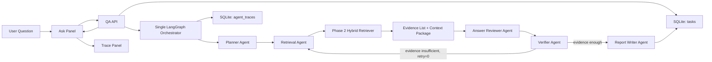
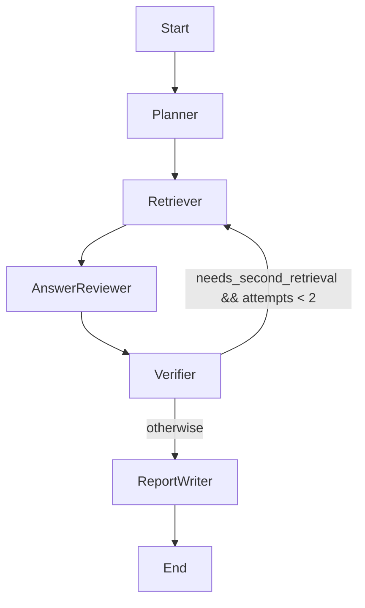
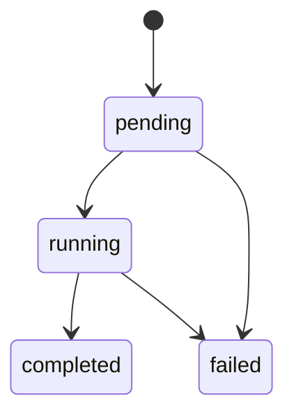

# RepoLens Phase 3 详细设计文档

## 1. 文档信息

- 文档名称：RepoLens Phase 3 详细设计文档
- 所属阶段：Phase 3 - 带引用仓库问答
- 当前版本：v0.1
- 创建日期：2026-06-06
- 依据文档：
  - `docs/p0-plus-development-plan.md`
  - `docs/requirements-analysis.md`
  - `docs/outline-design.md`
  - `docs/phase1-detailed-design.md`
  - `docs/phase2-detailed-design.md`
- 前置阶段：
  - Phase 1 已完成仓库导入、代码扫描、语言识别、解析、chunk 和 relation 落库。
  - Phase 2 已完成 BM25、embedding adapter、Qdrant、NetworkX、Hybrid Retriever、Evidence 和 Context Builder。

## 2. Phase 3 目标与边界

Phase 3 的目标是完成 RepoLens 第一个可面试演示闭环：用户选择一个已导入且 ready 的仓库，在前端输入问题，后端通过单主 LangGraph Orchestrator 编排 QA 角色型 Agent 节点，调用 Phase 2 的 GraphRAG 检索链路，输出带文件路径和行号引用的回答，并在前端展示 Evidence 和 Agent trace。

Phase 3 必须完成：

- `tasks` 表：保存 QA 任务状态、输入、输出和错误。
- `agent_traces` 表：保存每个 Agent 节点执行过程、耗时、token、工具调用摘要和错误。
- QA API：创建问题任务、查询任务结果。
- 单主 LangGraph Orchestrator。
- Planner Agent。
- Retrieval Agent。
- Answer Reviewer Agent。
- Verifier Agent。
- 证据不足时最多一次二次检索。
- Report Writer Agent。
- 前端 Ask Panel。
- 前端 Trace Panel。
- 回答中的 Evidence 引用。

Phase 3 不做：

- PR Review。
- Diff Analyzer。
- MCP Server。
- 独立自治式 Multi-Agent 协商、投票、消息总线或 Agent 间自由长对话。
- 长任务后台队列和 WebSocket 流式输出。
- cross-encoder reranker 或 LLM reranker。
- 完整 Evaluation Panel。
- Settings Panel。
- 真实工具执行，例如运行测试、执行 shell 或修改仓库文件。
- 将模型 API key、embedding key 或原始敏感配置写入数据库或前端。

## 3. Phase 3 任务映射

| 编号 | 任务 | 设计章节 |
| --- | --- | --- |
| P3-001 | 实现 tasks 表 | 6 |
| P3-002 | 实现 agent_traces 表 | 7 |
| P3-003 | 实现 QA API | 14 |
| P3-004 | 实现 Planner Agent | 10.1 |
| P3-005 | 实现 Retrieval Agent | 10.2 |
| P3-006 | 实现 Answer Reviewer Agent | 10.3 |
| P3-007 | 实现 Verifier Agent | 10.4 |
| P3-008 | 实现二次检索机制 | 11 |
| P3-009 | 实现 Report Writer Agent | 10.5 |
| P3-010 | 实现 Trace Panel | 16.2 |
| P3-011 | 实现 Ask Panel | 16.1 |

## 4. 总体数据流



核心原则：

- 回答只能基于 Evidence 和 Context Builder 输入，不直接读取任意文件。
- 所有 Agent 节点由一个 LangGraph 状态机编排，共享同一个 AgentState。
- 每个节点都必须写 trace，失败也要写 trace。
- 关键结论必须映射到 citation，citation 必须包含 file_path、start_line、end_line、evidence_id。
- Verifier 不能补写新事实，只能判定证据是否支撑草稿、要求一次补充检索或降低 confidence。
- 二次检索最多一次，避免循环和成本失控。

## 5. 模块设计

Phase 3 新增或扩展以下模块：

| 模块 | 路径 | 职责 |
| --- | --- | --- |
| Task model | `backend/app/models/task.py` | SQLAlchemy `Task`、任务类型和状态枚举 |
| Agent trace model | `backend/app/models/agent_trace.py` | SQLAlchemy `AgentTrace`、节点 trace 落库 |
| QA schemas | `backend/app/schemas/qa.py` | 请求、响应、trace、citation、answer schema |
| QA API | `backend/app/api/qa.py` | `POST /api/repositories/{id}/questions`、`GET /api/tasks/{id}` |
| Chat adapter | `backend/app/services/agent/chat.py` | OpenAI-compatible chat completion adapter 和 disabled/error 处理 |
| Agent state | `backend/app/services/agent/state.py` | QA AgentState、Plan、Draft、Verification、Citation 数据结构 |
| QA agents | `backend/app/services/agent/qa_agents.py` | Planner、Retrieval、Answer Reviewer、Verifier、Report Writer 节点实现 |
| Orchestrator | `backend/app/services/agent/orchestrator.py` | 单主 LangGraph Orchestrator 和条件边 |
| Trace service | `backend/app/services/agent/tracing.py` | trace 写入、摘要、耗时、token 记录 |
| QA service | `backend/app/services/qa/service.py` | 创建任务、执行编排、更新任务状态 |
| Frontend types | `frontend/types/workbench.ts` | QA request/response、trace、citation 类型 |
| Frontend API | `frontend/lib/api.ts` | QA API helper |
| Frontend page | `frontend/app/page.tsx` | Ask Panel 和 Trace Panel |

依赖要求：

- 后端 `pyproject.toml` 增加 `langgraph`。
- 模型调用仍使用 OpenAI-compatible adapter，不把 LangChain chain 作为主架构。
- 如果本地测试环境缺少真实 Chat API 配置，单元测试使用 fake chat adapter；开发环境可通过明确的 disabled fallback 输出保守 extractive answer，但 trace 必须标记 `chat_mode=disabled_fallback`，不得伪装为 LLM 结果。

## 6. P3-001 tasks 表设计

### 6.1 表用途

`tasks` 表保存 QA 任务生命周期。Phase 3 只创建 `task_type=qa` 的任务，但表结构保留 `review`、`evaluation` 类型值，供后续 Phase 使用。

### 6.2 字段

| 字段 | 类型 | 约束 | 说明 |
| --- | --- | --- | --- |
| id | String(36) | primary key | UUID |
| repository_id | String(36) | FK `repositories.id`, index, not null | 所属仓库 |
| task_type | String(32) | index, not null | Phase 3 固定为 `qa` |
| status | String(32) | index, not null | `pending`、`running`、`completed`、`failed` |
| input | Text | not null | JSON 字符串，保存 question、top_k 和 retrieval options |
| output | Text | nullable | JSON 字符串，保存 answer、citations、confidence、warnings |
| error_message | Text | nullable | 失败原因 |
| created_at | DateTime | not null, index | 创建时间 |
| started_at | DateTime | nullable | 开始执行时间 |
| completed_at | DateTime | nullable | 完成或失败时间 |
| updated_at | DateTime | not null | 更新时间 |

### 6.3 input JSON

```json
{
  "question": "Where is repository import handled?",
  "top_k": 8,
  "use_bm25": true,
  "use_vector": true,
  "use_graph": true
}
```

约束：

- `question` 长度 1 到 2000。
- `top_k` 范围 1 到 20。Phase 2 Retrieval Debug API 允许到 50，QA 为控制上下文和成本收紧到 20。
- `use_bm25`、`use_vector`、`use_graph` 默认 true。

### 6.4 output JSON

```json
{
  "answer": "Repository import is handled by ...",
  "citations": [
    {
      "evidence_id": "ev_...",
      "chunk_id": "...",
      "file_path": "backend/app/services/repository/service.py",
      "start_line": 10,
      "end_line": 80,
      "symbol_name": "RepositoryService.import_repository",
      "score": 0.82
    }
  ],
  "confidence": 0.78,
  "status": "answered",
  "warnings": ["Vector retrieval disabled: ..."],
  "verification": {
    "supported": true,
    "missing_claims": [],
    "second_retrieval_used": false
  }
}
```

约束：

- `answer` 必须为空字符串或带 citation 标记。
- 关键结论缺 citation 时 Verifier 降低 confidence，并写入 `warnings`。
- 不单独新增 `evidences` 表，避免超出 Phase 3 任务清单；Evidence 作为 `output.citations` 和 trace 的 JSON 快照保存。

### 6.5 索引和关系

- `ix_tasks_repository_status`：`repository_id`、`status`。
- `ix_tasks_type_created`：`task_type`、`created_at`。
- `Task.repository` 与 `Repository.tasks` 关系，仓库删除时 cascade 删除任务。
- `Task.traces` 与 `AgentTrace.task` 关系，任务删除时 cascade 删除 trace。

## 7. P3-002 agent_traces 表设计

### 7.1 表用途

`agent_traces` 表保存每个 Agent 节点的执行过程，用于前端 Trace Panel、调试、面试展示和后续评测。

### 7.2 字段

| 字段 | 类型 | 约束 | 说明 |
| --- | --- | --- | --- |
| id | String(36) | primary key | UUID |
| task_id | String(36) | FK `tasks.id`, index, not null | 所属任务 |
| step_name | String(64) | index, not null | `Planner`、`Retriever`、`AnswerReviewer`、`Verifier`、`ReportWriter` |
| step_order | Integer | not null | 节点顺序，二次检索时递增 |
| status | String(32) | index, not null | `running`、`completed`、`failed` |
| input_summary | Text | not null | 输入摘要，不保存完整敏感上下文 |
| output_summary | Text | nullable | 输出摘要 |
| evidence_ids | Text | not null | JSON array |
| tool_calls | Text | not null | JSON array |
| token_usage | Text | not null | JSON object |
| latency_ms | Integer | nullable | 节点耗时 |
| error_message | Text | nullable | 节点失败原因 |
| created_at | DateTime | not null, index | 创建时间 |
| completed_at | DateTime | nullable | 节点完成时间 |

### 7.3 tool_calls JSON

Phase 3 只记录结构化工具摘要，不实现完整 MCP Server。

```json
[
  {
    "tool_name": "code_search",
    "input_summary": "query=repository import flow, top_k=8",
    "output_summary": "evidence_count=6, vector_disabled=false",
    "permission_decision": "allow",
    "latency_ms": 34,
    "success": true,
    "error": null
  }
]
```

### 7.4 token_usage JSON

```json
{
  "prompt_tokens": 1200,
  "completion_tokens": 280,
  "total_tokens": 1480,
  "model": "qwen-plus"
}
```

若使用 disabled fallback 或规则节点：

```json
{
  "prompt_tokens": 0,
  "completion_tokens": 0,
  "total_tokens": 0,
  "model": "disabled_fallback"
}
```

### 7.5 安全裁剪

- `input_summary` 最大 2000 字符。
- `output_summary` 最大 4000 字符。
- `tool_calls` 不保存完整代码片段，只保存数量、query、top_k、状态和错误摘要。
- Evidence snippet 只保存在 task output 的 citation snapshot 或前端返回里，不在 trace 中重复保存大段内容。

## 8. QA AgentState 设计

AgentState 是 LangGraph 中所有节点共享的数据对象。

```python
class QAAgentState(TypedDict):
    task_id: str
    repository_id: str
    question: str
    top_k: int
    retrieval_options: RetrievalOptions
    plan: QAPlan | None
    retrieval_attempts: int
    retrieval_queries: list[str]
    evidences: list[Evidence]
    context_text: str
    draft_answer: DraftAnswer | None
    verification: VerificationResult | None
    final_answer: QAAnswer | None
    warnings: list[str]
    traces: list[TraceRecord]
    error_message: str | None
```

状态约束：

- `retrieval_attempts <= 2`，第一次检索加最多一次二次检索。
- `evidences` 必须来自 Phase 2 `retrieve_repository`，不得手工拼接不存在的代码位置。
- `final_answer.citations` 必须是 `evidences` 的子集。
- `warnings` 可以包含 vector disabled、missing context、chat disabled fallback。

## 9. 单主 LangGraph Orchestrator 设计

### 9.1 节点

| 节点 | 对应任务 | 输入 | 输出 |
| --- | --- | --- | --- |
| `planner` | P3-004 | question、repository_id | question_type、retrieval_queries、answer_style |
| `retriever` | P3-005/P3-008 | plan、retrieval_options、attempt | evidences、context_text、warnings |
| `answer_reviewer` | P3-006 | question、context_text、evidences | draft_answer、draft_claims |
| `verifier` | P3-007/P3-008 | draft_answer、evidences、attempt | supported、missing_claims、needs_second_retrieval |
| `report_writer` | P3-009 | draft_answer、verification、evidences | final_answer、citations、confidence |

### 9.2 条件边



### 9.3 LangGraph 落地方式

- 使用 `langgraph.graph.StateGraph` 声明状态机。
- 节点函数保持纯业务输入输出，数据库写 trace 由 wrapper 统一处理。
- 编排器提供 `run_qa(db, state, settings, chat_adapter)`。
- 每个节点完成后写入 `agent_traces`，并更新内存 state。
- 若 `langgraph` 依赖暂时不可用，测试不能跳过 Agent 节点本身；实现阶段需要安装依赖或在 CI 中补齐依赖，不采用长期自研替代状态机。

## 10. 角色型 Agent 节点设计

### 10.1 P3-004 Planner Agent

职责：

- 判断问题类型。
- 生成 1 到 3 个检索 query。
- 决定回答风格。

支持问题类型：

| 类型 | 触发特征 | 检索策略 |
| --- | --- | --- |
| `architecture` | 架构、模块、整体、流程 | 使用原始问题 + 关键名词 query |
| `feature_location` | 在哪里、哪个文件、入口、实现 | 强化文件名、服务名、函数名关键词 |
| `function_explanation` | 函数、方法、class、做什么 | 强化 symbol query |
| `call_relation` | 调用、依赖、谁调用谁 | 开启 graph，query 包含 caller/callee |
| `impact_scope` | 影响范围、改动会影响什么 | 开启 graph，query 包含相关 symbol 和 same_file |

实现策略：

- P0+ 使用规则 Planner，不调用 LLM，降低成本。
- query 生成必须保留原始问题，避免过度改写。
- 最多生成 3 个 query，避免 Retrieval Agent 过度检索。

输出：

```json
{
  "question_type": "feature_location",
  "retrieval_queries": [
    "repository import flow",
    "RepositoryService import_repository",
    "POST /api/repositories"
  ],
  "answer_style": "locate_implementation"
}
```

Trace：

- `step_name=Planner`
- `input_summary=question + repository_id`
- `output_summary=question_type + retrieval_queries`
- `token_usage=0`

### 10.2 P3-005 Retrieval Agent

职责：

- 对 Planner 输出的 query 调用 Phase 2 `retrieve_repository`。
- 合并多 query evidence。
- 保留来源解释和 vector disabled warning。

实现策略：

- 每个 query 调用 `retrieve_repository(db, repository_id, query, settings, top_k=top_k)`。
- 多 query evidence 按 `chunk_id` 去重，保留最高 score 的 evidence。
- 最终 evidence 上限默认 12，最多 20。
- Context Builder 仍用 Phase 2 `build_context_package`，QA 默认 `max_chars=12000`。

工具调用记录：

- 记录 `code_search`，包含 query_count、top_k、evidence_count、vector_disabled。

失败处理：

- 仓库无 chunk：返回空 evidence，不报错，交给 Verifier 降低 confidence。
- vector disabled：保留 warning，不阻断 BM25 和 graph。
- 所有检索链路失败：节点 failed，任务 failed。

Trace：

- `step_name=Retriever`
- `evidence_ids` 保存最终 evidence_id 列表。
- `tool_calls` 保存每次 `code_search` 的摘要。

### 10.3 P3-006 Answer Reviewer Agent

职责：

- 基于 question、context_text 和 evidence list 生成回答草稿。
- 草稿必须显式声明引用 evidence。
- 不输出最终 confidence。

模型输入原则：

- system prompt 强制要求只基于提供的 Evidence。
- user prompt 包含 question、Evidence context 和输出 JSON schema。
- prompt 中不包含 API key、系统路径外的敏感配置。

输出 JSON：

```json
{
  "draft_answer": "The import flow starts in ... [E1]",
  "claims": [
    {
      "text": "Repository import API calls RepositoryService.import_repository.",
      "evidence_ids": ["ev_..."]
    }
  ],
  "used_evidence_ids": ["ev_..."]
}
```

Chat disabled fallback：

- 若 Chat API 未配置，生成保守 extractive draft：
  - 简述“根据已检索到的代码证据...”
  - 按 evidence 分组列出文件、symbol 和片段含义。
  - trace 标记 `chat_mode=disabled_fallback`。
- fallback 不是伪造模型输出，只用于本地演示和测试。

Trace：

- `step_name=AnswerReviewer`
- `token_usage` 记录模型返回，fallback 为 0。

### 10.4 P3-007 Verifier Agent

职责：

- 检查草稿中的 claim 是否至少有一个 evidence_id 支撑。
- 检查 citation 是否属于当前 evidence list。
- 检查 evidence snippet 是否非空且文件路径、行号有效。
- 证据不足时触发一次二次检索。

实现策略：

- P0+ 使用规则 Verifier，不调用 LLM。
- 对每条 claim：
  - 无 evidence_id：missing。
  - evidence_id 不存在：missing。
  - evidence snippet 为空：missing。
- 若 missing_claims 非空且 `retrieval_attempts == 1`，设置 `needs_second_retrieval=true`。
- 若二次检索后仍 missing，设置 `supported=false`，最终 confidence 降低到不超过 0.45。

输出：

```json
{
  "supported": false,
  "missing_claims": ["No evidence for async queue behavior"],
  "needs_second_retrieval": true,
  "second_retrieval_query": "async queue repository import"
}
```

Trace：

- `step_name=Verifier`
- `output_summary=supported + missing_count + needs_second_retrieval`

### 10.5 P3-009 Report Writer Agent

职责：

- 将已验证草稿转换为最终 answer。
- 输出 citations 和 confidence。
- 对缺证据内容进行降级或移除。

输出：

```json
{
  "answer": "Repository import is exposed through ... [1]",
  "citations": [
    {
      "evidence_id": "ev_...",
      "chunk_id": "...",
      "file_path": "backend/app/api/repositories.py",
      "start_line": 20,
      "end_line": 45,
      "symbol_name": "import_repository",
      "score": 0.82,
      "snippet": "..."
    }
  ],
  "confidence": 0.78,
  "warnings": []
}
```

confidence 规则：

- base = average top 3 evidence score，裁剪到 0.1 到 0.9。
- `supported=true`：最多 0.9。
- `supported=false`：最多 0.45。
- evidence 为空：最多 0.2。
- 使用 disabled fallback：最多 0.65。
- 二次检索后才满足：最多 0.75。

Trace：

- `step_name=ReportWriter`
- `output_summary=answer_chars + citations_count + confidence`

## 11. P3-008 二次检索机制

触发条件：

- Verifier 判定有 missing_claims。
- `retrieval_attempts == 1`。
- Planner 或 Verifier 能生成补充 query。

补充 query 生成：

- 优先使用 missing_claims 中的关键词。
- 保留原 question。
- 最多追加 1 个 query。

执行方式：

1. `retrieval_attempts += 1`。
2. Retrieval Agent 再调用一次 `retrieve_repository`。
3. 新旧 evidence 按 `chunk_id` 去重合并。
4. Answer Reviewer Agent 基于合并后的 evidence 重新生成草稿。
5. Verifier 再校验。

停止条件：

- 第二次 Verifier 后无论是否 supported，都进入 Report Writer。
- 不允许第三次检索。

Trace 展示：

- Trace Panel 能看到两个 `Retriever` 节点记录，`step_order` 不同。
- 第二次 `Retriever` 的 `input_summary` 标记 `attempt=2`。

## 12. Evidence 引用设计

### 12.1 citation 字段

前端回答引用使用 task output 中的 `citations`：

| 字段 | 说明 |
| --- | --- |
| evidence_id | Phase 2 稳定 evidence id |
| chunk_id | 对应 code chunk |
| file_path | 文件路径 |
| start_line | 起始行 |
| end_line | 结束行 |
| symbol_name | 符号 |
| symbol_type | file/class/function/method |
| language | 语言 |
| score | 综合检索分 |
| sources | bm25/vector/graph_expand 来源 |
| snippet | 证据片段 |

### 12.2 回答引用格式

- 文本中使用 `[1]`、`[2]` 标记。
- 前端 citation list 按编号显示文件路径、行号、symbol、score 和 snippet。
- 每个编号映射到 `citations[index - 1]`。

### 12.3 约束

- 引用必须来自 evidence list。
- 不允许引用不存在的文件或行号。
- 文件路径只显示仓库相对路径，不显示用户机器绝对路径。
- snippet 长度沿用 Phase 2 Evidence 的截断规则。

## 13. Chat Adapter 设计

### 13.1 配置

在 `Settings` 中新增：

| 环境变量 | 说明 |
| --- | --- |
| `REPOLENS_CHAT_BASE_URL` | OpenAI-compatible chat endpoint base URL |
| `REPOLENS_CHAT_API_KEY` | Chat API key |
| `REPOLENS_CHAT_MODEL` | Chat model |
| `REPOLENS_CHAT_TEMPERATURE` | 默认 0.2 |
| `REPOLENS_CHAT_TIMEOUT_SECONDS` | 默认 60 |

### 13.2 接口

```python
class ChatCompletionAdapter(Protocol):
    def complete_json(self, messages: list[ChatMessage], *, response_schema: str) -> ChatResult:
        ...
```

`ChatResult`：

- `content`
- `parsed_json`
- `model`
- `prompt_tokens`
- `completion_tokens`
- `total_tokens`

错误：

- `ChatDisabledError`：配置缺失。
- `ChatRequestError`：HTTP、JSON 或 schema 解析失败。

### 13.3 安全

- API key 仅从环境变量读取。
- trace 不保存 request headers。
- prompt 中只包含当前 repository evidence context。
- 模型错误返回 502 或任务 failed，但不泄露 API key。

## 14. P3-003 QA API 设计

### 14.1 创建 QA 任务

`POST /api/repositories/{repository_id}/questions`

请求：

```json
{
  "question": "Where is repository import implemented?",
  "top_k": 8,
  "use_bm25": true,
  "use_vector": true,
  "use_graph": true
}
```

响应：

```json
{
  "task_id": "...",
  "repository_id": "...",
  "status": "completed",
  "question": "...",
  "answer": "...",
  "citations": [],
  "confidence": 0.78,
  "warnings": [],
  "created_at": "...",
  "completed_at": "..."
}
```

P0+ Phase 3 采用同步执行：

- API 创建 `pending` task。
- 立即执行 Orchestrator。
- 成功后返回 completed task。
- 失败后返回 failed task，并给出 `error_message`。

同步执行的原因：

- 不引入 Celery/RQ/后台队列，避免扩展范围。
- 前端能直接展示第一个 QA 闭环。
- 后续可在 Phase 5 评测或 P1 中升级为异步。

实现阶段说明：

- P3-003 先落地 QA API 骨架：创建 `pending` QA task，并支持 `GET /api/tasks/{task_id}` 查询。
- P3-004 到 P3-009 逐步接入 Planner、Retrieval、Answer Reviewer、Verifier 和 Report Writer 后，`POST /questions` 会从创建 pending 任务升级为同步执行 Orchestrator 并返回 completed/failed 结果。
- 这样保持任务清单顺序可测试，不在 P3-003 阶段伪造尚未实现的 Agent 回答。

当前实现说明：

- P3-008/P3-009 已将 `POST /api/repositories/{repository_id}/questions` 升级为同步执行单主 LangGraph Orchestrator。
- Orchestrator 节点顺序为 Planner -> Retriever -> AnswerReviewer -> Verifier -> Retriever(可选二次) -> AnswerReviewer(可选重写草稿) -> Verifier(二次后终止) -> ReportWriter。
- 当首次 Verifier 判断证据不足且 `retrieval_attempts < 2` 时，最多触发一次补充检索；第二次 Verifier 后无论是否 supported 都进入 ReportWriter。

### 14.2 查询任务

`GET /api/tasks/{task_id}`

响应包含：

- task 基本信息。
- answer、citations、confidence、warnings。
- traces。

### 14.3 查询 trace

可选 API：

- Phase 3 可以通过 `GET /api/tasks/{task_id}` 一并返回 trace。
- 若前端需要单独刷新，可新增 `GET /api/tasks/{task_id}/trace`。
- 为控制范围，优先实现合并返回；单独 trace API 仅在实现复杂度很低时加入。

### 14.4 HTTP 错误

| 场景 | 状态码 | detail |
| --- | --- | --- |
| repository 不存在 | 404 | `Repository not found.` |
| repository 未 ready | 400 | `Repository must be ready before QA.` |
| question 为空或过长 | 422 | Pydantic validation |
| task 不存在 | 404 | `Task not found.` |
| Chat API 配置缺失 | 200 或 400 | 若启用 fallback 返回 200 + warning；若禁用 fallback 返回 failed task |
| Chat API 请求失败 | 502 | `Chat completion failed.` |
| Orchestrator 内部失败 | 500 | 不暴露敏感上下文 |

## 15. 错误处理与状态流转

### 15.1 Task 状态



状态语义：

- `pending`：task 已创建但未进入 Orchestrator。
- `running`：至少一个 Agent 节点开始。
- `completed`：Report Writer 输出 final_answer。
- `failed`：任何不可恢复错误。

### 15.2 节点失败

- Planner 失败：task failed。
- Retrieval 失败：若只是 vector disabled，写 warning，不 failed；若 DB/检索主链路失败，task failed。
- Answer Reviewer 失败：若 Chat request 失败且 fallback 允许，则降级；否则 task failed。
- Verifier 失败：task failed。
- Report Writer 失败：task failed。

### 15.3 trace 完整性

- 每个节点开始时写 running trace。
- 节点成功后补全 output_summary、latency_ms、completed_at、status=completed。
- 节点失败后补全 error_message、latency_ms、completed_at、status=failed。
- task failed 时至少能看到失败节点之前的 trace。

## 16. 前端设计

### 16.1 P3-011 Ask Panel

位置：

- 在现有 Repository/Evidence 工作台中加入 Ask Panel。
- 不做 landing page。
- 选中 repository 且 status ready 后才允许提交。

控件：

- 多行问题输入框。
- `top_k` 数字输入，1 到 20。
- BM25、Vector、Graph checkbox，沿用 Phase 2 检索控制。
- Ask 按钮。

展示：

- answer markdown-like text。
- citations list。
- confidence。
- warnings。
- task status。

交互状态：

- `idle`：未提问。
- `asking`：提交中。
- `ready`：有回答。
- `failed`：任务失败。

### 16.2 P3-010 Trace Panel

展示字段：

- step order。
- step name。
- status。
- latency_ms。
- token_usage total。
- input_summary。
- output_summary。
- evidence count。
- tool calls。
- error_message。

UI 约束：

- Trace Panel 是工程工作台的一部分，不做装饰性大卡片。
- 长文本使用折叠或 `pre` 滚动区域，避免撑破布局。
- 移动端单列展示，桌面端与 answer/evidence 并排或上下组合。

### 16.3 Evidence 与 QA 的关系

- Phase 2 Evidence Panel 保留为检索调试工具。
- Phase 3 Ask Panel 的 citations 独立展示最终回答引用。
- 两者共享 `EvidenceItem` 类型字段，但 QA citation 可以包含更短 snippet。

## 17. 安全边界

- QA 只能针对当前 `repository_id` 查询。
- QA API 必须检查 repository exists 且 status ready。
- Retrieval Agent 调用 Phase 2 `retrieve_repository`，继续沿用 repository_id 过滤。
- 不读取未导入仓库路径。
- 不执行用户问题中的 shell、代码、安装命令或网络操作。
- prompt injection 防护：
  - system prompt 明确忽略 evidence 中要求泄露密钥、修改系统或跳过规则的内容。
  - Report Writer 只输出代码理解回答，不执行指令。
- trace 不保存 API key、绝对用户目录之外的敏感配置、完整 request headers。
- 失败信息要裁剪，不把 prompt 全量返回前端。

## 18. 测试策略

### 18.1 后端单元测试

| 范围 | 测试点 |
| --- | --- |
| P3-001 tasks 表 | 表创建、字段默认值、repository cascade、JSON input/output round-trip |
| P3-002 agent_traces 表 | 表创建、trace round-trip、task cascade、step_order 排序 |
| Planner | 五类问题分类、query 数量上限、保留原始问题 |
| Retrieval Agent | 多 query evidence 去重、vector disabled warning、空 evidence |
| Answer Reviewer | fake chat JSON 输出、disabled fallback、无 evidence 草稿 |
| Verifier | 缺 citation、无效 evidence_id、二次检索触发、二次后降级 |
| Report Writer | citation 子集、confidence 规则、warnings |
| Orchestrator | 正常链路、二次检索链路、失败 trace |

### 18.2 API 测试

- `POST /api/repositories/{id}/questions` ready repository 返回 completed task。
- repository 不存在返回 404。
- repository 未 ready 返回 400。
- empty question 触发 422。
- `GET /api/tasks/{task_id}` 返回 answer、citations、traces。
- fake chat adapter 确认关键结论带 citation。

### 18.3 前端验证

- `npm run build` 通过。
- Ask Panel 类型检查通过。
- 选中非 ready repository 时 Ask 按钮 disabled。
- QA 成功后展示 answer、citations、trace。
- QA failed 后展示错误。

### 18.4 评测记录

Phase 3 先记录 5 类问题各至少 1 条 smoke 样例：

| 类型 | 指标 |
| --- | --- |
| architecture | 是否返回模块级回答和引用 |
| feature_location | 是否定位文件和函数 |
| function_explanation | 是否解释函数职责 |
| call_relation | 是否包含调用关系 evidence |
| impact_scope | 是否说明相邻影响范围并标注 confidence |

不在 Phase 3 建完整 50 条评测集；完整评测放到 Phase 5。

## 19. 验收标准

Phase 3 完成时必须满足：

- `tasks` 表和 `agent_traces` 表可创建并通过 round-trip 测试。
- QA API 能对 ready repository 创建并返回 completed QA task。
- 至少支持架构理解、功能定位、函数解释、调用关系、影响范围 5 类问题的规划和回答。
- 回答关键结论带文件路径和行号引用。
- Verifier 能发现缺 evidence 的 claim，并触发最多一次二次检索。
- 二次检索后仍证据不足时降低 confidence 或标记 warning。
- Trace Panel 能展示 Planner、Retriever、AnswerReviewer、Verifier、ReportWriter 的步骤、耗时、token、工具调用摘要。
- Ask Panel 能输入问题、展示回答、citations、confidence、warnings。
- 后端 `ruff check app` 通过。
- 后端 `pytest app\\tests` 通过。
- 前端 `npm run build` 通过。

## 20. 开发顺序

推荐按以下顺序实现：

1. P3-001/P3-002：新增 `Task` 和 `AgentTrace` 模型与表结构测试。
2. P3-003：新增 QA schema、QA service 骨架、QA API 和任务查询 API。
3. P3-004：实现规则 Planner Agent。
4. P3-005：实现 Retrieval Agent，接入 Phase 2 Hybrid Retriever。
5. P3-006：实现 Chat adapter、Answer Reviewer Agent 和 disabled fallback。
6. P3-007：实现规则 Verifier。
7. P3-008：在 Orchestrator 中加入最多一次二次检索条件边。
8. P3-009：实现 Report Writer Agent 和最终 output JSON。
9. P3-010：前端 Trace Panel。
10. P3-011：前端 Ask Panel。
11. 最终自查、测试、评测记录和文档更新。
