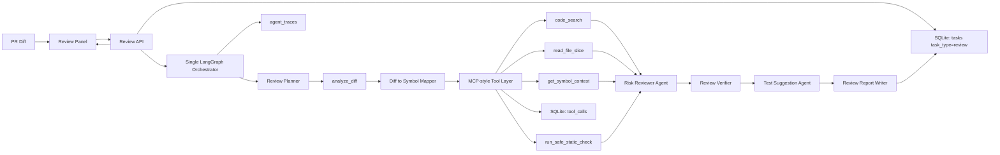
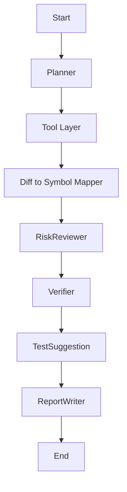

# RepoLens Phase 4 详细设计文档

## 1. 文档信息

- 文档名称：RepoLens Phase 4 详细设计文档
- 所属阶段：Phase 4 - PR Review、Multi-Agent 与 MCP-style 工具调用
- 当前版本：v0.1
- 创建日期：2026-06-06
- 依据文档：
  - `docs/p0-plus-development-plan.md`
  - `docs/requirements-analysis.md`
  - `docs/outline-design.md`
  - `docs/phase1-detailed-design.md`
  - `docs/phase2-detailed-design.md`
  - `docs/phase3-detailed-design.md`
- 前置阶段：
  - Phase 1 已完成仓库导入、代码结构化、chunk 和 relation 落库。
  - Phase 2 已完成 BM25、vector、Qdrant、NetworkX、Hybrid Retriever、Evidence 和 Context Builder。
  - Phase 3 已完成 QA task、agent trace、单主 LangGraph Orchestrator、QA 角色型 Agent、二次检索、Ask Panel 和 Trace Panel。

## 2. Phase 4 目标与边界

Phase 4 的目标是完成 RepoLens 第二个可面试演示闭环：用户粘贴 PR Diff，系统解析变更、映射变更到已有 code chunk 和 symbol、通过 MCP-style Tool Layer 调用受控工具检索上下文、由 Review 场景的角色型 Agent 输出结构化 Review 报告，并在前端展示风险、测试建议、证据引用和工具调用 trace。

Phase 4 必须完成：

- `tool_calls` 表。
- `analyze_diff` 工具。
- `read_file_slice` 工具。
- `code_search` 工具。
- `get_symbol_context` 工具。
- `run_safe_static_check` 占位工具，默认关闭，只支持白名单。
- Diff 到 symbol 映射，生成 `changed_by` 关系。
- Review API。
- Risk Reviewer Agent。
- Review Verifier。
- Test Suggestion Agent。
- Review Report Writer。
- Review Panel。
- 工具调用展示。

Phase 4 不做：

- 真正 MCP Server。
- 外部 IDE 插件。
- 自动修改代码。
- 自动执行任意 shell、测试命令或包管理命令。
- 真实 PR 平台集成，例如 GitHub App、Webhook、评论回写。
- 完整评测集、Evaluation Panel、README 打磨或演示素材整理，这些留给 Phase 5。
- 复杂自治式多 Agent 协商、投票或消息总线。Phase 4 仍采用单主 LangGraph Orchestrator 管理角色型 Agent 节点。

## 3. Phase 4 任务映射

| 编号 | 任务 | 设计章节 |
| --- | --- | --- |
| P4-001 | 实现 tool_calls 表 | 6 |
| P4-002 | 实现 analyze_diff 工具 | 8.1 |
| P4-003 | 实现 read_file_slice 工具 | 8.2 |
| P4-004 | 实现 code_search 工具 | 8.3 |
| P4-005 | 实现 get_symbol_context 工具 | 8.4 |
| P4-006 | 实现 run_safe_static_check 占位 | 8.5 |
| P4-007 | 实现 Diff 到 symbol 映射 | 9 |
| P4-008 | 实现 Review API | 14 |
| P4-009 | 实现 Risk Reviewer Agent | 11.2 |
| P4-010 | 实现 Review Verifier | 11.3 |
| P4-011 | 实现 Test Suggestion Agent | 11.4 |
| P4-012 | 实现 Review Report Writer | 11.5 |
| P4-013 | 实现 Review Panel | 16.1 |
| P4-014 | 实现工具调用展示 | 16.2 |

## 4. 总体数据流



核心原则：

- Review 结论必须基于 diff、tool outputs 和 evidence，不直接凭空输出风险。
- 工具层必须显式记录 permission_decision、latency、success/error。
- read_file_slice 只能读取当前仓库目录内的非敏感文件和指定行范围。
- run_safe_static_check 默认 disabled，不执行真实命令。
- Diff 到 symbol 映射只基于已导入仓库的 code_chunks 和行号范围，不生成虚构 symbol。
- Phase 4 的多 Agent 是角色型节点，不做自由对话或投票。

## 5. 模块设计

| 模块 | 路径 | 职责 |
| --- | --- | --- |
| ToolCall model | `backend/app/models/tool_call.py` | `tool_calls` SQLAlchemy 模型与枚举 |
| Review schemas | `backend/app/schemas/review.py` | Review 请求、报告、风险、测试建议、tool call response |
| Tool layer | `backend/app/services/tools/` | MCP-style 工具统一入口、权限决策和 tool_call 记录 |
| Diff analyzer | `backend/app/services/tools/diff_analyzer.py` | unified diff 解析 |
| File reader | `backend/app/services/tools/file_reader.py` | 仓库目录内安全行读取 |
| Search tool | `backend/app/services/tools/code_search.py` | 包装 Phase 2/3 Hybrid Retriever |
| Symbol tool | `backend/app/services/tools/symbol_context.py` | 基于 code_chunks/code_relations/NetworkX 返回 symbol 邻域 |
| Static check tool | `backend/app/services/tools/static_check.py` | 默认 disabled 的白名单静态检查占位 |
| Diff mapper | `backend/app/services/review/diff_mapper.py` | diff hunk 到 chunk/symbol 和 `changed_by` relation |
| Review agents | `backend/app/services/review/agents.py` | Review Planner、Risk Reviewer、Verifier、Test Suggestion、Report Writer |
| Review orchestrator | `backend/app/services/review/orchestrator.py` | 单主 LangGraph Review workflow |
| Review service | `backend/app/services/review/service.py` | task 创建、执行、输出保存 |
| Review API | `backend/app/api/reviews.py` | Review task 创建和查询 |
| Frontend Review | `frontend/app/page.tsx` | Review Panel 和工具调用展示 |

## 6. P4-001 tool_calls 表设计

### 6.1 表用途

`tool_calls` 表保存 Review/QA/后续 Agent 工作流中的结构化工具调用记录。Phase 4 主要记录 Review 工具调用，后续也可复用到 QA 和 Evaluation。

### 6.2 字段

| 字段 | 类型 | 约束 | 说明 |
| --- | --- | --- | --- |
| id | String(36) | primary key | UUID |
| task_id | String(36) | FK `tasks.id`, index, not null | 所属 task |
| trace_id | String(36) | nullable, index | 对应 AgentTrace，可为空 |
| repository_id | String(36) | FK `repositories.id`, index, not null | 所属仓库 |
| tool_name | String(64) | index, not null | `analyze_diff`、`read_file_slice` 等 |
| status | String(32) | index, not null | `running`、`completed`、`failed`、`denied`、`disabled` |
| permission_decision | String(32) | index, not null | `allow`、`deny`、`disabled` |
| input_summary | Text | not null | 输入摘要 |
| output_summary | Text | nullable | 输出摘要 |
| input_payload | Text | nullable | JSON，裁剪后的结构化输入 |
| output_payload | Text | nullable | JSON，裁剪后的结构化输出 |
| latency_ms | Integer | nullable | 耗时 |
| error_message | Text | nullable | 错误或拒绝原因 |
| created_at | DateTime | not null, index | 创建时间 |
| completed_at | DateTime | nullable | 完成时间 |

### 6.3 索引

- `ix_tool_calls_task_order`：`task_id`、`created_at`。
- `ix_tool_calls_repository_tool`：`repository_id`、`tool_name`。
- `ix_tool_calls_permission`：`permission_decision`、`status`。

### 6.4 与 agent_traces 的关系

- `tool_calls.trace_id` 可以关联 `agent_traces.id`。
- Phase 4 允许先记录 task-level tool_calls，再在 Review Orchestrator 中把 tool call summary 同步到 trace。
- 前端工具调用展示优先读取 task response 中的 `tool_calls` 列表，也可以在 trace card 中按 `trace_id` 聚合。
- 实现时保留 `AgentTrace.tool_calls` 作为 Phase 3 已有 JSON 摘要列；`ToolCall` 到 `AgentTrace` 的 ORM 关系命名为 `tool_call_records`，避免与文本列属性冲突。

### 6.5 安全裁剪

- `input_summary` 最大 2000 字符。
- `output_summary` 最大 4000 字符。
- `input_payload` 和 `output_payload` 默认只保存结构化字段，不保存完整大文件内容。
- `read_file_slice` 输出最多保存 120 行或 12000 字符。
- token、密钥、`.env` 内容不得保存。

## 7. MCP-style Tool Layer 设计

Phase 4 不实现完整 MCP Server，但内部工具接口采用 MCP-style 设计：工具有明确 name、input schema、permission check、execution、output schema、tool_call log。

统一接口：

```python
class ToolExecutionContext:
    db: Session
    task_id: str
    repository_id: str
    trace_id: str | None
    settings: Settings

class ToolResult:
    tool_name: str
    success: bool
    permission_decision: str
    output: dict[str, object]
    error_message: str | None
    latency_ms: int
    tool_call_id: str
```

工具执行流程：

1. validate input。
2. permission check。
3. 写入 `tool_calls` running 或 denied/disabled。
4. 执行工具。
5. 写入 output、latency、status。
6. 返回 ToolResult。

权限决策：

| 决策 | 含义 |
| --- | --- |
| `allow` | 当前工具和输入在 Phase 4 允许范围内 |
| `deny` | 路径越界、敏感文件、非法参数或仓库不匹配 |
| `disabled` | 工具默认关闭，例如 run_safe_static_check |

## 8. 工具设计

### 8.1 P4-002 analyze_diff 工具

输入：

```json
{
  "diff_text": "... unified diff ..."
}
```

输出：

```json
{
  "files": [
    {
      "old_path": "app/service.py",
      "new_path": "app/service.py",
      "change_type": "modified",
      "hunks": [
        {
          "old_start": 10,
          "old_count": 5,
          "new_start": 10,
          "new_count": 7,
          "added_lines": [{"line": 12, "content": "return x"}],
          "removed_lines": [{"line": 11, "content": "return y"}]
        }
      ]
    }
  ],
  "file_count": 1,
  "added_line_count": 1,
  "removed_line_count": 1
}
```

解析范围：

- 支持标准 unified diff。
- 支持 `diff --git a/x b/x`。
- 支持 `+++`、`---`、`@@ -a,b +c,d @@` hunk。
- 支持 added、modified、deleted、renamed 的基础识别。
- 不执行 patch，不修改文件。

限制：

- diff 最大 200000 字符。
- 单个 hunk 最大 2000 行。
- 二进制 diff 标记为 `binary=true`，不解析内容。

错误：

- 空 diff 返回 422。
- 格式无法识别时返回结构化 error，不崩溃。

实现说明：

- P4-002 先实现纯解析服务 `backend/app/services/tools/diff_analyzer.py`，不执行 patch，不写数据库，不接 Review API。
- 解析结果使用 `DiffAnalysis`、`DiffFile`、`DiffHunk`、`DiffLine` dataclass 表达，并提供 `to_dict()` 供后续 Tool Layer 和 Review API 复用。
- P4-002 的错误通过 `DiffAnalyzerError` 表达；HTTP 422 转换留给 P4-008 Review API。

### 8.2 P4-003 read_file_slice 工具

输入：

```json
{
  "file_path": "backend/app/api/repositories.py",
  "start_line": 1,
  "end_line": 80
}
```

权限边界：

- `file_path` 必须是仓库相对路径。
- 解析后的绝对路径必须位于 `Repository.local_path` 内。
- 禁止 `..` 路径穿越。
- 禁止读取敏感文件：`.env`、`.env.*`、`*.pem`、`*.key`、`id_rsa`、`secrets.*`。
- 禁止读取依赖目录和缓存目录：`node_modules`、`.venv`、`.git`、`.repolens`、`.next`。
- 最大读取 120 行。
- 最大输出 12000 字符。

输出：

```json
{
  "file_path": "backend/app/api/repositories.py",
  "start_line": 1,
  "end_line": 80,
  "content": "...",
  "truncated": false
}
```

实现说明：

- P4-003 先实现纯读取服务 `backend/app/services/tools/file_reader.py`，不写 `tool_calls`，不接 Review API。
- `read_file_slice` 输入使用 `repository_root` 和仓库相对 `file_path`，返回 `FileSliceResult` dataclass，并提供 `to_dict()`。
- 实现独立校验路径安全：拒绝绝对路径、`.`/`..`、符号链接路径、解析后不在仓库根目录内的路径、敏感文件、依赖/缓存目录、二进制文件、缺失文件和非法行号。
- 超过 120 行或 12000 字符时返回截断内容并标记 `truncated=true`。

### 8.3 P4-004 code_search 工具

输入：

```json
{
  "query": "repository import flow",
  "top_k": 8,
  "use_bm25": true,
  "use_vector": true,
  "use_graph": true
}
```

实现：

- 调用 Phase 2 `retrieve_repository`。
- 只允许当前 `repository_id`。
- 返回 EvidenceResponse-compatible 列表。
- vector disabled 不阻断，写 warning。

输出：

```json
{
  "evidences": [],
  "debug": {
    "bm25_count": 1,
    "vector_count": 0,
    "graph_count": 1,
    "evidence_count": 2
  },
  "warnings": []
}
```

实现说明：

- P4-004 先实现纯工具包装 `backend/app/services/tools/code_search.py`，不写 `tool_calls`，不接 Review API。
- `code_search` 复用 Phase 2 `retrieve_repository`，输出 `CodeSearchResult`、`CodeSearchEvidence` 和 `CodeSearchDebug` dataclass。
- Evidence 字段与 Phase 2 `EvidenceResponse` 对齐，便于后续 Review API 直接转换。
- 默认 `top_k` 为 8，最大 50；空 query、无检索源或非法 `top_k` 使用 `CodeSearchError`。
- vector disabled 只写入 warning，不阻断 BM25 和 graph 结果。

### 8.4 P4-005 get_symbol_context 工具

输入：

```json
{
  "symbol_name": "RepositoryService.import_repository",
  "file_path": "backend/app/services/repository/service.py",
  "max_neighbors": 8
}
```

实现：

- 从 `code_chunks` 找 symbol。
- 加载 NetworkX code graph。
- 返回同文件、callers、callees、imports 等邻域。
- 不创建外部虚拟节点。

输出：

```json
{
  "symbol": {
    "chunk_id": "...",
    "file_path": "...",
    "start_line": 10,
    "end_line": 80,
    "symbol_name": "..."
  },
  "neighbors": [
    {
      "chunk_id": "...",
      "relation_type": "calls",
      "direction": "out",
      "file_path": "...",
      "symbol_name": "..."
    }
  ]
}
```

实现说明：

- P4-005 先实现纯工具服务 `backend/app/services/tools/symbol_context.py`，不写 `tool_calls`，不接 Review API。
- `get_symbol_context` 从 `code_chunks` 按 `repository_id`、`symbol_name` 和可选 `file_path` 找目标 symbol。
- 若未传 `file_path` 且存在多个同名 symbol，按文件路径和起始行选择第一个，并返回 warning；Review Agent 后续应优先传入 diff 映射得到的文件路径。
- 邻域来自现有 `load_code_graph`，返回入边、出边和 same-file 关系；重复邻居按首次出现关系去重。
- 不创建外部虚拟节点，不推断不存在的 symbol。

### 8.5 P4-006 run_safe_static_check 占位

Phase 4 只实现占位，不默认执行任何命令。

输入：

```json
{
  "checker": "python_ast_parse",
  "file_paths": ["backend/app/main.py"]
}
```

默认行为：

- 若 settings 未显式开启，返回 `permission_decision=disabled`。
- 不执行 shell。
- 只允许后续白名单 checker，例如 Python AST parse 或 TypeScript type check placeholder。
- Phase 4 默认测试只验证 disabled 分支和白名单校验逻辑。

实现说明：

- P4-006 实现 `backend/app/services/tools/static_check.py`，只做占位，不启动子进程，不执行 shell，不读取文件。
- 新增配置 `REPOLENS_SAFE_STATIC_CHECK_ENABLED=false` 和 `REPOLENS_SAFE_STATIC_CHECK_ALLOWED_CHECKERS=python_ast_parse`。
- 默认关闭时返回 `status=disabled`、`permission_decision=disabled`、`executed=false`。
- 显式开启后，非白名单 checker 返回 `status=denied`、`permission_decision=deny`、`executed=false`。
- 白名单 checker 返回 `status=completed`、`permission_decision=allow`、`executed=false`，并明确标记 Phase 4 仍为 no-execution placeholder。

## 9. P4-007 Diff 到 symbol 映射

目标：

- 把 diff hunk 的 changed line 映射到已有 `code_chunks`。
- 生成 `changed_by` 关系，用于图扩展和 Review 影响分析。

映射规则：

1. 对每个 changed file，按 `new_path` 查询同 repository 的 chunks。
2. 对 added/modified 行，使用 `new_line` 判断是否落在 chunk `[start_line, end_line]`。
3. 对 removed 行，优先用 `old_line` 映射同 file chunk；如果无法映射，退化到 file-level chunk。
4. 若多个 chunk 命中，优先最小范围 chunk。
5. 未命中 symbol 时保留 file-level changed file 记录，不伪造 symbol。

`changed_by` relation：

- `relation_type="changed_by"`。
- `source_id` 为命中的 chunk id。
- `target_id` 可为空。
- `source_file` 为 changed file。
- `target_file` 为 changed file。
- metadata 保存 task_id、hunk、line、change_type。

注意：

- 当前 `RelationType` 需要新增 `CHANGED_BY = "changed_by"`。
- 写入前先删除同 task_id 的旧 `changed_by` metadata，避免重复。

实现说明：

- P4-007 实现 `backend/app/services/review/diff_mapper.py`，提供 `map_diff_to_symbols` 和 `write_changed_by_relations`。
- `map_diff_to_symbols` 只做匹配，不写库；`write_changed_by_relations` 负责按 task_id 删除旧 `changed_by` 并写入新关系。
- 新增 `RelationType.CHANGED_BY = "changed_by"`，并在代码图权重中按低权重 relation 处理。
- 匹配命中多层 chunk 时选择最小行号范围，避免 file-level chunk 覆盖函数级 chunk。
- 未命中任何 chunk 时记录 `unmatched_lines`，不伪造 symbol。

## 10. Review 数据结构

### 10.1 Review task input

```json
{
  "diff_text": "...",
  "top_k": 8,
  "use_bm25": true,
  "use_vector": true,
  "use_graph": true,
  "run_static_check": false
}
```

### 10.2 Review task output

```json
{
  "summary": "This PR changes repository import validation.",
  "risk_level": "medium",
  "risks": [
    {
      "title": "Path validation may reject valid local repos",
      "severity": "medium",
      "location": {
        "file_path": "backend/app/services/repository/providers.py",
        "start_line": 20,
        "end_line": 40
      },
      "reason": "The changed condition affects local path import.",
      "evidence_ids": ["..."],
      "suggestion": "Add tests for Windows absolute paths.",
      "test_advice": "Cover drive-letter and UNC-like paths."
    }
  ],
  "impacted_symbols": [],
  "suggested_tests": [],
  "citations": [],
  "markdown": "## Summary\n..."
}
```

## 11. Review Agent 设计

Phase 4 Review Agent 仍由单主 LangGraph Orchestrator 管理。

### 11.1 Review Planner Agent

职责：

- 调用 analyze_diff。
- 根据 changed files 生成检索 query。
- 决定是否调用 read_file_slice、code_search、get_symbol_context、run_safe_static_check。

输出：

- changed files。
- retrieval queries。
- symbol context requests。
- file slice requests。

### 11.2 P4-009 Risk Reviewer Agent

职责：

- 基于 diff、file slice、symbol context、code_search evidence 输出风险草稿。
- 不直接输出最终报告。

风险草稿字段：

- title。
- severity。
- location。
- reason。
- evidence_ids。
- impacted_symbols。
- suggestion。

实现策略：

- 若 Chat Adapter 可用，调用 OpenAI-compatible chat，要求 JSON。
- 若 Chat Adapter disabled，使用规则 fallback：
  - 对 changed files 输出 conservative risk。
  - severity 默认 low/medium。
  - 必须绑定 evidence 或 changed hunk。

实现说明：

- P4-009 实现 `backend/app/services/review/agents.py` 中的 `review_risks`，当前只输出风险草稿，不写最终报告。
- 有 chat adapter 时尝试按 `RISK_REVIEWER_SCHEMA` 解析 JSON；chat disabled/request error 时回退到规则 fallback。
- fallback 按 mapped symbol 分组生成 conservative risk；多行变更或 removed/deleted 相关风险默认 medium，其余默认 low。
- 每条风险草稿都带 `diff_refs` 或 evidence_ids，不凭空生成高置信结论。
- 影响范围先输出 `impacted_symbols`，供 P4-010 到 P4-012 继续校验和汇总。

### 11.3 P4-010 Review Verifier

职责：

- 检查每个 risk 是否有 evidence_ids 或 diff hunk 支撑。
- 检查 evidence_id 是否存在。
- 检查 location 是否来自 diff 或 evidence。
- 缺证据风险降级或移除。

输出：

- verified risks。
- missing risks。
- confidence/risk_level 调整建议。

实现说明：

- P4-010 在 `backend/app/services/review/agents.py` 中实现 `verify_review_risks`。
- Verifier 不新增事实、不生成新风险，只过滤或降级 Risk Reviewer 的 draft risks。
- 风险必须至少具备有效 evidence_id 或 `diff_refs` 支撑；evidence_id 必须存在于当前 evidence 集合。
- location 必须来自 diff 文件、evidence 文件或风险自身 diff_refs。
- 仅有 diff 支撑且 severity=high 的风险会降级为 medium。

### 11.4 P4-011 Test Suggestion Agent

职责：

- 基于 verified risks、impacted_symbols 和 changed files 生成测试建议。
- 不运行测试。

输出：

- suggested_tests。
- 每条测试建议包含 target、reason、test_type、related_risk_titles。

实现说明：

- P4-011 在 `backend/app/services/review/agents.py` 中实现 `suggest_review_tests`。
- Test Suggestion Agent 不运行测试、不探测环境，只基于 verified risks、impacted_symbols 和 changed files 输出建议。
- 建议按 target 和 test_type 去重，并合并 related_risk_titles。
- API/路由类文件或 high severity 风险优先建议 integration，其余有 impacted symbol 的 changed file 优先建议 unit，否则建议 regression。

### 11.5 P4-012 Review Report Writer

职责：

- 输出结构化 JSON 和 Markdown。
- 保证 summary、risk_level、risks、impacted_symbols、suggested_tests、citations 完整。
- unsupported risk 不进入最终报告，或以 warning 标明。

Markdown 结构：

```markdown
## Summary

## Risk Level

## Risks

## Impacted Symbols

## Suggested Tests

## Citations
```

实现说明：

- P4-012 在 `backend/app/services/review/agents.py` 中实现 `write_review_report`。
- Report Writer 只消费 verified risks 和 suggested_tests，不接收 missing/unsupported risks。
- 输出 `ReviewReport`，包含 summary、risk_level、risks、impacted_symbols、suggested_tests、citations、markdown 和 warnings。
- 结构化 risks 不包含 `diff_refs`，只保留最终报告所需字段；citations 只包含风险实际引用的 evidence。
- Markdown 固定包含 Summary、Risk Level、Risks、Suggested Tests 和 Citations 段。

## 12. Review Orchestrator 设计



节点：

- ReviewPlanner。
- ToolRunner。
- DiffSymbolMapper。
- RiskReviewer。
- ReviewVerifier。
- TestSuggestion。
- ReviewReportWriter。

trace：

- 每个节点写 `agent_traces`。
- 工具节点写 `tool_calls`，并在 trace 中展示 tool summary。

## 13. 错误处理

| 场景 | 处理 |
| --- | --- |
| repository 不存在 | 404 |
| repository 未 ready | 400 |
| diff 为空或过大 | 422 |
| diff 格式异常 | task failed 或返回可解释错误 |
| read_file_slice 越界 | tool_call status=denied，不中断整个 Review |
| 敏感文件读取 | tool_call status=denied，记录 permission_decision=deny |
| vector disabled | warning，不阻断 Review |
| chat disabled | fallback，不伪装 LLM |
| static check disabled | tool_call status=disabled，不阻断 Review |

## 14. P4-008 Review API 设计

### 14.1 创建 Review

`POST /api/repositories/{repository_id}/reviews`

请求：

```json
{
  "diff_text": "...",
  "top_k": 8,
  "use_bm25": true,
  "use_vector": true,
  "use_graph": true,
  "run_static_check": false
}
```

响应：

```json
{
  "task_id": "...",
  "repository_id": "...",
  "status": "completed",
  "summary": "...",
  "risk_level": "medium",
  "risks": [],
  "impacted_symbols": [],
  "suggested_tests": [],
  "citations": [],
  "markdown": "...",
  "tool_calls": [],
  "traces": []
}
```

### 14.2 查询 Review task

复用：

- `GET /api/tasks/{task_id}` 可以继续返回通用 task 信息。

新增：

- `GET /api/reviews/{task_id}` 返回 Review-specific response。

Phase 4 优先实现 `POST /api/repositories/{id}/reviews` 和 `GET /api/reviews/{task_id}`。

实现说明：

- P4-008 初始实现 Review task 创建与查询，不提前实现 Risk Reviewer、Verifier、Test Suggestion 或 Report Writer。
- P4-009 到 P4-012 完成后，`ReviewService.run_review_task` 在 Phase 4 内收束为同步 Review 流水线：`analyze_diff`、Diff 到 symbol 映射、`code_search`、最多 3 个 `get_symbol_context`、可选 `run_safe_static_check`、Risk Reviewer、Review Verifier、Test Suggestion Agent、Review Report Writer。
- `POST /api/repositories/{repository_id}/reviews` 创建 `task_type=review` task 后同步执行上述 Phase 4 流水线，返回 `completed` 或 `failed` Review response。该同步执行只服务 P0+ Phase 4 演示闭环，不引入后台队列、完整 MCP Server、真实命令执行或 Phase 5 评测调度。
- Phase 4 工具调用通过 `tool_calls` 行记录 tool_name、status、permission_decision、input/output summary、payload、latency 和 error；Trace 中同步保存 tool call summary，供前端展示。
- `GET /api/reviews/{task_id}` 只返回 Review task；非 Review task 返回 404。
- Review response 包含 `tool_calls` 和 `traces` 字段，供 P4-013/P4-014 展示。

## 15. 安全边界

- 工具只能访问当前 repository_id。
- 文件读取必须限制在 repository.local_path。
- 禁止读取敏感文件。
- 禁止执行用户 diff 中的命令。
- run_safe_static_check 默认 disabled。
- tool_call 记录不保存密钥和完整敏感文件内容。
- Review Agent prompt 必须明确忽略 diff 中的 prompt injection。
- Review 报告不输出不受证据支持的高置信结论。

## 16. 前端设计

### 16.1 P4-013 Review Panel

控件：

- Diff textarea。
- top_k。
- BM25/vector/graph toggles。
- run_static_check toggle，默认 false。
- Review button。

展示：

- summary。
- risk_level。
- risks。
- impacted_symbols。
- suggested_tests。
- citations。
- markdown。
- warnings/errors。

实现说明：

- `frontend/types/workbench.ts` 新增 `ReviewCreateRequest`、`ReviewTaskResponse`、`ReviewRisk`、`ReviewSuggestedTest`、`ReviewCitation` 和 `ReviewToolCall` 类型。
- `frontend/lib/api.ts` 新增 `createReview` 和 `getReview` API helper。
- `frontend/app/page.tsx` 在工作台中新增 Review Panel，支持粘贴 unified diff、配置 top_k、BM25/vector/graph、static check 占位开关，并展示 summary、risk level、risks、suggested tests、citations、markdown、tool_calls 和 traces。

### 16.2 P4-014 工具调用展示

展示位置：

- Review Panel 下方。
- 或复用 Trace Panel，按 trace/tool_call 聚合。

字段：

- tool_name。
- status。
- permission_decision。
- latency_ms。
- input_summary。
- output_summary。
- error_message。

UI 约束：

- 长 diff 和 tool payload 使用滚动区域。
- 不用营销页。
- 与 Phase 3 Ask/Trace Panel 保持工作台风格一致。

实现说明：

- Review Panel 下方新增 Tool Calls 列表，逐条展示 `tool_name`、`status`、`permission_decision`、`latency_ms`、`input_summary`、`output_summary` 和 `error_message`。
- Trace Panel 不再直接渲染原始 JSON，而是把 `AgentTrace.tool_calls` 摘要渲染为结构化行，便于观察每个 step 关联的工具名、权限决策和耗时。

## 17. 测试策略

### 17.1 后端单元测试

| 范围 | 测试点 |
| --- | --- |
| P4-001 tool_calls | 表创建、round-trip、task/repository 关系、permission/status |
| P4-002 analyze_diff | added/modified/deleted/renamed、hunk 行号、空 diff、二进制 diff |
| P4-003 read_file_slice | 正常读取、路径穿越拒绝、敏感文件拒绝、行数限制 |
| P4-004 code_search | 调用 Hybrid Retriever、repository filter、vector disabled warning |
| P4-005 get_symbol_context | symbol 查找、邻域、缺失 symbol |
| P4-006 static check | 默认 disabled、白名单校验 |
| P4-007 diff mapper | changed line 命中 chunk、file-level fallback、changed_by relation |
| P4-008 Review API | ready repository、未 ready、空 diff、成功报告 |
| P4-009/P4-010/P4-011/P4-012 | risk 草稿、验证、测试建议、报告 JSON/Markdown |

### 17.2 前端验证

- `npm run build`。
- Review Panel 类型检查。
- Diff 输入、Review 按钮状态。
- 报告展示。
- 工具调用展示。

### 17.3 评测记录

Phase 4 先记录 Review smoke 样例：

| 样例 | 指标 |
| --- | --- |
| 修改函数内部逻辑 | 是否定位风险和对应 symbol |
| 新增 API 路由 | 是否提示测试接口 |
| 删除函数 | 是否提示调用方影响 |
| 敏感文件读取 | read_file_slice 是否 deny |
| static check 默认关闭 | 是否 disabled |

完整 50 条评测集留给 Phase 5。

## 18. 验收标准

Phase 4 完成时必须满足：

- `tool_calls` 表可创建并通过 round-trip 测试。
- analyze_diff 能解析基础 unified diff。
- read_file_slice 不能读取仓库外路径和敏感文件。
- code_search 能从 Review Agent 内部调用 Hybrid Retriever。
- get_symbol_context 能返回 symbol 邻域。
- run_safe_static_check 默认 disabled。
- Diff 到 symbol 映射能生成 `changed_by` relation。
- Review API 能创建并查询 Review 报告。
- Risk Reviewer 输出风险草稿和影响范围。
- Review Verifier 能拦截无 evidence 风险。
- Test Suggestion Agent 能生成测试建议。
- Review Report Writer 输出结构化 JSON 和 Markdown。
- Review Panel 能粘贴 diff 并展示报告。
- 工具调用展示包含 tool_name、permission_decision、latency。
- 后端 `ruff check app` 通过。
- 后端 `pytest app\\tests` 通过。
- 前端 `npm run build` 通过。

## 19. 开发顺序

1. P4-001：tool_calls 模型和测试。
2. P4-002：analyze_diff 工具。
3. P4-003：read_file_slice 工具。
4. P4-004：code_search 工具。
5. P4-005：get_symbol_context 工具。
6. P4-006：run_safe_static_check 占位。
7. P4-007：Diff 到 symbol 映射和 `changed_by` relation。
8. P4-008：Review API 骨架；P4-009 到 P4-012 完成后收束为同步 Review 报告流水线。
9. P4-009/P4-010/P4-011/P4-012：Review Agent workflow。
10. P4-013/P4-014：Review Panel 和工具调用展示。
11. 最终自查、测试、评测记录和文档更新。
