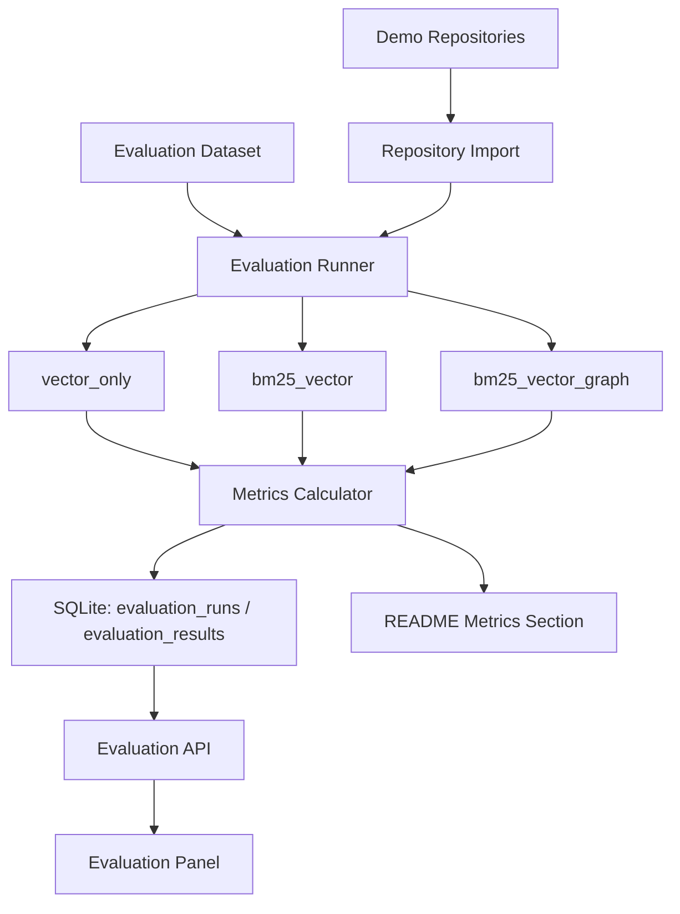

# RepoLens Phase 5 详细设计文档

## 1. 文档信息

- 文档名称：RepoLens Phase 5 详细设计文档
- 所属阶段：Phase 5 - 评测、部署与简历包装
- 依据文档：`docs/p0-plus-development-plan.md`
- 任务范围：P5-001 至 P5-012
- 创建日期：2026-06-08

## 2. Phase 5 目标与边界

Phase 5 的目标是把 RepoLens 从“功能可运行”收束为“可复现、可展示、可解释、可写入简历”的 P0+ 完整版本。核心工作包括：构建固定评测数据集，比较检索策略，输出指标报告，在前端展示 Evaluation Panel，完善 Docker Compose、README、演示仓库、演示问题和截图材料。

Phase 5 必须完成：

- 评测数据格式。
- 50 条评测样例。
- vector_only、bm25_vector、bm25_vector_graph 三种策略评测。
- Hit@5、MRR、引用覆盖率、延迟、token 指标。
- Evaluation Panel。
- Docker Compose 可复现部署。
- README 完整版。
- 演示仓库、演示问题、演示截图材料。
- 开发、审核、测试、评测闭环记录。

Phase 5 不做：

- 不新增完整 MCP Server。
- 不新增真实命令执行能力。
- 不新增复杂自治式 Multi-Agent 协商、投票或消息总线。
- 不追求企业级大仓库压测。
- 不引入 cross-encoder reranker 或新的模型训练。
- 不把评测结果伪装为线上大规模 benchmark。

## 3. Phase 5 任务映射

| 任务编号 | 任务 | 设计章节 |
| --- | --- | --- |
| P5-001 | 设计评测数据格式 | 5 |
| P5-002 | 准备 50 条评测样例 | 6 |
| P5-003 | 实现 vector_only 评测 | 8.1 |
| P5-004 | 实现 bm25_vector 评测 | 8.2 |
| P5-005 | 实现 bm25_vector_graph 评测 | 8.3 |
| P5-006 | 实现指标计算 | 9 |
| P5-007 | 实现 Evaluation Panel | 12 |
| P5-008 | 完善 Docker Compose | 13 |
| P5-009 | 完善 README | 14 |
| P5-010 | 准备演示仓库 | 15 |
| P5-011 | 准备演示问题 | 16 |
| P5-012 | 录制或整理演示截图 | 17 |

## 4. 总体架构



Phase 5 不重写检索能力，而是复用 Phase 2 的 `retrieve_repository` 和 Phase 3/4 的 response 数据结构。评测 Runner 只负责按样例调用既有能力、记录结果、计算指标和输出展示数据。

## 5. P5-001 评测数据格式

### 5.1 文件位置

评测数据放在：

- `evals/datasets/p0_plus_eval.jsonl`
- `evals/datasets/demo_questions.json`

`jsonl` 用于机器评测；`json` 用于 README/演示问题展示。

### 5.2 JSONL Schema

每行表示一个评测样例：

```json
{
  "id": "qa-location-001",
  "type": "location",
  "repository_key": "python_demo",
  "question": "Where is repository import implemented?",
  "expected_files": ["backend/app/services/repository/service.py"],
  "expected_symbols": ["RepositoryService"],
  "expected_answer_keywords": ["import", "RepositoryService"],
  "review_diff": null,
  "tags": ["qa", "retrieval"],
  "notes": "定位类问题，主要评估检索命中文件和 symbol。"
}
```

Review 样例使用 `review_diff`：

```json
{
  "id": "review-risk-001",
  "type": "review",
  "repository_key": "python_demo",
  "question": "Review this diff.",
  "expected_files": ["app/auth.py"],
  "expected_symbols": ["validate_token"],
  "expected_answer_keywords": ["token", "test"],
  "review_diff": "diff --git a/app/auth.py b/app/auth.py\n...",
  "tags": ["review"],
  "notes": "评估 Review 报告是否覆盖变更文件和建议测试。"
}
```

### 5.3 字段定义

| 字段 | 类型 | 必填 | 说明 |
| --- | --- | --- | --- |
| `id` | string | 是 | 稳定样例 ID，全局唯一 |
| `type` | string | 是 | `location`、`explanation`、`architecture`、`review` |
| `repository_key` | string | 是 | 指向演示仓库配置 |
| `question` | string | 是 | QA 或 Review 的自然语言任务 |
| `expected_files` | string[] | 是 | 期望命中的文件路径 |
| `expected_symbols` | string[] | 否 | 期望命中的 symbol |
| `expected_answer_keywords` | string[] | 否 | 用于引用覆盖和答案 smoke 的关键词 |
| `review_diff` | string/null | 否 | Review 样例使用的 unified diff |
| `tags` | string[] | 否 | 分组标签 |
| `notes` | string | 否 | 人类说明 |

### 5.4 校验规则

- `id` 不重复。
- `type` 只能取四类之一。
- `expected_files` 至少 1 个。
- `review` 类型必须有非空 `review_diff`。
- 非 review 类型不要求 `review_diff`。
- 所有文件路径使用 `/`，禁止绝对路径和 `..`。

## 6. P5-002 50 条评测样例

### 6.1 数量分布

| 类型 | 数量 | 目标 |
| --- | --- | --- |
| `location` | 20 | 功能定位、文件定位、symbol 定位 |
| `explanation` | 10 | 函数/类解释、关键逻辑解释 |
| `architecture` | 10 | 架构模块、数据流、依赖关系 |
| `review` | 10 | PR diff 风险、影响范围、测试建议 |

### 6.2 样例来源

Phase 5 使用两个演示仓库：

- `python_demo`：Python/FastAPI 风格小仓库。
- `ts_demo`：TypeScript/JavaScript/Next.js 风格小仓库。

样例优先覆盖 RepoLens 自身常见能力，而不是构造过难问题。

### 6.3 质量要求

- 每条样例必须能人工确认 expected_files。
- 至少 30 条样例带 expected_symbols。
- 10 条 Review 样例必须是合法 unified diff。
- 样例不包含密钥、真实 token、个人隐私或外部专有代码。

## 7. Evaluation 数据模型

### 7.1 `evaluation_runs`

| 字段 | 类型 | 说明 |
| --- | --- | --- |
| `id` | string | UUID |
| `name` | string | 评测名称 |
| `dataset_path` | string | 数据集路径 |
| `strategy` | string | `vector_only`、`bm25_vector`、`bm25_vector_graph` 或 `all` |
| `status` | string | `pending`、`running`、`completed`、`failed` |
| `sample_count` | int | 样例数 |
| `started_at` | datetime | 开始时间 |
| `completed_at` | datetime/null | 完成时间 |
| `metrics_json` | text | 聚合指标 JSON |
| `error_message` | text/null | 错误 |

### 7.2 `evaluation_results`

| 字段 | 类型 | 说明 |
| --- | --- | --- |
| `id` | string | UUID |
| `run_id` | string | evaluation_runs 外键 |
| `sample_id` | string | 样例 ID |
| `sample_type` | string | 样例类型 |
| `repository_key` | string | 仓库 key |
| `strategy` | string | 评测策略 |
| `hit_at_5` | bool | Top5 是否命中 expected file/symbol |
| `mrr` | float | reciprocal rank |
| `citation_coverage` | float | 引用覆盖率 |
| `latency_ms` | int | 样例耗时 |
| `token_count` | int | token 估算或真实记录 |
| `matched_files_json` | text | 命中文件 |
| `matched_symbols_json` | text | 命中 symbol |
| `citations_json` | text | 引用或 evidence |
| `error_message` | text/null | 错误 |

### 7.3 存储边界

- 不保存完整模型回答大文本，只保存必要摘要、引用和指标。
- 不保存密钥、环境变量、完整源码 dump。
- Review diff 只来自 eval dataset，不从外部网络拉取。

## 8. 策略评测

### 8.1 P5-003 vector_only

配置：

- `use_bm25=false`
- `use_vector=true`
- `use_graph=false`

行为：

- 如果 embedding 未配置，样例记录为 `error_message="vector_disabled"`，聚合指标单独展示 vector unavailable。
- 不用 BM25 fallback 冒充 vector_only。

### 8.2 P5-004 bm25_vector

配置：

- `use_bm25=true`
- `use_vector=true`
- `use_graph=false`

行为：

- vector disabled 时保留 warning，并记录实际 vector_count=0。
- 指标仍可计算，但 README 必须说明本地无 embedding 配置时该策略退化。

实现落地：

- `backend/app/services/evaluation/runner.py` 提供 `run_bm25_vector_sample`。
- Runner 固定使用 `use_bm25=true`、`use_vector=true`、`use_graph=false`。
- 结果结构包含 `bm25_count`、`vector_count`、`evidence_count`、`latency_ms`、`vector_disabled_reason` 和 Evidence refs。
- 当前 P5-004 只完成单样例 runner 与 smoke 记录，不提前计算 Hit@5、MRR、引用覆盖率或写入 Evaluation API。

### 8.3 P5-005 bm25_vector_graph

配置：

- `use_bm25=true`
- `use_vector=true`
- `use_graph=true`

行为：

- 复用 Phase 2 图扩展、候选合并和轻量重排。
- 这是 P0+ 主策略，用于证明 GraphRAG 对定位、架构和影响范围问题的增益。

实现落地：

- `backend/app/services/evaluation/runner.py` 提供 `run_bm25_vector_graph_sample`。
- Runner 固定使用 `use_bm25=true`、`use_vector=true`、`use_graph=true`。
- 结果结构包含 `bm25_count`、`vector_count`、`graph_count`、`evidence_count`、`latency_ms`、`vector_disabled_reason` 和 Evidence refs。
- 当前 P5-005 只完成单样例 runner 与 smoke 记录，不提前计算 Hit@5、MRR、引用覆盖率或写入 Evaluation API。

### 8.4 Review 样例策略

Review 样例默认使用：

- `use_bm25=true`
- `use_vector=true`
- `use_graph=true`
- `run_static_check=false`

指标从 Review report 中提取 citations、risks、suggested_tests 和 impacted_symbols。

## 9. P5-006 指标计算

### 9.1 Hit@5

定义：

- 对 QA/retrieval 样例：Top 5 evidence 中任一 evidence.file_path 命中 expected_files，则 file hit。
- 如果 expected_symbols 非空，Top 5 evidence 中任一 symbol_name 命中 expected_symbols，则 symbol hit。
- `hit_at_5 = file_hit && symbol_hit_required_passed`。

### 9.2 MRR

定义：

- 找到第一个命中 expected_files 或 expected_symbols 的 evidence rank。
- `MRR = 1 / rank`。
- 未命中则 0。

### 9.3 引用覆盖率

定义：

- `citation_coverage = matched_expected_files / expected_files_count`。
- 对 Review 样例，使用 report citations 和 risk locations 共同计算覆盖。
- 范围为 0 到 1。

### 9.4 延迟

定义：

- 单样例从 Runner 调用策略开始到拿到结果结束的毫秒数。
- 聚合输出 avg、p50、p95。

### 9.5 Token

Phase 5 的 token 指标分两级：

- 如果 Agent trace 中有真实 token_usage，则使用真实 token。
- 如果没有真实 token，则使用 `estimate_tokens = ceil(character_count / 4)`，并在报告中标记为 estimated。

### 9.6 聚合报告

每种策略输出：

```json
{
  "strategy": "bm25_vector_graph",
  "sample_count": 50,
  "hit_at_5": 0.78,
  "mrr": 0.61,
  "citation_coverage": 0.72,
  "avg_latency_ms": 420,
  "p50_latency_ms": 360,
  "p95_latency_ms": 880,
  "avg_token_count": 1200,
  "error_count": 2
}
```

### 9.7 实现落地

- `backend/app/services/evaluation/metrics.py` 提供 `compute_sample_metrics`、`compute_aggregate_metrics` 和 `estimate_token_count`。
- 单样例指标输出 `hit_at_5`、`mrr`、`citation_coverage`、`latency_ms`、`token_count`、`token_estimated`、`matched_files`、`matched_symbols` 和 `error_message`。
- 聚合指标输出 `sample_count`、`hit_at_5`、`mrr`、`citation_coverage`、`avg_latency_ms`、`p50_latency_ms`、`p95_latency_ms`、`avg_token_count`、`token_estimated_count` 和 `error_count`。
- 当前 P5-006 只完成指标计算模块和单元验证，不提前实现 Evaluation API、Evaluation Panel 或正式 50 条策略运行。

## 10. Evaluation Service 设计

### 10.1 模块位置

- `backend/app/models/evaluation.py`
- `backend/app/schemas/evaluation.py`
- `backend/app/services/evaluation/dataset.py`
- `backend/app/services/evaluation/runner.py`
- `backend/app/services/evaluation/metrics.py`
- `backend/app/api/evaluations.py`

### 10.2 Runner 流程

1. 读取 JSONL dataset。
2. 校验样例格式。
3. 按 strategy 和 repository_key 找到目标 repository。
4. QA 样例调用 `retrieve_repository`，必要时调用 QA API/service 取 citations。
5. Review 样例调用 Review service。
6. 计算单样例 metrics。
7. 写入 `evaluation_results`。
8. 聚合 metrics，写入 `evaluation_runs.metrics_json`。

P0+ 可先采用同步 Runner，不引入 Celery、队列或后台调度。

## 11. Evaluation API 设计

### 11.1 创建评测

`POST /api/evaluations`

```json
{
  "name": "P0+ baseline",
  "dataset_path": "evals/datasets/p0_plus_eval.jsonl",
  "strategy": "all",
  "repository_map": {
    "python_demo": "repository-id-1",
    "ts_demo": "repository-id-2"
  }
}
```

响应：

```json
{
  "run_id": "...",
  "status": "completed",
  "metrics": [],
  "sample_count": 50,
  "error_message": null
}
```

### 11.2 查询评测

- `GET /api/evaluations`
- `GET /api/evaluations/{run_id}`

### 11.3 错误处理

| 场景 | 响应 |
| --- | --- |
| dataset 不存在 | 422 |
| dataset 格式错误 | 422 |
| repository_map 缺 key | 422 |
| repository 未 ready | 400 |
| strategy 非法 | 422 |
| 单样例失败 | run completed with error_count，不中断全局 |

## 12. P5-007 Evaluation Panel

### 12.1 页面位置

复用 `frontend/app/page.tsx` 工作台，不新增营销页。

### 12.2 控件

- dataset path 输入或固定默认 dataset。
- strategy 下拉：`all`、`vector_only`、`bm25_vector`、`bm25_vector_graph`。
- repository_map 选择：当前选中仓库可作为 demo repository。
- Run Evaluation 按钮。

### 12.3 展示

- 策略对比表：Hit@5、MRR、引用覆盖率、平均延迟、p95 延迟、平均 token、error_count。
- 样例结果表：sample_id、type、strategy、hit、mrr、coverage、latency、error。
- vector disabled warning。

### 12.4 UI 边界

- 使用工作台风格，密集、可扫描。
- 不使用营销式 hero。
- 表格横向内容在小屏可滚动。

### 12.5 实现落地

- 后端新增 `backend/app/models/evaluation.py`、`backend/app/schemas/evaluation.py`、`backend/app/services/evaluation/service.py` 和 `backend/app/api/evaluations.py`。
- API 支持同步 `POST /api/evaluations`、`GET /api/evaluations` 和 `GET /api/evaluations/{run_id}`。
- 前端在 `frontend/app/page.tsx` 中新增 Evaluation Panel，展示策略对比表、样例结果表和 vector disabled warning。
- 当前 P5-007 不提前完善 Docker Compose、README、演示仓库、演示问题或截图。

## 13. P5-008 Docker Compose

### 13.1 服务

- `backend`
- `frontend`
- `qdrant`

### 13.2 Volume

- `repolens_data`：SQLite、导入仓库、缓存。
- `qdrant_data`：Qdrant 数据。

### 13.3 环境变量

`.env.example` 必须覆盖：

- `REPOLENS_DATABASE_URL`
- `REPOLENS_WORKSPACE_ROOT`
- `REPOLENS_QDRANT_URL`
- `REPOLENS_EMBEDDING_*`
- `REPOLENS_CHAT_*`
- `REPOLENS_SAFE_STATIC_CHECK_*`
- `NEXT_PUBLIC_API_BASE_URL`

### 13.4 验证

- `docker compose config` 通过。
- 本地非 Docker 方式仍可使用。
- 如果当前环境无法实际启动所有容器，记录未运行原因。

### 13.5 P5-008 落地记录

- `docker-compose.yml` 保持 P0+ 三服务：`backend`、`frontend`、`qdrant`。
- `repolens_data` 挂载到 `/app/.repolens`，承载 SQLite、导入仓库和缓存；`qdrant_data` 挂载到 `/qdrant/storage`。
- Compose 内后端覆盖容器专用配置：
  - `REPOLENS_DATABASE_URL=sqlite:////app/.repolens/repolens.sqlite`
  - `REPOLENS_WORKSPACE_ROOT=/app/.repolens/repos`
  - `REPOLENS_QDRANT_URL=http://qdrant:6333`
- `.env.example` 使用本地默认值，覆盖 `REPOLENS_DATABASE_URL`、`REPOLENS_WORKSPACE_ROOT`、`REPOLENS_QDRANT_URL`、`REPOLENS_EMBEDDING_*`、`REPOLENS_CHAT_*`、`REPOLENS_SAFE_STATIC_CHECK_*` 和 `NEXT_PUBLIC_API_BASE_URL`。
- `frontend/Dockerfile` 使用 `npm ci`、`NEXT_PUBLIC_API_BASE_URL` build arg、`npm run build` 和 `next start`，避免容器内以 dev server 作为默认启动方式。
- `backend/.dockerignore` 和 `frontend/.dockerignore` 排除虚拟环境、测试缓存、`node_modules`、`.next` 和本地环境文件，降低构建上下文污染。
- `docker compose config` 已通过；本地后端 Ruff、后端全量测试和前端 build 已通过。
- 已尝试 `docker compose up -d --build`，当前环境无法连接 Docker Desktop Linux daemon：`dockerDesktopLinuxEngine` pipe 不存在，因此未完成实际容器启动验证。

## 14. P5-009 README 完整版

README 必须包含：

- 项目定位。
- 适合简历的亮点。
- 架构图。
- 功能截图。
- 技术栈。
- 快速启动。
- 环境变量。
- Phase 1-5 功能清单。
- 评测方法与指标表。
- 安全边界。
- P0+ 不做范围。
- 简历 bullet 最终版。
- 面试讲法。

### 14.1 P5-009 落地记录

- `README.md` 已从 Phase 0 骨架说明升级为 P0+ 完整版。
- README 覆盖：
  - 项目定位。
  - 简历亮点。
  - Mermaid 架构图。
  - 技术栈。
  - Phase 1-5 功能清单。
  - 本地启动与 Docker Compose 启动。
  - 环境变量表。
  - 核心 API 表。
  - 评测数据、策略和指标说明。
  - 截图目标清单。
  - 安全边界。
  - P0+ non-goals。
  - Demo 计划。
  - 简历 bullet。
  - 面试讲法。
- README 未伪造 P5-010 到 P5-012 尚未产出的演示仓库、演示问题、截图或真实评测分数；相关位置明确标记为 `pending`。
- P5-009 未创建演示仓库、未整理演示问题、未录制截图。

## 15. P5-010 演示仓库

### 15.1 位置

- `evals/demo_repos/python_service`
- `evals/demo_repos/ts_webapp`

### 15.2 Python demo

包含：

- FastAPI-style routes。
- service 层。
- repository 层。
- auth 或 validation 逻辑。
- 测试文件。

### 15.3 TS/JS demo

包含：

- Next.js-style page/components。
- API client。
- state/hooks。
- utility functions。

### 15.4 约束

- 小型仓库，适合快速导入。
- 不包含真实密钥。
- 文件数量控制在 20-60。
- 有明确可问的问题和可 review 的 diff。

### 15.5 P5-010 落地记录

- 已创建 `evals/demo_repos/python_service`。
  - 文件数：22。
  - 覆盖 FastAPI-style routes、service 层、repository 层、auth token validation、billing、scanner filters、chunk builder、audit logger、retry helper、worker scheduler 和测试文件。
  - 对齐 `p0_plus_eval.jsonl` 中 `python_demo` 的 `expected_files` 和 `expected_symbols`。
- 已创建 `evals/demo_repos/ts_webapp`。
  - 文件数：21。
  - 覆盖 Next.js-style dashboard page、components、API clients、evaluation hook、review panel、tool calls panel、trace panel、persistence、routes、workspace helper 和测试文件。
  - 对齐 `p0_plus_eval.jsonl` 中 `ts_demo` 的 `expected_files` 和 `expected_symbols`。
- 已更新 `evals/README.md`，说明 Phase 5 dataset 和 demo repo 位置。
- 已更新 `README.md` Demo Plan，将 P5-010 标记为 `ready`，P5-011/P5-012 继续保持 `pending`。
- P5-010 未创建演示问题、未录制或整理截图、未填写真正评测分数。
- 新增 `backend/app/tests/test_phase5_demo_repos.py`，校验：
  - 两个 demo repo 目录存在。
  - 50 条评测样例引用的 expected files 在对应 demo repo 内全部存在。
  - 每个 demo repo 文件数在 20-60 范围内。
  - 不包含 `.env` 文件。
  - 关键后端/前端层文件齐备。

## 16. P5-011 演示问题

演示问题覆盖：

- 架构理解。
- 功能定位。
- 函数解释。
- 影响范围。
- PR Review。

存放：

- `evals/demo_questions.md`
- `evals/datasets/demo_questions.json`

每个问题包含：

- question。
- expected answer focus。
- suggested demo flow。
- screenshot target。

### 16.1 P5-011 落地记录

- 已新增 `evals/demo_questions.md`。
  - 面向演示讲解，包含 demo flow、10 条演示问题、2 条 Review diff 和 screenshot mapping。
  - 覆盖架构理解、功能定位、函数解释、影响范围、PR Review。
- 已新增 `evals/datasets/demo_questions.json`。
  - 面向后续 UI/截图流程，包含结构化字段：`id`、`category`、`repository_key`、`repository_path`、`question`、`expected_answer_focus`、`suggested_demo_flow`、`screenshot_target`、`expected_files`、`expected_symbols`、`review_diff`。
  - 共 10 条问题，覆盖 `python_demo` 与 `ts_demo`。
  - `impact` 和 `review` 类型共 4 条，均包含 unified diff。
- 已更新 `README.md` Demo Plan，将 P5-011 标记为 `ready`，P5-012 继续保持 `pending`。
- 已更新 `evals/README.md`，说明 demo questions 文档和 JSON 数据集位置。
- P5-011 未录制或整理截图、未填写真正评测分数、未新增超出 P0+ 的演示流程。
- 新增 `backend/app/tests/test_phase5_demo_questions.py`，校验：
  - 问题数量和类别覆盖。
  - repository_key 覆盖两个 demo repo。
  - 每条问题具备 required fields。
  - expected files 在 demo repo 中存在。
  - review/impact diff 格式合法。
  - Markdown 包含 JSON 中所有 question id。

## 17. P5-012 演示截图

### 17.1 目标截图

- Repository import ready。
- Evidence Panel 检索结果。
- Ask Panel 带 citations 回答。
- Trace Panel。
- Review Panel 报告。
- Tool Calls Panel。
- Evaluation Panel 策略对比。

### 17.2 存放位置

- `docs/assets/screenshots/`

### 17.3 验证方式

- 优先使用浏览器截图工具。
- 如果当前环境无法打开 UI，记录构建验证结果和未截图原因。

### 17.4 P5-012 落地记录

- 已创建 `docs/assets/screenshots/`。
- 已通过本地后端与前端工作台导入两个演示仓库：
  - `python_demo`：22 files、68 chunks、208 relations。
  - `ts_demo`：21 files、37 chunks、52 relations。
- 已在 Workbench 中完成 Phase 5 演示状态：
  - Evaluation Panel：运行 `all` 策略，对比 `vector_only`、`bm25_vector`、`bm25_vector_graph` 三组结果。
  - Ask Panel：生成带 citations 的仓库问答结果，并展示降级 warning 和 trace 入口。
  - Review Panel：生成 medium risk、suggested test、review citations。
  - Tool Calls Panel：展示 `analyze_diff`、`code_search`、`get_symbol_context` 调用状态、权限决策和耗时。
  - Evidence Panel：展示 BM25 + graph expansion 的 Evidence 列表、debug count 和 vector disabled warning。
- 已保存 6 张截图：
  - `docs/assets/screenshots/repository-status.png`
  - `docs/assets/screenshots/evaluation-panel.png`
  - `docs/assets/screenshots/ask-trace-panel.png`
  - `docs/assets/screenshots/review-panel.png`
  - `docs/assets/screenshots/tool-calls-panel.png`
  - `docs/assets/screenshots/evidence-panel.png`
- 已修正前端工作台阶段标识为 `Phase 5`。
- 已修正前端长表格、长报告和代码块在演示视口中造成的横向溢出。
- 已为 Phase 5 demo 输入提供默认问题、默认检索词和默认 Review diff，便于 README 演示路径复现；该调整不新增 P0+ 外功能。
- 已更新 `README.md`：
  - Phase 5 状态改为 `Done`。
  - 当前 score table 写入 P5-012 本地 demo run 的真实指标。
  - Workbench Screenshots 表改为实际 `docs/assets/screenshots/*.png` 路径。
  - Demo Plan 将 P5-012 标记为 `ready`。

### 17.5 P5-012 演示评测结果

P5-012 本地 demo run 的结果如下。默认环境未配置 embedding provider，因此 `vector_only` 预期为 0 命中，`bm25_vector` 与 `bm25_vector_graph` 通过 BM25 和 graph expansion 降级路径完成。

| Strategy | Samples | Hit@5 | MRR | Citation coverage | Avg latency | P95 latency | Avg token | Errors |
| --- | ---: | ---: | ---: | ---: | ---: | ---: | ---: | ---: |
| `vector_only` | 50 | 0% | 0.000 | 0% | 0.2 ms | 1 ms | 14.9 est | 0 |
| `bm25_vector` | 50 | 92% | 0.787 | 85.2% | 4.6 ms | 7 ms | 66.4 est | 0 |
| `bm25_vector_graph` | 50 | 90% | 0.892 | 84.5% | 9.6 ms | 20 ms | 64.8 est | 0 |

## 18. 安全边界

- Evaluation dataset 不允许绝对路径和路径穿越。
- Docker Compose 不挂载用户整个磁盘，只挂载项目数据目录。
- README 不展示真实 token。
- static check 仍默认 disabled。
- 评测不执行用户 diff 中的命令。
- 演示仓库不包含真实业务代码或隐私信息。

## 19. 测试策略

| 范围 | 测试 |
| --- | --- |
| Dataset loader | JSONL 解析、重复 ID、非法 type、路径校验 |
| Metrics | Hit@5、MRR、coverage、latency 聚合、token 估算 |
| Runner | 三种策略参数、vector disabled、单样例失败不阻断 run |
| API | create/list/get evaluation |
| Frontend | `npm run build`、Evaluation Panel 类型检查 |
| Docker | `docker compose config` |
| Docs | README 链接、命令和指标口径自查 |

## 20. 验收标准

Phase 5 完成时必须满足：

- 至少 50 条评测样例。
- 至少 3 种检索策略对比。
- 输出 Hit@5、MRR、引用覆盖率、延迟、token 指标。
- 前端 Evaluation Panel 可展示策略对比。
- Docker Compose 配置可校验。
- README 包含架构、启动、截图、指标和简历写法。
- 演示仓库、演示问题、截图材料齐备或明确记录截图无法运行原因。
- 后端 `ruff check app` 通过。
- 后端 `pytest app\\tests` 通过。
- 前端 `npm run build` 通过。

## 21. 开发顺序

1. P5-001：评测数据格式和 loader。
2. P5-002：50 条评测样例。
3. P5-003/P5-004/P5-005：三种策略 Runner。
4. P5-006：指标计算。
5. P5-007：Evaluation API 和 Panel。
6. P5-008：Docker Compose。
7. P5-009：README。
8. P5-010/P5-011：演示仓库和问题。
9. P5-012：截图整理。
10. 最终自查、测试、评测记录和文档更新。
