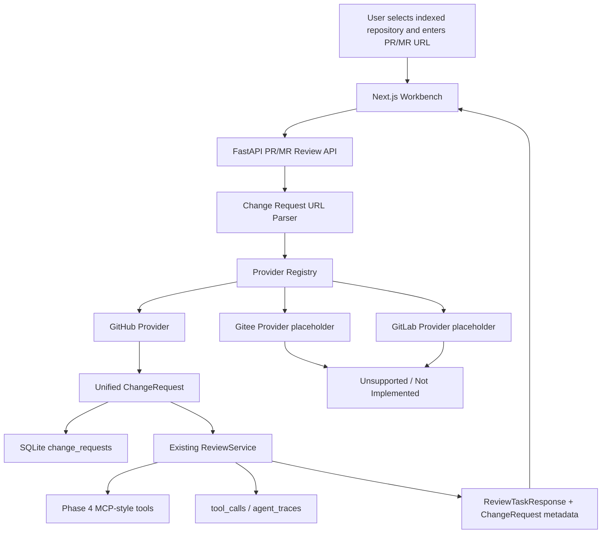

# RepoLens Phase 6 详细设计文档

## 1. 文档信息

- 文档名称：RepoLens Phase 6 详细设计文档
- 所属阶段：V1 Phase 6 - 多代码平台 PR/MR 集成与真实项目演示增强
- 当前版本：v0.1
- 创建日期：2026-06-13
- 依据文档：
  - `docs/v1-development-plan.md`
  - `docs/outline-design.md`
  - `docs/p0-plus-final-closure-review.md`
  - `docs/phase4-detailed-design.md`
  - `docs/phase5-detailed-design.md`
- 任务范围：P6-001 至 P6-012

## 2. Phase 6 目标与边界

Phase 6 的目标是把 P0+ 的“粘贴 diff 审查”升级为“输入真实代码平台 PR/MR URL 后生成 Review 报告”。此阶段必须复用 P0+ 已完成的 Review pipeline，包括 `analyze_diff`、Diff 到 symbol 映射、`code_search`、`get_symbol_context`、Risk Reviewer、Review Verifier、Test Suggestion、Review Report Writer、tool_calls 和 agent_traces。

Phase 6 的核心不是只支持 GitHub，而是建立平台无关的 Change Request Provider 抽象。GitHub PR 是首个落地适配器；Gitee Pull Request、GitLab Merge Request 和 self-hosted GitLab Merge Request 必须在 URL parser、配置、数据模型和 provider registry 中预留扩展点。

### 2.1 必须完成

- 建立 Change Request 统一领域模型。
- 建立多平台 Provider 抽象与 registry。
- 实现 PR/MR URL parser。
- 实现 GitHub PR 只读 client 作为首个 provider。
- 预留 Gitee/GitLab/self-hosted GitLab provider 契约和 unsupported provider 错误。
- 新增平台 token/base URL/timeout/diff limit 配置。
- 新增 `change_requests` 数据模型。
- 新增基于 PR/MR URL 的 Review API。
- 接入现有 ReviewService，不复制 Review pipeline。
- 前端新增平台无关 PR/MR Review flow。
- 建立 Phase 6 开发、审核、测试、评测闭环记录。

### 2.2 明确不做

- 不自动写回 GitHub/Gitee/GitLab PR/MR 评论。
- 不 approve、request changes、merge 或关闭 PR/MR。
- 不自动修改代码、生成 patch、commit 或 push。
- 不做 GitHub App、Gitee 应用、GitLab OAuth 或多用户授权。
- 不做后台队列、异步任务调度或 webhook。
- 不自动从 PR/MR URL clone/import/index 仓库。
- 不实现 Phase 7 MCP Server。
- 不实现 Phase 8 真正多 Agent 消息总线。
- 不实现 Phase 9 大规模 PR/MR benchmark。

### 2.3 关键约束

- Phase 6 初始版本要求用户先选择一个已完成索引的 RepoLens repository，再输入 PR/MR URL。
- PR/MR diff 拉取成功后转换为现有 `ReviewCreateRequest.diff_text`。
- Review task 仍使用 `TaskType.REVIEW`，避免新增一套任务系统。
- `change_requests` 只保存脱敏 metadata，不保存 token。
- 平台 API token 只从环境变量读取，不写入数据库、trace、tool_calls 或前端响应。
- 大 diff 必须在进入 Review pipeline 前被限制或拒绝，避免撑爆上下文和 UI。

## 3. Phase 6 任务映射

| 编号 | 任务 | 设计章节 |
| --- | --- | --- |
| P6-001 | 编写 Phase 6 详细设计 | 全文 |
| P6-002 | 新增多平台配置项 | 7 |
| P6-003 | 实现 PR/MR URL parser | 8 |
| P6-004 | 实现首个 Change Request client | 9 |
| P6-005 | 新增 change_requests 数据模型 | 10 |
| P6-006 | 新增 PR/MR Review API | 11 |
| P6-007 | 接入现有 Review pipeline | 12 |
| P6-008 | 前端新增 PR/MR Review flow | 13 |
| P6-009 | 错误处理与安全边界 | 14 |
| P6-010 | 准备真实演示 PR/MR | 15 |
| P6-011 | 测试与评测 | 16 |
| P6-012 | 更新文档和演示材料 | 17 |

## 4. 当前 P0+ 可复用能力

Phase 6 不重写 P0+ 的能力，主要复用以下模块：

| 现有模块 | 文件 | Phase 6 复用方式 |
| --- | --- | --- |
| Review API | `backend/app/api/reviews.py` | 参考现有 `POST /api/repositories/{repository_id}/reviews` 行为 |
| Review Service | `backend/app/services/review/service.py` | 新 API 拉取 PR/MR diff 后构造 `ReviewCreateRequest` 并调用现有 `create_review_task` 与 `run_review_task` |
| Review schemas | `backend/app/schemas/review.py` | 扩展 response，或新增 change request response wrapper |
| Diff Analyzer | `backend/app/services/tools/diff_analyzer.py` | 继续解析 unified diff |
| Code Search Tool | `backend/app/services/tools/code_search.py` | 继续复用混合检索 |
| Symbol Context Tool | `backend/app/services/tools/symbol_context.py` | 继续复用代码图邻域 |
| Tool Calls | `backend/app/models/tool_call.py` | 继续记录 review pipeline 工具调用 |
| Agent Trace | `backend/app/models/agent_trace.py` | 继续记录 Review steps |
| 前端 Review Panel | `frontend/app/page.tsx` | 新增 PR/MR URL 输入区并复用 Review 报告展示 |
| API helper/type | `frontend/lib/api.ts`、`frontend/types/workbench.ts` | 新增 PR/MR request/response 类型和 helper |

## 5. 总体架构



Phase 6 的新链路只负责“把外部平台变更转换为统一 ChangeRequest + diff”。真正审查仍由 P0+ Review pipeline 完成。

## 6. 领域模型

### 6.1 术语

| 术语 | 含义 |
| --- | --- |
| Change Request | 平台无关的代码变更请求，统一表示 GitHub PR、Gitee PR、GitLab MR |
| Provider | 负责识别平台 URL 并通过平台 API 拉取 metadata/diff/files/commits |
| Platform | `github`、`gitee`、`gitlab`、`self_hosted_gitlab`、`unsupported` |
| Change type | `pull_request` 或 `merge_request` |
| Review target repository | RepoLens 中已索引完成的 repository，Review pipeline 基于它检索上下文 |

### 6.2 统一 ChangeRequest 数据结构

后端 service 层使用 dataclass 表示：

```python
@dataclass(frozen=True)
class ChangeRequestRef:
    platform: str
    change_type: str
    owner: str
    repo: str
    number: str
    url: str
    base_url: str | None = None


@dataclass(frozen=True)
class ChangeRequestFile:
    path: str
    status: str
    additions: int
    deletions: int
    patch: str | None = None


@dataclass(frozen=True)
class ChangeRequestCommit:
    sha: str
    title: str
    author: str | None = None


@dataclass(frozen=True)
class ChangeRequest:
    ref: ChangeRequestRef
    title: str
    author: str
    source_branch: str | None
    target_branch: str | None
    state: str | None
    html_url: str
    diff_text: str
    files: list[ChangeRequestFile]
    commits: list[ChangeRequestCommit]
    metadata: dict[str, object]
```

### 6.3 Provider 接口

```python
class ChangeRequestProvider(Protocol):
    platform: str

    def detect(self, url: str) -> bool:
        ...

    def parse_url(self, url: str) -> ChangeRequestRef:
        ...

    def fetch(self, ref: ChangeRequestRef, settings: Settings) -> ChangeRequest:
        ...
```

Provider 不负责创建 task，不负责运行 Review，不负责写数据库。Provider 只做 URL 解析和平台只读数据拉取。

## 7. P6-002 多平台配置项

### 7.1 新增环境变量

| 环境变量 | 默认值 | 说明 |
| --- | --- | --- |
| `REPOLENS_CHANGE_REQUEST_TIMEOUT_SECONDS` | `30` | 平台 API 请求超时 |
| `REPOLENS_CHANGE_REQUEST_MAX_DIFF_CHARS` | 与 `DIFF_MAX_CHARS` 对齐 | PR/MR diff 最大字符数 |
| `REPOLENS_GITHUB_TOKEN` | 空 | GitHub API token，空时只访问 public API |
| `REPOLENS_GITHUB_BASE_URL` | `https://api.github.com` | GitHub API base URL |
| `REPOLENS_GITEE_TOKEN` | 空 | Gitee API token，Phase 6 可先预留 |
| `REPOLENS_GITEE_BASE_URL` | `https://gitee.com/api/v5` | Gitee API base URL |
| `REPOLENS_GITLAB_TOKEN` | 空 | GitLab API token，Phase 6 可先预留 |
| `REPOLENS_GITLAB_BASE_URL` | `https://gitlab.com/api/v4` | GitLab API base URL |

### 7.2 Settings 扩展

在 `backend/app/core/config.py` 的 `Settings` 增加：

- `change_request_timeout_seconds: float`
- `change_request_max_diff_chars: int`
- `github_token: str`
- `github_base_url: str`
- `gitee_token: str`
- `gitee_base_url: str`
- `gitlab_token: str`
- `gitlab_base_url: str`

### 7.3 安全要求

- token 字段不得出现在 response schema。
- token 字段不得写入 `change_requests.metadata`。
- error message 不得包含 token 或 Authorization header。
- 前端只展示“token missing/permission denied/rate limited”等脱敏错误。

## 8. P6-003 PR/MR URL Parser

### 8.1 支持范围

| 平台 | URL 示例 | Phase 6 行为 |
| --- | --- | --- |
| GitHub | `https://github.com/owner/repo/pull/123` | 解析并支持 fetch |
| Gitee | `https://gitee.com/owner/repo/pulls/123` | 解析或返回 not implemented，按任务推进决定 |
| GitLab.com | `https://gitlab.com/group/project/-/merge_requests/123` | 解析或返回 not implemented，按任务推进决定 |
| self-hosted GitLab | `https://git.example.com/group/project/-/merge_requests/123` | 通过 configured base URL 预留 |

### 8.2 Parser 设计

新增模块：

- `backend/app/services/change_request/__init__.py`
- `backend/app/services/change_request/models.py`
- `backend/app/services/change_request/providers.py`

Parser 规则：

- URL 必须是 `http` 或 `https`。
- 去除 query string 和 fragment 后解析。
- GitHub repo 名可包含 `-`、`_`、`.`。
- GitLab namespace 可多级，例如 `group/subgroup/project`。
- PR/MR number 保留为字符串，接口层需要时再转 int。

### 8.3 错误类型

| 错误 | 场景 | API 映射 |
| --- | --- | --- |
| `ChangeRequestValidationError` | URL 为空、格式非法、number 缺失 | 422 |
| `UnsupportedChangeRequestProviderError` | URL 平台不支持 | 400 |
| `ChangeRequestProviderNotImplementedError` | 平台已识别但 client 未实现 | 501 或 400 |

P6-003 只实现 parser，不调用平台 API，不写数据库，不接 Review API。

## 9. P6-004 首个 Change Request Client

### 9.1 GitHub Client 范围

GitHub 作为首个落地 provider，读取：

- PR metadata：title、user、state、head/base branch、html_url。
- PR files：filename、status、additions、deletions、patch。
- PR commits：sha、commit message title、author。
- PR diff：通过 GitHub diff media type 或 `.diff` URL 获取 unified diff。

### 9.2 HTTP 实现约束

P0+ 当前后端依赖中已有 `httpx` 作为 dev dependency，但生产依赖未包含。Phase 6 有两种可选路径：

1. 使用 Python 标准库 `urllib.request` 实现轻量 client，避免新增运行时依赖。
2. 将 `httpx` 从 dev dependency 提升到正式 dependency。

推荐 Phase 6 使用标准库 `urllib.request`，保持依赖面小。若实现成本过高，再在详细记录中说明并升级依赖。

### 9.3 请求策略

| API | 用途 |
| --- | --- |
| `GET /repos/{owner}/{repo}/pulls/{number}` | metadata |
| `GET /repos/{owner}/{repo}/pulls/{number}/files` | changed files |
| `GET /repos/{owner}/{repo}/pulls/{number}/commits` | commits |
| `GET /repos/{owner}/{repo}/pulls/{number}` with `Accept: application/vnd.github.v3.diff` | unified diff |

### 9.4 GitHub token 策略

- `REPOLENS_GITHUB_TOKEN` 为空时允许 public PR smoke。
- token 非空时添加 `Authorization: Bearer ***`。
- 不把 token 写入日志。
- 401/403 返回脱敏错误。
- rate limit 403 单独提示。

### 9.5 Client 错误

| 错误 | 场景 | API 映射 |
| --- | --- | --- |
| `ChangeRequestAuthError` | 401/403 | 400 |
| `ChangeRequestNotFoundError` | 404 | 404 |
| `ChangeRequestRateLimitError` | rate limit | 429 |
| `ChangeRequestDiffTooLargeError` | diff 超过限制 | 413 |
| `ChangeRequestFetchError` | 网络、timeout、非预期响应 | 502 |

P6-004 只实现 client 和单元测试，不创建 API，不写数据库。

## 10. P6-005 change_requests 数据模型

### 10.1 新增 SQLAlchemy 模型

新增文件：

- `backend/app/models/change_request.py`

模型字段：

| 字段 | 类型 | 说明 |
| --- | --- | --- |
| `id` | string uuid | 主键 |
| `repository_id` | FK repositories.id | 关联已索引 repository |
| `task_id` | FK tasks.id nullable | 关联 review task，创建 task 后写入 |
| `platform` | string | `github`、`gitee`、`gitlab`、`self_hosted_gitlab` |
| `change_type` | string | `pull_request` 或 `merge_request` |
| `owner` | string | owner/namespace |
| `repo` | string | 仓库名 |
| `number` | string | PR/MR 编号 |
| `url` | text | 原始 URL |
| `title` | text | 标题 |
| `author` | string nullable | 作者 |
| `source_branch` | string nullable | 源分支 |
| `target_branch` | string nullable | 目标分支 |
| `state` | string nullable | open/closed/merged 等平台状态 |
| `changed_file_count` | integer | changed files 数量 |
| `addition_count` | integer | additions |
| `deletion_count` | integer | deletions |
| `commit_count` | integer | commits |
| `metadata` | text nullable | 脱敏 JSON |
| `created_at` | datetime | 创建时间 |
| `updated_at` | datetime | 更新时间 |

### 10.2 关系

- `Repository.change_requests`
- `Task.change_request` 或 `Task.change_requests`

如果为了降低 Phase 6 迁移风险，也可以先只从 `ChangeRequest` 指向 `Task`，不改 `Task` relationship；但必须在查询 response 时能根据 `task_id` 取回 metadata。

### 10.3 索引

- `(repository_id, platform, owner, repo, number)`
- `(task_id)`
- `(platform, created_at)`

### 10.4 SQLite 兼容

项目当前没有 Alembic，使用 `Base.metadata.create_all()`。新增表不会影响已有 SQLite 表，但新增已有表字段会有迁移风险。因此 Phase 6 优先新增 `change_requests` 表，不修改既有表字段。

## 11. P6-006 PR/MR Review API

### 11.1 API 路径

新增 router：

- `backend/app/api/change_requests.py`

新增 endpoint：

```text
POST /api/repositories/{repository_id}/change-requests/reviews
GET  /api/change-requests/{change_request_id}
GET  /api/change-requests/tasks/{task_id}
```

不替代现有：

```text
POST /api/repositories/{repository_id}/reviews
```

现有粘贴 diff Review API 必须保持兼容。

### 11.2 Request schema

新增文件：

- `backend/app/schemas/change_request.py`

```python
class ChangeRequestReviewCreateRequest(BaseModel):
    url: str = Field(min_length=1, max_length=2000)
    top_k: int = Field(default=8, ge=1, le=50)
    use_bm25: bool = True
    use_vector: bool = True
    use_graph: bool = True
    run_static_check: bool = False
```

### 11.3 Response schema

```python
class ChangeRequestMetadataResponse(BaseModel):
    id: str
    repository_id: str
    task_id: str | None
    platform: str
    change_type: str
    owner: str
    repo: str
    number: str
    url: str
    title: str
    author: str | None
    source_branch: str | None
    target_branch: str | None
    state: str | None
    changed_file_count: int
    addition_count: int
    deletion_count: int
    commit_count: int
    created_at: datetime
    updated_at: datetime


class ChangeRequestReviewResponse(BaseModel):
    change_request: ChangeRequestMetadataResponse
    review: ReviewTaskResponse
```

### 11.4 API 行为

1. 校验 repository 存在。
2. 校验 repository `status=ready`。
3. 解析 PR/MR URL。
4. 选择 provider。
5. 拉取 ChangeRequest。
6. 限制 diff 大小。
7. 写入 `change_requests` 记录。
8. 构造 `ReviewCreateRequest(diff_text=change_request.diff_text, ...)`。
9. 调用现有 `ReviewService.create_review_task()`。
10. 更新 `change_requests.task_id`。
11. 调用现有 `ReviewService.run_review_task()`。
12. 返回 `ChangeRequestReviewResponse`。

### 11.5 状态与失败处理

如果 fetch 成功但 Review pipeline 失败：

- `change_requests` 记录保留。
- `task.status=failed`。
- response 返回 failed review task 和错误信息。

如果 fetch 失败：

- 不创建 review task。
- 可不写 `change_requests`，避免保存不完整记录。

## 12. P6-007 接入现有 Review pipeline

### 12.1 服务层设计

新增：

- `backend/app/services/change_request/service.py`

服务类：

```python
class ChangeRequestReviewService:
    def __init__(self, db: Session):
        self.db = db

    def create_review_from_url(
        self,
        repository_id: str,
        request: ChangeRequestReviewCreateRequest,
        settings: Settings,
    ) -> ChangeRequestReviewResponse:
        ...
```

### 12.2 复用方式

`ChangeRequestReviewService` 内部持有 `ReviewService`：

```python
review_request = ReviewCreateRequest(
    diff_text=change_request.diff_text,
    top_k=request.top_k,
    use_bm25=request.use_bm25,
    use_vector=request.use_vector,
    use_graph=request.use_graph,
    run_static_check=request.run_static_check,
)
task = review_service.create_review_task(repository, review_request)
task = review_service.run_review_task(task, review_request, settings)
```

### 12.3 不允许的实现

- 不复制 `ReviewService.run_review_task`。
- 不在 Change Request service 内直接调用 `analyze_diff`、`code_search`、`review_risks`。
- 不新增第二套 tool_calls/traces 写入逻辑。
- 不改变现有 Review API 的 response 语义。

## 13. P6-008 前端 PR/MR Review Flow

### 13.1 UI 入口

在当前 Workbench Review 区域增加两个模式：

- `Diff`：保留 P0+ 粘贴 diff。
- `PR/MR URL`：新增 Phase 6 flow。

UI 文案必须平台无关，例如：

- `PR/MR URL`
- `Run PR/MR Review`
- `Platform`
- `Source branch`
- `Target branch`
- `Changed files`

避免写成只支持 GitHub 的固定文案。

### 13.2 前端类型

在 `frontend/types/workbench.ts` 增加：

- `ChangeRequestReviewCreateRequest`
- `ChangeRequestMetadata`
- `ChangeRequestReviewResponse`

### 13.3 API helper

在 `frontend/lib/api.ts` 增加：

```typescript
export async function createChangeRequestReview(
  repositoryId: string,
  payload: ChangeRequestReviewCreateRequest
): Promise<ChangeRequestReviewResponse>
```

### 13.4 状态

前端状态包括：

- `idle`
- `fetching`
- `reviewing`
- `completed`
- `failed`

可以先合并为现有 `reviewState`，但错误提示要能区分：

- URL 格式错误。
- provider unsupported。
- token/permission/rate limit。
- diff too large。
- repository not ready。

### 13.5 展示内容

成功后展示：

- platform。
- PR/MR title。
- author。
- source/target branch。
- changed_file_count。
- addition/deletion/commit count。
- Review summary/risk/suggested tests/citations/tool_calls/traces。

## 14. P6-009 错误处理与安全边界

### 14.1 输入限制

| 输入 | 限制 |
| --- | --- |
| PR/MR URL | max 2000 chars，必须 http/https |
| diff_text | 不超过 `REPOLENS_CHANGE_REQUEST_MAX_DIFF_CHARS` |
| top_k | 1-50 |

### 14.2 安全边界

- 只读平台 API。
- 不写评论。
- 不执行平台操作。
- 不自动 clone 未索引仓库。
- 不允许 provider 读取本地任意文件。
- 不记录 token。
- 不把平台 API raw response 原样透出到前端。
- metadata 必须脱敏，只保留展示和审计需要的字段。

### 14.3 错误映射

| 内部错误 | HTTP 状态 | 前端提示 |
| --- | --- | --- |
| repository missing | 404 | Repository not found |
| repository not ready | 400 | Repository must be ready |
| invalid URL | 422 | Invalid PR/MR URL |
| unsupported provider | 400 | Unsupported code platform |
| provider not implemented | 501 或 400 | Provider recognized but not implemented yet |
| auth/permission error | 400 | Platform authorization failed |
| not found | 404 | Change request not found |
| rate limit | 429 | Platform rate limit exceeded |
| diff too large | 413 | PR/MR diff is too large |
| network/timeout | 502 | Platform request failed |

## 15. P6-010 真实演示 PR/MR

### 15.1 演示原则

- 优先使用公开小型 PR。
- PR/MR diff 要小，便于展示。
- PR/MR 对应仓库应能被 RepoLens 先导入并索引。
- 不展示 token。
- 不依赖私有仓库。

### 15.2 候选路径

1. 使用本项目 GitHub 仓库自造一个小 PR。
2. 使用公开 demo repo 的小 PR。
3. 使用 synthetic PR/MR URL mock 数据完成本地演示，真实 public PR smoke 作为可选验证。

### 15.3 Demo 验收

- 前端输入 PR/MR URL 后显示 metadata。
- Review 报告包含风险摘要、建议测试、citations、tool_calls 和 traces。
- 失败场景至少展示 unsupported provider 或 token/rate limit 的清晰提示。

## 16. P6-011 测试与评测

### 16.1 后端单元测试

新增测试文件建议：

| 文件 | 覆盖 |
| --- | --- |
| `test_phase6_change_request_parser.py` | GitHub/Gitee/GitLab URL parse、invalid URL、unsupported provider |
| `test_phase6_github_provider.py` | metadata/files/commits/diff response parse、auth/rate limit/not found/diff too large |
| `test_phase6_change_request_models.py` | `change_requests` 表创建、repository/task 关联、metadata round-trip |
| `test_phase6_change_request_api.py` | 创建 PR/MR Review、repository not ready、provider errors、response schema |

### 16.2 前端验证

- `npm run build`。
- TypeScript type check 如历史流程可用则执行 `npm exec tsc -- --noEmit`。
- PR/MR URL flow 表单、错误态、metadata 展示和 Review 报告展示。

### 16.3 质量门禁

每个实现任务完成后至少执行对应专项测试。阶段收束时执行：

```powershell
cd backend
.\.venv\Scripts\python.exe -m ruff check app
.\.venv\Scripts\python.exe -m pytest app\tests

cd ..\frontend
npm run build
npm exec tsc -- --noEmit
```

如 Docker daemon 可用，追加：

```powershell
docker compose config
```

### 16.4 Phase 6 评测口径

Phase 6 不建立大规模 benchmark，但需要记录 smoke 评测：

| 指标 | 说明 |
| --- | --- |
| URL parse success | 支持平台 URL 能被正确解析 |
| provider fetch success | public GitHub PR 能拉取 metadata/diff |
| review completion | PR/MR URL 能生成 completed Review task |
| citation coverage smoke | Review 报告至少包含 citations 或明确无 evidence warning |
| latency smoke | 记录一次真实或 mock PR/MR Review 总耗时 |
| safety smoke | token 不出现在 response、trace、tool_calls、metadata |

## 17. P6-012 文档和演示材料

Phase 6 收束时更新：

- `README.md`：新增 V1 Phase 6 PR/MR Review 使用说明。
- `docs/development-worklog.md`：记录 P6-001 到 P6-012 完成状态。
- `docs/phase6-closed-loop-log.md`：完整记录开发、审核、测试、评测。
- `docs/v1-development-plan.md`：如实际实现范围与计划有偏差，做同步修正。
- `docs/assets/screenshots/`：新增 PR/MR Review 截图，文件名建议 `change-request-review-panel.png`。

## 18. 开发顺序

推荐严格按以下顺序推进：

1. P6-001：完成本详细设计。
2. P6-CLOSED-LOOP：建立闭环记录文档。
3. P6-002：新增配置项和 `.env.example`。
4. P6-003：实现 URL parser 和 provider registry。
5. P6-004：实现 GitHub provider client。
6. P6-005：新增 `change_requests` 模型和测试。
7. P6-006：新增 PR/MR Review API schema/router/service 骨架。
8. P6-007：接入现有 Review pipeline。
9. P6-008：前端新增 PR/MR URL flow。
10. P6-009：补齐错误处理、安全测试和 diff limit。
11. P6-010：准备真实或 mock 演示 PR/MR。
12. P6-011：全量测试、build、smoke 评测。
13. P6-012：更新 README、截图和最终记录。

每个任务都必须更新 `docs/phase6-closed-loop-log.md` 和 `docs/development-worklog.md`，并说明没有越界进入 Phase 7/8/9/10。

## 19. 阶段验收标准

Phase 6 完成后必须满足：

- 可以识别至少 GitHub PR URL。
- 代码结构支持多平台 Change Request Provider。
- Gitee/GitLab/self-hosted GitLab 有明确预留契约或 unsupported/not implemented 错误。
- 可以从 GitHub public PR 或 mock provider 拉取 metadata、files、commits、diff。
- 可以把 PR/MR diff 接入现有 Review pipeline。
- 可以保存 `change_requests` 记录并关联 review task。
- 前端可以输入 PR/MR URL，展示 metadata 和 Review 报告。
- token 不落数据库、trace、tool_calls、前端 response 或截图。
- 大 diff 有明确拒绝或截断策略。
- 粘贴 diff Review API 保持兼容。
- 后端专项测试、全量 ruff/pytest、前端 build/type check 通过或记录环境阻断原因。

