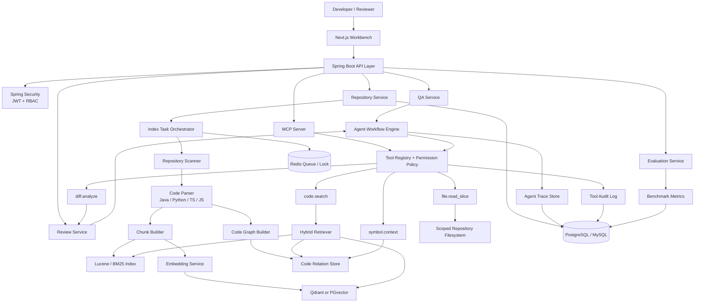
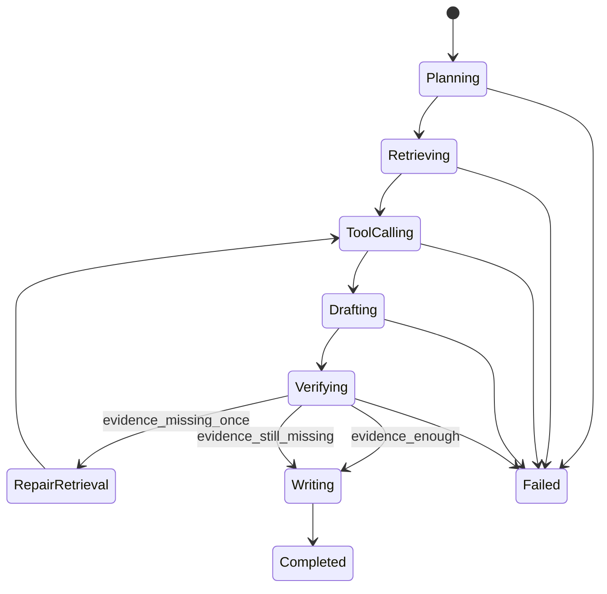
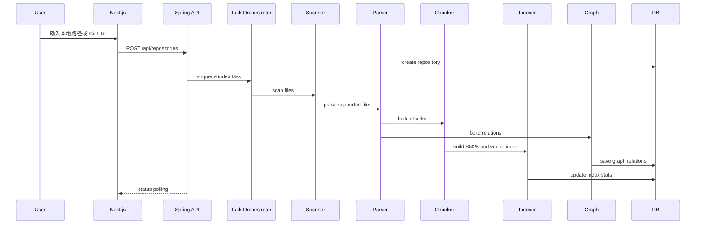
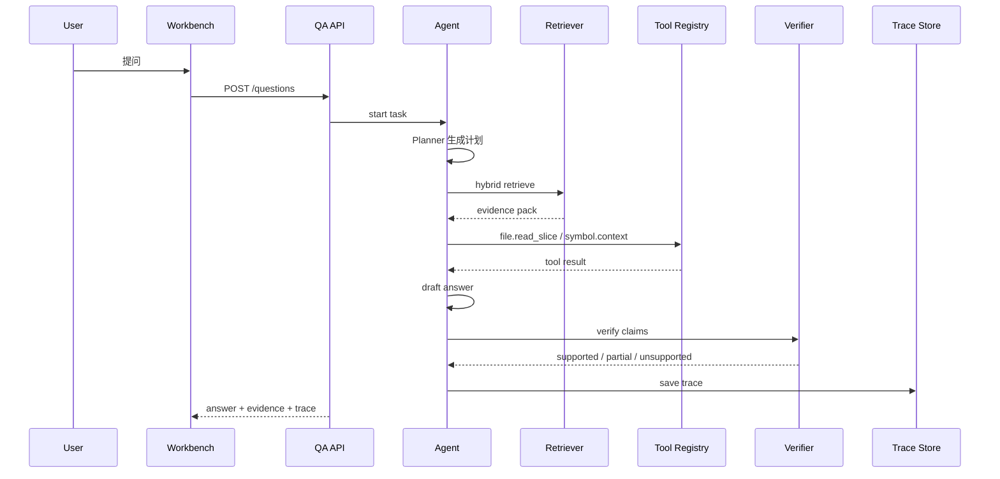
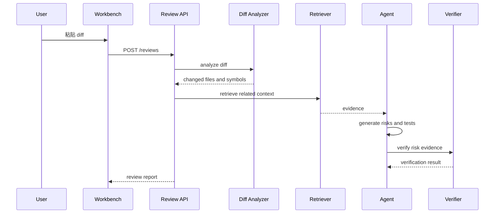

# RepoLens-Java 需求分析与概要设计

## 1. 文档信息

| 字段 | 内容 |
| --- | --- |
| 项目名称 | RepoLens-Java |
| 推荐简历名称 | RepoLens：基于 Spring AI 与 MCP 的仓库级 Code Agent 平台 |
| 文档类型 | 需求分析 + 概要设计 |
| 目标版本 | Java Edition V1 |
| 创建日期 | 2026-06-28 |
| 目标岗位 | Java 后端、Java 全栈、大模型应用后端、AI Agent 应用开发 |
| 旧版关系 | 复用 RepoLens V1 的产品定位、前端工作台、评测数据、Demo 仓库与 PR/MR fixtures；重写 Java 后端核心 |

## 2. 项目定位

RepoLens-Java 是一个面向开发者代码理解与 PR/MR Review 场景的仓库级 Code Agent 平台。系统能够导入本地或远程 Git 仓库，解析代码结构，构建函数级代码块、符号关系图、BM25 索引与向量索引，并通过 Spring AI Tool Calling 与 MCP Server 暴露只读代码工具，支持证据可追溯的仓库问答、影响范围分析、PR Review、Agent Trace 与评测可视化。

项目不是普通代码聊天机器人，也不是简单调用大模型 API。它强调：

- 仓库级结构化理解，而不是把文件拼进 prompt。
- BM25 + 向量 + 代码图谱的混合检索，而不是纯向量 RAG。
- MCP 工具协议、工具权限与审计，而不是 Agent 任意读写文件。
- 异步索引、任务状态、失败重试、幂等控制与可观测性，而不是一次性 Demo 脚本。
- 评测指标、证据引用与 Verifier 校验，而不是只看生成效果。

## 3. 技术趋势与选型依据

### 3.1 为什么这个题目足够新

2025-2026 年 Java AI 应用工程的几个明显趋势是：

1. Spring AI 进入 Spring 生态主线，提供 ChatClient、Tool Calling、RAG、VectorStore、Observability、Evaluation 与 MCP Boot Starters 等能力。
2. MCP 成为 Agent 连接外部工具与数据源的标准协议之一，MCP Java SDK 已经提供同步、异步、客户端、服务端与多种 transport 能力。
3. 代码智能体从“直接让模型读代码”演进为“仓库索引 + 结构化检索 + 工具调用 + 权限审计 + 评测”的工程系统。
4. 企业落地更关心安全边界、trace、token/延迟成本、工具权限、证据引用和失败诊断，而不只是 prompt 效果。

### 3.2 官方能力映射

| 能力 | 官方生态依据 | 本项目落点 |
| --- | --- | --- |
| Tool Calling | Spring AI `@Tool`、`ToolCallback`、`ToolCallingAdvisor` | `code.search`、`file.read_slice`、`symbol.context`、`diff.analyze` 等工具 |
| RAG | Spring AI `QuestionAnswerAdvisor`、`RetrievalAugmentationAdvisor`、query rewrite、post processor | 仓库问答、PR Review 的 evidence-grounded context |
| Vector Store | Spring AI `VectorStore`、`VectorStoreRetriever`，支持 Qdrant、PGvector、Elasticsearch 等 | 代码 chunk embedding 检索 |
| MCP | MCP Java SDK + Spring AI MCP Server Boot Starter | 对外暴露 RepoLens 只读代码工具 |
| Observability | Spring AI 基于 Micrometer 记录 ChatClient、Tool、Embedding、VectorStore observations | Agent Trace、工具耗时、模型 token、向量查询耗时 |
| Security | Spring Security、MCP Security、工具权限策略 | JWT/RBAC、只读工具、敏感文件过滤、审计日志 |

参考资料：

- Spring AI Tool Calling: https://docs.spring.io/spring-ai/reference/api/tools.html
- Spring AI RAG: https://docs.spring.io/spring-ai/reference/api/retrieval-augmented-generation.html
- Spring AI Vector Databases: https://docs.spring.io/spring-ai/reference/api/vectordbs.html
- Spring AI MCP: https://docs.spring.io/spring-ai/reference/api/mcp/mcp-overview.html
- Spring AI Observability: https://docs.spring.io/spring-ai/reference/observability/index.html
- MCP Java SDK: https://github.com/modelcontextprotocol/java-sdk

## 4. 目标用户与核心场景

### 4.1 目标用户

| 用户 | 诉求 |
| --- | --- |
| 后端开发者 | 快速理解陌生仓库、定位功能实现、分析改动影响范围 |
| 全栈开发者 | 在前端工作台中完成仓库导入、问答、Review 与评测查看 |
| Tech Lead / Reviewer | 对 PR/MR 做辅助审查，关注风险、影响范围、测试建议与证据 |
| 面试官 | 观察候选人的 Java 后端架构、AI 工程化、全栈交付与安全意识 |

### 4.2 核心业务场景

1. 仓库导入与索引
   - 用户输入本地路径或 Git URL。
   - 系统过滤依赖目录、二进制、大文件、敏感文件。
   - 系统解析代码结构，构建 chunk、symbol、relation、BM25 和向量索引。
   - 前端展示扫描进度、文件数、chunk 数、relation 数、失败文件与索引状态。

2. 代码问答
   - 用户提问：“登录鉴权逻辑在哪里？”、“这个任务调度流程如何启动？”。
   - 系统通过混合检索找到相关文件、函数、调用关系。
   - Agent 使用工具读取证据，生成带路径、行号、代码片段引用的回答。
   - Verifier 检查关键结论是否有 evidence 支撑。

3. PR/MR Review
   - 用户粘贴 diff 或输入 PR/MR URL。
   - 系统解析变更文件、函数、调用方、被调用方和测试覆盖建议。
   - Agent 输出风险等级、风险原因、影响范围、建议测试与证据。
   - 不写回平台、不 approve、不 merge，保持只读。

4. MCP 工具服务
   - 外部 MCP Client 或本项目 Agent 可以通过标准工具协议调用 RepoLens 能力。
   - 工具包括仓库列表、代码检索、文件切片读取、符号上下文、diff 分析。
   - 每次调用记录 permission decision、输入 hash、输出 hash、耗时、client、session。

5. 评测与可观测
   - 系统运行固定 benchmark，对比 `vector_only`、`bm25_vector`、`bm25_vector_graph`。
   - 前端展示 Hit@5、MRR、citation coverage、unsupported claim rate、latency、token estimate。
   - Agent Trace 展示 Planner、Retriever、Tool、Verifier、Report Writer 的执行链路。

## 5. 项目边界

### 5.1 Java Edition V1 必做范围

| 模块 | 必做能力 |
| --- | --- |
| Repository | 本地路径导入、Git URL clone、仓库元数据、索引状态 |
| Scanner | 文件过滤、语言识别、敏感文件跳过、大文件跳过 |
| Parser | Java、Python、TypeScript/JavaScript 基础结构解析 |
| Chunking | 文件级、类级、函数/方法级 chunk，带路径、行号、hash、symbol |
| Code Graph | file/class/function/method 节点，contains/imports/calls/defined_in 边 |
| Lexical Search | Lucene/BM25，支持文件名、符号、代码文本检索 |
| Vector Search | Qdrant 或 PGvector，支持 embedding 写入与相似检索 |
| Hybrid Retrieval | 候选合并、去重、图扩展、轻量重排、Evidence 输出 |
| Agent Workflow | Planner、Retriever、Reviewer、Verifier、Report Writer |
| MCP Server | 只读工具注册、tools/list、tools/call、HTTP transport |
| Security | JWT/RBAC、仓库访问边界、工具权限、审计日志 |
| Frontend | 复用 Next.js 工作台，适配 Java API，展示状态、证据、Trace、评测 |
| Evaluation | 复用并扩展 JSONL 数据集，输出指标报告 |
| Deployment | Docker Compose 启动 backend-java、frontend、db、redis、qdrant |
| Testing | JUnit 5、Testcontainers、核心服务集成测试 |

### 5.2 V1 暂不做

- 不做自动修改代码、自动提交、自动 push。
- 不做 PR/MR 平台写评论、approve、merge。
- 不做多租户计费、组织管理、复杂 SaaS 后台。
- 不做 Kubernetes、Service Mesh、分布式图数据库。
- 不支持几十种语言，优先 Java + Python + TypeScript/JavaScript。
- 不让 Agent 执行任意 shell 命令。
- 不把模型 prompt、API key、敏感文件内容写入普通日志。

### 5.3 后续增强

| 版本 | 增强方向 |
| --- | --- |
| V1.1 | GitHub/GitLab/Gitee PR/MR 只读 Provider、真实平台 metadata 拉取 |
| V1.2 | 动态工具发现，按 query 选择 3-5 个最相关 MCP tools，降低 tool token 开销 |
| V1.3 | 增量索引、文件变更监听、索引版本对比 |
| V1.4 | LLM-as-a-Judge 评测、Review 风险命中率人工标注闭环 |
| V2-Lite | ReviewHub 分布式任务平台：Job Center + RabbitMQ/Kafka + Redis 幂等/锁/限流 + 团队规则/配额 + Grafana |
| V2 | PostgreSQL + Redis Queue + OpenSearch/Neo4j 可替换生产化部署 |

## 6. 非功能性需求

| 类别 | 需求 |
| --- | --- |
| 性能 | 10k 文件以内仓库可在本地 Demo 环境完成索引；普通 QA p95 响应小于 8s，不含外部模型长尾 |
| 可扩展性 | Parser、VectorStore、Embedding、ChatModel、MCP Tool 都通过接口替换 |
| 安全 | 文件读取必须限制在已导入仓库目录内；`.env`、secret、key、证书默认不可读 |
| 可观测 | 每个任务必须有 trace id；记录阶段耗时、工具调用、模型 token、检索来源 |
| 可评测 | 固定数据集可重复跑；指标输出 JSON 与前端面板 |
| 可恢复 | 索引任务支持失败状态、错误原因、重试；chunk/hash 支持幂等 |
| 可部署 | Docker Compose 一键启动本地环境；配置通过 env 管理 |
| 可测试 | 核心服务用单元测试，DB/Redis/Qdrant 用 Testcontainers 做集成测试 |

## 7. 总体架构



## 8. 技术栈

| 层级 | 选型 | 说明 |
| --- | --- | --- |
| Frontend | Next.js 14、React、TypeScript、Tailwind CSS | 复用现有工作台，突出工程工具感 |
| Backend | Java 21、Spring Boot 3.x | 简历主技术栈 |
| AI Framework | Spring AI 2.x | ChatClient、Tool Calling、RAG、VectorStore、MCP、Observability |
| MCP | MCP Java SDK + Spring AI MCP Starter | 标准工具服务 |
| Database | PostgreSQL 优先，MySQL 兼容 | 仓库、chunk、relation、trace、audit |
| Migration | Flyway | schema 版本管理 |
| Cache/Queue | Redis + Spring Task/事件队列 | 索引任务状态、锁、进度、短期缓存 |
| Lexical Search | Lucene embedded；可替换 Elasticsearch/OpenSearch | BM25 精确召回 |
| Vector Store | Qdrant 或 PGvector | 语义召回 |
| Graph | 关系表 + JGraphT 内存图 | V1 控制复杂度，不引入 Neo4j |
| Security | Spring Security + JWT + RBAC | API 与 MCP 权限 |
| Observability | Micrometer + OpenTelemetry + structured logging | Trace、metrics、日志关联 |
| Test | JUnit 5、Mockito、Testcontainers | 单元和集成测试 |
| Deployment | Docker Compose | 本地可复现演示 |

## 9. 后端模块设计

### 9.1 Package 规划

```text
com.repolens
  common
    error
    id
    json
    time
  config
  security
  repository
    api
    application
    domain
    infrastructure
  scanner
  parser
    java
    python
    typescript
  chunking
  graph
  indexing
    lexical
    vector
  retrieval
  agent
    workflow
    tools
    verifier
    trace
  review
  mcp
  evaluation
  observability
```

### 9.2 Repository Service

职责：

- 创建仓库导入任务。
- 记录 repository source、branch、local path、status、统计数据。
- 管理导入 workspace。
- 调用索引任务编排器。
- 暴露仓库列表、详情、状态、错误原因。

状态机：

```text
CREATED
  -> CLONING
  -> SCANNING
  -> PARSING
  -> CHUNKING
  -> INDEXING_LEXICAL
  -> INDEXING_VECTOR
  -> BUILDING_GRAPH
  -> READY

任意阶段 -> FAILED
FAILED -> RETRYING -> 对应可恢复阶段
```

关键设计：

- `repository_id` 使用稳定 UUID。
- `content_hash` 用于判断 chunk 是否变化。
- Git clone 默认 shallow clone。
- 本地路径导入必须做路径规范化，禁止越权读取工作区外文件。

### 9.3 Scanner

默认忽略：

```text
.git
node_modules
dist
build
target
.next
.venv
venv
__pycache__
coverage
.idea
.vscode
*.log
*.zip
*.png
*.jpg
*.pdf
```

敏感文件规则：

- `.env`
- `*.pem`
- `*.key`
- `id_rsa`
- `application-prod.yml`
- 文件名包含 `secret`、`token`、`credential`

输出：

```text
ScannedFile:
  repositoryId
  relativePath
  absolutePath
  language
  sizeBytes
  contentHash
  skipped
  skipReason
```

### 9.4 Code Parser

#### Java Parser

优先使用 JavaParser 或 Eclipse JDT，提取：

- package
- import
- class / interface / enum / record
- method / constructor
- annotation
- field
- method call expression
- inheritance / implements

Java 是 RepoLens-Java 的主语言，必须比旧版 Python/TS parser 更深入。最低要求：

- 方法级起止行号准确。
- 支持 Spring 常见注解识别：`@RestController`、`@Service`、`@Repository`、`@Component`、`@Transactional`、`@RequestMapping`。
- 能识别 Controller -> Service -> Repository 的常见调用链候选。
- 对无法解析文件降级为 file chunk，不中断索引。

#### Python Parser

提取：

- module import
- class
- function
- method
- decorator
- call name

#### TypeScript/JavaScript Parser

提取：

- import/export
- function declaration
- arrow function
- class/method
- React component candidate
- route/API handler candidate

### 9.5 Chunk Builder

Chunk 类型：

| 类型 | 说明 |
| --- | --- |
| `FILE` | 解析失败或小文件 fallback |
| `CLASS` | class/interface/record |
| `METHOD` | Java/Python/TS 方法或函数 |
| `ROUTE` | Controller/API route |
| `CONFIG` | 配置文件片段 |
| `TEST` | 测试方法或测试文件 |

Chunk 字段：

```text
CodeChunk:
  id
  repositoryId
  filePath
  language
  symbolName
  symbolType
  startLine
  endLine
  content
  contentHash
  tokenEstimate
  metadata
```

切分原则：

- 优先方法级，便于 Review 与定位。
- 类过大时按方法切，类级 chunk 只保留摘要 metadata。
- 同文件相邻小函数可以在 Context Builder 阶段合并，而不是提前合并。

### 9.6 Code Graph

节点：

| 节点 | 示例 |
| --- | --- |
| Repository | `repo:repolens` |
| File | `file:src/main/java/.../UserController.java` |
| Package/Module | `pkg:com.repolens.user` |
| Class | `class:UserService` |
| Method | `method:UserService#createUser` |
| Route | `route:POST /api/users` |
| Test | `test:UserServiceTest#createUser_shouldPersist` |

边：

| 边 | 含义 |
| --- | --- |
| `CONTAINS` | repository/file/class 包含下级节点 |
| `DEFINED_IN` | symbol 定义在文件 |
| `IMPORTS` | 文件或类导入依赖 |
| `CALLS` | 方法调用方法 |
| `IMPLEMENTS` | 实现接口 |
| `EXTENDS` | 继承父类 |
| `ROUTES_TO` | HTTP route 映射到方法 |
| `TESTS` | 测试覆盖目标方法候选 |
| `CHANGED_BY` | diff 变更影响节点 |

图扩展策略：

1. 检索命中方法后扩展所在类与同文件邻近方法。
2. 对 Controller route 扩展 Service 和 Repository 候选。
3. 对 diff 命中文件扩展调用方、被调用方和相关测试。
4. 限制最大 depth 与最大节点数，避免上下文膨胀。

### 9.7 Indexing

#### Lexical Index

使用 Lucene embedded 建立 BM25：

- field: `content`
- field: `symbolName`
- field: `filePath`
- field: `language`
- field: `annotations`
- field: `route`

适合：

- 精确符号搜索。
- 文件名搜索。
- API 路径搜索。
- 错误码、配置项、表名、字段名搜索。

#### Vector Index

使用 Spring AI `VectorStore` 抽象，首选 Qdrant 或 PGvector。

Document metadata：

```json
{
  "repository_id": "repo_xxx",
  "chunk_id": "chunk_xxx",
  "file_path": "src/main/java/...",
  "symbol_name": "createUser",
  "symbol_type": "METHOD",
  "language": "JAVA",
  "start_line": 42,
  "end_line": 87
}
```

写入策略：

- 索引阶段批量 embedding。
- 按 content hash 跳过未变化 chunk。
- embedding 失败时进入 `INDEXING_VECTOR_FAILED`，允许以 BM25-only 模式降级运行。

### 9.8 Hybrid Retriever

输入：

```text
repositoryId
query
taskType: QA / REVIEW / IMPACT
changedFiles?
symbolHints?
topK
tokenBudget
```

召回路径：

1. BM25 recall：关键词、符号、文件路径。
2. Vector recall：语义相似 chunk。
3. Graph expansion：从命中节点扩展邻居。
4. Diff context：PR Review 时加入变更文件和变更 symbol。
5. Merge + dedup：按 `chunk_id` 去重。
6. Rerank：综合多路分数。

重排公式 V1：

```text
final_score =
  0.32 * bm25_score +
  0.28 * vector_score +
  0.20 * graph_score +
  0.12 * file_relevance_score +
  0.08 * diff_relevance_score
```

Evidence 输出：

```text
Evidence:
  id
  chunkId
  filePath
  startLine
  endLine
  symbolName
  source: BM25 / VECTOR / GRAPH / DIFF / TOOL
  score
  snippet
  reason
```

### 9.9 Context Builder

职责：

- 控制 token budget。
- 合并同文件相邻 evidence。
- 保留路径、行号、符号与分数。
- 输出给 Agent 的结构化上下文。

规则：

- QA 默认最多 12 条 evidence。
- Review 默认最多 20 条 evidence。
- 高风险 diff 相关 evidence 优先。
- 同文件连续行片段合并，但保留原 evidence id。
- 超预算时优先删除低分且无 graph 关系的 chunk。

### 9.10 Agent Workflow

V1 不追求自由多智能体聊天，采用可控的状态机工作流：



角色：

| 角色 | 职责 |
| --- | --- |
| Planner | 判断问题类型，生成检索计划和工具预算 |
| Retrieval Agent | 调用 Hybrid Retriever，生成 evidence pack |
| Tool Agent | 调用 code.search、file.read_slice、symbol.context、diff.analyze |
| Answer / Risk Reviewer | 生成问答草稿或 Review 风险草稿 |
| Verifier | 校验证据是否支持 claim |
| Report Writer | 输出最终结构化结果和 Markdown |

AgentState：

```text
AgentState:
  taskId
  repositoryId
  taskType
  userInput
  plan
  retrievalQueries
  evidences
  toolCalls
  draftClaims
  verification
  finalAnswer
  traceId
  error
```

### 9.11 Verifier

Verifier 必须检查：

- 每条关键 claim 是否至少有一个 evidence。
- evidence 是否来自当前 repository。
- 文件路径和行号是否存在。
- Review 风险是否引用了 diff 或相关上下文。
- 影响范围是否来自 graph relation 或可解释规则。
- 证据不足时是否输出低置信度或 missing context，而不是强行断言。

Claim 状态：

| 状态 | 含义 |
| --- | --- |
| `SUPPORTED` | 证据充分 |
| `PARTIAL` | 有相关证据但不足以完全支撑 |
| `UNSUPPORTED` | 没有证据或证据冲突 |
| `INSUFFICIENT_CONTEXT` | 检索不足，需要补充 |

### 9.12 MCP Server

RepoLens-Java 通过 MCP Server 暴露只读工具。

工具清单：

| Tool | 权限 | 说明 |
| --- | --- | --- |
| `repository.list` | read_only | 列出当前用户可访问仓库 |
| `repository.status` | read_only | 查询索引状态 |
| `code.search` | read_only | 混合检索代码 evidence |
| `file.read_slice` | read_only | 读取仓库内指定文件行片段 |
| `symbol.context` | read_only | 查询符号及图邻居 |
| `diff.analyze` | read_only | 解析 diff 变更文件和 symbol |
| `review.diff` | read_only | 对 diff 执行 Review 工作流 |

MCP 调用审计：

```text
ToolCallAudit:
  id
  toolName
  repositoryId
  userId
  clientName
  sessionId
  permissionDecision
  inputHash
  outputHash
  status
  latencyMs
  errorCode
  createdAt
```

权限策略：

- 默认只读。
- 禁止工具读取敏感文件。
- 禁止仓库外路径。
- 禁止执行 shell。
- 禁止写 PR/MR、push、merge、comment。
- 对外部 client 记录 client name 和 session id。

### 9.13 Review Service

支持两种输入：

1. pasted diff
2. PR/MR URL，V1.1 增强

Review 输出：

```text
ReviewReport:
  taskId
  summary
  riskLevel
  risks[]
  impactedSymbols[]
  suggestedTests[]
  citations[]
  verification
  markdown
  traceId
```

Risk：

```text
Risk:
  severity: HIGH / MEDIUM / LOW
  title
  description
  filePath
  startLine
  endLine
  evidenceIds
  confidence
  suggestedFix?
```

### 9.14 Evaluation Service

数据集格式：

```json
{
  "id": "java_auth_001",
  "repository_key": "java_demo",
  "question": "Where is JWT authentication validated?",
  "task_type": "location",
  "expected_files": [
    "src/main/java/com/demo/security/JwtAuthenticationFilter.java"
  ],
  "expected_symbols": [
    "JwtAuthenticationFilter#doFilterInternal"
  ],
  "expected_risk": null
}
```

策略：

| 策略 | 说明 |
| --- | --- |
| `vector_only` | 只用向量检索 |
| `bm25_only` | 只用 BM25 |
| `bm25_vector` | BM25 + 向量 |
| `bm25_vector_graph` | BM25 + 向量 + 图扩展 |
| `review_agent` | 完整 Review Agent |

指标：

| 指标 | 含义 |
| --- | --- |
| Hit@5 | top 5 evidence 是否命中 expected file |
| MRR | 首个命中文件倒数排名 |
| Citation Coverage | 引用覆盖 expected file/symbol 比例 |
| Unsupported Claim Rate | 无证据 claim 比例 |
| Risk Hit Rate | Review 是否命中预期风险 |
| Latency p50/p95 | 端到端延迟 |
| Tool Calls | 平均工具调用次数 |
| Token Estimate | 输入输出 token 估算或真实 usage |

## 10. 数据模型概要

### 10.1 repositories

| 字段 | 类型 | 说明 |
| --- | --- | --- |
| id | varchar | repository id |
| name | varchar | 仓库名称 |
| source_type | varchar | LOCAL / GIT |
| source_url | varchar | Git URL |
| branch | varchar | 分支 |
| local_path | varchar | 服务端 workspace path |
| status | varchar | 状态机状态 |
| language_summary | jsonb/text | 语言统计 |
| file_count | int | 文件数 |
| chunk_count | int | chunk 数 |
| relation_count | int | relation 数 |
| last_error | text | 最近错误 |
| created_at | timestamp | 创建时间 |
| indexed_at | timestamp | 索引完成时间 |

### 10.2 repository_files

| 字段 | 类型 | 说明 |
| --- | --- | --- |
| id | varchar | file id |
| repository_id | varchar | 仓库 id |
| relative_path | varchar | 相对路径 |
| language | varchar | 语言 |
| size_bytes | bigint | 文件大小 |
| content_hash | varchar | 内容 hash |
| skipped | boolean | 是否跳过 |
| skip_reason | varchar | 跳过原因 |

### 10.3 code_chunks

| 字段 | 类型 | 说明 |
| --- | --- | --- |
| id | varchar | chunk id |
| repository_id | varchar | 仓库 id |
| file_id | varchar | 文件 id |
| file_path | varchar | 相对路径 |
| language | varchar | 语言 |
| symbol_name | varchar | 符号 |
| symbol_type | varchar | FILE / CLASS / METHOD / ROUTE |
| start_line | int | 起始行 |
| end_line | int | 结束行 |
| content_hash | varchar | 内容 hash |
| content | text | chunk 内容 |
| token_estimate | int | token 估算 |
| metadata | jsonb/text | 注解、route、imports 等 |

### 10.4 code_relations

| 字段 | 类型 | 说明 |
| --- | --- | --- |
| id | varchar | relation id |
| repository_id | varchar | 仓库 id |
| source_chunk_id | varchar | 起点 chunk |
| target_chunk_id | varchar | 终点 chunk |
| source_symbol | varchar | 起点符号 |
| target_symbol | varchar | 终点符号 |
| relation_type | varchar | CONTAINS / CALLS / IMPORTS 等 |
| source_file | varchar | 起点文件 |
| target_file | varchar | 终点文件 |
| weight | decimal | 权重 |
| metadata | jsonb/text | 解析来源 |

### 10.5 tasks

| 字段 | 类型 | 说明 |
| --- | --- | --- |
| id | varchar | task id |
| repository_id | varchar | 仓库 |
| user_id | varchar | 用户 |
| task_type | varchar | INDEX / QA / REVIEW / EVAL |
| status | varchar | RUNNING / COMPLETED / FAILED |
| input | jsonb/text | 输入 |
| output | jsonb/text | 输出 |
| trace_id | varchar | trace |
| created_at | timestamp | 创建时间 |
| completed_at | timestamp | 完成时间 |

### 10.6 evidences

| 字段 | 类型 | 说明 |
| --- | --- | --- |
| id | varchar | evidence id |
| task_id | varchar | 任务 |
| chunk_id | varchar | chunk |
| source | varchar | BM25 / VECTOR / GRAPH / TOOL |
| score | decimal | 分数 |
| file_path | varchar | 文件 |
| start_line | int | 起始行 |
| end_line | int | 结束行 |
| symbol_name | varchar | 符号 |
| snippet | text | 片段 |
| reason | text | 命中原因 |

### 10.7 agent_traces

| 字段 | 类型 | 说明 |
| --- | --- | --- |
| id | varchar | trace step id |
| trace_id | varchar | trace id |
| task_id | varchar | task id |
| step_name | varchar | Planner/Retriever/Verifier |
| input_summary | text | 输入摘要 |
| output_summary | text | 输出摘要 |
| evidence_ids | jsonb/text | 关联 evidence |
| latency_ms | int | 耗时 |
| token_usage | jsonb/text | token |
| status | varchar | SUCCESS / FAILED |
| error | text | 错误 |

### 10.8 tool_call_audits

| 字段 | 类型 | 说明 |
| --- | --- | --- |
| id | varchar | audit id |
| task_id | varchar | 任务 |
| trace_id | varchar | trace |
| tool_name | varchar | 工具 |
| repository_id | varchar | 仓库 |
| client_name | varchar | MCP client |
| session_id | varchar | session |
| permission_decision | varchar | ALLOW / DENY |
| input_hash | varchar | 输入 hash |
| output_hash | varchar | 输出 hash |
| latency_ms | int | 耗时 |
| status | varchar | SUCCESS / FAILED / DENIED |
| error | text | 错误 |
| created_at | timestamp | 时间 |

## 11. API 设计概要

### 11.1 Repository API

| Method | Path | 说明 |
| --- | --- | --- |
| POST | `/api/repositories` | 创建仓库导入 |
| GET | `/api/repositories` | 仓库列表 |
| GET | `/api/repositories/{id}` | 仓库详情 |
| GET | `/api/repositories/{id}/status` | 索引状态 |
| POST | `/api/repositories/{id}/reindex` | 重建索引 |
| GET | `/api/repositories/{id}/files` | 文件列表 |
| GET | `/api/repositories/{id}/symbols` | 符号列表 |

### 11.2 Retrieval / QA API

| Method | Path | 说明 |
| --- | --- | --- |
| POST | `/api/repositories/{id}/retrieve` | 混合检索 |
| POST | `/api/repositories/{id}/questions` | 创建问答任务 |
| GET | `/api/tasks/{taskId}` | 任务详情 |
| GET | `/api/tasks/{taskId}/evidences` | 证据列表 |
| GET | `/api/tasks/{taskId}/trace` | Agent Trace |

### 11.3 Review API

| Method | Path | 说明 |
| --- | --- | --- |
| POST | `/api/repositories/{id}/reviews` | pasted diff review |
| POST | `/api/repositories/{id}/change-requests/reviews` | PR/MR URL review，V1.1 |
| GET | `/api/reviews/{taskId}` | Review 结果 |
| GET | `/api/reviews/{taskId}/markdown` | Markdown 报告 |

### 11.4 MCP API

Spring AI MCP Server 暴露标准 MCP transport。Workbench 可额外提供调试 API：

| Method | Path | 说明 |
| --- | --- | --- |
| GET | `/api/mcp/tools` | 工具注册表 |
| GET | `/api/mcp/tool-calls` | 工具调用审计列表 |

### 11.5 Evaluation API

| Method | Path | 说明 |
| --- | --- | --- |
| POST | `/api/evaluations` | 运行评测 |
| GET | `/api/evaluations` | 评测列表 |
| GET | `/api/evaluations/{id}` | 评测详情 |

## 12. 前端工作台设计

复用现有 Next.js 工作台，但按 Java Edition 增强：

| Panel | 展示内容 |
| --- | --- |
| Repository Panel | 导入表单、仓库列表、索引状态、错误原因 |
| Overview Panel | 文件数、chunk 数、relation 数、语言分布、索引耗时 |
| Ask Panel | 代码问答、回答、引用、confidence |
| Review Panel | diff 输入、风险列表、影响范围、测试建议、Markdown |
| Evidence Panel | evidence 来源、分数、路径、行号、snippet |
| Trace Panel | Agent step、工具调用、耗时、token |
| MCP Panel | tools/list、permission、audit hash、client/session |
| Evaluation Panel | 策略对比、指标表、样例命中情况 |

前端原则：

- 首页就是工作台，不做 landing page。
- 界面强调密度和可扫描性。
- 所有结论都能跳到 evidence。
- 所有工具调用都能看到权限结果和耗时。
- 评测指标必须能截图放进 README。

## 13. 安全设计

### 13.1 文件安全

- 所有文件读取通过 `RepositoryPathGuard`。
- 使用 canonical path 检查路径是否在 repository workspace 内。
- 默认拒绝敏感文件。
- `file.read_slice` 必须限制最大行数和最大字符数。

### 13.2 工具安全

- MCP tools 默认 read_only。
- 每个 tool 有权限声明、输入 schema、输出 schema。
- 工具执行前经过 `ToolPermissionPolicy`。
- denied 也要记录审计。

### 13.3 Prompt 与日志安全

- 不默认记录完整 prompt 和 completion。
- trace 中只保存摘要、hash、token 和 evidence id。
- API key 只从环境变量读取，不落库。
- Review 输出必须过滤 secret-like 内容。

### 13.4 用户权限

角色：

| 角色 | 权限 |
| --- | --- |
| `ADMIN` | 管理仓库、用户、配置 |
| `DEVELOPER` | 导入仓库、问答、Review、评测 |
| `VIEWER` | 查看仓库、问答结果、评测结果 |
| `MCP_CLIENT` | 调用被授权的只读 MCP tools |

## 14. 可观测性设计

每个请求链路包含：

- `trace_id`
- `task_id`
- `repository_id`
- `user_id`
- `phase`
- `tool_name`
- `model_name`
- `latency_ms`
- `token_usage`
- `error_code`

指标：

| 指标 | 用途 |
| --- | --- |
| `repository.index.duration` | 索引耗时 |
| `repository.index.files.count` | 文件数 |
| `retrieval.latency` | 检索延迟 |
| `retrieval.hit.count` | 候选数量 |
| `agent.task.duration` | Agent 总耗时 |
| `agent.tool.calls` | 工具调用数 |
| `mcp.tool.latency` | MCP 工具耗时 |
| `gen_ai.token.usage` | 模型 token |
| `vector.query.latency` | 向量查询耗时 |

日志策略：

- 结构化 JSON 日志。
- 普通日志不含代码全文。
- 调试环境可通过开关记录 prompt，但默认关闭。
- 错误日志必须带 error code 和 remediation hint。

## 15. 关键流程

### 15.1 仓库导入流程



### 15.2 代码问答流程



### 15.3 PR Review 流程



## 16. 开发计划

### Phase 0：Java 项目骨架

- Spring Boot 3 + Java 21。
- PostgreSQL/MySQL、Redis、Qdrant docker compose。
- Flyway 初始化表。
- `/health`、`/api/status`。
- Next.js API base URL 适配。

### Phase 1：仓库导入与扫描

- Repository API。
- 本地路径导入。
- Git URL clone。
- Scanner 过滤规则。
- 状态机与失败重试。

### Phase 2：Parser、Chunk 与 Code Graph

- Java parser 深度支持。
- Python/TS/JS 基础支持。
- chunk builder。
- relation builder。
- graph query API。

### Phase 3：混合检索

- Lucene BM25。
- Spring AI VectorStore 写入。
- Qdrant/PGvector 查询。
- candidate merge、graph expansion、rerank。
- Evidence API。

### Phase 4：Agent QA

- Planner/Retriever/Verifier/Writer。
- Spring AI ChatClient 集成。
- Tool Calling 封装。
- Answer citation 和 trace。

### Phase 5：PR Review

- Diff parser。
- changed symbol mapping。
- risk reviewer。
- test suggestion。
- markdown export。

### Phase 6：MCP Server 与权限审计

- MCP tools/list。
- tools/call。
- Tool Registry。
- permission policy。
- audit log。
- MCP Workbench panel。

### Phase 7：评测与发布包装

- Java benchmark 数据集。
- 策略对比。
- Evaluation Panel。
- README、截图、简历 bullet、面试讲解稿。

## 17. 验收标准

### 17.1 功能验收

- 可以导入至少一个 Java Spring Boot 仓库和一个 TypeScript/Next.js 仓库。
- Java parser 能提取 Controller、Service、Repository、方法、注解和 route。
- 可以完成 BM25、向量、图扩展三路检索。
- 代码问答必须返回文件路径、行号、symbol 和 snippet。
- PR Review 必须输出风险、影响范围、测试建议和 citations。
- MCP tools 可以被本地 MCP client 调用。
- 工具调用有权限决策和审计 hash。
- 前端可以展示仓库状态、问答、Review、Evidence、Trace、MCP Audit、Evaluation。

### 17.2 工程验收

- 后端核心测试通过。
- Testcontainers 覆盖 DB、Redis、Qdrant 关键路径。
- Docker Compose 一键启动。
- Flyway migration 可从空库初始化。
- 日志不泄露 API key 和敏感文件内容。
- README 有架构图、启动命令、Demo 步骤、评测结果和简历写法。

### 17.3 评测验收

建议最低指标：

| 指标 | 目标 |
| --- | --- |
| Java demo Hit@5 | >= 85% |
| Citation Coverage | >= 80% |
| Unsupported Claim Rate | <= 10% |
| Review Risk Hit Rate | >= 70% |
| QA p95 latency | <= 8s，不含模型供应商异常 |
| MCP tool success rate | >= 95% |

## 18. 简历表达建议

项目名称：

> RepoLens：基于 Spring AI 与 MCP 的仓库级 Code Agent 平台

简历 bullet：

- 基于 Spring Boot 3 与 Java 21 构建仓库级代码智能体平台，支持 Git 仓库导入、文件过滤、Java/Python/TypeScript 代码解析、函数级 Chunk 构建、索引状态追踪和失败重试。
- 设计 BM25 + 向量检索 + 代码关系图的混合检索链路，结合文件路径、符号、调用关系和 Diff 相关性进行重排，实现带文件路径、行号和代码片段引用的代码问答。
- 基于 Spring AI Tool Calling 与 MCP Java SDK 封装 `code.search`、`file.read_slice`、`symbol.context`、`diff.analyze` 等只读工具，实现工具注册、权限校验、调用审计和输入输出 Hash 记录。
- 实现 PR/MR Review 工作流，支持变更文件分析、风险识别、影响范围推断、测试建议生成和 Verifier 证据校验，降低无依据生成。
- 建立 Agent Trace 与评测体系，对比 vector-only、BM25+vector、BM25+vector+graph 的 Hit@5、MRR、引用覆盖率、延迟和工具调用成本，并在 Next.js 工作台可视化展示。

## 19. 面试讲解主线

60 秒版本：

> RepoLens-Java 是我做的一个基于 Spring Boot + Spring AI 的仓库级代码智能体平台。它不是简单代码聊天，而是先导入 Git 仓库，解析 Java/Python/TypeScript 代码，构建函数级 chunk、BM25 索引、向量索引和代码关系图。用户问代码问题或做 PR Review 时，系统会通过混合检索和图扩展找到证据，再由 Agent 调用 `code.search`、`file.read_slice`、`symbol.context`、`diff.analyze` 等 MCP 工具生成带文件路径、行号和代码片段引用的结果。后端实现了工具权限、审计日志、Agent Trace 和评测指标，所以它更像一个可观测、可评测、只读安全的 Code Agent 平台，而不是一个 prompt demo。

10 分钟深讲顺序：

1. 为什么代码智能体不能只靠大模型直接读文件。
2. 仓库导入、扫描过滤和安全边界。
3. Java Parser、chunk 和代码关系图如何设计。
4. BM25、向量、图扩展为什么要组合。
5. Spring AI Tool Calling 如何映射到代码工具。
6. MCP Server 如何暴露只读工具与审计。
7. Agent Workflow 如何规划、检索、调用工具、验证和写报告。
8. PR Review 如何做 diff 映射、风险识别和测试建议。
9. Trace、Micrometer、OpenTelemetry 和 token/latency 观测。
10. 评测集和指标如何证明检索与 Review 有改进。

## 20. 主要风险与规避

| 风险 | 规避 |
| --- | --- |
| 范围过大 | V1 聚焦仓库导入、检索、QA、Review、MCP、评测，不做写回和多租户 |
| Java Parser 难度高 | 先支持 Spring Boot 常见结构，复杂调用图用启发式，无法解析降级为 file chunk |
| 向量服务不可用 | 支持 BM25-only 降级，索引状态明确标记 vector failed |
| Agent 幻觉 | 强制 citation，Verifier 标记 unsupported claim |
| 工具越权 | PathGuard + ToolPermissionPolicy + 审计日志 |
| Demo 依赖外部模型 | 保留 deterministic fallback 和 mock chat adapter，核心链路可离线跑 |
| 面试被问生产化 | 明确 V1 本地可复现，生产可升级 PostgreSQL、Redis Queue、OpenSearch、Neo4j、对象存储和多租户权限 |

## 21. V2-Lite 生产化增强建议

如果需要在 RepoLens-Java 基础上补传统 Java 后端能力，不建议重新做一个割裂的秒杀、商城或调度项目。更合理的方向是将 V1/V1.1 升级为 ReviewHub：面向团队代码仓库的分布式智能评审任务平台。

### 21.1 业务关联

V2-Lite 的高并发与分布式能力来自 RepoLens 自身业务：

- 多个 GitHub/GitLab/Gitee Webhook 同时触发 PR/MR Review。
- 批量仓库重建索引需要拆分任务并行执行。
- 外部平台 API、LLM、向量索引和数据库都需要限流、削峰、幂等和失败恢复。
- 团队使用需要组织、项目、仓库、成员、规则集、配额和审计日志。

### 21.2 技术范围

| 方向 | 设计要求 |
| --- | --- |
| 分布式任务 | 新增 `analysis_job`、`job_attempt`、`job_event`，支持状态机、attempt、重试、死信、取消 |
| MQ | RabbitMQ 作为默认工作队列，Kafka 作为可替换路线；消息只传 job id，任务 payload 以 DB 为准 |
| Redis | 仓库级分布式锁、Webhook 幂等、用户/仓库限流、任务状态缓存 |
| 业务系统 | 组织、项目、仓库绑定、Review Ruleset、Quota Bucket、审计日志 |
| 可观测 | Actuator、Micrometer、Prometheus、Grafana，展示队列积压、成功率、失败原因和 p95 耗时 |
| 前端 | Job Queue、Worker Monitor、Ruleset、Quota、Metrics 看板 |

### 21.3 与 V1 主链路复用

V2-Lite 不改写 V1 的核心算法链路，而是用任务平台编排已有能力：

```text
INDEX_REPOSITORY job -> 复用 V1 indexing pipeline
REVIEW_CHANGE_REQUEST job -> 复用 V1/V1.1 ReviewService 与 ChangeRequestProvider
MCP tool audit -> 复用 V1 MCP-style 审计表，并增加团队查询维度
Evaluation -> 可复用 V1 benchmark，新增任务耗时、失败率、队列延迟指标
```

### 21.4 验收指标

- 100 个模拟 Webhook 并发请求不会创建重复 Review job。
- 同一仓库并发索引时只有一个任务持有仓库锁。
- Worker 宕机后任务能通过心跳超时重新入队。
- MQ 重复投递不会重复扣配额或重复生成报告。
- Grafana 能展示任务成功率、队列积压、失败原因分布和 p95 耗时。

详细计划见 `docs/repolens-java-v2-lite-reviewhub-plan.md`。

## 22. 最终判断

RepoLens-Java 适合作为 985 研究生面向 Java 全栈开发岗位的简历重点项目。它的核心优势不是“用了 AI”，而是把 Java 后端工程能力与新一代 Agent 工程能力结合起来：

- 有清晰业务场景：仓库理解与 PR Review。
- 有后端深度：异步任务、索引、检索、权限、审计、评测、观测、部署。
- 有技术新度：Spring AI、MCP、Tool Calling、Agent Trace、GraphRAG。
- 有全栈展示：Next.js 工作台可演示完整流程。
- 有面试可追问空间：Parser、Graph、Retriever、MCP、安全、评测都能展开。

项目简历主线应只写 Java Edition。旧 FastAPI 版作为原型资产和设计参考，不单独占简历主项目位置。
