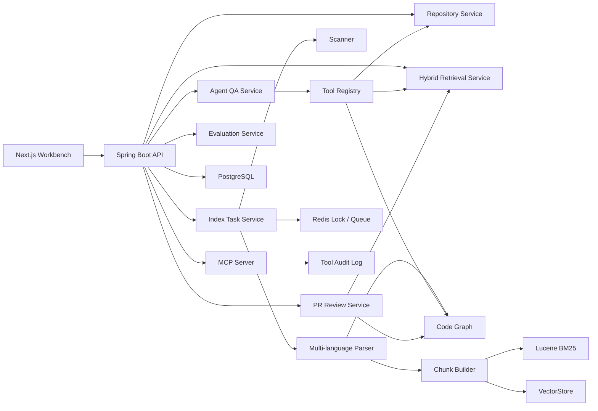

# RepoLens-Java V1 分阶段执行计划书

## 1. 文档信息

| 字段 | 内容 |
| --- | --- |
| 项目名称 | RepoLens-Java |
| V1 推荐简历名称 | RepoLens：基于 Spring AI 与 MCP 的仓库级 Code Agent 平台 |
| 文档类型 | V1 分阶段执行计划书 |
| 创建日期 | 2026-06-28 |
| 前置版本 | V0：Java 后端最小闭环 |
| 关联文档 | `docs/repolens-java-requirements-outline-design.md`、`docs/repolens-java-development-roadmap.md`、`docs/repolens-java-v0-execution-plan.md`、`docs/repolens-java-v0-design-and-worklog.md` |

## 2. V1 定位

V1 是 RepoLens-Java 面向简历和面试的主版本，不再只是证明 Java 后端可行，而是要形成一个完整、可演示、可追问的全栈项目：

```text
仓库导入
  -> 异步索引
  -> 多语言解析
  -> 代码图谱
  -> BM25 + Vector + Graph 混合检索
  -> Spring AI Tool Calling
  -> 仓库问答
  -> PR/MR Review
  -> MCP Tool Server
  -> Agent Trace
  -> Evaluation Dashboard
```

V1 的核心价值不是“接了一个大模型接口”，而是把代码理解、检索增强、工具调用、权限审计、评测闭环做成工程系统。面试时可以围绕 Spring Boot 后端架构、索引任务状态机、混合检索、Agent 工具编排、MCP 协议、前端工作台、评测体系展开。

## 3. 和 V0 的关系

V1 在 V0 基础上增量升级，不重新开新项目。

| 维度 | V0 | V1 |
| --- | --- | --- |
| 后端目录 | `backend-java/` | 继续使用 `backend-java/`，新增模块和 migration |
| 前端目录 | `frontend/` | 继续使用 `frontend/`，扩展 Ask、Review、MCP、Eval 工作台 |
| 旧 Python 后端 | 可保留为参考和历史实现 | 不作为 V1 主链路，不让 Java 只做网关 |
| 检索能力 | Lucene BM25 | BM25 + Vector + Code Graph 混合召回 |
| 代码理解 | Java 基础解析 | Java 深度解析 + Python/TypeScript 基础解析 + relation |
| AI 能力 | 不接 LLM | Spring AI ChatClient、Tool Calling、Verifier |
| 协议能力 | 无 MCP | MCP tools/list、tools/call、权限审计 |
| 演示能力 | 导入仓库和搜索证据 | 仓库问答、PR Review、Trace、Eval、MCP 审计 |

开发时不新建 `RepoLens-Java-V1` 目录。推荐只新增这些内容：

- `backend-java/src/main/java/.../indexing`
- `backend-java/src/main/java/.../parser`
- `backend-java/src/main/java/.../graph`
- `backend-java/src/main/java/.../retrieval`
- `backend-java/src/main/java/.../agent`
- `backend-java/src/main/java/.../review`
- `backend-java/src/main/java/.../mcp`
- `backend-java/src/main/java/.../evaluation`
- `backend-java/src/main/resources/db/migration`
- `frontend/app` 或既有前端页面中的 V1 工作台组件
- `docs/repolens-java-v1-design-and-worklog.md`，执行 V1 时再创建，用来记录每个子阶段详细设计和完成记录

## 4. V1 范围

### 4.1 必做范围

- 异步索引任务状态机、进度追踪、失败重试。
- Java 深度解析，Python/TypeScript 基础解析。
- 代码符号表和关系图谱：class、method、function、import、call、route、dependency。
- Lucene BM25 + Spring AI Embedding + VectorStore 的混合检索。
- 图谱信号参与 rerank 或 evidence 扩展。
- Spring AI ChatClient + Tool Calling 的仓库问答。
- Agent Trace：Planner、Retriever、Tool Call、Verifier、Final Answer。
- PR/MR diff review：风险点、影响范围、测试建议、证据引用。
- MCP Server：暴露只读工具，并记录权限审计。
- Evaluation Dashboard：Hit@K、MRR、Citation Coverage、Latency、Tool Success Rate。
- V1 demo runbook、截图、简历 bullet 和面试讲稿素材。

### 4.2 暂缓范围

- 自动修改代码、提交 commit、push、merge。
- 多用户团队权限体系。
- 在线 GitHub/GitLab OAuth 登录。
- 大规模分布式索引。
- LLM 自动打分作为唯一评测结论。
- 生产级费用控制和租户隔离。

这些可以作为 V1.1 或 V2 的扩展，不影响 V1 作为简历重点项目。

## 5. 最终产品原型

V1 首屏应该是工作台，不是介绍页。

```text
┌──────────────────────────────────────────────────────────────────────┐
│ RepoLens-Java Workbench                                              │
├───────────────┬──────────────────────────────────┬───────────────────┤
│ Repository    │ Workspace                        │ Evidence / Trace  │
│               │                                  │                   │
│ Import Local  │ [Ask] [Review] [MCP] [Eval]      │ Evidence          │
│ java-demo     │                                  │ - file:line       │
│ backend-java  │ Ask: Where is JWT verified?      │ - symbol          │
│               │                                  │ - score/source    │
│ Status        │ Answer with citations            │                   │
│ READY         │                                  │ Agent Trace       │
│ files: 382    │ Review report                    │ - planner         │
│ chunks: 945   │ - risk                           │ - retriever       │
│ symbols: 620  │ - impact                         │ - tool calls      │
│ edges: 1,840  │ - tests                          │ - verifier        │
├───────────────┴──────────────────────────────────┴───────────────────┤
│ Evaluation: bm25 | vector | bm25+vector | bm25+vector+graph          │
│ Hit@5 / MRR / Citation Coverage / Latency / Tool Success             │
└──────────────────────────────────────────────────────────────────────┘
```

V1 需要准备一条 5 分钟稳定 demo：

1. 导入一个 Spring Boot demo 仓库。
2. 展示异步索引阶段变化和最终统计。
3. 提问“登录鉴权逻辑在哪里实现，涉及哪些 Controller 和 Service？”
4. 展示回答、证据、代码行、方法名和 Agent Trace。
5. 粘贴一段 diff，生成 PR Review 报告。
6. 展示 MCP 工具调用审计。
7. 运行 evaluation，对比 BM25、Vector、Hybrid、Hybrid+Graph 指标。

## 6. V1 技术架构



### 6.1 后端模块规划

| 模块 | 职责 | V1 重点 |
| --- | --- | --- |
| repository | 仓库元数据、路径校验、文件读取 | workspace guard、敏感文件过滤 |
| indexing | 异步任务、状态机、重试、进度 | Redis lock、task events |
| parser | 多语言解析、符号提取 | Java 深度，Python/TS 基础 |
| graph | 符号关系、调用关系、路由关系 | relation query、impact expansion |
| retrieval | BM25、Vector、Graph hybrid | score merge、rerank、evidence |
| agent | 问答、工具调用、trace、verifier | Spring AI ChatClient |
| review | diff 解析、风险识别、测试建议 | changed symbol mapping |
| mcp | MCP 工具暴露、权限控制 | read-only tools、audit |
| evaluation | 数据集、指标、对比实验 | Hit@K、MRR、Citation Coverage |
| observability | 日志、metrics、trace export | 面试可解释性 |

### 6.2 前端模块规划

| 页面/组件 | 职责 |
| --- | --- |
| Repository Sidebar | 仓库列表、导入、索引状态、统计信息 |
| Ask Workspace | 问题输入、答案展示、引用跳转 |
| Review Workspace | diff 输入、风险报告、测试建议、Markdown 导出 |
| Evidence Panel | evidence 列表、文件路径、行号、score、source |
| Trace Panel | Agent step、tool call、耗时、输入输出摘要 |
| MCP Panel | tools/list、tools/call 结果、权限和审计记录 |
| Evaluation Panel | 指标对比、运行历史、样本级错误分析 |

### 6.3 存储规划

如果 V0 已经存在同名或近似表，V1 只做兼容性 migration，不破坏已有数据。

| 表/集合 | 用途 |
| --- | --- |
| repositories | 仓库元信息和索引状态 |
| repository_files | 文件路径、语言、hash、跳过原因 |
| code_chunks | chunk 文本、行号、symbol、token 统计 |
| code_symbols | class、method、function、route、field |
| code_relations | import、call、implements、extends、route_to_method |
| index_tasks | 异步索引任务主表 |
| index_task_events | 阶段事件、错误、耗时 |
| vector_chunks | chunk 与 embedding/vector id 映射 |
| agent_sessions | 问答会话 |
| agent_runs | 单次 Agent 执行 |
| agent_steps | planner、retriever、tool、verifier 步骤 |
| tool_call_logs | 工具调用、耗时、结果摘要 |
| review_requests | PR/MR review 请求 |
| review_findings | 风险点、严重级别、证据 |
| mcp_audit_logs | MCP 工具调用审计 |
| eval_runs | 评测运行记录 |
| eval_results | 样本级评测结果 |

## 7. 总体排期

V1 推荐按 6-8 周稳态开发；如果每天投入时间较多，可以压缩到 4-6 周。

| 阶段 | 建议周期 | 主要交付 | 是否可单独演示 |
| --- | --- | --- | --- |
| V1-P0 | 2-3 天 | V0 基线固化、V1 详细设计模板、配置准备 | 是 |
| V1-P1 | 4-5 天 | 异步索引任务和状态机 | 是 |
| V1-P2 | 6-8 天 | 多语言解析和代码图谱 | 是 |
| V1-P3 | 5-7 天 | 向量检索和混合召回 | 是 |
| V1-P4 | 6-8 天 | Agent QA 和 Trace | 是 |
| V1-P5 | 5-7 天 | PR/MR Review | 是 |
| V1-P6 | 4-6 天 | MCP Server 和审计 | 是 |
| V1-P7 | 4-6 天 | 评测、前端打磨、发布包装 | 是 |

## 8. V1-P0：基线固化与工程准备

### 8.1 目标

让 V0 成为 V1 的稳定地基，避免后续一边扩功能一边修工程骨架。

### 8.2 后端任务

| 编号 | 工作项 | 说明 | 产出 |
| --- | --- | --- | --- |
| P0-BE-01 | 梳理 V0 API | 确认 repository、search、evidence API 返回结构 | API compatibility note |
| P0-BE-02 | 配置 profile | `local`、`test`、`demo` 三套 profile | application 配置 |
| P0-BE-03 | 数据库策略 | 确认 V1 使用 PostgreSQL，测试可继续 H2/Testcontainers | migration 约定 |
| P0-BE-04 | 模块包结构 | 按 indexing/parser/graph/retrieval/agent/review/mcp/evaluation 分包 | package skeleton |
| P0-BE-05 | Error Model | 统一错误码、错误响应、trace id | ErrorResponse |
| P0-BE-06 | Test Strategy | 单测、slice test、integration test、smoke test 分层 | test checklist |

### 8.3 前端任务

| 编号 | 工作项 | 说明 | 产出 |
| --- | --- | --- | --- |
| P0-FE-01 | 工作台信息架构 | 确认 Ask/Review/MCP/Eval tabs | 页面草图 |
| P0-FE-02 | API Client 整理 | 抽出 repository/search/index task client | API client |
| P0-FE-03 | 状态组件基线 | 统一 loading/error/empty 状态 | UI state primitives |

### 8.4 文档任务

- 新建 `docs/repolens-java-v1-design-and-worklog.md`。
- 每个子阶段执行前，在该文档补一节轻量详细设计。
- 每个子阶段结束后，记录实现文件、测试命令、已知限制。

### 8.5 验收标准

- V0 后端测试全部通过。
- V0 前端 build 通过。
- 本地 Java 21 启动方式稳定。
- V1 模块目录和 migration 规则明确。
- 有 V1 worklog 模板。

### 8.6 可降级策略

如果时间紧，P0 不做复杂重构，只完成 profile、worklog 模板、V0 测试确认。

## 9. V1-P1：异步索引任务与状态机

### 9.1 目标

把 V0 的同步仓库导入升级成可观测、可重试、可恢复的异步索引流水线。

### 9.2 状态机设计

```text
CREATED
  -> VALIDATING
  -> SCANNING
  -> PARSING
  -> CHUNKING
  -> BM25_INDEXING
  -> VECTOR_INDEXING
  -> GRAPH_BUILDING
  -> READY

FAILED 可从失败阶段 retry。
CANCELLED 只在任务未进入写索引关键区时允许。
```

### 9.3 后端任务

| 编号 | 工作项 | 说明 | 产出 |
| --- | --- | --- | --- |
| P1-BE-01 | `index_tasks` migration | 记录 repo_id、status、current_stage、progress、last_error、started_at、finished_at | Flyway migration |
| P1-BE-02 | `index_task_events` migration | 记录阶段事件、耗时、错误摘要 | Flyway migration |
| P1-BE-03 | IndexTaskService | 创建任务、查询任务、重试任务、取消任务 | service + tests |
| P1-BE-04 | IndexPipeline | scanner/parser/chunk/index 以阶段方式执行 | pipeline |
| P1-BE-05 | Redis Lock | 同一 repo 同一时间只允许一个 active task | lock adapter |
| P1-BE-06 | Retry Policy | 失败后从安全阶段重新执行，清理临时索引 | retry implementation |
| P1-BE-07 | Progress Event | 每阶段写入 event，暴露耗时和数量 | event store |
| P1-BE-08 | API | `POST /repositories/{id}/index`、`GET /index-tasks/{id}`、`POST /index-tasks/{id}/retry` | controller |

### 9.4 前端任务

| 编号 | 工作项 | 说明 | 产出 |
| --- | --- | --- | --- |
| P1-FE-01 | Index Status Panel | 展示状态、阶段、进度、耗时 | sidebar/status card |
| P1-FE-02 | Polling | 任务运行中轮询，READY/FAILED 停止 | hook |
| P1-FE-03 | Retry UI | 失败后展示错误原因和重试按钮 | retry action |
| P1-FE-04 | Event Timeline | 展示 SCANNING/PARSING 等阶段事件 | timeline |

### 9.5 测试任务

- 单测：状态流转、非法状态保护、retry 策略。
- 集成测试：PostgreSQL/Testcontainers + Redis/Testcontainers。
- API 测试：创建任务、查询任务、失败重试。
- 前端 smoke：导入仓库后能看到阶段变化。

### 9.6 验收标准

- 导入仓库后 API 立即返回 task id。
- 前端可以看到索引阶段从 SCANNING 到 READY 的变化。
- 同一仓库重复点击索引不会产生两个并发 active task。
- 人为制造 parser 异常后，任务进入 FAILED 并记录 last_error。
- retry 后可以重新执行并进入 READY。

### 9.7 简历表达点

实现基于 Spring Boot、Redis Lock 和任务事件表的仓库索引状态机，支持异步执行、失败重试、进度追踪和前端可观测。

## 10. V1-P2：多语言解析与代码图谱

### 10.1 目标

从“按文本切 chunk”升级为“理解仓库结构”，为混合检索、问答和 PR Review 提供符号级证据。

### 10.2 语言范围

| 语言 | V1 要求 | 说明 |
| --- | --- | --- |
| Java | 深度解析 | package、import、class、interface、enum、method、annotation、Spring route、bean relation |
| Python | 基础解析 | import、class、function、decorator、call name |
| TypeScript/JavaScript | 基础解析 | import/export、class、function、method、React component、API route 候选 |

### 10.3 后端任务

| 编号 | 工作项 | 说明 | 产出 |
| --- | --- | --- | --- |
| P2-BE-01 | Parser SPI | 定义 `LanguageParser` 接口，按语言分发 | parser abstraction |
| P2-BE-02 | Java Parser 增强 | 提取 Spring 注解、HTTP method、route path、bean role | Java parser |
| P2-BE-03 | Python Parser | 提取 class/function/import/decorator | Python parser |
| P2-BE-04 | TS/JS Parser | 提取 import/export/function/class/component | TS parser |
| P2-BE-05 | Symbol Model | 统一 Symbol DTO/entity | `code_symbols` |
| P2-BE-06 | Relation Model | import、call、extends、implements、route_to_method | `code_relations` |
| P2-BE-07 | Graph Builder | 从 parser 输出构建 relation | graph builder |
| P2-BE-08 | Graph Query API | 查询 symbol、调用关系、route 关系、影响范围 | graph controller |
| P2-BE-09 | Parser Diagnostics | 记录解析失败文件和失败原因 | diagnostics API |

### 10.4 前端任务

| 编号 | 工作项 | 说明 | 产出 |
| --- | --- | --- | --- |
| P2-FE-01 | Symbol Statistics | 展示 symbols、relations、routes 数量 | repo stats |
| P2-FE-02 | Symbol Search | 输入方法/类名可查 symbol | search mode |
| P2-FE-03 | Impact Preview | 点击 symbol 展示 related symbols | right panel |
| P2-FE-04 | Parser Diagnostics | 展示解析失败文件列表 | diagnostics drawer |

### 10.5 测试任务

- 用小型 Java fixture 覆盖 Controller、Service、Repository、annotation、nested class。
- 用 Python fixture 覆盖 class、function、decorator、relative import。
- 用 TypeScript fixture 覆盖 export function、class method、React component、API handler。
- 图谱测试覆盖 route_to_method、method_call、import_dependency。

### 10.6 验收标准

- Java Spring Boot demo 中 Controller route 识别准确。
- symbol 可从 API 查询，并能定位到文件和行号。
- relation 能支持“某 Controller 调用了哪些 Service 方法”的查询。
- 前端能展示 symbol/relation 统计和基础 impact preview。

### 10.7 可降级策略

如果多语言解析库接入成本过高，V1 保证 Java 深度解析；Python/TS 先用结构化正则或轻量 parser 做基础 symbol，不影响主线。

### 10.8 简历表达点

设计多语言 Parser SPI 和代码图谱模型，支持 Java Spring 语义解析、跨文件符号关系构建和变更影响分析。

## 11. V1-P3：向量检索与混合召回

### 11.1 目标

把 V0 的 BM25 检索升级为面向代码问答的混合检索体系：

```text
BM25 lexical recall
  + Vector semantic recall
  + Graph neighborhood expansion
  + Score merge / rerank
  -> cited evidence
```

### 11.2 检索策略

| 策略 | 用途 |
| --- | --- |
| BM25 | 精确命中方法名、类名、配置 key、API path |
| Vector | 语义问题，例如“鉴权在哪里做”“订单状态如何流转” |
| Graph | 从命中 symbol 扩展调用方、被调用方、route、test |
| Hybrid | 合并多路召回，去重，归一化，按 evidence quality 排序 |

### 11.3 后端任务

| 编号 | 工作项 | 说明 | 产出 |
| --- | --- | --- | --- |
| P3-BE-01 | EmbeddingProvider | 封装 Spring AI EmbeddingModel，支持 mock/local/remote profile | provider adapter |
| P3-BE-02 | VectorStore Adapter | 优先 Qdrant 或 PGvector，保留 mock vector store 测试实现 | vector adapter |
| P3-BE-03 | Embedding Job | 索引时为 chunk 生成 embedding，记录 vector id | job |
| P3-BE-04 | Hybrid Search API | `mode=bm25/vector/hybrid/hybrid_graph` | API |
| P3-BE-05 | Score Normalizer | BM25/vector 分数归一化 | score merge |
| P3-BE-06 | Dedup | 按 chunk id、symbol、line range 去重 | dedup logic |
| P3-BE-07 | Graph Expansion | top evidence 周边 relation 扩展 | graph expansion |
| P3-BE-08 | Evidence Builder | 返回 path、line、symbol、score、source、snippet | evidence model |
| P3-BE-09 | Retrieval Trace | 记录每路召回数量、耗时、topK | retrieval trace |

### 11.4 前端任务

| 编号 | 工作项 | 说明 | 产出 |
| --- | --- | --- | --- |
| P3-FE-01 | Search Mode Switch | BM25/Vector/Hybrid/Hybrid+Graph 切换 | segmented control |
| P3-FE-02 | Evidence Source Badge | 标注 bm25/vector/graph/rerank | evidence badges |
| P3-FE-03 | Retrieval Trace View | 展示各路召回数量和耗时 | trace panel |
| P3-FE-04 | Error State | embedding provider 未配置时给出可读提示 | config error UI |

### 11.5 测试任务

- 使用 mock embedding 保证 CI 不依赖外部模型。
- 检索单测覆盖 score merge、dedup、graph expansion。
- 评测 fixture 覆盖关键词型、语义型、跨文件调用型问题。
- 性能 smoke：中小仓库 topK 查询在可接受时间内返回。

### 11.6 验收标准

- 同一个问题可以切换不同检索模式并看到不同 evidence source。
- Hybrid 模式能同时返回 BM25 和 Vector evidence。
- Hybrid+Graph 模式能补充调用关系或 route 相关 evidence。
- 无外部 embedding key 时，测试环境仍可用 mock provider 跑通。

### 11.7 简历表达点

构建 BM25、向量语义检索和代码图谱扩展的混合召回体系，并通过 retrieval trace 和离线评测验证检索效果。

## 12. V1-P4：Agent QA 与 Trace

### 12.1 目标

实现真正的仓库级代码问答。Agent 不能只把检索结果拼给模型，而要具备工具调用、证据约束、引用校验和可观测 trace。

### 12.2 Agent 流程

```text
User Question
  -> Planner: 判断问题类型和需要的工具
  -> Retriever Tool: hybrid search
  -> Code Read Tool: 读取关键文件片段
  -> Graph Tool: 查询调用链/影响范围
  -> Verifier: 检查回答是否引用真实 evidence
  -> Final Answer with citations
```

### 12.3 后端任务

| 编号 | 工作项 | 说明 | 产出 |
| --- | --- | --- | --- |
| P4-BE-01 | Tool Registry | 注册 `code.search`、`code.read`、`symbol.find`、`graph.neighbors` | tool registry |
| P4-BE-02 | Spring AI ChatClient | 封装模型调用，支持 mock profile | chat adapter |
| P4-BE-03 | Agent Planner | 根据问题选择检索模式和工具 | planner |
| P4-BE-04 | Tool Calling | 模型或规则驱动工具调用 | tool execution |
| P4-BE-05 | Answer Composer | 生成中文/英文回答，强制引用 evidence | composer |
| P4-BE-06 | Citation Verifier | 校验回答中的引用是否存在于 evidence | verifier |
| P4-BE-07 | Agent Trace Store | agent_runs、agent_steps、tool_call_logs | persistence |
| P4-BE-08 | Ask API | `POST /ask`、`GET /agent-runs/{id}` | controller |
| P4-BE-09 | Prompt Injection Guard | 对仓库内容中的提示注入做隔离说明和只读约束 | guard |

### 12.4 前端任务

| 编号 | 工作项 | 说明 | 产出 |
| --- | --- | --- | --- |
| P4-FE-01 | Ask Tab | 问题输入、运行按钮、answer view | Ask UI |
| P4-FE-02 | Citation Links | 点击引用定位 evidence | citation UI |
| P4-FE-03 | Agent Trace Panel | 展示 planner、tool call、verifier | trace UI |
| P4-FE-04 | Model Config Warning | 未配置模型时提示使用 mock mode | config UI |

### 12.5 测试任务

- Tool unit tests：search/read/symbol/graph 工具输入输出。
- Agent service tests：mock ChatClient 下验证调用流程。
- Verifier tests：引用不存在时拒绝或标记低可信。
- API tests：ask 返回 answer、evidence、trace id。

### 12.6 验收标准

- 可以问“某接口从 Controller 到 Service 的调用链是什么？”
- 回答必须带文件路径和行号引用。
- Trace 中能看到工具调用顺序、耗时和结果摘要。
- 当 evidence 不足时，回答明确说明不确定，不能编造。

### 12.7 简历表达点

基于 Spring AI 实现仓库级代码问答 Agent，设计工具注册、检索增强、引用校验和可追踪执行链路，降低模型幻觉。

## 13. V1-P5：PR/MR Diff Review

### 13.1 目标

实现面向代码审查场景的 Agent 能力：用户粘贴 diff 或选择 fixture，系统输出风险点、影响范围、测试建议和证据引用。

### 13.2 Review 流程

```text
Diff Input
  -> Diff Parser
  -> Changed File / Hunk / Symbol Mapping
  -> Related Evidence Retrieval
  -> Impact Analysis
  -> Risk Finding Generation
  -> Test Suggestion
  -> Markdown Report
```

### 13.3 后端任务

| 编号 | 工作项 | 说明 | 产出 |
| --- | --- | --- | --- |
| P5-BE-01 | Diff Parser | 解析 unified diff，提取文件、hunk、增删行 | parser |
| P5-BE-02 | Changed Symbol Mapper | 将变更行映射到 method/class/function | mapper |
| P5-BE-03 | Related Context Retriever | 检索调用方、被调用方、测试、配置 | retriever |
| P5-BE-04 | Risk Rule Layer | 空指针、鉴权绕过、事务边界、兼容性、配置变更等规则 | rule checks |
| P5-BE-05 | Review Agent | 综合 diff、规则、evidence 生成 findings | agent |
| P5-BE-06 | Test Suggestion | 输出单测、集成测试、回归测试建议 | test suggester |
| P5-BE-07 | Review Persistence | 保存 request、findings、evidence | review tables |
| P5-BE-08 | Review API | `POST /reviews`、`GET /reviews/{id}`、`GET /reviews/{id}/markdown` | controller |

### 13.4 前端任务

| 编号 | 工作项 | 说明 | 产出 |
| --- | --- | --- | --- |
| P5-FE-01 | Review Tab | diff textarea、fixture selector、run button | Review UI |
| P5-FE-02 | Findings View | severity、title、explanation、evidence | findings list |
| P5-FE-03 | Impact View | changed symbols、related symbols、tests | impact panel |
| P5-FE-04 | Markdown Export | 一键复制/下载 review report | export action |

### 13.5 测试任务

- Diff parser 单测覆盖新增文件、删除文件、重命名、多个 hunk。
- Changed symbol mapper 测试覆盖 Java 方法内变更、类注解变更。
- Rule layer 测试覆盖鉴权、配置、事务、异常处理。
- Review API 使用 fixture 跑出稳定结果。

### 13.6 验收标准

- 粘贴 diff 后可以生成 review findings。
- 每个高风险 finding 至少有一个 evidence。
- 报告包含影响范围和测试建议。
- Markdown export 可直接放进 README 或面试材料。

### 13.7 可降级策略

如果模型输出不稳定，先用规则层和模板生成 review，再把 LLM 用于解释和排序。这样 demo 稳定性更高。

### 13.8 简历表达点

实现基于 diff 解析、符号映射、代码图谱和检索增强的 PR Review Agent，能输出风险解释、影响范围和测试建议。

## 14. V1-P6：MCP Server 与权限审计

### 14.1 目标

把 RepoLens 的检索和代码读取能力暴露为 MCP 只读工具，让项目具备新的协议价值和平台扩展性。

### 14.2 MCP 工具范围

| Tool | 输入 | 输出 | 权限 |
| --- | --- | --- | --- |
| `repolens.search` | repo_id、query、mode、top_k | evidence list | read |
| `repolens.read_file` | repo_id、path、start_line、end_line | snippet | read |
| `repolens.find_symbol` | repo_id、symbol_query | symbols | read |
| `repolens.graph_neighbors` | repo_id、symbol_id、depth | related symbols | read |
| `repolens.review_diff` | repo_id、diff | review summary | read/compute |
| `repolens.eval_run` | dataset、strategy | metrics | read/compute |

### 14.3 后端任务

| 编号 | 工作项 | 说明 | 产出 |
| --- | --- | --- | --- |
| P6-BE-01 | MCP Server Adapter | 使用 Java MCP SDK 或 Spring AI MCP 能力封装 | MCP endpoint |
| P6-BE-02 | Tool Schema | 为每个工具定义 name、description、input schema、output schema | schema |
| P6-BE-03 | Permission Guard | 路径越界、敏感文件、非只读操作拦截 | guard |
| P6-BE-04 | Audit Log | 记录 tool、参数摘要、repo、耗时、结果数量、状态 | `mcp_audit_logs` |
| P6-BE-05 | Rate/Size Limit | 限制文件读取行数、topK、diff 大小 | limits |
| P6-BE-06 | MCP Smoke Client | 写一个本地 smoke 测试客户端或脚本 | smoke test |
| P6-BE-07 | API Bridge | 前端可查询 MCP tools 和 audit logs | controller |

### 14.4 前端任务

| 编号 | 工作项 | 说明 | 产出 |
| --- | --- | --- | --- |
| P6-FE-01 | MCP Tools Panel | 展示工具名、描述、schema | tools list |
| P6-FE-02 | Tool Tryout | 在 UI 内用样例参数调用只读工具 | tryout |
| P6-FE-03 | Audit Log Panel | 展示 tool call 历史、状态、耗时 | audit table |
| P6-FE-04 | Permission Failure UI | 展示越权/敏感文件拦截原因 | error state |

### 14.5 测试任务

- Tool schema 快照测试。
- Path guard 测试：`../`、绝对路径、敏感文件、超大范围读取。
- MCP smoke：tools/list 能列出工具，tools/call 能调用 search/read。
- Audit 测试：成功和失败调用都入库。

### 14.6 验收标准

- MCP client 可以发现 RepoLens tools。
- 调用 `repolens.search` 能返回 evidence。
- 调用非法 path 会被拒绝并写审计。
- 前端能展示工具列表和审计记录。

### 14.7 简历表达点

实现面向 AI Agent 生态的 MCP 只读工具服务，将仓库检索、代码读取、符号查询和 Review 能力协议化，并加入权限控制和审计。

## 15. V1-P7：评测、前端打磨与发布包装

### 15.1 目标

让 V1 从“功能可跑”变成“简历可写、面试可讲、demo 可复现”的作品。

### 15.2 评测任务

| 编号 | 工作项 | 说明 | 产出 |
| --- | --- | --- | --- |
| P7-EVAL-01 | Dataset Schema | query、expected_files、expected_symbols、category | jsonl |
| P7-EVAL-02 | Demo Dataset | 30-50 条 Java/Spring 问题，覆盖路由、鉴权、事务、配置、测试 | dataset |
| P7-EVAL-03 | Strategy Runner | bm25、vector、hybrid、hybrid_graph 对比 | eval runner |
| P7-EVAL-04 | Metrics | Hit@1/3/5、MRR、Citation Coverage、Latency | metrics |
| P7-EVAL-05 | Error Analysis | 样本级失败原因：解析缺失、召回失败、rerank 错误 | report |

### 15.3 前端打磨任务

| 编号 | 工作项 | 说明 | 产出 |
| --- | --- | --- | --- |
| P7-FE-01 | Workbench Layout Polish | 三栏布局、tabs、空状态、错误状态 | polished UI |
| P7-FE-02 | Demo Fixtures | 内置示例问题、示例 diff、示例 eval dataset | demo controls |
| P7-FE-03 | Screenshot States | 准备 README 截图状态 | screenshots |
| P7-FE-04 | Responsiveness | 桌面优先，保证常见宽度不溢出 | responsive fix |

### 15.4 后端发布任务

| 编号 | 工作项 | 说明 | 产出 |
| --- | --- | --- | --- |
| P7-BE-01 | Demo Profile | 一键 demo 配置，mock LLM 可运行 | demo profile |
| P7-BE-02 | Seed Script | 导入 demo repo、跑索引、准备 eval | script |
| P7-BE-03 | Health Checks | DB、Redis、VectorStore、LLM provider 健康检查 | actuator/info |
| P7-BE-04 | API Docs | 关键 API 示例和响应结构 | docs |

### 15.5 文档与简历材料

| 编号 | 工作项 | 说明 | 产出 |
| --- | --- | --- | --- |
| P7-DOC-01 | V1 Demo Runbook | 从启动到演示的完整路径 | runbook |
| P7-DOC-02 | V1 Release Package | 架构图、功能图、截图、指标、已知限制 | release doc |
| P7-DOC-03 | Resume Bullets | Java 后端版、全栈版、Agent 版三种写法 | resume text |
| P7-DOC-04 | Interview Deep Dive | 可追问问题和回答提纲 | interview notes |

### 15.6 验收标准

- 一条命令或清晰步骤可以启动后端、前端和依赖。
- 5 分钟 demo 不依赖临场编造数据。
- Evaluation Dashboard 能展示不同策略指标差异。
- README 有 V1 架构图、截图、启动方式和能力清单。
- 简历 bullet 能体现 Java 21、Spring Boot、Spring AI、MCP、混合检索、评测闭环。

### 15.7 简历表达点

建立面向代码智能体的离线评测体系和可复现 demo，量化不同检索策略在仓库问答中的效果，并沉淀发布材料。

## 16. 跨阶段工程规范

### 16.1 API 规范

| 约定 | 要求 |
| --- | --- |
| 版本前缀 | 优先沿用 V0 现有 API 风格，新增能力可使用 `/api/v1/...` |
| 错误响应 | 统一 `code`、`message`、`traceId`、`details` |
| evidence | 必须包含 `filePath`、`startLine`、`endLine`、`snippet`、`score`、`source` |
| trace | 每个 ask/review 请求返回 `runId`，前端可查询详情 |
| 大字段 | LLM prompt、tool output 只存摘要或截断内容，避免数据库膨胀 |

### 16.2 安全规范

- 所有文件读取必须经过 workspace guard。
- 禁止读取 `.env`、私钥、token、证书、数据库 dump 等敏感文件。
- MCP 工具只读，V1 不提供写文件、执行命令、提交代码能力。
- Prompt 中明确仓库内容是不可信上下文，不能执行仓库内指令。
- 所有 tool call 写 audit log。
- 前端错误信息不暴露本机绝对敏感路径。

### 16.3 测试规范

| 层级 | 覆盖内容 |
| --- | --- |
| Unit Test | parser、chunk、score merge、diff parser、permission guard |
| Slice Test | controller、repository、service contract |
| Integration Test | PostgreSQL、Redis、VectorStore mock/Testcontainers |
| Agent Test | mock model 下验证工具调用链路和 citation verifier |
| Frontend Build | TypeScript、lint/build、关键组件 smoke |
| Demo Smoke | 启动、导入、Ask、Review、MCP、Eval 全链路 |

### 16.4 可观测性规范

- 索引阶段必须有 task event。
- 检索必须有 retrieval trace。
- Agent 必须有 agent step。
- MCP 必须有 audit log。
- Evaluation 必须保存 run 和 result。
- 关键耗时：scan、parse、chunk、bm25、embedding、vector search、graph expansion、LLM call。

## 17. 风险与降级路线

| 风险 | 影响 | 降级方案 |
| --- | --- | --- |
| 外部 LLM/Embedding 不稳定 | Ask/Review demo 失败 | mock provider + 预置 demo profile |
| VectorStore 安装复杂 | 本地环境成本高 | 先用 in-memory/mock vector store，V1 文档说明可替换 Qdrant/PGvector |
| MCP Java 生态变化 | 接入耗时 | 先封装内部 Tool API，再加 MCP adapter |
| Python/TS 解析精度不足 | 多语言亮点变弱 | 保 Java 深度，Python/TS 做基础 symbol |
| PR Review 输出不稳定 | 演示风险 | 规则层先出稳定 finding，LLM 负责解释 |
| 工程量过大 | V1 延期 | 优先完成 P1/P2/P3/P4/P7，P5/P6 可做轻量版 |

## 18. V1 最小可交付边界

如果时间不足，V1 最小主线必须保留：

1. 异步索引状态机。
2. Java 深度解析和代码图谱。
3. BM25 + Vector + Graph 混合检索。
4. Agent QA + evidence citation + trace。
5. Evaluation 对比。
6. 前端工作台完整展示。

可以压缩：

- PR Review 先支持粘贴 diff，不接真实 Git provider。
- MCP 先支持 2-3 个核心工具：search、read_file、find_symbol。
- Python/TS 先做基础解析。
- VectorStore 先用 mock/in-memory，后续换 Qdrant/PGvector。

## 19. 每阶段详细设计方式

V1 不建议为每个小任务都新建一个独立目录。推荐保留当前项目结构，只在 `docs/` 下维护一个 V1 执行日志：

```text
docs/repolens-java-v1-design-and-worklog.md
```

每个阶段开始前补充：

```text
## V1-Px 详细设计
- 背景
- 目标
- 数据模型
- API 设计
- 后端类/包计划
- 前端组件计划
- 测试计划
- 风险和降级
```

每个阶段结束后追加：

```text
## V1-Px 完成记录
- 实现文件
- 测试命令
- 验收结果
- 已知限制
- 下一阶段注意事项
```

这样既保留工程过程，又不会产生过多碎片文档。

## 20. V1 完成验收清单

| 类别 | 验收项 |
| --- | --- |
| 后端 | Spring Boot 服务可启动，核心 API 可用 |
| 数据 | repository、file、chunk、symbol、relation、trace、eval 数据完整 |
| 索引 | 异步状态机、进度、失败重试可用 |
| 检索 | BM25、Vector、Hybrid、Hybrid+Graph 可切换 |
| Agent | Ask 返回 answer、evidence、trace，且引用可校验 |
| Review | diff review 返回风险、影响范围、测试建议 |
| MCP | tools/list、tools/call、audit log 可演示 |
| 前端 | Workbench 能完整展示 Repository、Ask、Review、MCP、Eval |
| 评测 | 至少 30 条样本，能输出 Hit@K/MRR/Citation Coverage/Latency |
| 文档 | README、demo runbook、release package、简历 bullet 完成 |
| 面试 | 能讲清架构、检索、Agent、MCP、安全、评测和取舍 |

## 21. V1 简历表达预期

完成 V1 后，简历可以写成：

```text
RepoLens：基于 Spring AI 与 MCP 的仓库级 Code Agent 平台
- 基于 Java 21、Spring Boot 构建仓库级代码智能体后端，实现本地仓库异步索引、多语言解析、符号图谱、Lucene BM25 与向量检索的混合召回。
- 设计 Spring AI Tool Calling 工作流，封装 code.search、code.read、symbol.find、graph.neighbors 等只读工具，实现带 evidence citation 和 Agent Trace 的仓库问答。
- 实现 PR/MR Diff Review 能力，结合 diff 解析、变更符号映射、调用关系扩展和检索增强，输出风险点、影响范围和测试建议。
- 将核心检索和代码读取能力暴露为 MCP 只读工具，加入路径权限控制、敏感文件过滤和工具调用审计，提升 Agent 生态集成能力。
- 建立离线评测体系，对 BM25、Vector、Hybrid、Hybrid+Graph 策略进行 Hit@K、MRR、Citation Coverage 和 Latency 对比，支撑效果迭代。
```

## 22. 执行顺序建议

实际执行时按下面顺序推进：

1. 先做 P0，确认 V0 稳定。
2. P1 和 P2 是 V1 地基，不能跳。
3. P3 做完后，项目开始有“新度”和技术深度。
4. P4 做完后，可以作为 Agent 项目演示。
5. P5 和 P6 是简历差异化亮点，至少做轻量版。
6. P7 是投简历前必须做的包装阶段，不要省略。

最推荐的投递节点是：P1-P4-P7 完成后可以开始投递；P5/P6 完成后更新简历为最终 V1。
