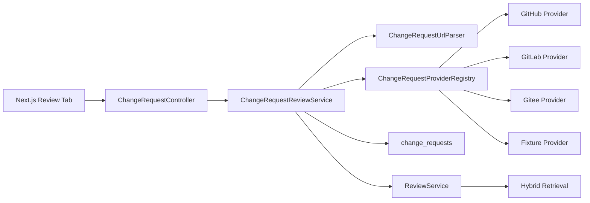

# RepoLens-Java V1.1 共用详细设计

## 1. 背景

V1 已经完成 pasted diff Review。V1.1 需要把用户输入从“手动粘贴 diff”扩展为“输入真实 PR/MR URL”，但 Review 本身继续复用 V1 的 `ReviewService`，避免两套审查逻辑分叉。

## 2. 设计目标

- 支持 GitHub Pull Request、GitLab Merge Request、Gitee Pull Request 的 URL 解析。
- 建立平台无关的 Change Request Provider SPI。
- 只读拉取 metadata、changed files、commit count 和 unified diff。
- 保存 change request metadata，并关联生成的 review task。
- 前端在 Review Tab 中提供 Diff / PR URL 两种模式。
- 默认测试和 demo 可使用 fixture/fake provider，避免依赖外网和 token。

## 3. 非目标

- 不评论 PR/MR。
- 不 approve/request changes。
- 不 merge/close/reopen。
- 不 push commit。
- 不存储平台 token。
- 不把 PR/MR Provider 做成通用代码托管平台 SDK。

## 4. 后端架构



## 5. 数据模型

新增表 `change_requests`：

| 字段 | 说明 |
| --- | --- |
| id | 内部 id |
| repository_id | RepoLens repository id |
| review_task_id | 关联的 V1 review task |
| platform | github / gitlab / gitee / fixture |
| change_type | pull_request / merge_request |
| owner_name | owner/group |
| repository_name | 平台仓库名 |
| change_number | PR number 或 MR iid |
| url | 原始 URL |
| title | 标题 |
| author | 作者 |
| source_branch | 源分支 |
| target_branch | 目标分支 |
| state | 状态 |
| changed_file_count | 变更文件数 |
| addition_count | 新增行数 |
| deletion_count | 删除行数 |
| commit_count | commit 数 |
| provider_status | fetched / reviewed / failed |
| metadata_json | 脱敏 metadata |
| diff_hash | diff SHA-256 |
| error_message | 错误摘要 |
| created_at / updated_at | 时间 |

## 6. API 设计

### 创建 URL Review

```http
POST /api/repositories/{repositoryId}/change-requests/reviews
```

请求：

```json
{
  "url": "https://github.com/org/repo/pull/123",
  "top_k": 8,
  "use_bm25": true,
  "use_vector": true,
  "use_graph": true,
  "run_static_check": true
}
```

响应：

```json
{
  "change_request": {},
  "review": {}
}
```

### 查询 Change Request

```http
GET /api/change-requests/{id}
GET /api/change-requests/tasks/{taskId}
```

## 7. Provider SPI

```text
ChangeRequestProvider
  supports(ref)
  fetch(ref)
```

Provider 返回 `FetchedChangeRequest`，包含：

- metadata
- changed files
- commit count
- unified diff
- provider warnings

## 8. 安全设计

- token 只从 `repolens.change-request.*.token` 或环境变量进入配置。
- token 不写入 `change_requests.metadata_json`。
- token 不出现在错误响应、日志、trace、markdown。
- Provider 输出统一经过 `SensitiveTextRedactor`。
- 限制 URL 长度和 diff 最大字符数。
- 默认只允许 http/https URL。
- 所有外部调用设置超时。

## 9. 前端设计

Review Tab 增加模式切换：

```text
[Diff] [PR/MR URL]
```

URL 模式展示：

- URL input
- Run URL Review
- change request metadata
- review summary
- risks / suggested tests / citations / tool calls / traces

## 10. 测试策略

- URL parser unit test。
- Provider registry unit test。
- Fixture provider API integration test。
- Token redaction test。
- Review URL API integration test。
- Frontend TypeScript build。

## 11. 降级策略

如果外网不可用：

- 默认 demo 使用 `fixture://github/repolens-java/1`。
- 真实 GitHub/GitLab/Gitee Provider 保留实现和配置，live smoke 放到 runbook。

如果平台 API 限流：

- 返回 provider error，不进入 Review。
- 前端展示可读错误。

## 12. 版本边界

V1.1 只补真实平台可信度，不做 V2 的生产化能力：

- 不做多用户 OAuth。
- 不做 webhook。
- 不做异步平台同步任务。
- 不做 PR 评论写回。
- 不做企业级 rate limit 池。
