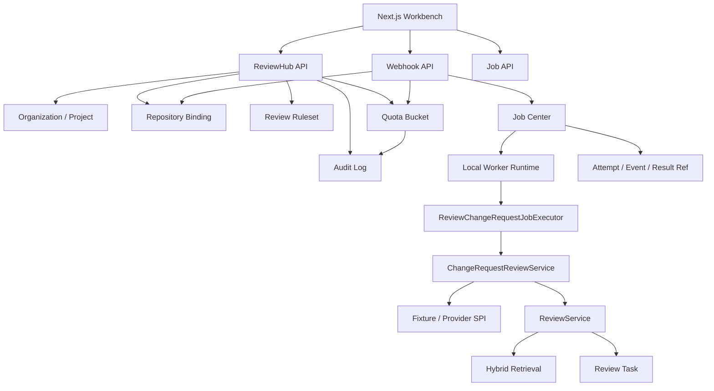

# RepoLens-Java V2-Lite Release Package

## 1. Positioning

RepoLens-Java V2-Lite extends the Java Edition from a code intelligence workbench into a backend-heavy ReviewHub system.

It combines:

- Java 21 + Spring Boot full-stack implementation.
- Local-first repository intelligence: import, parse, retrieval, QA, Review, MCP-style tools, evaluation.
- Distributed-task-style Job Center with attempts, events, retry, dead letter, idempotency, locks, rate limiting, and worker snapshots.
- ReviewHub business domain: organization, project, repository binding, review rulesets, quota buckets, audit logs.
- Webhook-driven asynchronous PR/MR review pipeline.
- Next.js workbench with V2-Lite tab for the business workflow.

This version is suitable as a resume centerpiece for Java backend or Java full-stack roles because it shows both AI/code-intelligence depth and traditional backend system depth.

## 2. Architecture



## 3. Capability Map

| Area | Capability |
| --- | --- |
| Job Center | `analysis_jobs`, attempts, events, dead letter, retry/cancel/list/detail APIs |
| Worker Runtime | local dispatcher, executor registry, worker snapshot, retry handling |
| Concurrency | lock, idempotency, rate limit, status cache abstraction |
| ReviewHub | organization, project, binding, ruleset, quota, audit |
| Webhook | fixture webhook, provider/external repo resolution, project quota, idempotent async job |
| Review | V1.1 Change Request Provider and Review pipeline reuse |
| Frontend | V2-Lite tab with setup, webhook trigger, job detail, quota, audit, worker view |
| Observability | Actuator, job events, worker snapshots, quota, audit logs |

## 4. Main APIs

| Method | Path |
| --- | --- |
| POST | `/api/jobs` |
| GET | `/api/jobs` |
| GET | `/api/jobs/{jobId}` |
| GET | `/api/jobs/{jobId}/events` |
| POST | `/api/jobs/{jobId}/retry` |
| POST | `/api/jobs/{jobId}/cancel` |
| GET | `/api/workers` |
| POST | `/api/organizations` |
| GET | `/api/organizations` |
| POST | `/api/organizations/{organizationId}/projects` |
| GET | `/api/organizations/{organizationId}/projects` |
| POST | `/api/projects/{projectId}/repositories/{repositoryId}/bind` |
| GET | `/api/projects/{projectId}/repositories` |
| POST | `/api/projects/{projectId}/rulesets` |
| GET | `/api/projects/{projectId}/rulesets` |
| GET | `/api/projects/{projectId}/quota` |
| GET | `/api/audit-logs` |
| POST | `/api/webhooks/{provider}` |

## 5. Resume Bullets

```text
RepoLens-Java V2-Lite：面向代码评审平台的 Java 全栈系统
- 基于 Java 21、Spring Boot、JPA/Flyway 和 Next.js 构建仓库级 Code Agent 工作台，支持仓库导入、混合检索、PR/MR Review、MCP-style 工具调用和评测。
- 设计并实现 Job Center：任务状态机、attempt/event/dead-letter、幂等创建、retry/cancel、worker snapshot，并通过 executor registry 承载索引、diff review、change request review 等异步任务。
- 抽象 Redis 语义的锁、幂等、限流、状态缓存，本地实现保证离线可测，后续可替换为 Redis/RabbitMQ 生产适配器。
- 新增 ReviewHub 业务域，建模 organization、project、repository binding、ruleset、quota bucket、audit log，支撑多租户项目治理、Webhook 入站配额和审计追踪。
- 实现 Webhook 驱动的异步 PR/MR Review 链路：provider + external_repo_id 解析仓库绑定，消费项目配额，按幂等键创建 REVIEW_CHANGE_REQUEST job，复用 ChangeRequestReviewService 生成 review task 和 change request metadata。
- 使用 Next.js 增加 V2-Lite 工作台，串联 ReviewHub 配置、Webhook fixture 触发、Job 事件流、Quota/Audit/Worker 可观测视图，形成可演示的全栈闭环。
```

## 6. Interview Talk Track

核心讲法：

```text
这个版本不是单纯做一个 AI Demo，而是把代码智能能力放进一个 ReviewHub 业务系统里：
入口是 Webhook，治理是 organization/project/binding/ruleset/quota/audit，执行是 Job Center 和 Worker，
最终复用已有 Change Request Review pipeline 产出 review task。它同时覆盖 AI 工程、异步任务、幂等限流、审计和全栈工作台。
```

可展开点：

- 为什么 Lite 不直接接 RabbitMQ/Redis：先稳定 API、状态机和接口边界，本地实现保证测试和演示。
- 幂等如何做：Webhook idempotency key 包含 provider、external repo、change URL、commit SHA、action。
- 配额如何做：项目级固定窗口 quota bucket，Webhook 重放不重复扣配额。
- 可观测如何做：Job event、attempt、worker snapshot、quota、audit 和 Actuator。
- 后续生产化路线：JobDispatcher 替换 RabbitMQ，ConcurrencyControlService 替换 Redis，quota 走 Redis Lua + DB 落账。

## 7. Verification

Backend:

```powershell
cd F:\Desktop\agent\RepoLens\backend-java
& ..\scripts\use-java.ps1 21
mvn test
```

Frontend:

```powershell
cd F:\Desktop\agent\RepoLens\frontend
npm run build
```

## 8. Known Limits

| Limit | V2 Full Upgrade |
| --- | --- |
| Local worker dispatcher | RabbitMQ publisher/consumer, delayed retry, DLQ exchange |
| Local concurrency adapter | Redis lock/idempotency/rate limit/status cache |
| Fixture webhook demo | GitHub/Gitee/GitLab webhook signature verification and public callback |
| Local quota transaction | Redis Lua quota + async DB settlement |
| Actuator/job/audit observability | Prometheus scrape config and Grafana dashboard |
| No full RBAC/login | Spring Security + user/org membership permission model |
