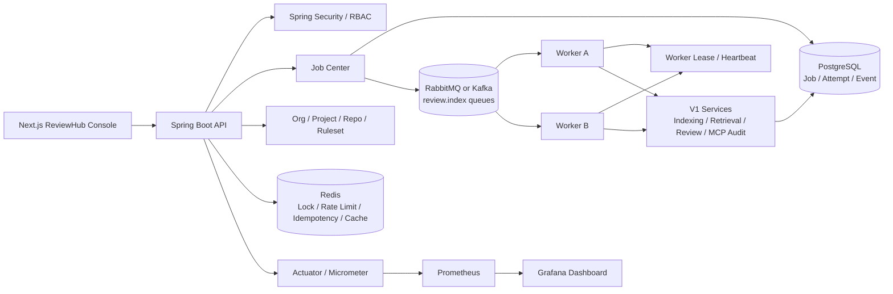

# RepoLens-Java V2-Lite ReviewHub 分布式任务平台计划书

## 1. 文档信息

| 字段 | 内容 |
| --- | --- |
| 项目名称 | RepoLens-Java |
| 版本名称 | V2-Lite / ReviewHub |
| 推荐简历名称 | RepoLens ReviewHub：面向团队代码仓库的分布式智能评审任务平台 |
| 文档类型 | 生产化增强计划书 / 传统 Java 后端能力补强方案 |
| 创建日期 | 2026-06-29 |
| 前置版本 | V1：仓库级 Code Agent 工作台；V1.1：真实 PR/MR URL Provider |
| 关联文档 | `docs/repolens-java-development-roadmap.md`、`docs/repolens-java-requirements-outline-design.md`、`docs/repolens-java-v1-phased-execution-plan.md`、`docs/repolens-java-v2-lite-phased-execution-plan.md` |

## 2. 版本定位

V2-Lite 不是另起一个秒杀、商城或调度系统项目，而是在 RepoLens-Java 的真实业务场景上补齐高并发、分布式、中间件和业务系统能力。它把 V1 的“单仓库智能分析工作台”升级为面向团队使用的 ReviewHub：

```text
Webhook / 手动触发 / 定时重建
  -> 分布式任务中心
  -> MQ 异步削峰
  -> Worker 并行执行索引与 Review
  -> Redis 锁、限流、幂等和缓存
  -> 团队、项目、仓库、规则集、配额、审计
  -> Metrics / Trace / Dashboard
```

该版本的目标不是堆中间件，而是让每个中间件都有业务落点：

| 能力 | RepoLens 中的真实问题 | V2-Lite 解决方式 |
| --- | --- | --- |
| 高并发 | 多个 PR/MR Webhook 同时触发 Review，批量仓库重建索引 | API 快速落库，MQ 异步削峰，Worker 横向扩展 |
| 分布式 | 单 JVM 内任务执行不利于扩展与故障恢复 | 任务状态持久化，Worker 租约抢占，心跳与超时恢复 |
| 中间件 | 外部平台 API、LLM、索引任务都需要保护 | Redis 限流、锁、幂等键，RabbitMQ/Kafka 任务队列 |
| 业务系统 | 团队使用需要权限、规则、配额、审计 | 组织、项目、仓库、成员、规则集、任务看板 |
| 工程化 | 简历项目需要证明可部署、可观测、可运维 | Docker Compose、Actuator、Micrometer、Grafana、CI |

## 3. 和 V1 / V1.1 的关系

V2-Lite 继续复用原目录，不新建独立项目：

| 层次 | V1 / V1.1 已有能力 | V2-Lite 增强 |
| --- | --- | --- |
| Repository | 本地仓库导入、状态查询 | 组织/项目/仓库归属、仓库级并发控制 |
| Indexing | 异步索引状态机、任务事件 | 通用 Job Center、MQ 投递、Worker 租约、失败重试 |
| Review | pasted diff Review，V1.1 扩展真实 PR/MR URL | Webhook 触发、批量 Review、规则集、配额 |
| Retrieval | BM25 + deterministic vector + graph | 增量索引、索引任务幂等、热点结果缓存 |
| MCP / Tool | 只读工具、权限审计 | 团队级工具权限、仓库访问策略、审计查询 |
| Frontend | Workbench tabs | Job Queue、Worker、Ruleset、Quota、Metrics 看板 |

## 4. 核心业务场景

### 4.1 PR/MR Webhook 自动评审

```text
GitHub/GitLab/Gitee Webhook
  -> 校验签名与仓库绑定
  -> 生成幂等键 provider + repo + change_number + commit_sha
  -> 写入 analysis_job
  -> 投递 review.job.created
  -> Worker 拉取 PR/MR diff
  -> 复用 V1 ReviewService
  -> 保存报告、风险、证据、任务事件
  -> 前端任务看板展示结果
```

价值：

- 业务自然，不是为了高并发硬塞秒杀。
- 可以讲 API 幂等、签名校验、MQ 削峰、重复消息处理、失败重试。
- 与 V1.1 的真实 PR/MR Provider 强关联。

### 4.2 批量仓库重建索引

```text
用户选择项目下 N 个仓库
  -> 创建 batch job
  -> 拆分 repository_index 子任务
  -> Redis 仓库锁避免同仓库重复索引
  -> Worker 并行执行 scan / parse / chunk / retrieve-index
  -> 失败任务按策略重试，最终进入 DEAD 或 SUCCEEDED
```

价值：

- 可以展示任务分片、批处理、并发上限、失败隔离。
- 与 V1 的索引状态机直接关联。

### 4.3 团队规则集与配额

```text
组织 -> 项目 -> 仓库 -> Review Ruleset
用户/仓库/组织 -> 每日配额
任务执行前 -> 权限 + 配额 + 限流检查
```

价值：

- 补足传统业务系统能力。
- 面试能讲 RBAC、租户边界、资源配额、审计日志。

## 5. 技术架构



### 5.1 模块划分

| 模块 | 包名建议 | 职责 |
| --- | --- | --- |
| Job Center | `com.repolens.job` | 任务创建、状态机、attempt、event、重试、死信 |
| Worker Runtime | `com.repolens.worker` | 消费 MQ、租约、心跳、执行器注册、超时恢复 |
| Webhook | `com.repolens.webhook` | 平台事件解析、签名校验、幂等生成、任务触发 |
| Team Domain | `com.repolens.team` | 组织、项目、成员、角色、仓库绑定 |
| Ruleset | `com.repolens.ruleset` | Review 规则、严重级别阈值、启用范围 |
| Quota | `com.repolens.quota` | 用户/仓库/组织级配额、限流、余量查询 |
| Ops | `com.repolens.ops` | 指标、任务看板、队列积压、失败原因统计 |

## 6. 数据模型

### 6.1 任务中心表

| 表 | 关键字段 | 说明 |
| --- | --- | --- |
| `analysis_job` | `id`、`job_type`、`status`、`priority`、`idempotency_key`、`repository_id`、`created_by`、`next_run_at` | 通用任务主表 |
| `job_attempt` | `id`、`job_id`、`attempt_no`、`worker_id`、`status`、`started_at`、`heartbeat_at`、`error_code` | 每次执行尝试 |
| `job_event` | `id`、`job_id`、`event_type`、`message`、`payload_json`、`created_at` | 状态变更与审计事件 |
| `dead_letter_job` | `job_id`、`final_error`、`attempt_count`、`payload_json` | 多次失败后的排障入口 |

### 6.2 团队业务表

| 表 | 关键字段 | 说明 |
| --- | --- | --- |
| `organization` | `id`、`name`、`plan`、`created_at` | 组织维度 |
| `project` | `id`、`organization_id`、`name` | 项目维度 |
| `team_member` | `organization_id`、`user_id`、`role` | 组织角色 |
| `repository_binding` | `project_id`、`repository_id`、`provider`、`external_repo_id` | 外部平台仓库绑定 |
| `review_ruleset` | `id`、`project_id`、`name`、`rules_json`、`enabled` | Review 规则集 |
| `quota_bucket` | `scope_type`、`scope_id`、`quota_type`、`used`、`limit`、`window_start` | 配额窗口 |

### 6.3 关键约束

- `analysis_job.idempotency_key` 必须唯一，防止 Webhook 重复投递。
- 同一仓库索引任务需要 repository-level lock，Review 任务可以按 PR/MR 维度并行。
- `job_attempt` 只追加，不覆盖历史，便于面试讲故障排查。
- 任务 payload 保存结构化 JSON，但敏感 token 不入库。

## 7. 状态机设计

```text
CREATED
  -> QUEUED
  -> RUNNING
  -> SUCCEEDED
  -> FAILED_RETRYABLE
  -> RETRY_SCHEDULED
  -> DEAD
  -> CANCELED
```

| 状态 | 说明 | 允许转移 |
| --- | --- | --- |
| `CREATED` | API 已落库，尚未投递 | `QUEUED`、`CANCELED` |
| `QUEUED` | 已投递 MQ，等待 Worker | `RUNNING`、`CANCELED` |
| `RUNNING` | Worker 持有租约执行中 | `SUCCEEDED`、`FAILED_RETRYABLE`、`DEAD` |
| `FAILED_RETRYABLE` | 可重试失败 | `RETRY_SCHEDULED`、`DEAD` |
| `RETRY_SCHEDULED` | 等待下一次投递 | `QUEUED`、`CANCELED` |
| `DEAD` | 超过重试次数或不可恢复失败 | 人工重新入队 |
| `CANCELED` | 用户或系统取消 | 终态 |

重试策略：

- 网络、平台限流、临时 5xx：指数退避重试。
- 参数错误、权限错误、仓库不存在：直接 DEAD。
- Worker 宕机：通过 `heartbeat_at` 超时回收租约，重新投递。

## 8. 中间件设计

### 8.1 MQ

优先使用 RabbitMQ，原因是本项目任务语义更接近工作队列，面试讲解也更直接。Kafka 可作为 V2 完整版替换方向。

| Queue | Message | Consumer | 说明 |
| --- | --- | --- | --- |
| `repolens.index.requested` | `job_id`、`repository_id`、`priority` | Index Worker | 仓库索引 |
| `repolens.review.requested` | `job_id`、`change_request_id` | Review Worker | PR/MR Review |
| `repolens.job.retry` | `job_id`、`run_at` | Scheduler | 延迟重试 |
| `repolens.job.dead` | `job_id`、`reason` | Ops | 死信排障 |

消息处理原则：

- MQ 消息只放引用 ID，不放大 payload。
- Worker 消费后先查 DB 状态和租约，保证重复消息安全。
- 任务执行结果以数据库为准，MQ 只负责触发。

### 8.2 Redis

| 用途 | Key 设计 | TTL | 说明 |
| --- | --- | --- | --- |
| 仓库锁 | `lock:repo:{repositoryId}:index` | 30 min，可续期 | 防止重复索引 |
| PR/MR 幂等 | `idem:cr:{provider}:{repo}:{number}:{sha}` | 24 h | 快速挡住重复 webhook |
| 用户限流 | `rate:user:{userId}:review:{minute}` | 2 min | 每分钟 Review 次数 |
| 仓库限流 | `rate:repo:{repoId}:provider:{minute}` | 2 min | 保护 GitHub/GitLab/Gitee API |
| 任务状态缓存 | `job:status:{jobId}` | 5 min | 降低看板轮询 DB 压力 |

实现策略：

- 分布式锁用原子 `SET NX PX`，释放时校验 owner token。
- 限流用滑动窗口或固定窗口计数，V2-Lite 采用固定窗口即可。
- Redis 失败时降级为 DB 幂等和本地限流，任务可以变慢但不能乱跑。

## 9. API 设计

| Method | Path | 说明 |
| --- | --- | --- |
| `POST` | `/api/projects/{projectId}/repositories/{repositoryId}/jobs/index` | 创建仓库索引任务 |
| `POST` | `/api/repositories/{repositoryId}/change-requests/{changeRequestId}/jobs/review` | 创建 PR/MR Review 任务 |
| `POST` | `/api/webhooks/{provider}` | 接收 GitHub/GitLab/Gitee Webhook |
| `GET` | `/api/jobs` | 任务列表，支持状态、类型、仓库过滤 |
| `GET` | `/api/jobs/{jobId}` | 任务详情 |
| `GET` | `/api/jobs/{jobId}/events` | 任务事件流 |
| `POST` | `/api/jobs/{jobId}/retry` | 死信或失败任务重新入队 |
| `POST` | `/api/jobs/{jobId}/cancel` | 取消任务 |
| `GET` | `/api/ops/queue-metrics` | 队列积压、耗时、失败率 |
| `GET` | `/api/projects/{projectId}/rulesets` | 查询 Review 规则集 |
| `POST` | `/api/projects/{projectId}/rulesets` | 创建规则集 |

## 10. 前端产品原型

V2-Lite 前端不做营销页，继续是工作台：

```text
┌─────────────────────────────────────────────────────────────────────┐
│ RepoLens ReviewHub                                                  │
├───────────────┬─────────────────────────────────┬───────────────────┤
│ Team          │ Job Queue                       │ Metrics           │
│ Org           │ [Index] [Review] [Webhook]      │ Queue depth       │
│ Project       │ Status: QUEUED/RUNNING/DEAD     │ Success rate      │
│ Repositories  │ Attempt timeline                │ p95 duration      │
│ Rulesets      │ Retry / Cancel                  │ Worker heartbeat  │
│ Quota         │ Error reason                    │ Rate limit usage  │
├───────────────┼─────────────────────────────────┼───────────────────┤
│ PR/MR Reviews │ Review report                   │ Evidence / Trace  │
│ Recent events │ Risks / tests / citations       │ Tool audit        │
└───────────────┴─────────────────────────────────┴───────────────────┘
```

核心页面：

- Job Queue：任务列表、状态筛选、重试、取消、attempt timeline。
- Worker Monitor：worker 在线状态、心跳、当前任务、处理耗时。
- Ruleset：项目级 Review 规则配置。
- Quota：用户/仓库/组织级调用余量。
- Metrics：队列积压、成功率、失败原因、p95 耗时。

## 11. 分阶段执行计划

本节是概要拆分。可直接对照执行的详细计划见 `docs/repolens-java-v2-lite-phased-execution-plan.md`。

### P0：基线收束与技术选型

| 任务 | 内容 | 验收 |
| --- | --- | --- |
| P0-1 | 明确 V2-Lite 不替换 V1 主链路，只包一层任务平台 | 文档与 package 边界确认 |
| P0-2 | 选择 RabbitMQ 作为默认 MQ，Kafka 作为可替换设计 | `application-v2-lite.yml` 有 profile |
| P0-3 | 增加 Docker Compose 服务：PostgreSQL、Redis、RabbitMQ、Prometheus、Grafana | 本地服务可启动 |

### P1：通用 Job Center

| 任务 | 内容 | 验收 |
| --- | --- | --- |
| P1-1 | 新增 `analysis_job`、`job_attempt`、`job_event` migration | 空库可迁移 |
| P1-2 | 实现任务状态机和状态转移校验 | 单测覆盖非法转移 |
| P1-3 | 实现幂等创建和任务查询 API | 重复请求返回同一 job |
| P1-4 | 将 V1 索引任务适配为 `INDEX_REPOSITORY` job | 原索引功能不回退 |

### P2：MQ Worker 与失败恢复

| 任务 | 内容 | 验收 |
| --- | --- | --- |
| P2-1 | 实现消息发布与 Worker 消费 | 创建 job 后异步执行 |
| P2-2 | 实现 worker lease、heartbeat、超时回收 | 模拟 Worker 中断后可恢复 |
| P2-3 | 实现重试、指数退避、死信 | 可重试失败进入 retry，超过次数进入 DEAD |
| P2-4 | 增加任务事件流 | 前端可看到 attempt 与错误 |

### P3：Redis 高并发控制

| 任务 | 内容 | 验收 |
| --- | --- | --- |
| P3-1 | 仓库级分布式锁 | 同仓库并发索引只有一个 RUNNING |
| P3-2 | Webhook 幂等缓存 | 重复 webhook 不重复创建 Review |
| P3-3 | 用户/仓库限流 | 超限返回明确错误和剩余额度 |
| P3-4 | 任务状态缓存 | 看板轮询不直接打满 DB |

### P4：ReviewHub 业务域

| 任务 | 内容 | 验收 |
| --- | --- | --- |
| P4-1 | 组织、项目、成员、仓库绑定 | 仓库可归属项目 |
| P4-2 | Review ruleset | Review 前加载规则并影响风险阈值 |
| P4-3 | 配额模型 | 每日 Review/索引配额可查询、扣减、回滚 |
| P4-4 | Webhook 入口 | 公开 PR/MR 事件可生成 Review job |

### P5：可观测性与前端看板

| 任务 | 内容 | 验收 |
| --- | --- | --- |
| P5-1 | Actuator + Micrometer 指标 | 暴露 job 成功率、失败率、耗时 |
| P5-2 | Prometheus + Grafana | 有可截图 Dashboard |
| P5-3 | Job Queue 前端 | 支持筛选、详情、重试、取消 |
| P5-4 | Worker / Quota / Ruleset 页面 | 能支撑 5 分钟演示 |

## 12. 验收标准

### 12.1 技术验收

- 100 个模拟 Webhook 并发请求不会创建重复 Review job。
- 同一仓库同时触发多个索引任务时，只有一个任务持有仓库锁。
- Worker 执行中断后，任务可根据心跳超时重新入队。
- MQ 重复投递不会导致重复扣配额或重复生成报告。
- Redis 不可用时，系统返回明确降级错误或走 DB 幂等，不产生脏状态。
- Grafana 能展示队列积压、任务成功率、失败原因分布、p95 耗时。

### 12.2 业务验收

- 用户可以按组织、项目、仓库查看 Review 与索引任务。
- 项目级 Ruleset 可以影响 Review 风险阈值或启用规则。
- 配额超限时，新任务被拒绝并返回可理解原因。
- Webhook 自动评审与手动 PR/MR URL Review 复用同一 ReviewService。

### 12.3 简历验收

- 能讲清为什么 RepoLens 需要异步削峰、幂等、锁、限流和任务恢复。
- 能展示一张任务看板截图和一张 Grafana 指标截图。
- 能用真实业务链路回答高并发、分布式、Redis、MQ、可观测性问题。

## 13. 不做内容

V2-Lite 明确不做：

- Kubernetes 全套部署。
- 企业收费、账单、复杂套餐。
- 自动修改代码、自动提交 PR。
- 复杂自治多 Agent 讨论系统。
- 支持几十种语言。
- 自研 MQ 或自研分布式锁组件。

这些内容可以作为 V2 完整版或面试追问路线，不应影响 V2-Lite 落地。

## 14. 简历表达建议

如果 V2-Lite 完成，可以在主项目 bullets 中补充：

```text
- 在 RepoLens V2-Lite 中设计分布式任务中心，将仓库索引与 PR/MR Review 抽象为 analysis_job / job_attempt / job_event 状态机，通过 RabbitMQ 异步削峰、Worker lease 心跳和死信重试机制支撑批量仓库分析与 Webhook 并发触发。
- 基于 Redis 实现仓库级分布式锁、Webhook 幂等、用户/仓库级限流和任务状态缓存，避免重复索引、重复 Review、外部平台 API 过载和看板轮询打满数据库。
- 建立组织、项目、仓库、规则集、配额和审计日志模型，将 Code Agent 能力沉淀为团队级 ReviewHub 业务系统，并通过 Actuator、Micrometer、Prometheus、Grafana 监控任务成功率、队列积压、失败原因和 p95 耗时。
```

## 15. 最终判断

V2-Lite 是 RepoLens-Java 补传统 Java 后端能力的最佳方向。它比单独再写一个秒杀或商城项目更有一致性，因为高并发、分布式任务、Redis、MQ、RBAC、配额和可观测性都来自 RepoLens 的真实业务压力。

求职策略上，V1 / V1.1 负责证明新度和 AI 工程深度，V2-Lite 负责证明传统 Java 后端工程能力。两者合在一起，可以把简历主项目从“AI 代码理解工具”升级为“团队级分布式智能评审平台”。
