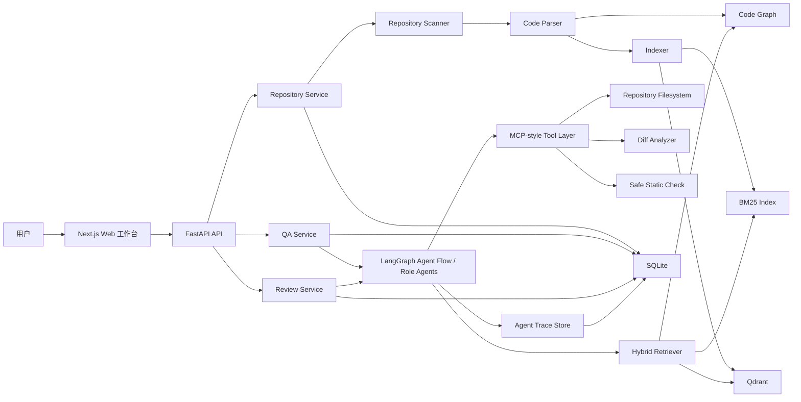

# RepoLens 项目需求分析文档

## 1. 文档信息

- 项目名称：RepoLens
- 推荐简历名称：RepoLens：基于代码图谱 GraphRAG 的仓库级代码智能体平台
- 英文副标题：Repository-Level Code Agent for Codebase Understanding and PR Review
- 项目定位：面向真实代码仓库的 Code Agent 应用，核心能力是仓库级代码理解、可追溯代码问答、PR Diff 风险审查和影响范围分析
- 目标用途：作为大模型应用开发方向的简历主项目、面试演示项目和个人作品集项目
- 当前版本：v0.3
- 创建日期：2026-06-05
- 最近更新：2026-06-05
- 维护人：项目实现者

## 2. 项目背景

大模型应用开发岗位通常关注候选人是否具备以下能力：

- 能将大模型能力落到真实业务场景，而不是只做简单聊天机器人。
- 熟悉 RAG、Agent、工具调用、工作流编排、评测和部署。
- 能处理复杂上下文，例如代码仓库、技术文档、业务系统数据。
- 能构建可追溯、可观测、可评估的大模型应用。
- 能在模型能力之外，完成数据处理、索引构建、接口服务、前端展示和工程部署。

RepoLens 选择“仓库级代码智能体”作为切入点，因为代码仓库天然包含长上下文、复杂结构、依赖关系、调用链和变更影响范围。与普通知识库问答相比，代码仓库问答和 PR Review 更能体现大模型应用开发中的工程能力。

用户输入一个本地仓库路径、GitHub 仓库地址或 PR Diff，系统自动解析代码结构，构建代码 chunk、关键词索引、向量索引和代码关系图，再通过多步骤 Agent 工作流生成可追溯的代码理解、风险审查、影响范围分析和测试建议。Agent 设计采用“单主编排器 + 角色型 Agent 节点”的演进路线：前期由 LangGraph 统一管理状态和流程，后续在 QA 与 PR Review 场景中逐步拆分 Planner、Retriever、Reviewer、Verifier、Report Writer 等角色型 Agent。

## 3. 项目定位与边界

### 3.1 最终定位

RepoLens 不是一个普通“代码聊天机器人”，也不是试图替代成熟商业代码审查平台。它的定位是：

面向仓库级代码理解的 Code Agent 基础设施，核心能力是代码结构记忆、混合检索、证据引用、影响范围分析和审查辅助。

PR Review 是核心展示场景之一，但不是唯一定位。项目需要同时支持：

- 仓库架构理解。
- 功能代码定位。
- 函数/类/模块解释。
- 简化调用链和影响范围分析。
- PR Diff 风险审查。
- 测试建议和修复建议生成。

### 3.2 大厂简历目标

RepoLens 需要在简历中体现以下亮点：

- 从 0 到 1 构建完整大模型应用，而非简单调用模型 API。
- 支持仓库级代码理解，涉及长上下文、代码结构化解析和混合检索。
- 使用代码图谱 GraphRAG 提升代码上下文召回质量。
- 使用 LangGraph 编排多步骤 Agent 工作流，并在 QA/Review 阶段演进为角色型 Multi-Agent 协作。
- 支持 MCP-style 工具封装，体现工具调用和权限控制意识。
- 提供前后端完整 Demo、评测指标、执行日志和 Docker 部署方案。

### 3.3 产品目标

- 帮助开发者快速理解陌生代码仓库的架构和核心模块。
- 帮助开发者定位某个功能、接口、函数或业务逻辑所在位置。
- 帮助团队对 PR Diff 进行自动化初审，发现潜在风险。
- 为代码修改提供影响范围分析、测试建议和修复建议。
- 输出带文件路径、函数名、行号和证据片段的可追溯报告。

### 3.4 技术目标

- 构建代码级 GraphRAG：结合 BM25、向量检索和代码关系图扩展。
- 构建可追溯 Agent 流程：规划、检索、审查、验证、报告生成。
- 构建 MCP-style Tool Layer：文件读取、符号检索、diff 分析、安全静态检查。
- 构建评测闭环：检索命中、引用覆盖率、幻觉率、延迟和 token 成本。
- 构建可演示工程：Web 工作台、Agent trace、Docker Compose、README 和演示截图。

## 4. 用户画像与核心场景

### 4.1 求职展示场景

用户是大模型应用开发方向求职者，需要在面试中展示一个完整、亮眼、有工程深度的项目。项目需要能本地运行，有清晰 README、架构图、演示视频、评测结果和可量化指标。

### 4.2 新人接手代码仓库场景

开发者接手一个陌生仓库，希望快速了解：

- 项目整体架构是什么。
- 服务入口和启动流程在哪里。
- 某个功能由哪些模块实现。
- 某个函数被谁调用，又调用了谁。
- 哪些文件是核心文件。

### 4.3 Code Reviewer 场景

代码审查者希望系统先对 PR Diff 做初步审查，发现：

- 潜在 bug。
- 兼容性风险。
- 安全风险。
- 边界条件遗漏。
- 测试缺口。
- 变更影响范围。

### 4.4 面试演示场景

面试时应能演示以下流程：

1. 导入一个真实 Python 或 TypeScript/JavaScript 仓库。
2. 展示系统提取的文件、函数、类、导入关系和代码图概览。
3. 提问“这个项目的启动流程是什么？”并得到带引用回答。
4. 提问“登录鉴权逻辑在哪些文件中？”并得到证据列表。
5. 粘贴一段 PR Diff，生成风险审查报告。
6. 展示 Agent trace、检索证据、耗时和 token 消耗。

## 5. 核心问题

当前通用代码问答或简单 RAG 系统存在以下不足：

- 只按文本切块检索，无法理解函数、类、调用关系和模块依赖。
- 只依赖向量检索，容易漏掉精确符号、文件名和函数名。
- 无法稳定处理仓库级上下文，容易遗漏关键文件。
- 生成结论缺少文件路径、行号和证据引用，难以信任。
- 对 PR Diff 的审查缺少结构化流程和验证步骤。
- 缺少评测指标，无法证明系统效果。
- Agent 工具调用缺少权限边界和执行 trace。

RepoLens 的核心价值是把代码仓库从“文本集合”变成“可检索、可推理、可追溯、可评测的代码知识空间”。

## 6. 版本范围

### 6.1 P0+：大厂简历可展示版本

P0+ 是第一阶段必须完成的版本。只有达到 P0+，项目才适合作为大厂简历主项目。

| 功能域 | P0+ 是否必须 | 功能点 | 说明 |
| --- | --- | --- | --- |
| 仓库导入 | 必须 | 本地仓库路径导入、GitHub URL 导入 | GitHub URL 可通过 `git clone` 实现；本地路径优先保证稳定 |
| 仓库扫描 | 必须 | 文件树扫描、语言统计、过滤规则 | 过滤依赖目录、构建产物、二进制文件和敏感文件 |
| 代码解析 | 必须 | Python、TypeScript、JavaScript | 提取文件、类、函数、方法、导入关系和基础调用关系 |
| 代码 chunk | 必须 | 函数级、类级、文件级 chunk | 每个 chunk 必须有文件路径、起止行号、symbol、hash |
| 代码图谱 | 必须 | contains、imports、calls、defined_in、changed_by | 用于 GraphRAG 和影响范围分析 |
| BM25 检索 | 必须 | 关键词、文件名、函数名、符号检索 | 用于精确召回 |
| 向量检索 | 必须 | embedding + Qdrant | 用于语义召回 |
| 图邻域扩展 | 必须 | 调用方、被调用方、同文件上下文、导入依赖 | 用于补足代码上下文 |
| 重排 | 必须 | 轻量加权 rerank | P0+ 可先使用规则加权，P1 再接入 cross-encoder reranker |
| 代码问答 | 必须 | 架构理解、功能定位、函数解释、调用关系 | 所有关键结论必须带证据 |
| PR Review | 必须 | Diff 解析、风险审查、影响范围、测试建议 | 支持粘贴 diff，输出结构化报告 |
| Agent 工作流 | 必须 | 单主 LangGraph 编排器 + Planner、Retriever、Reviewer、Verifier、Report Writer 角色节点 | P0+ 先做统一状态机，Phase 3/4 自然演进为角色型 Multi-Agent |
| MCP-style Tool Layer | 必须 | code_search、read_file_slice、get_symbol_context、analyze_diff | 不要求 P0+ 实现完整 MCP Server，但工具 schema 和权限边界必须明确 |
| Agent trace | 必须 | 每步输入、输出摘要、工具调用、耗时、token | 前端可视化展示 |
| 评测闭环 | 必须 | 至少 50 条评测样例和指标输出 | 覆盖代码定位、函数解释、架构问答、PR Review |
| Web 工作台 | 必须 | 仓库导入、问答、Review、证据、trace | 首页即工作台，不做营销页 |
| 部署文档 | 必须 | Docker Compose、README、演示截图 | 支持本地复现 |

### 6.2 P0+ 明确不做

以下内容不属于 P0+，不得在第一阶段强行加入：

- 多用户登录和团队权限系统。
- GitHub PR 评论自动写回。
- Kubernetes 部署。
- 大规模企业仓库的分布式索引。
- 完整 CI/CD 平台集成。
- 支持几十种编程语言。
- 自动执行任意仓库脚本。
- 复杂漏洞扫描替代方案。
- 生产级审计系统。
- 复杂自治式 Multi-Agent 协商框架。P0+ 只做 LangGraph 统一编排下的角色型 Agent 节点，不做独立 Agent 间长对话、消息总线或竞争式协作。

### 6.3 P1：增强版本

P1 在 P0+ 完成后再考虑，主要增强展示效果和真实集成能力：

- 引入 Repository Provider 抽象，支持 GitHub、Gitee、GitLab、generic Git URL 和本地 Git 仓库的统一导入。
- GitHub API 拉取 Issues、Pull Requests 和提交历史。
- 简化仓库架构图和模块依赖图可视化。
- 静态检查工具接入，例如 `ruff`、`eslint`、`mypy`、`pytest`。
- 增量索引。
- 用户反馈标注，用于评测集建设。
- 多模型切换：OpenAI、DeepSeek、Qwen、Claude 或本地模型。
- cross-encoder reranker 或 LLM reranker。

### 6.4 P2：作品集强化版本

P2 面向更高级展示或生产化探索：

- 实现真正 RepoLens MCP Server，对外暴露 code_search、read_file_slice、get_symbol_context、review_diff、list_repositories 等工具。
- 团队知识库：README、设计文档、Issue 讨论、PR 历史纳入检索。
- 自动生成项目架构说明文档。
- 自动生成 onboarding guide。
- Review 结果写回 GitHub PR 评论。
- 细粒度权限控制、审计日志和敏感信息策略。
- PostgreSQL、Redis/RQ、Neo4j 等生产化替换。

## 7. 功能需求

### 7.1 仓库导入与扫描

#### 7.1.1 输入

- 本地仓库路径。
- GitHub 仓库 URL。
- 可选分支名。

#### 7.1.2 输出

- repository_id。
- 仓库名称、来源、分支、语言统计。
- 文件树。
- 可解析文件列表。
- 过滤文件统计。

#### 7.1.3 规则

- 默认过滤 `.git`、`node_modules`、`dist`、`build`、`.venv`、`__pycache__`、`.next`、`coverage`。
- 默认过滤二进制文件、图片、压缩包、日志文件。
- 默认过滤 `.env`、密钥、证书、token 配置。
- 单文件超过 1MB 时跳过，记录原因。

### 7.2 代码解析与结构图谱

#### 7.2.1 支持语言

P0+ 支持：

- Python
- TypeScript
- JavaScript

#### 7.2.2 提取对象

- File
- Class
- Function
- Method
- Import
- Call
- Module

#### 7.2.3 关系类型

- contains：文件包含函数/类，类包含方法。
- imports：文件或模块导入另一个模块。
- calls：函数或方法调用另一个函数或方法。
- defined_in：符号定义于某个文件。
- changed_by：PR Diff 改动影响某个文件、函数或方法。

#### 7.2.4 chunk 要求

每个 chunk 必须包含：

- chunk_id
- repository_id
- file_path
- language
- symbol_name
- symbol_type
- start_line
- end_line
- content
- content_hash
- relation_ids

### 7.3 混合检索与 GraphRAG

#### 7.3.1 检索链路

系统必须支持以下检索链路：

1. 查询改写：将用户问题或 Review 子任务转成检索 query。
2. BM25 召回：召回精确符号、文件名、关键词相关 chunk。
3. 向量召回：召回语义相关 chunk。
4. 候选合并：按 chunk_id 去重，保留召回来源。
5. 图邻域扩展：根据代码关系图补充调用方、被调用方、同文件上下文和导入依赖。
6. 轻量重排：按语义分、关键词分、图距离、文件相关性和变更相关性综合排序。
7. 上下文组装：控制 token 预算，输出带元数据的证据包。

#### 7.3.2 证据要求

每条最终证据必须包含：

- evidence_id
- chunk_id
- file_path
- start_line
- end_line
- symbol_name
- source：bm25、vector、graph_expand、diff_context
- score
- snippet

### 7.4 仓库问答

#### 7.4.1 支持问题类型

- 架构理解类：项目整体结构、核心模块、启动流程。
- 功能定位类：某功能在哪些文件或函数中实现。
- 函数解释类：解释某个函数、类或文件作用。
- 调用关系类：某函数调用了谁，被谁调用。
- 影响范围类：修改某函数可能影响哪些模块。

#### 7.4.2 输出要求

仓库问答结果必须包含：

- answer：自然语言回答。
- citations：证据引用列表。
- confidence：高、中、低。
- missing_context：如果证据不足，说明缺失什么上下文。
- trace_id：对应 Agent trace。

### 7.5 PR Diff Review

#### 7.5.1 输入

- PR Diff 文本。
- 可选：变更说明。
- 可选：目标分支或基准版本。

#### 7.5.2 处理逻辑

- 解析变更文件、变更行号和变更类型。
- 将变更行映射到函数、类或文件级 chunk。
- 根据代码图查找调用方、被调用方和导入依赖。
- 检索相关上下文。
- 生成风险、原因、证据、测试建议和修复建议。
- 由 Verifier 检查风险是否有证据支撑。

#### 7.5.3 输出结构

Review 报告必须包含：

- summary：总体结论。
- risk_level：整体风险等级。
- risks：风险列表。
- impacted_symbols：影响到的函数、类、文件。
- suggested_tests：建议测试用例。
- patch_suggestions：可选修复建议。
- citations：证据引用。
- trace_id：对应 Agent trace。

单个风险项必须包含：

- title
- severity：High、Medium、Low
- location：文件路径和行号
- reason
- evidence_ids
- suggestion
- test_advice

### 7.6 多步骤 Agent 与 Multi-Agent 演进

RepoLens 的 Agent 设计分为两个层次：

1. P0+/Phase 3：单主 LangGraph Orchestrator。
2. Phase 4 及之后：角色型 Multi-Agent 协作。

当前不采用复杂自治多 Agent 框架，不让多个 Agent 脱离统一状态机自由对话。所有 Agent 角色都由 LangGraph 编排，统一共享 AgentState、证据包、工具调用记录和 trace。

P0+ 必须使用 LangGraph 编排以下节点：

| 角色型 Agent 节点 | 输入 | 输出 | 说明 |
| --- | --- | --- | --- |
| Planner | 用户问题或 PR Diff | 子任务列表、检索计划 | 判断任务类型，拆解问题 |
| Retriever | 检索计划 | 证据包 | 调用 Hybrid Retriever |
| Reviewer | 证据包、Diff 上下文 | 风险草稿或问答草稿 | 生成初步结论 |
| Verifier | 草稿、证据包 | 通过/驳回/补充检索建议 | 检查结论是否有证据支撑 |
| Report Writer | 已验证结论 | Markdown 报告或问答结果 | 生成最终输出 |

阶段拆分：

- Phase 3：实现 QA 场景的 Planner、Retriever、Answer Reviewer、Verifier、Report Writer。
- Phase 4：在 PR Review 场景中扩展 Review Planner、Risk Reviewer、Test Suggestion Agent、Review Verifier、Review Report Writer。
- Phase 5：通过 trace、评测样例和消融对比说明多 Agent 角色拆分是否提升可解释性和审查质量。

这种设计既能体现 Multi-Agent 思路，又能避免在检索和证据链尚未稳定前过早引入复杂协作框架。

Verifier 的规则：

- 没有证据的关键结论不得进入最终报告。
- 证据不足时触发一次补充检索。
- 二次检索后仍证据不足，应降低 confidence 或标记 missing_context。

### 7.7 MCP-style Tool Layer

P0+ 不要求实现完整 MCP Server，但必须实现结构化工具层，设计方式向 MCP 靠拢。

#### 7.7.1 必须实现的工具

| 工具名 | 作用 | 权限边界 |
| --- | --- | --- |
| code_search | 按 query 执行混合检索 | 只能访问当前 repository_id 的索引 |
| read_file_slice | 读取指定文件指定行范围 | 只能读取已导入仓库目录，禁止读取敏感文件 |
| get_symbol_context | 获取函数/类上下文和邻接节点 | 只能返回当前仓库的代码图信息 |
| analyze_diff | 解析 PR Diff 并映射到代码 chunk | 只处理用户输入 diff，不执行代码 |
| run_safe_static_check | 运行安全白名单静态检查 | 默认关闭，需要用户显式开启 |

#### 7.7.2 工具调用记录

每次工具调用都需要记录：

- tool_name
- input 摘要
- output 摘要
- latency_ms
- success
- error
- permission_decision

### 7.8 Web 工作台

Web 工作台是 P0+ 必须完成的展示入口。首页直接是工作台，不做营销型 landing page。

#### 7.8.1 页面区域

- Repository Panel：仓库导入、仓库列表、索引状态。
- Overview Panel：语言统计、文件数量、chunk 数、关系边数量。
- Ask Panel：代码问答输入和回答展示。
- Review Panel：Diff 输入和 Review 报告展示。
- Evidence Panel：代码证据、文件路径、行号、score 和 snippet。
- Trace Panel：Agent 执行轨迹、工具调用、耗时、token。
- Evaluation Panel：评测结果概览。
- Settings Panel：模型、embedding、过滤规则和 token 预算。

#### 7.8.2 交互要求

- 用户能看到索引进度。
- 用户能查看每个回答引用了哪些代码证据。
- 用户能展开 Agent trace。
- 用户能导出 Markdown 报告。
- 页面视觉风格应偏工程化工作台，克制、清晰、适合面试展示。

### 7.9 评测闭环

P0+ 必须包含评测脚本和评测数据。

#### 7.9.1 评测集规模

至少 50 条样例：

- 20 条代码定位问题。
- 10 条函数解释问题。
- 10 条架构理解问题。
- 10 条 PR Review 样例。

#### 7.9.2 对比方法

至少对比：

- 向量检索。
- BM25 + 向量检索。
- BM25 + 向量检索 + 图邻域扩展。

#### 7.9.3 输出指标

- Hit@5。
- MRR。
- 引用覆盖率。
- 幻觉率。
- Review 有效率。
- 平均响应延迟。
- 平均 token 成本。

## 8. 非功能需求

### 8.1 可用性

- 用户首次使用时，应在 5 分钟内完成一个中小型仓库的索引和第一次问答体验。
- 前端页面应清晰展示当前任务状态，例如解析中、索引中、审查中、完成或失败。
- 错误信息应说明原因和可执行的修复建议。
- README 需要包含完整启动流程和常见问题。

### 8.2 可靠性

- Agent 每一步需要记录输入摘要、输出摘要、工具调用和失败原因。
- 检索结果需要保存原始证据，最终回答必须可追溯。
- 模型失败、工具失败或网络失败时，应有重试或降级策略。
- 文件解析失败时不应中断整个仓库索引，应记录失败文件并继续。

### 8.3 性能

P0+ 目标性能：

- 20k LOC 以内仓库首次索引时间：3-10 分钟。
- 普通问答响应时间：10-30 秒。
- PR Review 响应时间：30-120 秒。
- 单次问答上下文证据数量默认不超过 12 条。
- 单次 Review 上下文证据数量默认不超过 20 条。

### 8.4 安全

- 默认不执行仓库中的任意脚本。
- 测试命令和静态检查需要用户确认或白名单控制。
- 对 `.env`、密钥、token、证书和私有配置进行过滤。
- GitHub token 和模型 API key 只通过环境变量管理。
- Agent trace 中不得保存完整密钥、token 或敏感文件内容。

### 8.5 可观测性

- 记录每次任务的模型名称、token 消耗、耗时、工具调用次数和错误信息。
- 支持查看 Agent 执行轨迹。
- 支持查看检索证据和召回来源。
- 支持保存失败案例，便于调试和评测。

### 8.6 可维护性

- 后端按 repository、parser、indexing、retrieval、graph、agent、review、tools、evaluation 模块拆分。
- Prompt 独立存放，避免散落在业务代码中。
- 模型调用通过 adapter 封装，便于切换模型。
- 工具调用通过统一 schema 管理，便于升级为 MCP Server。

## 9. 技术方案

### 9.1 P0+ 固定技术栈

| 层级 | 技术 | 说明 |
| --- | --- | --- |
| 前端 | Next.js + TypeScript | 构建 Web 工作台 |
| UI | Tailwind CSS + shadcn/ui | 克制、工程化、适合展示 |
| 后端 | Python 3.11+ + FastAPI | API 服务和业务编排 |
| ORM/数据库 | SQLAlchemy + SQLite | 保存元数据、任务和 trace |
| Agent | LangGraph | 编排单主状态机和角色型 Multi-Agent 工作流 |
| 关键词检索 | BM25 | 精确符号和关键词召回 |
| 向量检索 | Qdrant | 代码 chunk 语义检索 |
| 代码解析 | tree-sitter + Python ast fallback | Python、TS、JS 解析 |
| 代码图 | NetworkX | 本地代码关系图和邻域扩展 |
| LLM 接入 | OpenAI-compatible Chat Adapter | 适配 OpenAI、Qwen、DeepSeek 等兼容接口 |
| Embedding 接入 | OpenAI-compatible Embedding Adapter | 适配云端或本地 embedding |
| 部署 | Docker Compose | 启动 frontend、backend、qdrant |
| 评测 | 自建 eval 脚本 | 输出检索和生成指标 |

### 9.2 不采用的技术

P0+ 暂不采用：

- PostgreSQL：P0+ 用 SQLite 降低部署复杂度。
- Neo4j：P0+ 用 NetworkX 足以支撑中小仓库代码图。
- Redis/Celery：P0+ 用后端任务状态管理，P1 再引入队列。
- Kubernetes：P0+ 用 Docker Compose 即可复现。
- 完整 MCP Server：P0+ 先实现 MCP-style Tool Layer，P2 再升级。

## 10. 系统架构

## 11. 数据设计

### 11.1 Repository

- id
- name
- source_type
- source_url
- local_path
- branch
- language_summary
- file_count
- chunk_count
- relation_count
- indexed_at
- status

### 11.2 CodeChunk

- id
- repository_id
- file_path
- start_line
- end_line
- symbol_name
- symbol_type
- language
- content
- content_hash
- metadata

### 11.3 CodeRelation

- id
- repository_id
- source_id
- target_id
- source_symbol
- target_symbol
- relation_type
- source_file
- target_file
- metadata

### 11.4 Task

- id
- repository_id
- task_type：qa、review、evaluation
- status
- input
- output
- created_at
- completed_at

### 11.5 AgentTrace

- id
- task_id
- step_name
- input_summary
- output_summary
- evidence_ids
- tool_calls
- latency_ms
- token_usage
- error

### 11.6 Evidence

- id
- task_id
- chunk_id
- file_path
- start_line
- end_line
- symbol_name
- source
- score
- snippet

## 12. 评测指标

### 12.1 检索指标

- Hit@5：正确代码片段是否出现在前 5 个结果中。
- MRR：正确结果排名质量。
- 召回来源分布：BM25、vector、graph_expand 各自贡献比例。

### 12.2 生成指标

- 引用覆盖率：最终答案中的关键结论是否带证据引用。
- 幻觉率：无证据支撑或错误引用的比例。
- 回答准确率：人工或 LLM-as-judge 判断回答是否正确。
- Review 有效率：发现的问题中真实有效的问题占比。

### 12.3 工程指标

- 索引耗时。
- 问答端到端耗时。
- PR Review 端到端耗时。
- token 成本。
- 工具调用成功率。
- Agent 二次检索触发率。

## 13. P0+ 验收标准

P0+ 完成时，需要满足以下硬性标准：

- 可以导入至少 1 个真实 Python 仓库和 1 个真实 TypeScript/JavaScript 仓库。
- 可以完成仓库扫描、代码解析、chunk 生成、BM25 索引、Qdrant 向量索引和代码图构建。
- 代码图至少包含 File、Class、Function/Method 节点，以及 contains、imports、calls、defined_in 边。
- 可以回答至少 5 类问题：架构理解、功能定位、函数解释、调用关系、影响范围。
- QA 结果的关键结论必须带代码证据引用。
- 可以对一段 PR Diff 生成结构化 Review 报告。
- Review 报告必须包含风险等级、代码位置、原因、证据、影响范围和测试建议。
- Agent trace 必须记录 Planner、Retriever、Reviewer、Verifier、Report Writer 等角色型 Agent 节点的执行过程。
- 工具调用必须通过 MCP-style Tool Layer，并记录权限决策和调用结果。
- 至少准备 50 条评测样例，并输出检索和生成指标。
- 前端可以展示仓库状态、问答结果、Review 报告、证据列表、Agent trace 和评测结果。
- 可以通过 Docker Compose 启动主要服务。
- README 包含项目介绍、架构图、启动步骤、演示截图、评测结果和简历写法。

## 14. 里程碑计划

### 第 1 阶段：设计固化

- 完成需求分析文档。
- 完成概要设计文档。
- 完成大厂简历适配审核。
- 完成 P0+ 任务拆解和排期。

### 第 2 阶段：基础工程和代码索引

- 搭建 FastAPI + Next.js 项目骨架。
- 实现仓库导入和目录扫描。
- 实现代码解析和 chunk 元数据保存。
- 实现代码关系图构建。

### 第 3 阶段：GraphRAG 与证据问答

- 实现 BM25 检索。
- 实现 Qdrant 向量检索。
- 实现图邻域扩展和轻量重排。
- 实现带引用的代码问答。

### 第 4 阶段：多步骤 Agent 与 PR Review

- 实现 LangGraph 工作流和角色型 Multi-Agent 节点。
- 实现 MCP-style Tool Layer。
- 支持 PR Diff 输入和变更影响范围分析。
- 输出风险报告、测试建议和修复建议。
- 保存 Agent trace。

### 第 5 阶段：评测、部署与简历包装

- 构建至少 50 条评测样例。
- 输出检索和生成质量指标。
- 使用 Docker Compose 部署。
- 完成 README、架构图、演示截图、演示视频和简历描述。

## 15. 简历表达建议

项目名称：

RepoLens：基于代码图谱 GraphRAG 的仓库级代码智能体平台

项目描述：

- 构建仓库级代码智能体平台，基于 AST/tree-sitter 提取文件、类、函数、导入和调用关系，生成函数级代码 chunk 与代码关系图，支持 Python、TypeScript/JavaScript 仓库的结构化理解。
- 设计 BM25 + 向量检索 + 图邻域扩展的混合检索链路，结合 Qdrant 召回相关代码上下文，回答和审查结论均输出文件路径、行号和证据片段。
- 基于 LangGraph 编排 Planner、Retriever、Reviewer、Verifier、Report Writer 等角色型 Multi-Agent 节点，实现仓库问答、PR Diff 风险审查、影响范围分析和测试建议生成。
- 设计 MCP-style Tool Layer、Agent trace、工具调用日志、token/耗时统计和评测脚本，构建代码定位、函数解释、架构问答、PR Review 评测集，对比不同检索策略的 Hit@5、引用覆盖率、幻觉率和端到端延迟。
- 使用 FastAPI、Next.js、SQLite、Qdrant、Docker Compose 完成全栈实现和本地部署，提供可交互 Web Demo、架构图、评测报告和 Markdown 导出。

## 16. 当前已确定决策

- 项目方向确定为：基于代码图谱 GraphRAG 的仓库级代码智能体平台。
- PR Review 是核心场景之一，但项目不是单纯 PR Review 工具。
- P0+ 是大厂简历可展示版本，必须包含代码结构图谱、混合检索、证据引用、Agent trace、MCP-style Tool Layer 和评测闭环。
- P0+ 采用 FastAPI + Next.js + LangGraph + SQLite + Qdrant + NetworkX。
- Agent 架构采用单主 LangGraph Orchestrator 起步，Phase 3/4 按 Planner、Retriever、Reviewer、Verifier、Report Writer 等角色演进为可观测的 Multi-Agent 工作流。
- P0+ 优先支持 Python、TypeScript 和 JavaScript。
- P0+ 不做多用户、GitHub PR 写回、Kubernetes、大规模分布式索引和完整 MCP Server。
- P1/P2 允许将仓库来源从 GitHub 扩展到 Gitee、GitLab、generic Git URL 和本地 Git，并最终封装为 MCP Server 供外部 Agent 调用。
